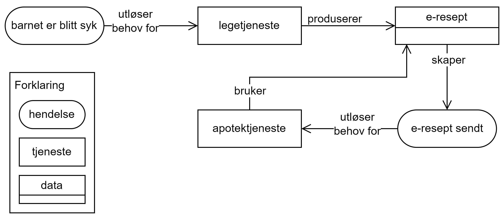

== Forenklet fremstilling av kravene i CPSV-AP-NO [[Forenklet-fremstilling]]

_Denne delen av spesifikasjonen er primært ment for den ikke-tekniske målgruppen._ 

:xrefstyle: short

Som illustrert i <> gir CPSV-AP-NO mulighet til å beskrive tjenester og hendelser. 

[[img-ForenkletModell]]
.Forenklet fremstilling av CPSV-AP-NO.
[link=images/CPSV-AP-NO-forenklet-fremstilling.png]
image::images/CPSV-AP-NO-forenklet-fremstilling.png[alt="Forenklet UML-diagram med 8 klasser, deres egenskaper og relasjoner til hverandre. Innholdet i diagrammet er forklart i teksten."]

Helt overordnet illustrerer figuren bl.a. følgende:

* En *https://data.norge.no/concepts/db48fa77-3f47-4d58-b4a3-41569f149c1a[hendelse &#x29C9;, window="_blank", role="ext-link"]* KAN sette i gang en eller flere *https://data.norge.no/concepts/9d406b71-273f-4631-8f3d-52d61943612b[tjenester &#x29C9;, window="_blank", role="ext-link"]*. 
** En tjeneste KAN være en *https://data.norge.no/concepts/73f78f28-cab8-4dae-9029-6e5af9f98dc0[offentlig tjeneste &#x29C9;, window="_blank", role="ext-link"]*, og en offentlig tjeneste realiserer en *lovpålagt tjeneste*.
** En hendelse KAN være en *https://data.norge.no/concepts/9b19d5ce-87b3-4584-a875-e7cff3ad6740[livshendelse &#x29C9;, window="_blank", role="ext-link"]* eller en *https://data.norge.no/concepts/71fd9d69-ca64-3f9b-a1d3-7ade4d069f8a[virksomhetshendelse &#x29C9;, window="_blank", role="ext-link"]*, som KAN utløse behov for en eller flere tjenester / offentlige tjenester.

* En tjeneste / offentlig tjeneste / lovpålagt tjeneste SKAL alltid ha et eller flere *mulige tjenesteresultat* som KAN skape en eller flere nye hendelser. 
** Et mulig tjenesteresultat KAN være en del av et *datasett*.

* Det KAN være *dokumentasjonskrav* til en tjeneste / offentlig tjeneste / lovpålagt tjeneste.
** Dokumentasjonstype som kreves KAN være beskrevet ved et datasett. 

Hvilke typer opplysninger som SKAL (obligatoriske), BØR (anbefalte) og KAN (valgfrie) tas med i en beskrivelse av en hendelse / livshendelse / virksomhetshendelse og tjeneste / offentlig tjeneste / lovpålagt tjeneste er nærmere spesifisert i det følgende i dette kapittelet. Hvordan opplysningene skal representeres teknisk i RDF (https://www.w3.org/RDF/[Resource Description Framework &#x29C9;, window="_blank", role="ext-link"]) er spesifisert i <<Spesifikasjon-per-klasse>>, som også inneholder flere klasser som kan brukes i tillegg til de som er vist i <> og beskrevet i dette kapittelet.

=== Opplysninger som SKAL, BØR og KAN tas med om en Tjeneste, Offentlig tjeneste eller Lovpålagt tjeneste [[Krav-til-tjeneste-offentlig-tjeneste-lovpålagt-tjeneste]]

__#@@@@@@ mangler Lovpålagt tjeneste, kommer#__

[[Tabell-obligatoriske-opplysninger-tjenesteklassene]]
.Obligatoriske opplysningstyper som en beskrivelse av Tjeneste, Offentlig tjeneste eller Lovpålagt tjeneste SKAL inneholde
[cols="20s,65d,15d", options="header"]
|===
| Obligatorisk | Forklaring | Ref. til kap. <<Spesifikasjon-per-klasse>>
| beskrivelse | Tekstlig beskrivelse av tjeneste | <<Tjeneste-beskrivelse>>, <<OffentligTjeneste-beskrivelse>>, <<LovpålagtTjeneste-beskrivelse>>
| har mulig tjenesteresultat | Refererer til type tjenesteresultat som tjenesten kan resultere i | <<Tjeneste-har-mulig-tjenesteresultat>>, <<OffentligTjeneste-har-mulig-tjenesteresultat>>, <<LovpålagtTjeneste-har-mulig-tjenesteresultat>>
| identifikator | Unik identifikator for tjenesten, som regel opprettet automatisk av et system | <<Tjeneste-identifikator>>, <<OffentligTjeneste-identifikator>>, <<LovpålagtTjeneste-identifikator>>
| kontaktpunkt | Oppgir til kontaktpunkt for tjenesten | <<Tjeneste-kontaktpunkt>>, <<OffentligTjeneste-kontaktpunkt>>, <<LovpålagtTjeneste-kontaktpunkt>>
| navn | Navn på tjenesten | <<Tjeneste-navn>>, <<OffentligTjeneste-navn>>, <<LovpålagtTjeneste-navn>>
| ansvarlig organisasjon | (Gjelder kun for Offentlig tjeneste) Refererer til offentiglig organisasjon som er ansvarlig for tjenesten | <<OffentligTjeneste-ansvarlig-organisasjon>>
| .. | .. | ..
|===

[[Tabell-anbefalte-opplysninger-tjenesteklassene]]
.Anbefalte opplysningstyper som en beskrivelse av Tjeneste, Offentlig tjeneste eller Lovpålagt tjeneste BØR inneholde
[cols="20s,65d,15d", options="header"]
|===
| Anbefalt | Forklaring | Ref. til kap. <<Spesifikasjon-per-klasse>>
|===

[[Tabell-valgfrie-opplysninger-tjenesteklassene]]
.Valgfrie opplysningstyper som en beskrivelse av Tjeneste, Offentlig tjeneste eller Lovpålagt tjeneste KAN inneholde
[cols="20s,65d,15d", options="header"]
|===
| Valgfri | Forklaring | Ref. til kap. <<Spesifikasjon-per-klasse>>
|===

=== Opplysninger som SKAL, BØR og KAN tas med om en Hendelse, Livshendelse eller virksomhetshendelse [[Krav-til-hendelse-livshendelse-virksomhetshendelse]]

[[Tabell-obligatoriske-opplysninger-hendelsesklassene]]
.Obligatoriske opplysningstyper som en beskrivelse av Hendelse, Livshendelse eller virksomhetshendelse SKAL inneholde
[cols="20s,65d,15d", options="header"]
|===
| Obligatorisk | Forklaring | Ref. til kap. <<Spesifikasjon-per-klasse>>
| identifikator | Unik identifikator for hendelsen, som regel opprettet automatisk av et system | <<Hendelse-identifikator>>, <<Livshendelse-identifikator>>, <<Virksomhetshendelse-identifikator>>
| navn | Navn på hendelsen | <<Hendelse-navn>>, <<Livshendelse-navn>>, <<Virksomhetshendelse-navn>>
|===

[[Tabell-anbefalte-opplysninger-hendelsesklassene]]
.Anbefalte opplysningstyper som en beskrivelse av Hendelse, Livshendelse eller virksomhetshendelse BØR inneholde
[cols="20s,65d,15d", options="header"]
|===
| Anbefalt | Forklaring | Ref. til kap. <<Spesifikasjon-per-klasse>>
| beskrivelse | Tekstlig beskrivelse av hendelsen | <<Hendelse-beskrivelse>>, <<Livshendelse-beskrivelse>>, <<Virksomhetshendelse-beskrivelse>>
| kan sette i gang | (Gjelder kun for Hendelse) Refererer til tjeneste som kan settes i gang av hendelsen | <<Hendelse-kan-sette-i-gang>>
| kan utløse behov for | (Gjelder kun for Livshendelse og Virksomhetshendelse) Refererer til tjeneste som hendelsen kan utløse behov for | <<Livshendelse-kan-utløse-behov-for>>, <<Virksomhetshendelse-kan-utløse-behov-for>>
|===

[[Tabell-valgfrie-opplysninger-hendelsesklassene]]
.Valgfrie opplysningstyper som en beskrivelse av Hendelse, Livshendelse eller virksomhetshendelse KAN inneholde
[cols="20s,65d,15d", options="header"]
|===
| Valgfri | Forklaring | Ref. til kap. <<Spesifikasjon-per-klasse>>
| begrep | Refererer til begrep som er viktig for å forstå hendelsen | <<Hendelse-begrep>>, <<Livshendelse-begrep>>, <<Virksomhetshendelse-begrep>>
| er beskrevet ved | Refererer til datasett som hendelsen kan være beskrevet ved | <<Hendelse-er-beskrevet-ved>>, <<Livshendelse-er-beskrevet-ved>>, <<Virksomhetshendelse-er-beskrevet-ved>>
| type | Oppgir type som hendelsen tilhører | <<Hendelse-type>>, <<Livshendelse-type>>, <<Virksomhetshendelse-type>>
|===

=== Opplysninger som SKAL, BØR og KAN tas med om en Dokumentasjonstype [[Krav-til-dokumentasjonstype]]

[[Tabell-obligatoriske-opplysninger-dokumentasjonstype]]
.Obligatoriske opplysningstyper som en beskrivelse av Dokumentasjonstype SKAL inneholde
[cols="20s,65d,15d", options="header"]
|===
| Obligatorisk | Forklaring | Ref. til kap. <<Spesifikasjon-per-klasse>>
| beskrivelse | Tekstlig beskrivelse av dokumentasjonstypen | <<Dokumentasjonstype-beskrivelse>>
| identifikator | Unik identifikator for dokumentasjonstypen, som regel opprettet automatisk av et system | <<Dokumentasjonstype-identifikator>>
| navn | Navn på dokumentasjonstypen | <<Dokumentasjonstype-navn>>
|===

[[Tabell-anbefalte-opplysninger-dokumentasjonstype]]
.Anbefalte opplysningstyper som en beskrivelse av Dokumentasjonstype BØR inneholde
[cols="20s,65d,15d", options="header"]
|===
| Anbefalt | Forklaring | Ref. til kap. <<Spesifikasjon-per-klasse>>
| tillatt gyldighetsperiode | Angir en tidsperiode som dokumentasjoner tilhørende dokumentasjonstypen skal være gyldig innenfor | <<Dokumentasjonstype-tillatt-gyldighetsperiode>>
| tillatt språk | Angir språk som dokumentasjoner tilhørende dokumentasjonstypen kan være på | <<Dokumentasjonstype-tillatt-språk>>
|===

[[Tabell-valgfrie-opplysninger-dokumentasjonstype]]
.Valgfrie opplysningstyper som en beskrivelse av Dokumentasjonstype KAN inneholde
[cols="20s,65d,15d", options="header"]
|===
| Valgfri | Forklaring | Ref. til kap. <<Spesifikasjon-per-klasse>>
| dokumentasjonstypekategori | Refererer til kategori som dokumentasjonstypen tilhører | <<Dokumentasjonstype-dokumentasjonstypekategori>>
| er beskrevet ved | Refererer til datasett som dokumentasjoner tilhørende denne dokumentasjonstypen kan være beskrevet ved | <<Dokumentasjonstype-er-beskrevet-ved>>
| er spesifisert i | Refererer til dokumentasjonstypeliste som inneholder dokumentasjonstypen | <<Dokumentasjonstype-er-spesifisert-i>>
| relatert informasjon | Refererer til der mer informasjon om den aktuelle type dokumentasjon kan finnes | <<Dokumentasjonstype-relatert-informasjon>>
| tillatt utstedelsessted | Angir tillatt utstedelsessted for dokumentasjoner tilhørende dokumentasjonstypen | <<Dokumentasjonstype-tillatt-utstedelsessted>>
|===

=== Opplysninger som SKAL, BØR og KAN tas med om en Tjenesteresultattype [[Krav-til-tjenesteresultattype]]

[[Tabell-obligatoriske-opplysninger-tjenesteresultattype]]
.Obligatoriske opplysningstyper som en beskrivelse av Tjenesteresultattype SKAL inneholde
[cols="20s,65d,15d", options="header"]
|===
| Obligatorisk | Forklaring | Ref. til kap. <<Spesifikasjon-per-klasse>>
| beskrivelse | Tekstlig beskrivelse av tjenesteresultattypen | <<Tjenesteresultattype-beskrivelse>>
| navn | Navn på tjenesteresultattypen | <<Tjenesteresultattype-navn>>
|===

[[Tabell-anbefalte-opplysninger-tjenesteresultattype]]
.Anbefalte opplysningstyper som en beskrivelse av Tjenesteresultattype BØR inneholde
[cols="20s,65d,15d", options="header"]
|===
| Anbefalt | Forklaring | Ref. til kap. <<Spesifikasjon-per-klasse>>
| mulig språk | Oppgir hvilke språk et mulig tjenesteresultat av tjenesteresultattypen kan være tilgjengelig på | <<Tjenesteresultattype-mulig-språk>>
|===

[[Tabell-valgfrie-opplysninger-tjenesteresultattype]]
.Valgfrie opplysningstyper som en beskrivelse av Tjenesteresultattype KAN inneholde
[cols="20s,65d,15d", options="header"]
|===
| Valgfri | Forklaring | Ref. til kap. <<Spesifikasjon-per-klasse>>
| er beskrevet ved | Refererer til datasett som et mulig tjenesteresultat av tjenesteresultattypen kan være beskrevet ved | <<Tjenesteresultattype-er-beskrevet-ved>>
| er spesifisert i | Refererer til tjenesteresultattypeliste som inneholder tjenesteresultattypen | <<Tjenesteresultattype-er-spesifisert-i>>
| identifikator | Unik identifikator for tjenesteresultattypen, som regel opprettet automatisk av et system | <<Tjenesteresultattype-identifikator>>
| kan skape | Refererer til hendelse som et mulig tjenesteresultat av tjenesteresultattypen kan skape | <<Tjenesteresultattype-kan-skape>>
|===

=== Et illustrativt eksempel [[Illustrativt-eksempel]]

<> viser et illustrativt eksempel: 

* En av enkelthendelsene i livshendelsen https://alvorligsyktbarn.no/[Alvorlig sykt barn &#x29C9;, window="_blank", role="ext-link"] er at «barnet er blitt syk».
* Hendelsen «barnet er blitt syk» kan utløse behov for «legetjeneste». 
* Et mulig tjenesteresultat fra «legetjeneste» er at det forskrives legemidler (datasett «e-resept») som kan skape en ny hendelse «e-resept sendt». 
* Denne nye hendelse kan sette i gang «apotektjeneste» som bruker datasettet «e-resept».

[[img-SyktBarn]]
.Eksempel på sammenheng mellom hendelse, tjeneste og data.
[link=images/FigurSyktBarn.png]

:xrefstyle: full