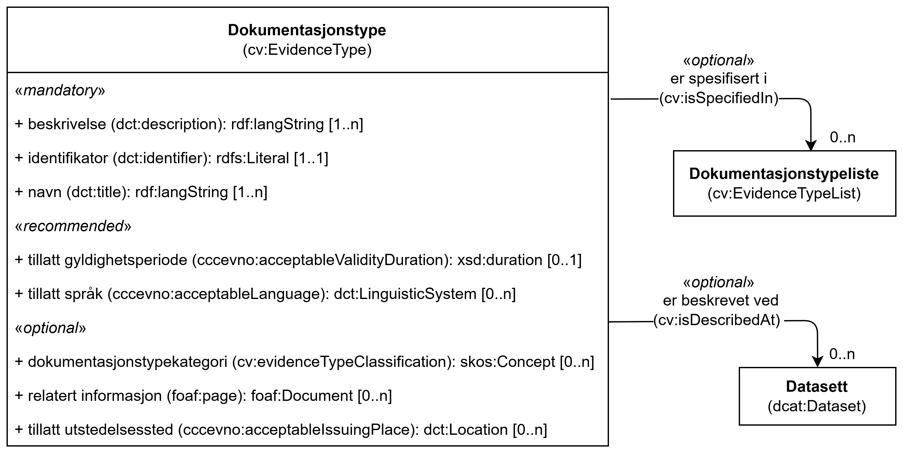

== Klassen Dokumentasjonstype (cv:EvidenceType) [[Dokumentasjonstype]]

[[img-KlassenDokumentasjonstype]]
.Klassen Dokumentasjonstype (cv:EvidenceType) og klassen den refererer til
[link=images/KlassenDokumentasjonstype.png]

[cols="30s,70d"]
|===
| _English name_ | _Evidence Type_
| Anvendelse / _Usage note_ | Klassen brukes til å representere informasjon om ønskede eller påkrevde egenskaper til dokumentasjonen. F.eks. at det kreves en firmaattest som dokumentasjon for å oppfylle et krav, og at denne attesten må være gyldig (ikke eldre enn 6 måneder).

_This class represents information about the characteristics of an Evidence. The Evidence Type and the characteristics it describes are not concrete individual responses to a Requirement (i.e. Evidence), but descriptions about the desired form, content, source and/or other characteristics that an actual response should have and provide._
| URI | cv:EvidenceType
|=== 

=== Obligatoriske egenskaper for klassen _Dokumentasjonstype_ [[Dokumentasjonstype-obligatoriske-egenskaper]]

==== Dokumentasjonstype – beskrivelse (dct:description) [[Dokumentasjonstype-beskrivelse]]

[cols="30s,70d"]
|===
| _English name_ | _description_
| URI | dct:description
|Verdiområde / _Range_ | rdf:langString
| Anvendelse / _Usage note_ | Egenskapen brukes til å oppgi en tekstlig beskrivelse av den dokumentasjonstypen. Egenskapen BØR gjentas når beskrivelsen finnes på flere språk.

_This property represents a free text Description of the Evidence type. This property SHOULD be repeated when the description is in parallel languages._
| Multiplisitet / _Multiplicity_ | 1..n
| Kravnivå / _Requirement level_ | Obligatorisk / _Mandatory_
| Merknad / _Note_ | Norsk utvidelse: Ikke eksplisitt spesifisert i CCCEV/CPSV-AP.

_Norwegian extension: Not explicitly specified in CCCEV/CPSV-AP._
| Eksempel |  «Firmaattest utstedt av Brønnøysundregistrene»
|===

Eksempel i RDF Turtle:
-----
<firmaattest> a cv:EvidenceType ; 
   dct:description "Firmaattest utstedt av Brønnøysundregistrene"@nb ; .
-----

==== Dokumentasjonstype – identifikator (dct:identifier) [[Dokumentasjonstype-identifikator]]

[cols="30s,70d"]
|===
| _English name_ | _identifier_
| URI | dct:identifier
| Verdiområde / _Range_ | rdfs:Literal
| Anvendelse / _Usage note_ | Egenskapen brukes til å oppgi identifikatoren til dokumentasjonstypen.

_This property represents an unambiguous reference to the Evidence Type._
| Multiplisitet / _Multiplicity_ | 1..1
| Kravnivå / _Requirement level_ | Obligatorisk / _Mandatory_ 
|===

Eksempel i RDF Turtle:
-----
<firmaattest> a cv:EvidenceType ; 
   dct:identifier "https://example.org/evidence-types/company-registration-certificate"^^xsd:anyURI ; .
-----

==== Dokumentasjonstype – navn (dct:title) [[Dokumentasjonstype-navn]]

[cols="30s,70d"]
|===
| _English name_ | _name_
| URI | dct:title
|Verdiområde / _Range_ | rdf:langString
| Anvendelse / _Usage note_ | Egenskapen brukes til å oppgi navnet til dokumentasjonstypen. Egenskapen BØR gjentas når navnet finnes på flere språk.

_This property represents the name of the Evidence Type. This property SHOULD be repeated when the name is in parallel languages._ 
| Multiplisitet / _Multiplicity_ | 1..n
| Kravnivå / _Requirement level_ | Obligatorisk / _Mandatory_
| Merknad / _Note_ | Norsk utvidelse: Ikke eksplisitt spesifisert i CCCEV/CPSV-AP.

_Norwegian extension: Not explicitly specified in CCCEV/CPSV-AP._
| Eksempel | «Firmaattest»
|===

Eksempel i RDF Turtle:
-----
<firmaattest> a cv:EvidenceType ; 
   dct:title "Firmaattest"@nb ; .
-----

=== Anbefalte egenskaper for klassen _Dokumentasjonstype_ [[Dokumentasjonstype-anbefalte-egenskaper]]

==== Dokumentasjonstype – tillatt gyldighetsperiode (cccevno:acceptableValidityDuration) [[Dokumentasjonstype-tillatt-gyldighetsperiode]]

[cols="30s,70d"]
|===
| _English name_ |  _acceptable validity duration_
| URI | cccevno:acceptableValidityDuration
|Verdiområde / _Range_ | xsd:duration
| Anvendelse / _Usage note_ | Egenskapen brukes til å angi en tidsperiode som dokumentasjoner tilhørende denne dokumentasjonstypen skal være gyldig innenfor.

_This property represents time duration within which the Evidences belonging to this Evidence Type must be valid._
| Multiplisitet / _Multiplicity_ | 0..1
| Kravnivå / _Requirement level_ | Anbefalt / _Recommended_
| Merknad / _Note_ | Norsk utvidelse: Ikke eksplisitt spesifisert i CCCEV/CPSV-AP.

_Norwegian extension: Not explicitly specified in CCCEV/CPSV-AP._
| Eksempel | Ikke eldre enn 6 måneder.
|===

Eksempel i RDF Turtle:
-----
<påkrevdFirmaattest> a cccevno:RequiredEvidence ; 
   cccevno:acceptableValidityDuration "P6M"^^xsd:duration ; . # 6 måneder
-----

==== Dokumentasjonstype – tillatt språk (cccevno:acceptableLanguage) [[Dokumentasjonstype-tillatt-språk]]

[cols="30s,70d"]
|===
| _English name_ | _acceptable language_
| URI | cccevno:acceptableLanguage
|Verdiområde / _Range_ | dct:LinguisticSystem
| Anvendelse / _Usage note_ | Egenskapen brukes til å oppgi språk som dokumentasjoner tilhørende denne dokumentasjonstypen kan være på.

_This property is used to specify the language(s) that the evidence must be written in._
| Multiplisitet / _Multiplicity_ | 0..n
| Kravnivå / _Requirement level_ | Anbefalt / _Recommended_
|Merknad 1 / _Note 1_ | Verdien SKAL velges fra EUs kontrollerte vokabular https://op.europa.eu/en/web/eu-vocabularies/concept-scheme/-/resource?uri=http://publications.europa.eu/resource/authority/language[Språk &#x29C9;, window="_blank", role="ext-link"].

__The value MUST be chosen from EU's controlled vocabulary https://op.europa.eu/en/web/eu-vocabularies/concept-scheme/-/resource?uri=http://publications.europa.eu/resource/authority/language[Language &#x29C9;, window="_blank", role="ext-link"].__
| Merknad 2 / _Note 2_ | Norsk utvidelse: Ikke eksplisitt spesifisert i CCCEV/CPSV-AP.

_Norwegian extension: Not explicitly specified in CCCEV/CPSV-AP._
| Eksempel | Den påkrevd dokumentasjonen må være på norsk eller engelsk.
|===

=== Valgfrie egenskaper for klassen _Dokumentasjonstype_ [[Dokumentasjonstype-valgfrie-egenskaper]]

==== Dokumentasjonstype – dokumentasjonstypekategori (cv:evidenceTypeClassification) [[Dokumentasjonstype-dokumentasjonstypekategori]]

[cols="30s,70d"]
|===
| _English name_ | _evidence type classification_
| URI | cv:evidenceTypeClassification
| Verdiområde / _Range_ | skos:Concept
| Anvendelse / _Usage note_ | Egenskapen brukes til å referere til kategorien som dokumentasjonstypen tilhører.

_This property represents the category to which the Evidence Type belongs._
| Multiplisitet / _Multiplicity_ | 0..n
| Kravnivå / _Requirement level_ | Valgfri / _Optional_
|===

==== Dokumentasjonstype – er beskrevet ved (cv:isDescribedAt) [[Dokumentasjonstype-er-beskrevet-ved]]

[cols="30s,70d"]
|===
| _English name_ | _is described at_
| URI | cv:isDescribedAt
| Verdiområde / _Range_ | https://informasjonsforvaltning.github.io/dcat-ap-no/#Datasett[dcat:Dataset &#x29C9;, window="_blank", role="ext-link"]
| Anvendelse / _Usage note_ |  Egenskapen brukes til å referere til datasett som dokumentasjoner tilhørende denne dokumentasjonstypen kan være beskrevet ved.

_This property it used to refer to dataset where the given type of evidences may be described._
| Multiplisitet / _Multiplicity_ | 0..n
| Kravnivå / _Requirement level_ | Valgfri / _Optional_
| Merknad / _Note_ | Norsk utvidelse: Ikke eksplisitt spesifisert i CCCEV/CPSV-AP.

_Norwegian extension: Not explicitly specified in CCCEV/CPSV-AP._
|===

==== Dokumentasjonstype – er spesifisert i (cv:isSpecifiedIn) [[Dokumentasjonstype-er-spesifisert-i]]

[cols="30s,70d"]
|===
| _English name_ | _is spesified in_
| URI | cv:isSpecifiedIn
| Verdiområde / _Range_ | https://informasjonsforvaltning.github.io/cccev-ap-no/#Dokumentasjonstypeliste[:EvidenceTypeList &#x29C9;, window="_blank", role="ext-link"]
| Anvendelse / _Usage note_ | Egenskapen brukes til å referere til en dokumentasjonstypeliste som inneholder dokumentasjonstypen.

_This property represents the Evidence Type List in which the Evidence Type is included._
| Multiplisitet / _Multiplicity_ | 0..n
| Kravnivå / _Requirement level_ | Valgfri / _Optional_
|===

==== Dokumentasjonstype – relatert informasjon (foaf:page) [[Dokumentasjonstype-relatert-informasjon]]

[cols="30s,70d"]
|===
| _English name_ | _related documentation_
| URI | foaf:page
|Verdiområde / _Range_ | foaf:Document
| Anvendelse / _Usage note_ | Egenskapen brukes til å referere til mer informasjon om den aktuelle type dokumentasjon, f.eks. en bestemt mal til et administrativt dokument eller en applikasjon, eller en veiledning for hvordan man skal formatere dokumentasjonen.

_This property is used to refer to more information related to the given type of evidences, for instance a particular template for an administrative document, an application or a guide on formatting the documentation._
| Multiplisitet / _Multiplicity_ | 0..n
| Kravnivå / _Requirement level_ | Valgfri / _Optional_
| Merknad / _Note_ | Norsk utvidelse: Ikke eksplisitt spesifisert i CCCEV/CPSV-AP.

_Norwegian extension: Not explicitly specified in CCCEV/CPSV-AP._
|===

==== Dokumentasjonstype – tillatt utstedelsessted (cccevno:acceptableIssuingPlace) [[Dokumentasjonstype-tillatt-utstedelsessted]]

[cols="30s,70d"]
|===
| _English name_ | _acceptable issuing place_
| URI |cccevno:acceptableIssuingPlace
| Verdiområde / _Range_ | dct:Location
| Anvendelse / _Usage note_ | Egenskapen brukes til å oppgi tillatt utstedelsessted for dokumentasjoner tilhørende denne dokumentasjonstypen, f.eks. Norge.

_This property represents acceptable issuing places for an Evidence of this Evidence Type, e.g. Norway._
| Multiplisitet / _Multiplicity_ |0..n
| Kravnivå / _Requirement level_ |Valgfri / _Optional_
| Merknad 1 / _Note 1_ | Norsk utvidelse: Verdien SKAL velges fra EUs kontrollerte vokabularer https://op.europa.eu/en/web/eu-vocabularies/concept-scheme/-/resource?uri=http://publications.europa.eu/resource/authority/continent[__Continent__ &#x29C9;, window="_blank", role="ext-link"], https://op.europa.eu/en/web/eu-vocabularies/concept-scheme/-/resource?uri=http://publications.europa.eu/resource/authority/country[__Countries and territories__ &#x29C9;, window="_blank", role="ext-link"] eller https://op.europa.eu/en/web/eu-vocabularies/concept-scheme/-/resource?uri=http://publications.europa.eu/resource/authority/place[__Place__ &#x29C9;, window="_blank", role="ext-link"], HVIS den finnes på listene; https://sws.geonames.org/[__GeoNames__ &#x29C9;, window="_blank", role="ext-link"] SKAL i andre tilfeller brukes. 

__Norwegian extension: The value MUST be chosen from EU's controlled vocabularies https://op.europa.eu/en/web/eu-vocabularies/concept-scheme/-/resource?uri=http://publications.europa.eu/resource/authority/continent[Continent &#x29C9;, window="_blank", role="ext-link"], https://op.europa.eu/en/web/eu-vocabularies/concept-scheme/-/resource?uri=http://publications.europa.eu/resource/authority/country[Countries and territories &#x29C9;, window="_blank", role="ext-link"] or https://op.europa.eu/en/web/eu-vocabularies/concept-scheme/-/resource?uri=http://publications.europa.eu/resource/authority/place[Place &#x29C9;, window="_blank", role="ext-link"], IF it is in one of the lists;  if a particular location is not in one of the mentioned Named Authority Lists, https://sws.geonames.org/[GeoNames &#x29C9;, window="_blank", role="ext-link"] URIs MUST be used.__
| Merknad 2 / _Note 2_ | Norsk utvidelse: Ikke eksplisitt spesifisert i CCCEV/CPSV-AP.

_Norwegian extension: Not explicitly specified in CCCEV/CPSV-AP._
|===

