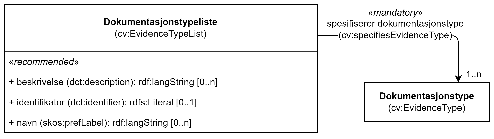

== Klassen Dokumentasjonstypeliste (cv:EvidenceTypeList) [[Dokumentasjonstypeliste]]

[[img-KlassenDokumentasjonstypeliste]]
.Klassen Dokumentasjonstypeliste (cv:EvidenceTypeList)
[link=images/KlassenDokumentasjonstypeliste.png]

[cols="30s,70d"]
|===
|English name|  Evidence type list
|Anvendelse| Klassen brukes til å representere en gruppe av dokumentasjonstyper som kreves for å oppfylle et krav.

Kravet om å være i samsvar med en dokumentasjonstypeliste er oppfylt **hvis og bare hvis** den aktuelle dokumentasjonen samsvarer med **alle** typer som listen inneholder. Det er med andre ord en `AND` betingelse mellom typene på en gitt dokumentasjonsliste, og en `OR` betingelse mellom ulike dokumentasjonslister.
|Usage note| This class represents a group of Evidence Types for conforming to a Requirement.

An Evidence Type List is satisfied, if and only if, for all included Evidence Types in this List, corresponding conformant Evidence(s) are supporting the Requirement having this List. The Evidence Type List describes thus an AND condition on the different Evidence Types within the list and an OR condition between two or more Evidence Type Lists. Combinations of alternative Lists can be provided for a respondent of a Requirement to choose amongst them.
|URI| cv:EvidenceTypeList
|Kravnivå| Valgfri/Optional
|Merknad | Norsk utvidelse: Ikke eksplisitt spesifisert i CPSV-AP, men i CCCEV som CPSV-AP også bruker.
|Remark | Norwegian extension: Not explicitly specified in CPSV-AP, but in CCCEV which CPSV-AP also uses.
|Eksempel| Se under <<Å-beskrive-dokumentasjonskrav>>.
|===

Eksempel i RDF Turtle: Se under <<Å-beskrive-dokumentasjonskrav>>.

=== Obligatoriske egenskaper for klassen _Dokumentasjonstypeliste_ [[Dokumentasjonstypeliste-obligatoriske-egenskaper]]

==== Dokumentasjonstypeliste – spesifiserer dokumentasjonstype (cv:specifiesEvidenceType) [[Dokumentasjonstypeliste-SpesifisererDokumentasjonstype]]

[cols="30s,70d"]
|===
|English name|specifies evidence type
|URI|cv:specifiesEvidenceType
|Range|cv:EvidenceType
|Anvendelse|Egenskapen brukes til å referere til dokumentasjonstypene som inngår i dokumentasjonstypelisten.
|Usage note|This property represents Evidence Type included in this Evidence Type List.
|Multiplisitet|1..n
|Kravnivå|Obligatorisk/Mandatory
|Merknad | Norsk utvidelse: Ikke eksplisitt spesifisert i CPSV-AP, men i CCCEV som CPSV-AP også bruker.
|Remark | Norwegian extension: Not explicitly specified in CPSV-AP, but in CCCEV which CPSV-AP also uses.
|===

=== Anbefalte egenskaper for klassen _Dokumentasjonstypeliste_ [[Dokumentasjonstypeliste-anbefalte-egenskaper]]

==== Dokumentasjonstypeliste – beskrivelse (dct:description) [[Dokumentasjonstypeliste-beskrivelse]]

[cols="30s,70d"]
|===
|English name|description
|URI|dct:description
|Range|rdf:langString
|Anvendelse|Egenskapen brukes til å oppgi en tekstlig beskrivelse av dokumentasjonstypelisten. F.eks. informasjon knyttet til bruk av listen eller annen tilleggsinformasjon. Egenskapen bør gjentas når beskrivelsen finnes på flere språk.
|Usage note|This property represents a short explanation supporting the understanding of the Evidence Type List. The explanation can include information about the nature, attributes, uses or any other additional information about the Evidence Type List.
|Multiplisitet| 0..n
|Kravnivå|Anbefalt/Recommended
|Merknad | Norsk utvidelse: Ikke eksplisitt spesifisert i CPSV-AP, men i CCCEV som CPSV-AP også bruker.
|Remark | Norwegian extension: Not explicitly specified in CPSV-AP, but in CCCEV which CPSV-AP also uses.
|===

==== Dokumentasjonstypeliste – identifikator (dct:identifier) [[Dokumentasjonstypeliste-identifikator]]

[cols="30s,70d"]
|===
|English name|identifier
|URI|dct:identifier
|Range|rdfs:Literal
|Anvendelse|Egenskapen brukes til å oppgi identifikatoren til dokumentasjonstypelisten.
|Usage note|This property represents an unambiguous reference to the Evidence Type List.
|Multiplisitet| 0..1
|Kravnivå|Anbefalt/Recommended
|Merknad | Norsk utvidelse: Ikke eksplisitt spesifisert i CPSV-AP, men i CCCEV som CPSV-AP også bruker.
|Remark | Norwegian extension: Not explicitly specified in CPSV-AP, but in CCCEV which CPSV-AP also uses.
|===

==== Dokumentasjonstypeliste – navn (skos:prefLabel) [[Dokumentasjonstypeliste-navn]]

[cols="30s,70d"]
|===
|English name|name
|URI|skos:prefLabel
|Range|rdf:langString
|Anvendelse|Egenskapen brukes til å oppgi navnet til dokumentasjonstypelisten. Egenskapen bør gjentas når navnet finnes på flere språk.
|Usage note|This property represents the Name of the Evidence Type List.
|Multiplisitet|0..n
|Kravnivå|Anbefalt/Recommended
|Merknad | Norsk utvidelse: Ikke eksplisitt spesifisert i CPSV-AP, men i CCCEV som CPSV-AP også bruker.
|Remark | Norwegian extension: Not explicitly specified in CPSV-AP, but in CCCEV which CPSV-AP also uses.
|===
