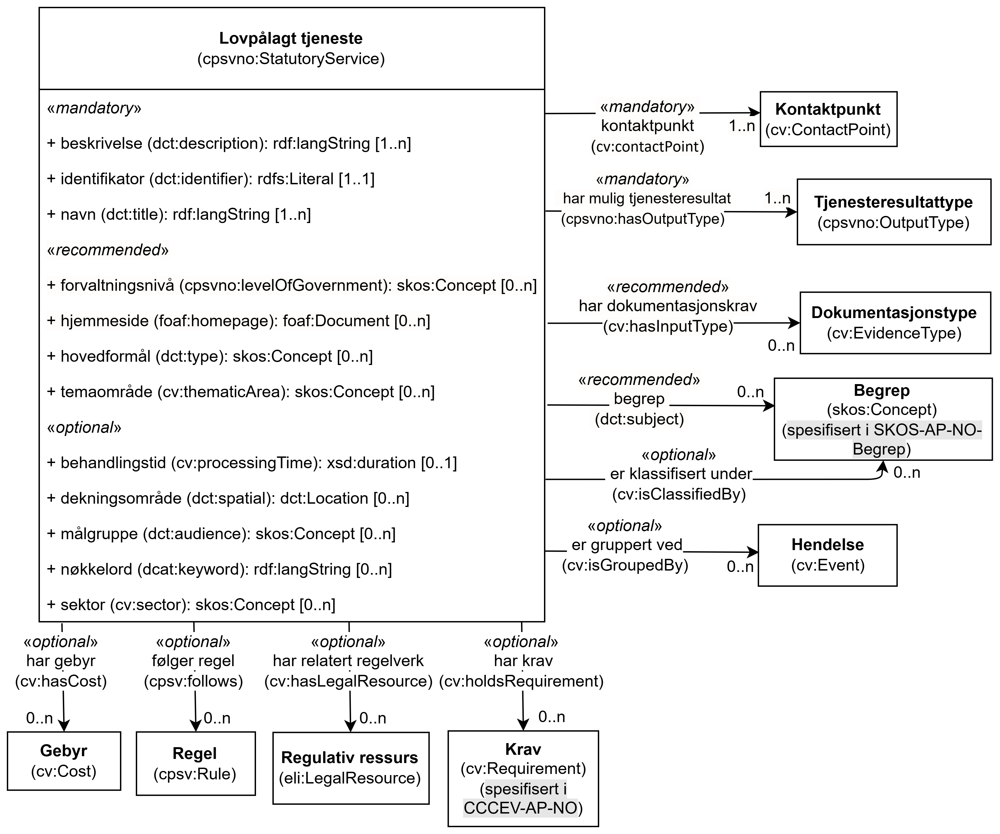

== Klassen Lovpålagt tjeneste (cpsvno:StatutoryService) [[LovpålagtTjeneste]]

[[img-KlassenLovpålagtTjeneste]]
.Klassen Lovpålagt tjeneste (cpsvno:StatutoryService) og klassene den refererer til.
[link=images/KlassenLovpålagtTjeneste.png]

[cols="30s,70d"]
|===
| _English name_ | _Statutory Service_
| Anvendelse / _Usage note_ | Klassen brukes til generelle beskrivelser av en lovpålagt tjeneste, uten å knytte tjenesten til en konkret tjenesteyter. 

_This class is used to represent a staturory service._
| URI | cpsvno:StatutoryService
| Merknad / _Note_ | Norsk utvidelse: Hele klassen er ikke eksplisitt spesifisert i CPSV-AP.

_Norwegian extension: The whole class is not explicitly specified in CPSV-AP._
| Eksempel | Skjenkebevilling er en lovpålagt tjeneste 
|===

Eksempel i RDF Turtle:
-----
<skjenkebevilling> a cpsvno:StatutoryService ; # en lovpålagt tjeneste
    dct:title "Skjenkebevilling"@nb .
-----

=== Obligatoriske egenskaper for klassen _Lovpålagt tjeneste_ [[LovpålagtTjeneste-obligatoriske-egenskaper]]

==== Lovpålagt tjeneste – beskrivelse (dct:description) [[LovpålagtTjeneste-beskrivelse]]

[cols="30s,70d"]
|===
| _English name_ | _description_
| URI | dct:description
| Verdiområde / _Range_ | rdf:langString
| Anvendelse / _Usage note_ |  Egenskapen brukes til å oppgi en tekstlig beskrivelse av tjenesten. Egenskapen BØR gjentas når beskrivelsen finnes på flere språk.

_This property represents a free text Description of the Public Service. This property SHOULD be repeated when the text is in parallel languages._
| Multiplisitet / _Multiplicity_ | 1..n
| Kravnivå / _Requirement level_ | Obligatorisk / _Mandatory_
| Eksempel | Bevilling for skjenking av alkoholholdig drikke, enten som alminnelig bevilling eller som bevilling for lukket selskap.
|===

Eksempel i RDF Turtle:
-----
<skjenkebevilling> a cpsvno:StatutoryService ;
   dct:description "Bevilling for skjenking av alkoholholdig drikk, enten som alminnelig bevilling eller som bevilling for lukket selskap."@nb ; .
-----

==== Lovpålagt tjeneste – har mulig tjenesteresultat (cpsvno:OutputType) [[LovpålagtTjeneste-har-mulig-tjenesteresultat]]

[cols="30s,70d"]
|===
| _English name_ | _has output type_
| URI | cpsvno:hasOutputType
| Verdiområde / _Range_ | <<Tjenesteresultattype, cpsvno:OutputType>>
| Anvendelse / _Usage note_ |  Egenskapen brukes til å spesifisere type mulige tjenesteresultater fra tjenesten.

_This property is used to specify type of possible result of the service._
| Multiplisitet / _Multiplicity_ | 1..n
| Kravnivå / _Requirement level_ | Obligatorisk / _Mandatory_
| Eksempel | En type mulig tjenesteresultat fra tjenesten «Skjenkebevilling» er bevillingen som utstedes når søknaden godkjennes. En annen type mulig tjenesteresultat er avslag når søknaden ikke godkjennes.
|===

Eksempel i RDF Turtle:
-----
<skjenkebevilling> a cpsvno:StatutoryService ;
   cpsvno:hasOutputType <bevilling> , <avslag> .
-----

==== Lovpålagt tjeneste – identifikator (dct:identifier) [[LovpålagtTjeneste-identifikator]]

[cols="30s,70d"]
|===
| _English name_ | _identifier_
| URI | dct:identifier
| Verdiområde / _Range_ | rdfs:Literal
| Anvendelse / _Usage note_ |  Egenskapen brukes til å oppgi en formell identifikasjon til tjenesten.

_This property represents a formally-issued Identifier for the Public Service._
| Multiplisitet / _Multiplicity_ | 1..1
| Kravnivå / _Requirement level_ | Obligatorisk / _Mandatory_
|===

==== Lovpålagt tjeneste – kontaktpunkt (cv:contactPoint) [[LovpålagtTjeneste-kontaktpunkt]]

[cols="30s,70d"]
|===
| _English name_ | _contact point_
| URI |  cv:contactPoint
| Verdiområde / _Range_ | <<Kontaktpunkt, cv:ContactPoint>>
| Anvendelse / _Usage note_ |  Egenskapen brukes til å oppgi kontaktpunkt(er) for beskrivelsen av tjenesten.

_This property represents contact points for the service._
| Multiplisitet / _Multiplicity_ | 1..n
| Kravnivå / _Requirement level_ |  Obligatorisk / _Mandatory_
| Eksempel | Helsedirektoratet er kontaktpunkt for de generelle beskrivelsene av «Skjenkebevilling».
|===

Eksempel i RDF Turtle:
-----
<skjenkebevilling> a cpsvno:StatutoryService ;
   cv:contactPoint <hdir> ; .
-----

==== Lovpålagt tjeneste – navn (dct:title) [[LovpålagtTjeneste-navn]]

[cols="30s,70d"]
|===
| _English name_ | _name_
| URI | dct:title
| Verdiområde / _Range_ | rdf:langString
| Anvendelse / _Usage note_ |  Egenskapen brukes til å oppgi det offisielle navnet på tjenesten. Egenskapen BØR gjentas når navnet finnes på flere språk.

_This property represents the official Name of the Public Service. This property SHOULD be repeated when the name is in parallel languages._
| Multiplisitet / _Multiplicity_ | 1..n
| Kravnivå / _Requirement level_ |  Obligatorisk / _Mandatory_
| Eksempel | «Skjenkebevilling»
|===

Eksempel i RDF Turtle:
-----
<skjenkebevilling> a cpsvno:StatutoryService ;
   dct:title "Skjenkebevilling"@nb ; .
-----

=== Anbefalte egenskaper for klassen _Lovpålagt tjeneste_ [[LovpålagtTjeneste-anbefalte-egenskaper]]

==== Lovpålagt tjeneste – begrep (dct:subject) [[LovpålagtTjeneste-begrep]]

[cols="30s,70d"]
|===
| _English name_ | _subject_
| URI | dct:subject
| Verdiområde / _Range_ | https://data.norge.no/specification/skos-ap-no-begrep#Begrep[skos:Concept &#x29C9;, window="_blank", role="ext-link"]
| Anvendelse / _Usage note_ |  Egenskapen brukes til å referere til begrep som er viktig for å forstå tjenesten.

_This property refers to concept that is important for the understanding of the service._
| Multiplisitet / _Multiplicity_ | 0..n
| Kravnivå / _Requirement level_ |  Anbefalt / _Recommended_
|===

==== Lovpålagt tjeneste – dekningsområde (dct:spatial) [[LovpålagtTjeneste-dekningsområde]]

[cols="30s,70d"]
|===
| _English name_ | _spatial coverage_
| URI | dct:spatial
| Verdiområde / _Range_ | dct:Location
| Anvendelse / _Usage note_ |  Egenskapen brukes til å referere til et geografisk område som dekkes av tjenesten.

_This property represents that area(s) a Public Service is likely to be available only within, typically the area(s) covered by a particular public authority._
| Multiplisitet / _Multiplicity_ | 0..n
| Kravnivå / _Requirement level_ | Anbefalt / _Recommended_
|Merknad / _Note_ a| Norsk utvidelse: Verdien SKAL velges fra EUs kontrollerte vokabularer https://op.europa.eu/en/web/eu-vocabularies/concept-scheme/-/resource?uri=http://publications.europa.eu/resource/authority/continent[__Continent__ &#x29C9;, window="_blank", role="ext-link"], https://op.europa.eu/en/web/eu-vocabularies/concept-scheme/-/resource?uri=http://publications.europa.eu/resource/authority/country[__Countries and territories__ &#x29C9;, window="_blank", role="ext-link"] eller https://op.europa.eu/en/web/eu-vocabularies/concept-scheme/-/resource?uri=http://publications.europa.eu/resource/authority/place[__Place__ &#x29C9;, window="_blank", role="ext-link"], HVIS den finnes på listene; https://sws.geonames.org/[__GeoNames__ &#x29C9;, window="_blank", role="ext-link"] SKAL i andre tilfeller brukes. 

__Norwegian extension: The value MUST be chosen from EU's controlled vocabularies https://op.europa.eu/en/web/eu-vocabularies/concept-scheme/-/resource?uri=http://publications.europa.eu/resource/authority/continent[Continent &#x29C9;, window="_blank", role="ext-link"], https://op.europa.eu/en/web/eu-vocabularies/concept-scheme/-/resource?uri=http://publications.europa.eu/resource/authority/country[Countries and territories &#x29C9;, window="_blank", role="ext-link"] or https://op.europa.eu/en/web/eu-vocabularies/concept-scheme/-/resource?uri=http://publications.europa.eu/resource/authority/place[Place &#x29C9;, window="_blank", role="ext-link"], IF it is in one of the lists;  if a particular location is not in one of the mentioned Named Authority Lists, https://sws.geonames.org/[GeoNames &#x29C9;, window="_blank", role="ext-link"] URIs MUST be used.__
| Eksempel | «Skjenkebevilling» har Norge som dekningsområde.
|===

Eksempel i RDF Turtle:
----
<skjenkebevilling> a cpsvno:StatutoryService ;
   dct:spatial <http://publications.europa.eu/resource/authority/country/NOR> ; # Norge
    .
----

==== Lovpålagt tjeneste – har dokumentasjonskrav (cv:hasInputType) [[LovpålagtTjeneste-har-dokumentasjonskrav]]

[cols="30s,70d"]
|===
| _English name_ | _has input type_
| URI | cv:hasInputType
| Verdiområde / _Range_ | <<Dokumentasjonstype, cv:EvidenceType>>
| Anvendelse / _Usage note_ |  Egenskapen brukes til å spesifisere type dokumentasjon som er påkrevd av tjenesten.

_This property is used to specify evidence that is required by the service._
| Multiplisitet / _Multiplicity_ | 0..n
| Kravnivå / _Requirement level_ |  Anbefalt / _Recommended_
| Merknad / _Note_ | For å kunne levere en tjeneste kan det kreves  dokumentasjon. Hvis dokumentasjon som kreves varierer avhengig av kanal tjenesten tilbys gjennom, BØR tilsvarende egenskap i klassen Tjenestekanal benyttes. 

_A service may require certain evidence in order to be delivered. If the evidence required varies according to the channel through which it is accessed, then the corresponding property in the class Channel SHOULD be used._
| Eksempel | En type dokumentasjon som er påkrevd for å søke om skjenkebevilling er firmaattest.
|===

Eksempel i RDF Turtle:
----
<skjenkebevilling> a cpsvno:StatutoryService ;
   cv:hasInputType <firmaattest> ; .
----

==== Lovpålagt tjeneste – hjemmeside (foaf:homepage) [[LovpålagtTjeneste-hjemmeside]]

[cols="30s,70d"]
|===
| _English name_ | _homepage_
| URI | foaf:homepage
| Verdiområde / _Range_ | foaf:Document
| Anvendelse / _Usage note_ |  Egenskapen brukes til å referere til en hjemmeside til tjenesten.

_This property refers to a homepage of the Service._
| Multiplisitet / _Multiplicity_ | 0..n
| Kravnivå / _Requirement level_ | Anbefalt / _Recommended_
| Eksempel | https://www.helsedirektoratet.no/forebygging-diagnose-og-behandling/forebygging-og-levevaner/alkohol/skjenkebevilling-for-alkohol[Helsedirektoratets side om Skjenkebevilling for alkohol &#x29C9;, window="_blank", role="ext-link"]
|===

Eksempel i RDF Turtle:
-----
<skjenkebevilling> a cpsvno:StatutoryService ;
   foaf:homepage <https://www.helsedirektoratet.no/forebygging-diagnose-og-behandling/forebygging-og-levevaner/alkohol/skjenkebevilling-for-alkohol> ; .
-----

==== Lovpålagt tjeneste – hovedformål (dct:type) [[LovpålagtTjeneste-hovedformål]]

[cols="30s,70d"]
|===
| _English name_ | _functions of government_
| URI | dct:type
| Verdiområde / _Range_ | skos:Concept
| Anvendelse / _Usage note_ |  Egenskapen brukes til å indikere type tjeneste i henhold til et kontrollert vokabular.

_This property represents the Type of a Public Service as described in a controlled vocabulary._
| Multiplisitet / _Multiplicity_ | 0..n
| Kravnivå / _Requirement level_ | Anbefalt / _Recommended_
| Merknad / _Note_ | Verdien SKAL velges fra EUs kontrollerte vokabular https://op.europa.eu/en/web/eu-vocabularies/concept-scheme/-/resource?uri=http://publications.europa.eu/resource/authority/main-activity[Main activity &#x29C9;, window="_blank", role="ext-link"], når verdien finnes i vokabularet.

__The value MUST be chosen from EU's controlled vocabulary https://op.europa.eu/en/web/eu-vocabularies/concept-scheme/-/resource?uri=http://publications.europa.eu/resource/authority/main-activity[Main activity &#x29C9;, window="_blank", role="ext-link"].__
|===

==== Lovpålagt tjeneste – temaområde (cv:thematicArea) [[LovpålagtTjeneste-temaområde]]

[cols="30s,70d"]
|===
| _English name_ | _thematic area_
| URI | cv:thematicArea
| Verdiområde / _Range_ | skos:Concept
| Anvendelse / _Usage note_ |  Egenskapen brukes til å referere til primært temaområde som dekkes av tjenesten.

_This property represents the Thematic Area of a Public Service as described in a controlled vocabulary._
| Multiplisitet / _Multiplicity_ | 0..n
| Kravnivå / _Requirement level_ | Anbefalt / _Recommended_
| Merknad / _Note_ | Verdien BØR velges fra EUs kontrollerte vokabular https://op.europa.eu/en/web/eu-vocabularies/concept-scheme/-/resource?uri=http://eurovoc.europa.eu/100141[EuroVoc &#x29C9;, window="_blank", role="ext-link"] eller https://psi.norge.no/los/[Los – felles vokabular for å kategorisere og beskrive offentlige tjenester og ressurser &#x29C9;, window="_blank", role="ext-link"].

__The value SHOULD  be chosen from EU's controlled vocabulary https://op.europa.eu/en/web/eu-vocabularies/concept-scheme/-/resource?uri=http://eurovoc.europa.eu/100141[EuroVoc &#x29C9;, window="_blank", role="ext-link"] or https://psi.norge.no/los/[Los &#x29C9;, window="_blank", role="ext-link"].__
|===

=== Valgfrie egenskaper for klassen _Lovpålagt tjeneste_ [[LovpålagtTjeneste-valgfrie-egenskaper]]

==== Lovpålagt tjeneste – er del av (dct:isPartOf) [[LovpålagtTjeneste-er-del-av]]

[cols="30s,70d"]
|===
| _English name_ | _is part of_
| URI | dct:isPartOf
| Verdiområde / _Range_ | <<Tjeneste, cpsvno:Service>>
| Anvendelse / _Usage note_ |  Egenskapen brukes til å referere til en annen lovpålagt tjeneste som tjenesten er en del av.

_This property indicates a related statutory service in which the described resource is included. This property is the inverse of `dct:hasPart`._
| Multiplisitet / _Multiplicity_ | 0..n
| Kravnivå / _Requirement level_ | Valgfri / _Optional_
| Merknad / _Note_ | Denne er den inverse av egenskapen <<LovpålagtTjeneste-har-del>>.

_This is the inverse of the property <<LovpålagtTjeneste-har-del>>._
|===

==== Lovpålagt tjeneste – er gruppert ved (cv:isGroupedBy) [[LovpålagtTjeneste-er-gruppert-ved]]

[cols="30s,70d"]
|===
| _English name_ | _is grouped by_
| URI | cv:isGroupedBy
| Verdiområde / _Range_ | <<Hendelse, cv:Event>>
| Anvendelse / _Usage note_ |  Egenskapen brukes til å referere til en eller flere hendelser som tjenesten kan grupperes ved.

_This property is used to refer to the Event by which the service is grouped._
| Multiplisitet / _Multiplicity_ | 0..n
| Kravnivå / _Requirement level_ | Valgfri / _Optional_
| Merknad / _Note_ | Flere lovpålagte tjenester KAN være knyttet til en bestemt hendelse, og likedan KAN den samme offentlige tjenesten være knyttet til flere forskjellige hendelser.

_Several Statutory Services MAY be associated with a particular Event and, likewise, the same Public Service MAY be associated with several different Events._
| Eksempel | Tjenesten «Skjenkebevilling» grupperes under hendelsen «Starte og drive en restaurant»
|===

Eksempel i RDF Turtle:
-----
<skjenkebevilling> a cpsvno:StatutoryService ;
   cv:isGroupedBy <starteOgDriveRestaurant> .

<starteOgDriveRestaurant> a cv:Event .
-----

==== Lovpålagt tjeneste – er klassifisert under (cv:isClassifiedBy) [[LovpålagtTjeneste-er-klassifisert-under]]

[cols="30s,70d"]
|===
| _English name_ | _is classified by_
| URI | cv:isClassifiedBy
| Verdiområde / _Range_ | https://data.norge.no/specification/skos-ap-no-begrep#Begrep[skos:Concept &#x29C9;, window="_blank", role="ext-link"]
| Anvendelse / _Usage note_ |  Egenskapen brukes til å referere til et eller flere begreper som er brukt til å klassifisere tjenesten, begreper som _ikke_ er eller _ikke_ kan være inkludert i andre egenskaper som <<LovpålagtTjeneste-temaområde>>, <<LovpålagtTjeneste-sektor>> osv.

_This property allows to classify the Public Service with any Concept, other than those already foreseen and defined explicitly in CPSV-AP (<<LovpålagtTjeneste-temaområde>>, <<LovpålagtTjeneste-sektor>> etc.)_
| Multiplisitet / _Multiplicity_ | 0..n
| Kravnivå / _Requirement level_ | Valgfri / _Optional_
| Merknad / _Note_ |  Dette er en generisk egenskap som kan spesialiseres til å lage spesifikke klassifiseringer, f.eks. å klassifisere offentlige tjenester etter digitaliseringsnivå osv.

_It is a generic property which can be further specialised to make the classification explicit, for instance for classifying public services according to level of digitisation etc._
|===

==== Lovpålagt tjeneste – følger regel (cpsv:follows) [[LovpålagtTjeneste-følger-regel]]

[cols="30s,70d"]
|===
| _English name_ | _follows_
| URI | cpsv:follows
| Verdiområde / _Range_ | <<Regel, cpsv:Rule>>
| Anvendelse / _Usage note_ |  Egenskapen brukes til å referere til regelen som gjelder for tjenesten.

_This property links a Service to the Rule(s) under which it operates._
| Multiplisitet / _Multiplicity_ | 0..n
| Kravnivå / _Requirement level_ | Valgfri / _Optional_
|===

==== Lovpålagt tjeneste – har del (dct:hasPart) [[LovpålagtTjeneste-har-del]]

[cols="30s,70d"]
|===
| _English name_ | _has part_
| URI | dct:hasPart
| Verdiområde / _Range_ | <<LovpålagtTjeneste, cpsvno:StatutoryService>>
| Anvendelse / _Usage note_ |  Egenskapen brukes til å referere til en annen lovpålagt tjeneste som er inkludert i tjenesten som beskrives.

_This property indicates a related statutory service that is included in the described resource._
| Multiplisitet / _Multiplicity_ | 0..n
| Kravnivå / _Requirement level_ | Valgfri / _Optional_
| Merknad / _Note_ | Dette er den inverse av egenskapen <<LovpålagtTjeneste-er-del-av>>.

_This is the inverse of the property <<LovpålagtTjeneste-er-del-av>>._
|===

==== Lovpålagt tjeneste – har gebyr (cv:hasCost) [[LovpålagtTjeneste-har-gebyr]]

[cols="30s,70d"]
|===
| _English name_ | _has cost_
| URI | cv:hasCost
| Verdiområde / _Range_ | <<Gebyr, cv:Cost>>
| Anvendelse / _Usage note_ |  Egenskapen brukes til å referere til en eller flere instanser av klassen Gebyr (`cv:Cost`), for å oppgi ev. gebyr for tjenesten.

_This property links a Public Service to one or more instances of the Cost class. It indicates the costs related to the execution of a Public Service for the citizen or business related to the execution of the particular Public Service._
| Multiplisitet / _Multiplicity_ | 0..n
| Kravnivå / _Requirement level_ | Valgfri / _Optional_
| Merknad / _Note_ | Der gebyret varierer avhengig av kanalen tjenesten tilbys gjennom, SKAL egenskapen <<Gebyr-hvis-tilbys-gjennom>> brukes.

_Where the cost varies depending on the channel through which the service is accessed, it MUST be linked to the channel using the <<Gebyr-hvis-tilbys-gjennom>> relationship._
|===

==== Lovpålagt tjeneste – har krav (cv:holdsRequirement) [[LovpålagtTjeneste-har-krav]]

[cols="30s,70d"]
|===
| _English name_ |  _holds requirement_
| URI |  cv:holdsRequirement
| Verdiområde / _Range_ | https://informasjonsforvaltning.github.io/cccev-ap-no/#Krav[cv:Requirement &#x29C9;, window="_blank", role="ext-link"]
| Anvendelse / _Usage note_ |  Egenskapen brukes til å referere til krav knyttet til behov for eller bruk av tjenesten.

_This property links a Public Service to a class that describes the criteria for needing or using the service, such as residency in a given location, being over a certain age etc._
| Multiplisitet / _Multiplicity_ | 0..n
| Kravnivå / _Requirement level_ | Valgfri / _Optional_
| Eksempel | Vilkår for å søke om skjenkebevilling.
|===

Eksempel i RDF Turtle:
-----
<skjenkebevilling> a cpsvno:StatutoryService ;
   cv:holdsRequirement <vilkårForSkjenkebevilling> ; .

<vilkårForSkjenkebevilling> a cv:Criterion ;
   dct:title "Vilkår for skjenkebevilling"@nb ; . 
-----

==== Lovpålagt tjeneste – har relatert regelverk (cv:hasLegalResource) [[LovpålagtTjeneste-har-relatert-regelverk]]

[cols="30s,70d"]
|===
| _English name_ | _has legal resource_
| URI | cv:hasLegalResource
| Verdiområde / _Range_ | <<RegulativRessurs, eli:LegalResource>>
| Anvendelse / _Usage note_ |  Egenskapen brukes til å referere til regelverk (instans av "regulativ ressurs") som tjenesten opereres under eller har som sin juridiske ramme, eller på andre måter er relatert til.

_This property links a Public Service to a Legal Resource. It indicates the Legal Resource (e.g. legislation) to which the Public Service relates, operates or has its legal basis._
| Multiplisitet / _Multiplicity_ | 0..n
| Kravnivå / _Requirement level_ | Valgfri / _Optional_
|===

==== Lovpålagt tjeneste – krever (dct:requires) [[LovpålagtTjeneste-krever]]

[cols="30s,70d"]
|===
| _English name_ | _requires_
| URI | dct:requires
| Verdiområde / _Range_ | <<LovpålagtTjeneste, cpsvno:StatutoryService>>
| Anvendelse / _Usage note_ |  Egenskapen brukes til å referere til en eller flere andre lovpålagte tjenester som tjenesten krever utført først, eller som tjenesten på en eller annen måte bruker resultatet fra.

_One service may require, or in some way make use of, the output of one or several other services. In this case, for a service to be executed, another service must be executed beforehand. The nature of the requirement will be described in the associated Rule or Input._
| Multiplisitet / _Multiplicity_ | 0..n
| Kravnivå / _Requirement level_ | Valgfri / _Optional_
| Eksempel | For å kunne søke om skjenkebevilling kreves det at «Kunnskapsprøve» er tatt.
|===

Eksempel i RDF Turtle:
-----
<skjenkebevilling> a cpsvno:StatutoryService ;
   dct:requires <kunnskapsprøve> .

<kunnskapsprøve> a cpsvno:StatutoryService ;
   dct:title "Kunnskapsprøve for styrere og stedfortredere – Alkoholloven og serveringsloven"@nb .
-----

==== Lovpålagt tjeneste – målgruppe (dct:audience) [[LovpålagtTjeneste-målgruppe]]

[cols="30s,70d"]
|===
| _English name_ | _addressee_ 
| URI | dct:audience 
| Verdiområde / _Range_ | skos:Concept
| Anvendelse / _Usage note_ | Egenskapen brukes til å spesifisere målgruppe av tjenesten.   

_This property is used to specify the target recipient of the service._ 
| Multiplisitet / _Multiplicity_ | 0..n 
| Kravnivå / _Requirement level_ | Valgfri / _Optional_ 
|===

==== Lovpålagt tjeneste – nøkkelord (dcat:keyword) [[LovpålagtTjeneste-nøkkelord]]

[cols="30s,70d"]
|===
| _English name_ | _keyword_
| URI | dcat:keyword
| Verdiområde / _Range_ | rdf:langString
| Anvendelse / _Usage note_ |  Egenskapen brukes til å oppgi nøkkelord som beskriver den aktuelle offentlige tjenesten.

_This property represents a keyword, term or phrase to describe the Public Service._
| Multiplisitet / _Multiplicity_ | 0..n
| Kravnivå / _Requirement level_ | Valgfri / _Optional_
| Eksempel / _Example_ | Eksempler i forbindelse med tjenesten «Skjenkebevilling»: alkoholservering, skjenkebevilling, bar, nattklubb.

_Examples in connection with the service «Liquor license»: Alcohol serving, Liquor license, Bar, Nightclub._
|===

Eksempel i RDF Turtle:
-----
<skjenkebevilling> a cpsvno:StatutoryService ;
   dcat:keyword "alkoholservering"@nb , "skjenkebevilling"@nb , "bar"@nb , "nattklubb"@nb ; .
-----

==== Lovpålagt tjeneste – sektor (cv:sector) [[LovpålagtTjeneste-sektor]]

[cols="30s,70d"]
|===
| _English name_ | _sector_
| URI | cv:sector
| Verdiområde / _Range_ | skos:Concept
| Anvendelse / _Usage note_ |  Egenskapen brukes til å referere til industri/sektor som den aktuelle tjenesten er relatert til, eller er ment for. En tjeneste KAN relateres til flere industrier/sektorer.

_This property represents the industry or sector a service relates to, or is intended for. Note that a single service MAY relate to multiple sectors._
| Multiplisitet / _Multiplicity_ | 0..n
| Kravnivå / _Requirement level_ | Valgfri / _Optional_
| Merknad / _Note_ | Verdien SKAL velges fra EUs kontrollerte vokabular https://op.europa.eu/en/web/eu-vocabularies/concept-scheme/-/resource?uri=http://publications.europa.eu/resource/authority/data-theme[Data theme &#x29C9;, window="_blank", role="ext-link"].

__The value MUST be chosen from the controlled vocabulary https://op.europa.eu/en/web/eu-vocabularies/concept-scheme/-/resource?uri=http://publications.europa.eu/resource/authority/data-theme[Data theme &#x29C9;, window="_blank", role="ext-link"] of the Publications Office.__
|===

