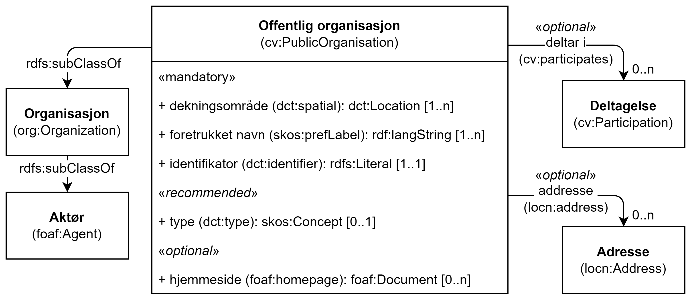

== Klassen Offentlig organisasjon (cv:PublicOrganisation) [[OffentligOrganisasjon]]

[[img-KlassenOffentligOrganisasjon]]
.Klassen Offentlig organisasjon (cv:PublicOrganisation)
[link=images/KlassenOffentligOrganisasjon.png]

[cols="30s,70d"]
|===
|English name|Public Organisation
|Beskrivelse|Brukes til å representere en offentlig organisasjon.
|Usage note|To represent a Public Organisation.
|URI|cv:PublicOrganisation
|Subklasse av / Subclass of|foaf:Agent
|Kravsnivå|Anbefalt/Recommended
|Merknad|Norsk utvidelse: Kravsnivå er endret fra obligatorisk til anbefalt, for at spesifikasjonen også skal kunne brukes til beskrivelse av f.eks. tjenester levert av aktører som ikke er offentlige organisasjoner.
|Eksempel|Brønnøy kommune er en offentlig organisasjon.
|===

Eksempel i RDF Turtle:
-----
<BrønnøyKommune> a cv:PublicOrganisation ; .
-----

=== Obligatoriske egenskaper for klassen _Offentlig organisasjon_ [[OffentligOrganisasjon-obligatoriske-egenskaper]]

==== Offentlig organisasjon – dekningsområde (dct:spatial) [[OffentligOrganisasjon-dekningsområde]]

[cols="30s,70d"]
|===
|English name|spatial coverage
|URI|dct:spatial
|Range|dct:Location
|Beskrivelse|Brukes til å referere til et geografisk eller administrativt område dekket av organisasjonen.
|Usage note|This property contains the geographic or administrative region covered by a Public Organisation.
|Multiplisitet|1..n
|Kravsnivå|Obligatorisk/Mandatory
|Merknad a|Følgende krav til bruk av kontrollerte vokabularer gjelder:

* Minst en verdi skal være fra en av følgende kontrollerte lister: https://op.europa.eu/en/web/eu-vocabularies/dataset/-/resource?uri=http://publications.europa.eu/resource/dataset/continent[Continent]; https://op.europa.eu/en/web/eu-vocabularies/dataset/-/resource?uri=http://publications.europa.eu/resource/dataset/country[Country]; https://op.europa.eu/en/web/eu-vocabularies/dataset/-/resource?uri=http://publications.europa.eu/resource/dataset/place[Place]; http://sws.geonames.org/[GeoNames].

* For å angi dekningsområde i Norge, bør Kartverkets liste over https://data.geonorge.no/administrativeEnheter/nasjon/doc/173163[Administrative enheter] brukes.
|Eksempel|Offentlig organisasjon «Brønnøy kommune» har Brønnøy kommune i Norge som sitt dekningsområde.
|===

Eksempel i RDF Turtle:
----
<BrønnøyKommune> a cv:PublicOrganisation ;
   dct:spatial <http://publications.europa.eu/resource/authority/country/NOR> , # Norge
      <https://data.geonorge.no/administrativeEnheter/kommune/id/172833> ; # Brønnøy kommune
   .
----

==== Offentlig organisasjon – foretrukket navn (skos:prefLabel) [[OffentligOrganisasjon-foretrukketNavn]]

[cols="30s,70d"]
|===
|English name|preferred label
|URI|skos:prefLabel
|Range|rdfs:Literal
|Beskrivelse|Brukes til å oppgi det foretrukne navnet til organisasjonen. Gjentas når navnet finnes i flere ulike språk.
|Usage note|For the preferred name of the organisation.
|Multiplisitet|1..n
|Kravsnivå|Obligatorisk/Mandatory
|Merknad|Norsk utvidelse: multiplisitet endret fra 1..1 til 1..n, for å tillate flerspråklighet.
|Eksempel|Brønnøy kommune
|===

Eksempel i RDF Turtle:
-----
<BrønnøyKommune> a cv:PublicOrganisation ;
   skos:prefLabel "Brønnøy kommune"@nb ; .
-----

==== Offentlig organisasjon – identifikator (dct:identifier) [[OffentligOrganisasjon-identifikator]]

[cols="30s,70d"]
|===
|English name|identifier
|URI|dct:identifier
|Range|dfs:Literal
|Beskrivelse|Brukes til å oppgi organisasjonens identifikator, f.eks. i henhold til Enhetsregisterets organisasjonsnummer.
|Usage note|This property represents an Identifier for an Agent.
|Multiplisitet|1..1
|Kravsnivå|Obligatorisk/Mandatory
|Merknad|Identifikator er som regel systemgenerert av verktøystøtte, slik at du som vanlig bruker ikke trenger å fylle ut verdien til denne egenskapen manuelt.

For deg som skal utvikle/tilpasse verktøystøtte: Når aktøren har et organisasjonsnummer bør identifikatoren oppgis som en URI med følgende mønster der "nnnnnnnnn" er organisasjonsnummeret: f.eks. `\https://organization-catalogue.fellesdatakatalog.digdir.no/organizations/nnnnnnnnn`
|Eksempel|
|===

Eksempel i RDF Turtle:
-----
<BrønnøyKommune> a cv:PublicOrganisation ;
   dct:identifier "https://organization-catalogue.fellesdatakatalog.digdir.no/organizations/991825827" ; .
-----

==== Offentlig organisasjon – navn (dct:title) [[OffentligOrganisasjon-navn]]

[cols="30s,70d"]
|===
|English name|name
|URI|dct:title
|Range|rdfs:Literal
|Beskrivelse|Brukes til å oppgi navn på organisasjonen. Gjentas når navnet finnes i flere ulike språk.
|Usage note|This property represents the name of the public organisation.
|Multiplisitet|1..n
|Kravsnivå|Obligatorisk/Mandatory
|Merknad 1|Både navn (denne egenskapen) og <<OffentligOrganisasjon-foretrukketNavn>> er obligatorisk (dette for å ha samsvar mellom våre nasjonale spesifikasjoner og EU-standarder på området). Egenskapen <<OffentligOrganisasjon-foretrukketNavn>> anbefalt brukes primært. Når det ikke finnes flere navn enn det foretrukne navnet, har disse to egenskapene samme verdi.
|Eksempel|Brønnøy kommune
|===

Eksempel i RDF Turtle:
-----
<BrønnøyKommune> a cv:PublicOrganisation ;
   skos:prefLabel "Brønnøy kommune"@nb ; # foretrukket navn
   dct:title "Brønnøy kommune"@nb . # navn
-----

=== Anbefalte egenskaper for klassen _Offentlig organisasjon_ [[OffentligOrganisasjon-anbefalte-egenskaper]]

==== Offentlig organisasjon – adresse (locn:address) [[OffentligOrganisasjon-adresse]]

[cols="30s,70d"]
|===
|English name|address
|URI|locn:address
|Range|locn:Address
|Beskrivelse|Brukes til å oppgi adresse til en offentlig organisasjon.
|Usage note|This property represents the address.
|Multiplisitet|0..n
|Kravsnivå|Anbefalt/Recommended
|Merknad|Norsk utvidelse: I CPSV-AP er URIen for denne egenskapen `cv:hasAddress` og range `locn:Address`. Vi har valgt å samkjøre med DCAT-AP-NO som bruker URI `locn:address` med range `locn:Address`. Core Public Organization Vocabulary (v.1.0.0) som CPSV-AP baseres på, bruker også URIen `locn:address`.
|Eksempel|
|===

Eksempel i RDF Turtle:
-----
<BrønnøyKommune> a cv:PublicOrganisation ;
   skos:prefLabel "Brønnøy kommune"@nb ;
   locn:address [ a locn:Address ;
       locn:fullAddress "Sivert Nielsens gt. 24, 8905 Brønnøysund"@nb ; ] ; .
-----

==== Offentlig organisasjon – hjemmeside (foaf:homepage) [[OffentligOrganisasjon-hjemmeside]]

[cols="30s,70d"]
|===
|English name|homepage
|URI|foaf:homepage
|Range|foaf:Document
|Beskrivelse|Brukes til å referere til hjemmesiden til organisasjonen. Bør gjentas når hjemmesiden finnes i flere ulike språk.
|Usage note|This property refers to the homepage of a Public Organisation.
|Multiplisitet|0..n
|Kravsnivå|Anbefalt/Recommended
|Merknad|Norsk utvidelse: Multiplisitet endret fra 0..1 til 0..n for å kunne behov for å ha flere ulike hjemmesider for ulike språk.
|Eksempel|https://www.bronnoy.kommune.no/[https://www.bronnoy.kommune.no/]
|===

Eksempel i RDF Turtle:
-----
<BrønnøyKommune> a cv:PublicOrganisation ;
   skos:prefLabel "Brønnøy kommune"@nb ;
   foaf:homepage <https://www.bronnoy.kommune.no/> ;  .
-----

==== Offentlig organisasjon – klassifisering (org:classification) [[OffentligOrganisasjon-klassifisering]]

[cols="30s,70d"]
|===
|English name|classification
|URI|org:classification
|Range|skos:Concept
|Beskrivelse|Brukes til å indikere klassifisering av organisasjonen i henhold til et klassifikasjonsskjema.
|Usage note|This property Indicates a classification for a Public Organisation within some classification scheme.
|Multiplisitet|0..n
|Kravsnivå|Anbefalt/Recommended
|Merknad| Verdien skal velges fra http://purl.org/adms/publishertype/[ADMS Publisher Type Vocabulary (i RDF)].
|Eksempel|Brønnøy kommune er av type _Local Authority_.
|===

Eksempel i RDF Turtle:
-----
<BrønnøyKommune> a cv:PublicOrganisation ;
   skos:prefLabel "Brønnøy kommune"@nb ;
   org:classification adms:LocalAuthority ;  .
-----

=== Valgfrie egenskaper for klassen _Offentlig organisasjon_ [[OffentligOrganisasjon-valgfrie-egenskaper]]

==== Offentlig organisasjon – har rolle i (cv:playsRole) [[OffentligOrganisasjon-harRolle]]

[cols="30s,70d"]
|===
|English name|plays role
|URI|cv:playsRole
|Range|cv:Participation
|Beskrivelse|Brukes til å knytte en aktør/organisasjon til en instans av deltagelse (cv:Participation) i en tjeneste der organisasjonen har en eller flere roller i.
|Usage note|This property links an Agent / Public Organisation to the Participation class.
|Multiplisitet|0..n
|Kravsnivå|Valgfri/Optional
|Merknad|
|Remarks|The Participation class (`cv:Participation`) facilitates the detailed description of how an Agent / Public Organisation participates in or interacts with a (Public) Service and may include temporal and spatial constraints on that participation.
|Eksempel|Se tilsvarende eksempel under <<KnytteDeltagendeAktørerTilEnTjeneste>>.
|===

Eksempel i RDF Turtle: Se tilsvarende eksempel under <<KnytteDeltagendeAktørerTilEnTjeneste>>.
