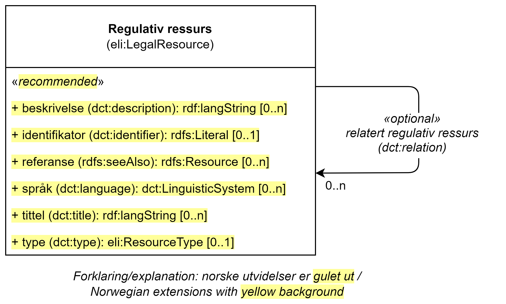

== Klassen Regulativ ressurs (eli:LegalResource) [[RegulativRessurs]]

[[img-KlassenRegulativRessurs]]
.Klassen Regulativ ressurs (eli:LegalResource).
[link=images/KlassenRegulativRessurs.png]

[cols="30s,70d"]
|===
| _English name_ | _Legal Resource_
| Anvendelse / _Usage note_ | Klassen brukes til å representere en regulativ ressurs, f.eks. lovgivning/lovverket, retningslinjer eller politikk som regulerer utførelsen av en tjeneste.

_This class represents the legislation, policy or policies that lie behind the Rules that govern the service._
| URI | eli:LegalResource
| Kravnivå / _Requirement level_ | Valgfri / _Optional_
| Eksempel | Se under <<KnytteTilRegelverk>> for eksempel på bruk av klassen.
|===

Eksempel i RDF Turtle: Se under <<KnytteTilRegelverk>>.

=== Anbefalte egenskaper for klassen _Regulativ ressurs_ [[RegulativRessurs-anbefalte-egenskaper]]

==== Regulativ ressurs – beskrivelse (dct:description) [[RegulativRessurs-beskrivelse]]

[cols="30s,70d"]
|===
| _English name_ | _description_
| URI | dct:description
| Verdiområde / _Range_ |  rdf:langString
| Anvendelse / _Usage note_ | Egenskapen brukes til å referere til en tekstlig beskrivelse av ressursen. Egenskapen bør gjentas når den finnes på flere språk.

_This property contains descriptive textual information about the Legal Resource. This property should be repeated in case there are various versions of the text in different languages._
| Multiplisitet / _Multiplicity_ | 0..n
| Kravnivå / _Requirement level_ | Anbefalt / _Recommended_
| Merknad / _Note_ | Norsk utvidelse: Ikke eksplisitt tatt med i CPSV-AP, men i DCAT-AP-NO.

_Norwegian extension: Not explicitly specified in CPSV-AP._
|===

==== Regulativ ressurs – identifikator (dct:identifier) [[RegulativRessurs-identifikator]]

[cols="30s,70d"]
|===
| _English name_ | _identifier_
| URI | dct:identifier
| Verdiområde / _Range_ | rdfs:Literal
| Anvendelse / _Usage note_ | Egenskapen brukes til å oppgi en identifikator til ressursen.

_This property contains an identifier for the resource._
| Multiplisitet / _Multiplicity_ | 0..1
| Kravnivå / _Requirement level_ | Anbefalt / _Recommended_
| Merknad 1 / _Note 1_ | Identifikator er som regel systemgenerert av verktøystøtte, slik at du som vanlig bruker ikke trenger å fylle ut verdien til egenskapen manuelt.

For deg som skal utvikle/tilpasse verktøystøtte, se https://data.norge.no/guide/veileder-beskrivelse-av-datasett/#om-identifikator[Om identifikator (dct:identifier) i Veileder for beskrivelse av datasett osv. &#x29C9;, window="_blank", role="ext-link"]

_Identifier is usually generated by the application, such that you as an end-user of the application usually do not need to manually fill out the value of this property._ 

_If you are developing applications, see https://data.norge.no/guide/veileder-beskrivelse-av-datasett/#om-identifikator[Om identifikator (dct:identifier) i Veileder for beskrivelse av datasett osv. &#x29C9;, window="_blank", role="ext-link"] (in Norwegian only)._
| Merknad 2 / _Note 2_ | Norsk utvidelse: Ikke eksplisitt tatt med i CPSV-AP, men i DCAT-AP-NO.

_Norwegian extension: Not explicitly specified in CPSV-AP._
|===

==== Regulativ ressurs – referanse (rdfs:seeAlso) [[RegulativRessurs-referanse]]

[cols="30s,70d"]
|===
| _English name_ | _reference_
| URI | rdfs:seeAlso
| Verdiområde / _Range_ | rdfs:Resource
| Anvendelse / _Usage note_ | Egenskapen brukes til å oppgi referanse til den regulative ressursen.

_This property is used to specify the reference(s) to the legal resource._
| Multiplisitet / _Multiplicity_ | 0..n
| Kravnivå / _Requirement level_ | Anbefalt / _Recommended_
| Merknad / _Note_ | Norsk utvidelse: Ikke eksplisitt tatt med i CPSV-AP, men i DCAT-AP-NO.

_Norwegian extension: Not explicitly specified in CPSV-AP._
| Eksempel | Se under <<KnytteTilRegelverk>>.
|===

Eksempel i RDF: Se under <<KnytteTilRegelverk>>.

==== Regulativ ressurs – språk (dct:language) [[RegulativRessurs-språk]]

[cols="30s,70d"]
|===
| _English name_ |  _language_
| URI | dct:language
| Verdiområde / _Range_ | dct:LinguisticSystem
| Anvendelse / _Usage note_ | Egenskapen brukes til å oppgi språk som den regulative ressursen er  tilgjengelig på.

_This property is used to specify the language in which the legal resource is available._
| Multiplisitet / _Multiplicity_ | 0..n
| Kravnivå / _Requirement level_ | Anbefalt / _Recommended_
| Merknad 1 / _Note 1_ | Verdien skal velges fra EUs kontrollerte vokabular https://op.europa.eu/en/web/eu-vocabularies/concept-scheme/-/resource?uri=http://publications.europa.eu/resource/authority/language[Språk &#x29C9;, window="_blank", role="ext-link"].

__The value shall be chosen from Eu's controlled vocabulary https://op.europa.eu/en/web/eu-vocabularies/concept-scheme/-/resource?uri=http://publications.europa.eu/resource/authority/language[Language &#x29C9;, window="_blank", role="ext-link"].__
| Merknad 2 / _Note 2_ | Norsk utvidelse: Ikke eksplisitt tatt med i CPSV-AP.

_Norwegian extension: Not explicitly specified in CPSV-AP._
| Eksempel | Se under <<KnytteTilRegelverk>>.
|===

Eksempel i RDF: Se under <<KnytteTilRegelverk>>.

==== Regulativ ressurs – tittel (dct:title) [[RegulativRessurs-tittel]]

[cols="30s,70d"]
|===
| _English name_ |  _title_
| URI | dct:title
| Verdiområde / _Range_ |  rdf:langString
| Anvendelse / _Usage note_ | Egenskapen brukes til å oppgi tittel til den regulative ressursen. Egenskapen bør gjentas når tittelen finnes på flere språk.

_This property is used to specify the title of the legal resource, repeated when the title is in several parallel languages._
| Multiplisitet / _Multiplicity_ | 0..n
| Kravnivå / _Requirement level_ | Anbefalt / _Recommended_
| Merknad / _Note_ | Norsk utvidelse: Ikke eksplisitt tatt med i CPSV-AP.

_Norwegian extension: Not explicitly specified in CPSV-AP._
| Eksempel | Se under <<KnytteTilRegelverk>>.
|===

Eksempel i RDF: Se under <<KnytteTilRegelverk>>.

==== Regulativ ressurs – type (dct:type) [[RegulativRessurs-type]]

[cols="30s,70d"]
|===
| _English name_ | _type_
| URI | dct:type
| Verdiområde / _Range_ | eli:ResourceType
| Anvendelse / _Usage note_ | Egenskapen brukes til å referere til typen av en regulativ ressurs (f.eks. direktiv, forordning).

_This property refers to the type of a legal resource (e.g. "Directive", "Règlement grand ducal", "law", "Règlement ministériel", "draft proposition", "Parliamentary act", etc.). Member states are encouraged to make their own list of values in the corresponding concept scheme._
| Multiplisitet / _Multiplicity_ | 0..n
| Kravnivå / _Requirement level_ |  Anbefalt / _Recommended_
| Merknad 1 / _Note 1_ |  Verdien skal velges fra det felles kontrollerte vokabularet https://data.norge.no/vocabulary/legal-resource-type[Regulativ ressurs type &#x29C9;, window="_blank", role="ext-link"], når verdien finnes i vokabularet.

__The value shall be chosen from the common controlled vocabulary https://data.norge.no/vocabulary/legal-resource-type[Legal resource type &#x29C9;, window="_blank", role="ext-link"], when the value is in the vocabulary.__
| Merknad 2 / _Note 2_ | Norsk utvidelse: Ikke eksplisitt tatt med i CPSV-AP, men i DCAT-AP-NO.

_Norwegian extension: Not explicitly specified in CPSV-AP._
|===

=== Valgfrie egenskaper for klassen _Regulativ ressurs_ [[RegulativRessurs-valgfrie-egenskaper]]

==== Regulativ ressurs – relatert regulativ ressurs (dct:relation) [[RegulativRessurs-relatertRegulativRessurs]]

[cols="30s,70d"]
|===
| _English name_ | _related legal resource_
| URI | dct:relation
| Verdiområde / _Range_ | eli:LegalResource
| Anvendelse / _Usage note_ | Egenskapen brukes til å referere til en annen relatert regulativ ressurs.

_This property represents another instance of the Legal Resource class that is related to a particular Legal Resource being described._
| Multiplisitet / _Multiplicity_ | 0..n
| Kravnivå / _Requirement level_ | Valgfri / _Optional_
|===
