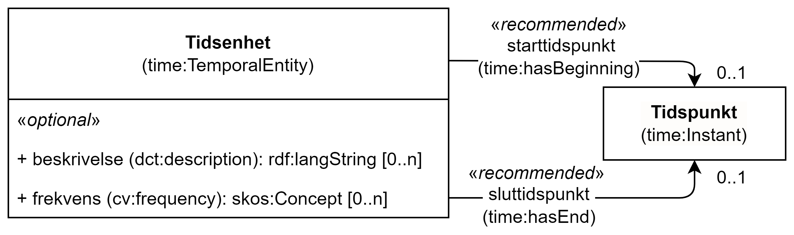

== Klassen Tidsenhet (time:TempoeralEntity) [[Tidsenhet]]

[[img-KlassenTidsenhet]]
.Klassen Tidsenhet (time:TempoeralEntity)
[link=images/KlassenTidsenhet.png]

[cols="30s,70d"]
|===
|English name| temporal entity
|Anvendelse| Klassen brukes til å beskrive et tidsinterval eller tidspunkt.
|Usage note| This class represents a temporal interval or instant.
|URI| time:TempoeralEntity
|Kravnivå | Valgfri/Optional
|Merknad | Klassen inneholder nå to egenskaper som kan brukes til en enkel og tekstlig beskrivelse av en tidsenhet. For mer strukturert beskrivelse av tid kan modellen i Time Ontology brukes, se https://www.w3.org/TR/owl-time/#dtd-vs-dt[et eksempel]. 
|Remark | The class contains now two properties that may be used for a simple and free text description of a temporal entity. For more structured data use the model in Time Ontology, see https://www.w3.org/TR/owl-time/#dtd-vs-dt[an example].
|===

=== Anbefalte egenskaper for klassen _Tidsenhet_ [[Tidsenhet-anbefalte-egenskaper]]

==== Tidsenhet – beskrivelse (dct:description) [[Tidsenhet-beskrivelse]]
[cols="30s,70d"]
|===
|English name | end time
|URI| time:hasEnd
|Range| xsd:dateTime
|Anvendelse | Egenskapen brukes til å oppgi slutten på et tidsrom eller intervall.
|Usage note | This property represents the end of a period or interval.
|Multiplisitet| 0..1
|Kravnivå | Anbefalt/Recommended
|Merknad | Norsk utvidelse: Ikke eksplisitt spesifisert i CPSV-AP.
|Remark | Norwegian extension: Not explicitly specified in CPSP-AP.
|===
