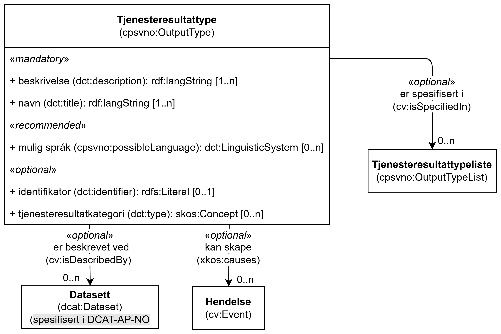

== Klassen Tjenesteresultattype (cpsvno:OutputType) [[Tjenesteresultattype]]

[[img-KlassenTjenesteresultattype]]
.Klassen Tjenesteresultattype (cpsvno:OutputType) og klassene den refererer til. 
[link=images/KlassenTjenesteresultattype.png]

[cols="30s,70d"]
|===
| _English name_ | _Output Type_
| Anvendelse / _Usage note_ |  Klassen brukes til å representere type tjenesteresultat fra en tjeneste.

_The class is used to represent a type of output of a service._
| URI | cpsvno:OutputType
| Merknad / _Note_ | Norsk utvidelse: Ikke eksplisitt spesifisert i CPSV-AP.

_Norwegian extension: Not explicitly specified in CPSV-AP._
| Eksempel | Et type tjenesteresultat fra tjenesten «Skjenkebevilling (i Brønnøy kommune)» er «bevilling» (når søknaden godkjennes). En annen typetjenesteresultat er «avslag» (når søknaden ikke blir godkjent).
|===

Eksempel i RDF Turtle:
-----
<bevilling> a cpsvno:OutputType .

<avslag> a cpsvno:OutputType .
-----

=== Obligatoriske egenskaper for klassen _Tjenesteresultattype_ [[Tjenesteresultattype-obligatoriske-egenskaper]]

==== Tjenesteresultattype – beskrivelse (dct:description) [[Tjenesteresultattype-beskrivelse]]

[cols="30s,70d"]
|===
| _English name_ | _description_
| URI | dct:description
| Verdiområde / _Range_ |  rdf:langString
| Anvendelse / _Usage note_ |  Egenskapen brukes til å oppgi en tekstlig beskrivelse av typen tjenesteresultat. Egenskapen BØR gjentas når beskrivelsen finnes på flere språk.

_This property represents a free text Description of the type of output. This property SHOULD be repeated when the description is in several parallel languages._
| Multiplisitet / _Multiplicity_ | 1..n
| Kravnivå / _Requirement level_ | Obligatorisk / _Mandatory_
| Merknad / _Note_ | Norsk utvidelse: Ikke eksplisitt spesifisert i CPSV-AP.

_Norwegian extension: Not explicitly specified in CPSV-AP._
|===

Eksempel i RDF Turtle:
-----
<bevilling> a cpsvno:OutputType ;
   dct:description "Vedtak om bevilling, når en skjenketillatelse bevilges."@nb ; .

<avslag> a cpsvno:OutputType ;
   dct:description "Vedtak om avslag, når en skjenketillatelse ikke bevilges."@nb ; .
-----

==== Tjenesteresultattype – navn (dct:title) [[Tjenesteresultattype-navn]]

[cols="30s,70d"]
|===
| _English name_ | _name_
| URI | dct:title
| Verdiområde / _Range_ |  rdf:langString
| Anvendelse / _Usage note_ |  Egenskapen brukes til å oppgi  navn til tjenesteresultatet. Egenskapen BØR gjentas når navnet finnes på flere språk.

_This property represents the official Name of the Output. This property SHOULD be repeated when the name is in several parallel languages._
| Multiplisitet / _Multiplicity_ | 1..n
| Kravnivå / _Requirement level_ | Obligatorisk / _Mandatory_
| Eksempel | «Skjenkebevilling»
|===

Eksempel i RDF Turtle:
-----
<bevilling> a cpsvno:OutputType ;
   dct:title "Skjenkebevilling"@nb ; .
-----

=== Anbefalte egenskaper for klassen _Tjenesteresultattype_ [[Tjenesteresultattype-anbefalte-egenskaper]]

==== Tjenesteresultattype – mulig språk (cpsvno:possibleLanguage) [[Tjenesteresultattype-mulig-språk]]

[cols="30s,70d"]
|===
| _English name_ | _language_
| URI | dct:language
| Verdiområde / _Range_ | dct:LinguisticSystem
| Anvendelse / _Usage note_ |  Egenskapen brukes til å oppgi hvilke språk et mulig tjenesteresultat kan være tilgjengelig på. Egenskapen BØR gjentas når flere språk er mulige.

_This property represents the language in which a possible output may be written. This property SHOULD be repeated when several languages are available._
| Multiplisitet / _Multiplicity_ | 0..n
| Kravnivå / _Requirement level_ | Anbefalt / _Recommended_
| Merknad 1 / _Note 1_ | Verdien SKAL velges fra EUs kontrollerte vokabular https://op.europa.eu/en/web/eu-vocabularies/concept-scheme/-/resource?uri=http://publications.europa.eu/resource/authority/language[Språk &#x29C9;, window="_blank", role="ext-link"].

__The value MUST be chosen from Eu's controlled vocabulary https://op.europa.eu/en/web/eu-vocabularies/concept-scheme/-/resource?uri=http://publications.europa.eu/resource/authority/language[Language &#x29C9;, window="_blank", role="ext-link"].__
| Merknad 2 / _Note 2_ | Norsk utvidelse: Ikke eksplisitt spesifisert i CPSV-AP.

_Norwegian extension: Not explicitly specified in CPSV-AP._
| Eksempel | Bokmål, nynorsk eller engelsk
|===

Eksempel i RDF Turtle:
-----
<bevilling> a cpsvno:OutputType ;
   dct:language
      <https://publications.europa.eu/resource/authority/language/NOB>, # bokmål
      <https://publications.europa.eu/resource/authority/language/NNO>, # nynorsk
      <https://publications.europa.eu/resource/authority/language/ENG>; # engelsk  
   .
-----

=== Valgfrie egenskaper for klassen _Tjenesteresultattype_ [[Tjenesteresultattype-valgfrie-egenskaper]]

==== Tjenesteresultattype – er beskrevet ved (cv:isDescribedAt) [[Tjenesteresultattype-er-beskrevet-ved]]

[cols="30s,70d"]
|===
| _English name_ |  _is described at_
| URI | cv:isDescribedAt
|Verdiområde / _Range_ | https://informasjonsforvaltning.github.io/dcat-ap-no/#Datasett[dcat:Dataset &#x29C9;, window="_blank", role="ext-link"]
| Anvendelse / _Usage note_ | Egenskapen brukes til å referere til et datasett som denne typen tjenesteresultat kan være beskrevet ved.

_This property is used to refer to a dataset at which the type of output may be described._
| Multiplisitet / _Multiplicity_ | 0..n
| Kravnivå / _Requirement level_ | Valgfri / _Optional_
| Merknad / _Note_ | Norsk utvidelse: Ikke eksplisitt spesifisert i CPSV-AP.

_Norwegian extension: Not explicitly specified in CPSV-AP._
|===

==== Tjenesteresultattype – er spesifisert i (cv:isSpecifiedIn) [[Tjenesteresultattype-er-spesifisert-i]]

[cols="30s,70d"]
|===
| _English name_ | _is specified in_
| URI | cv:isSpecifiedIn
| Verdiområde / _Range_ | <<Tjenesteresultattypeliste, cpsvno:OutputTypeList>>
| Anvendelse / _Usage note_ | Egenskapen brukes til å referere til en tjenesteresultattypeliste som inneholder tjenesteresultattypen.

_This property represents the Output Type List in which the Output Type is included._
| Multiplisitet / _Multiplicity_ | 0..n
| Kravnivå / _Requirement level_ | Valgfri / _Optional_
|===

==== Tjenesteresultattype – identifikator (dct:identifier) [[Tjenesteresultattype-identifikator]]

[cols="30s,70d"]
|===
| _English name_ | _identifier_
| URI | dct:identifier
| Verdiområde / _Range_ | rdfs:Literal
| Anvendelse / _Usage note_ |  Egenskapen brukes til å oppgi identifikatoren til denne typen tjenesteresultat.

_This property represents an identifier for a possible output._
| Multiplisitet / _Multiplicity_ | 0..1
| Kravnivå / _Requirement level_ | Valgfri / _Optional_
| Merknad / _Note_ | Norsk utvidelse: Ikke eksplisitt spesifisert i CPSV-AP.

_Norwegian extension: Not explicitly specified in CPSV-AP._
|===

==== Tjenesteresultattype – kan skape (xkos:causes) [[Tjenesteresultattype-kan-skape]]

[cols="30s,70d"]
|===
| _English name_ | _may cause_
| URI |xkos:causes
| Verdiområde / _Range_ | <<Hendelse, cv:Event>>
| Anvendelse / _Usage note_ | Egenskapen brukes til å uttrykke relasjon mellom en tjenesteresultattype og en eller flere hendelser, f.eks. endring av data (som en type tjenesteresultat) skaper en eller flere hendelser.

_This property expresses the relation between a type of output and one or more events, for instance the cases where change of data (as a type of output) may cause one of more events._
| Multiplisitet / _Multiplicity_ | 0..n 
| Kravnivå / _Requirement level_ | Valgfri / _Optional_ 
| Merknad / _Note_ | Norsk utvidelse: Ikke eksplisitt spesifisert i CPSV-AP.

_Norwegian extension: Not explicitly specified in CPSV-AP._
|===

==== Tjenesteresultattype – tjenesteresultatkategori (dct:type) [[Tjenesteresultattype-tjenesteresultatkategori]]

[cols="30s,70d"]
|===
| _English name_ | _type_
| URI | dct:type
| Verdiområde / _Range_ | skos:Concept
| Anvendelse / _Usage note_ |  Egenskapen brukes til å referere til begrep som representerer kategorien tjenesteresultattypen tilhører.

_This property represents the category of the output type, as defined in a controlled vocabulary._
| Multiplisitet / _Multiplicity_ | 0..n
| Kravnivå / _Requirement level_ | Valgfri / _Optional_
| Merknad / _Note_ | Verdien SKAL velges fra det felles kontrollerte vokabularet https://data.norge.no/vocabulary/service-output-type[Tjenesteresultattype &#x29C9;, window="_blank", role="ext-link"], når verdien finnes i vokabularet.

__The value MUST be chosen from the common controlled vocabulary https://data.norge.no/vocabulary/service-output-type[Service output type &#x29C9;, window="_blank", role="ext-link"], when the value is in the vocabulary.__
| Merknad 2 / _Note 2_ | Norsk utvidelse: Ikke eksplisitt spesifisert i CPSV-AP.

_Norwegian extension: Not explicitly specified in CPSV-AP._
| Eksempel | tillatelse
|===

Eksempel i RDF Turtle:
-----
<bevilling> a cpsvno:OutputType ;
   dct:type <https://data.norge.no/vocabulary/service-output-type#permit> ; # tillatelse
   .
-----
