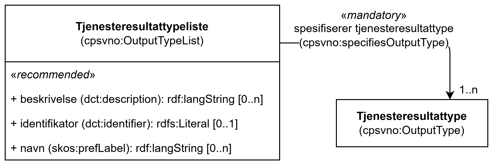

== Klassen Tjenesteresultattypeliste (cpsvno:OutputTypeList) [[Tjenesteresultattypeliste]]

[[img-KlassenTjenesteresultattypeliste]]
.Klassen Tjenesteresultattypeliste (cpsvno:OutputTypeList) og klassen den refererer til
[link=images/KlassenTjenesteresultattypeliste.png]

[cols="30s,70d"]
|===
| _English name_ | _Output Type List_
| Anvendelse / _Usage note_ | Klassen brukes til å representere en gruppe av typer tjenesteresultater som en tjeneste kan resultere i.

Kravet om å være i samsvar med en tjenesteresultattypeliste er oppfylt **hvis og bare hvis** de aktuelle tjenesteresultatene samsvarer med **alle** typer som listen inneholder. Det er med andre ord en *`AND`* betingelse mellom typene på en gitt   tjenesteresultattypeliste, og en *`OR`* betingelse mellom ulike tjenesteresultattypelister.

_This class represents a group of types of output that a service may produce._

_An Output Type List is satisfied, if and only if, for all included Output Types in this List, a service must produce outputs that conform to all the types on the list. The Evidence Type List describes thus an `AND` condition on the different Output Types within the list and an `OR` condition between two or more Output Type Lists. Combinations of alternative Lists can be provided for a respondent of a Requirement to choose amongst them._
| URI | cpsvno:OutputTypeList
| Merknad / _Note_ |  Norsk utvidelse: Ikke eksplisitt spesifisert i CPSV-AP.

_Norwegian extension: Not explicitly specified in CPSV-AP._
|===

=== Obligatoriske egenskaper for klassen _Tjenesteresultattypeliste_ [[Tjenesteresultattypeliste-obligatoriske-egenskaper]]

==== Tjenesteresultattypeliste – spesifiserer tjenesteresultattype (cpsvno:specifiesOutputType) [[Tjenesteresultattypeliste-spesifiserer-tjenesteresultattype]]

[cols="30s,70d"]
|===
| _English name_ |  _specifies output type_
| URI |cpsvno:specifiesOutputType
| Verdiområde / _Range_ | <<Tjenesteresultattype, cpsvno:OutputType>>
| Anvendelse / _Usage note_ | Egenskapen brukes til å referere til tjenesteresultattype som inngår i tjenesteresultattypelisten.

_This property represents Evidence Type included in this Evidence Type List._
| Multiplisitet / _Multiplicity_ | 1..n
| Kravnivå / _Requirement level_ | Obligatorisk/Mandatory
| Merknad / _Note_ |  Norsk utvidelse: Ikke eksplisitt spesifisert i CPSV-AP.

_Norwegian extension: Not explicitly specified in CPSV-AP._
|===

=== Anbefalte egenskaper for klassen _Tjenesteresultattypeliste_ [[Tjenesteresultattypeliste-anbefalte-egenskaper]]

==== Tjenesteresultattypeliste – beskrivelse (dct:description) [[Tjenesteresultattypeliste-beskrivelse]]

[cols="30s,70d"]
|===
| _English name_ | _description_
| URI |dct:description
| Verdiområde / _Range_ | rdf:langString
| Anvendelse / _Usage note_ | Egenskapen brukes til å oppgi en tekstlig beskrivelse av tjenesteresultattypelisten. F.eks. informasjon knyttet til bruk av listen eller annen tilleggsinformasjon. Egenskapen BØR gjentas når beskrivelsen finnes på flere språk.

_This property represents a short explanation supporting the understanding of the Output Type List. The explanation can include information about the nature, attributes, uses or any other additional information about the Output Type List. The property SHOULD be repeated when the description is in parallel languages._
| Multiplisitet / _Multiplicity_ |  0..n
| Kravnivå / _Requirement level_ | Anbefalt / _Recommended_
| Merknad / _Note_ |  Norsk utvidelse: Ikke eksplisitt spesifisert i CPSV-AP.

_Norwegian extension: Not explicitly specified in CPSV-AP._
|===

==== Tjenesteresultattypeliste – identifikator (dct:identifier) [[Tjenesteresultattypeliste-identifikator]]

[cols="30s,70d"]
|===
| _English name_ | _identifier_
| URI |dct:identifier
| Verdiområde / _Range_ | rdfs:Literal
| Anvendelse / _Usage note_ | Egenskapen brukes til å oppgi identifikatoren til tjenesteresultattypelisten.

_This property represents an unambiguous reference to the Evidence Type List._
| Multiplisitet / _Multiplicity_ |  0..1
| Kravnivå / _Requirement level_ | Anbefalt / _Recommended_
| Merknad / _Note_ |  Norsk utvidelse: Ikke eksplisitt spesifisert i CPSV-AP.

_Norwegian extension: Not explicitly specified in CPSV-AP._
|===

==== Tjenesteresultattypeliste – navn (skos:prefLabel) [[Tjenesteresultattypeliste-navn]]

[cols="30s,70d"]
|===
| _English name_ | _name_
| URI |skos:prefLabel
| Verdiområde / _Range_ | rdf:langString
| Anvendelse / _Usage note_ | Egenskapen brukes til å oppgi navnet til tjenesteresultattypelisten. Egenskapen BØR gjentas når navnet finnes på flere språk.

_This property represents the Name of the Output Type List. This property SHOULD be repeated when the name is in parallel languages._
| Multiplisitet / _Multiplicity_ | 0..n
| Kravnivå / _Requirement level_ | Anbefalt / _Recommended_
| Merknad / _Note_ |  Norsk utvidelse: Ikke eksplisitt spesifisert i CPSV-AP.

_Norwegian extension: Not explicitly specified in CPSV-AP._
|===
