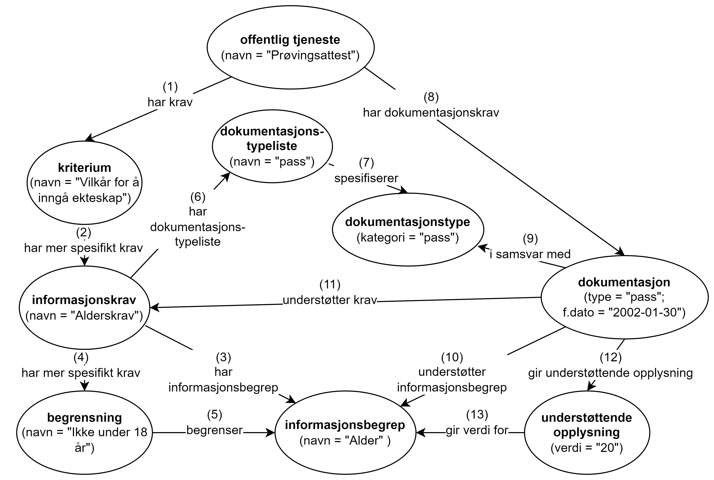
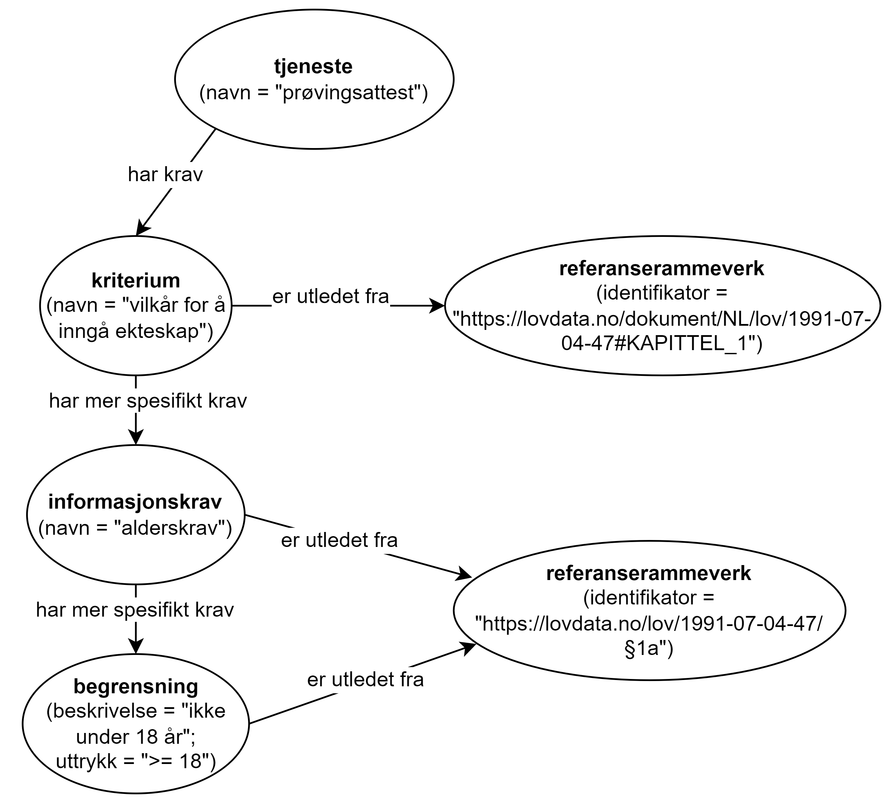

=== Å beskrive dokumentasjonskrav [[Å-beskrive-dokumentasjonskrav]]

:xrefstyle: short

Spesifikasjonen gjør det mulig å beskrive et dokumentasjonskrav strukturert og dermed også maskinprosesserbart.

[[img-FigurEksempelDokumentasjonskrav]]
.Eksempel - beskrivelse av «alderskrav» til tjenesten «prøvingsattest».
[link=images/FigurEksempelDokumentasjonskrav.png]

<> Viser et eksempel på å beskrive et av kravene som skal oppfylles for å kunne utføre tjenesten https://www.skatteetaten.no/skjema/provingsattest/[«prøvingsattest» &#x29C9;, window="_blank", role="ext-link"] som Skatteetaten tilbyr.

<> forklares som følger (numrene refererer til de samme numrene i figuren):

.  Tjenesten «Prøvingsattest» har «Vilkår for å inngå ekteskap» som krav.
. «Vilkår for å inngå ekteskap» har et mer spesifikt informasjonskrav «Alderskrav».
. «Alderskrav» refererer til informasjonsbegrepet «Alder».
. «Alderskrav» har også en mer spesifikk begrensning «Ikke under 18 år».
. Begrensningen «Ikke under 18 år» begrenser informasjonsbegrepet «Alder».
. «Alderskrav» bruker en liste over lovlige dokumentasjonstyper.
. På dokumentasjonstypelisten finner man «Attest».
. Tjenesten «Prøvingsattest» har «Attest» som sin dokumentasjonstype.
. Tjenesten «Prøvingsattest» har «Fødselsattest» som en påkrevd dokumentasjon.
. «Fødselsattest» er i samsvar med det som er spesifisert som lovlig dokumentasjonstype.
. «Fødselsattest» understøtter informasjonskrav «Alderskrav».

Som illustrert i <>, er det også mulig å knytte kravene illustrert i eksemplet ovenfor, til aktuell lovgivning: «Vilkår for å inngå ekteskap» er utledet fra kapittel 1 i ekteskapsloven, og «Alderskrav» og begrensningen «Ikke under 18 år» er utledet fra §1a i ekteskapsloven.

[[img-FigurEksempelDokumentasjonskrav2]]
.Eksempel på å knytte dokumentasjonskrav til lovgivning.
[link=images/FigurEksempelDokumentasjonskrav2.png]

Eksemplet i RDF Turtle:
-----
<prøvingsattest> a cpsv:PublicService ; # offentlig tjeneste
   dct:title "Prøvingsattest"@nb ; # navn
   cv:holdsRequirement <vilkårForÅInngåEkteskap> ; # har krav
   cv:hasInputType <attest> ; # har dokumentasjonstype
   cpsvno:hasRequiredEvidence <fødselsattest> ; # har påkrevd dokumentasjon
   .

<vilkårForÅInngåEkteskap> a cv:Criterion ; # kriterium
   dct:title "Vilkår for å inngå ekteskap"@nb ; # navn
   cv:isDerivedFrom <ekteskapsloven1a> ; # er utledet fra
   cv:hasRequirement <alderskrav> ; # har mer spesifikt krav
   .

<alderskrav> a cv:InformationRequirement ;  # informasjonskrav
   dct:title "Alderskrav"@nb ; # navn
   cv:isDerivedFrom <ekteskapsloven1a> ; # er utledet fra
   cv:hasRequirement <ikkeUnder18> ; # har mer spesifikt krav
   cv:hasEvidenceTypeList <typeListeAttest> ; # har dokumentasjonstypeliste
   .

<ikkeUnder18> a cv:Constraint ; # begrensning
   dct:title "Ikke under 18 år" ; # navn
   cv:isDerivedFrom <ekteskapsloven1a> ;
   cv:constrains <alder> ; # begrenser
   .

<ekteskapsloven1a> a cv:ReferenceFramework ; # referanserammeverk 
   dct:identifier <https://lovdata.no/lov/1991-07-04-47/§1a> ; # identifikator
   .

<alder> a cv:InformationConcept ; # informasjonsbegrep
   dct:title "Alder"@nb ; # navn
   .

<typeListeAttest> a cv:EvidenceTypeList ; #dokumentasjonstypeliste
   skos:prefLabel "Attest"@nb ; # navn
   cv:specifiesEvidenceType <typeAttest> ; # spesifiserer
   .

<typeAttest> a cv:EvidenceType ; # dokumentasjonstype
   cv:evidenceTypeClassification <attest> ; # dokumentasjonstypekategori
   .

<attest> a skos:Concept ; # begrep
   skos:prefLabel "attest"@nb ; # navn
   .

<fødselsattest> a cpsvno:RequiredEvidence ; # påkrevd dokumentasjon
   dct:description "Fødselsattest som dokumentasjon på alder"@nb ; # beskrivelse
   dct:title "Fødselsattest"@nb ; # navn
   dct:conformsTo <attest> ; # i samsvar med
   cv:supportsRequirement <alderskrav> ; # understøtter krav
   .
-----

:xrefstyle: full