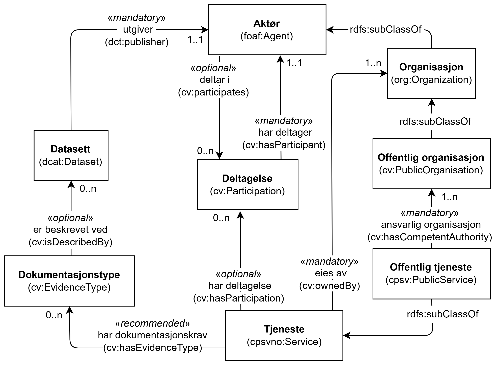

=== Å knytte deltagende aktører til en tjeneste [[KnytteDeltagendeAktørerTilEnTjeneste]]

:xrefstyle: short

[[img-FigurTjenesteOgDeltagelse]]
.Tjeneste og Deltagelse.
[link=images/FigurTjenesteOgDeltagelse.png]

Som illustrert i <> brukes egenskapen <<Tjeneste-eies-av, Tjeneste – eies av (cv:ownedBy)>> til å uttrykke relasjonen mellom en Tjeneste (`cpsvno:Service`) og dens eier (en Organisasjon, `Org:Organization`), og egenskapen <<OffentligTjeneste-ansvarlig-organisasjon, Offentlig tjeneste – ansvarlig organisasjon (cv:hasCompetentAuthority)>> til å uttrykke relasjonen mellom en Offentlig tjeneste (`cpsv:PublicService`) og den ansvarlige organisasjonen (en Offentlig organisasjon, `cv:PublicOrganisation`) for tjenesten.

For å uttrykke involvering av andre aktører (inkl. andre offentlige organisasjoner) enn ovennevnte, brukes <<Deltagelse, Klassen Deltagelse (cv:Participation)>>. En Tjeneste eller Offentlig tjenestekan ha en eller flere Deltagelser knyttet til seg, og dette uttrykkes ved bruk av egenskapen <<Tjeneste-har-deltagelse, Tjeneste – har deltagelse (cv:hasParticipation)>> eller egenskapen <<OffentligTjeneste-har-deltagelse, Offentlig tjeneste – har deltagelse (cv:hasParticipation)>>. En Aktør (inkl. Organisasjon og Offentlig organisasjon) kan delta i en eller flere Deltagelser, og dette uttrykkes ved bruk av egenskapen <<Aktør-deltar-i, Aktør – deltar i (cv:participates)>> (eller <<Organisasjon-deltar-i, Organisasjon – deltar i (cv:participates)>>, <<OffentligOrganisasjon-deltar-i, Offentlig organisasjon – deltar i (cv:participates)>>).

Den obligatoriske egenskapen <<Deltagelse-rolle, Deltagelse – rolle (cv:role)>> skal brukes til å beskrive en eller flere roller i en Deltagelse, f.eks. «dataleverandør» (leverandør av f.eks. datasett som bekreftelse på at et dokumentasjonskrav er oppfylt), og «datakonsument» (konsument av datasett som produseres av tjenesten). 

Eksempel: Brønnøysundregistrene (med «Firmaattest» som er en del av datasettet «Foretaksregisteret») deltar som dataleverandør til tjenesten «Skjenkebevilling».

Eksempel i RDF Turtle:
----
<skjenkebevillingOslokommune> a cpsv:PublicService ;
   cv:hasParticipation <deltagendeDataleverandør> ; .

<deltagendeDataleverandør> a cv:Participation ;
   dct:description "deltagende dataleverandør til tjenesten Skjenkebevilling i Oslo kommune"@nb ;
   cv:role <https://data.norge.no/vocabulary/role-type#data-provider> ; # dataleverandør
   cv:hasParticipant <Brønnøysundregistrene> ;
   .

<Brønnøysundregistrene> a cv:PublicOrganisation ;
   cv:participates <deltagendeDataleverandør> ; .
----

:xrefstyle: full