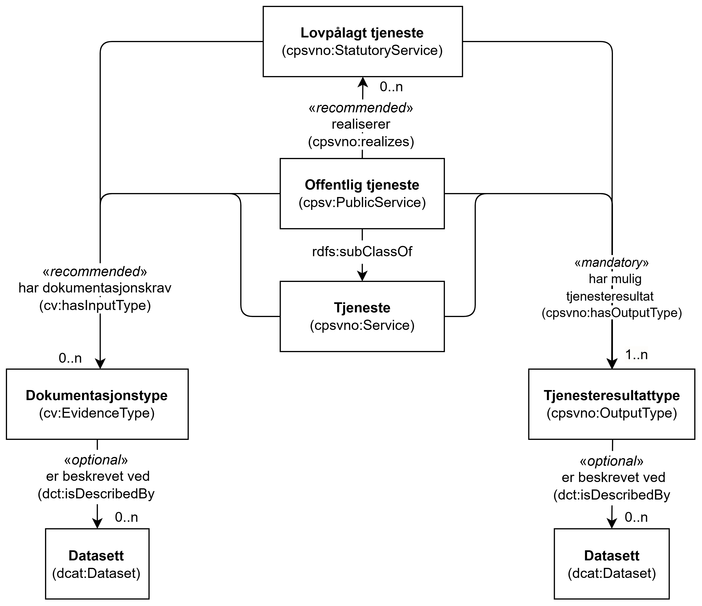

=== Å knytte en tjeneste til et datasett og derfra til API, begrep og informasjonsmodell [[KnytteTilDatasett]]

:xrefstyle: short

[[img-TjenesteOgData]]
.Tjeneste med påkrevd dokumentasjon og mulig tjenesteresultat som er del av datasett.
[link=images/FigurTjenesteMedDataInnOgUt.png]

Som illustrert i <>, kan en Tjenesteresultattype (`cpsvno:OutputType`) fra en Tjeneste (`cpsvno:Service`), Offentlig tjeneste (`cpsv:PublicService`) eller en Lovpålagt tjeneste (`cpsvno:StatutoryService`) være beskrevet ved et eller flerer Datasett (`dcat:Dataset`). F.eks.  «Bevilling» som en type mulig tjenesteresultat fra en Lovpålagt tjeneste «Skjenkebevilling» kan være beskrevet ved et datasett over alle skjenkebevillinger. 

Figuren illustrerer også at en Dokumentasjonstype (`cv:EvidenceType`) kan være beskrevet ved et eller flere Datasett (`dcat:Dataset`). F.eks. «firmaattest» kan være beskrevet ved datasettet «Foretaksregisteret» hos Brønnøysundregistrene. 

Se https://informasjonsforvaltning.github.io/dcat-ap-no/#Datasett[spesifikasjon til klassen Datasett (dcat:Dataset) i DCAT-AP-NO &#x29C9;, window="_blank", role="ext-link"], for hvordan et datasett kan knyttes videre til API, begrep og informasjonsmodell.

:xrefstyle: full
