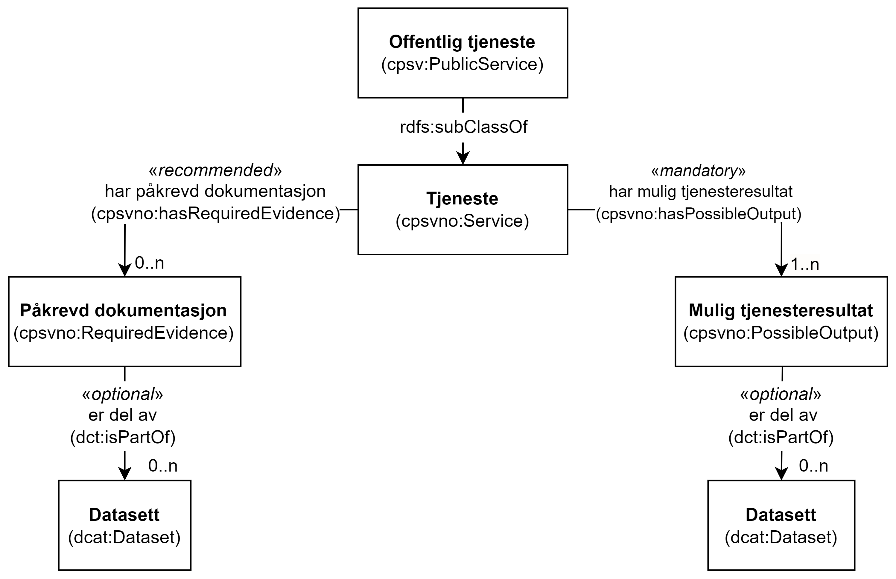

=== Å knytte en tjeneste til et datasett og derfra til API, begrep og informasjonsmodell [[KnytteTilDatasett]]

:xrefstyle: short

[[img-TjenesteOgData]]
.Tjeneste med påkrevd dokumentasjon og mulig tjenesteresultat som er del av datasett.
[link=images/FigurTjenesteMedDataInnOgUt.png]

Som illustrert i <>, kan et Mulig tjenesteresultat (`cpsvno:PossibleOutput`) fra en Tjeneste (`cpsvno:Service` inkl. subklassen Offentlig tjeneste (`cpsv:PublicService`)) være en del av et Datasett (`dcat:Dataset`), f.eks. selve «bevilling» som et mulig tjenesteresultat fra tjenesten «Skjenkebevilling» kan inngå i datasettet over alle skjenkebevillinger som den aktuelle kommunen har utstedt over en gitt tidsperiode. 

Figuren illustrerer også at en Påkrevd dokumentasjon (`cpsvno:RequiredEvidence`) kan være en del av et Datasett (`dcat:Dataset`), f.eks. «firmaattest» er en del av datasettet «Foretaksregisteret» hos Brønnøysundregistrene. 

Se https://informasjonsforvaltning.github.io/dcat-ap-no/#Datasett[spesifikasjon til klassen Datasett (dcat:Dataset) i DCAT-AP-NO &#x29C9;, window="_blank", role="ext-link"], for hvordan et datasett kan knyttes videre til API, begrep og informasjonsmodell.

:xrefstyle: full
