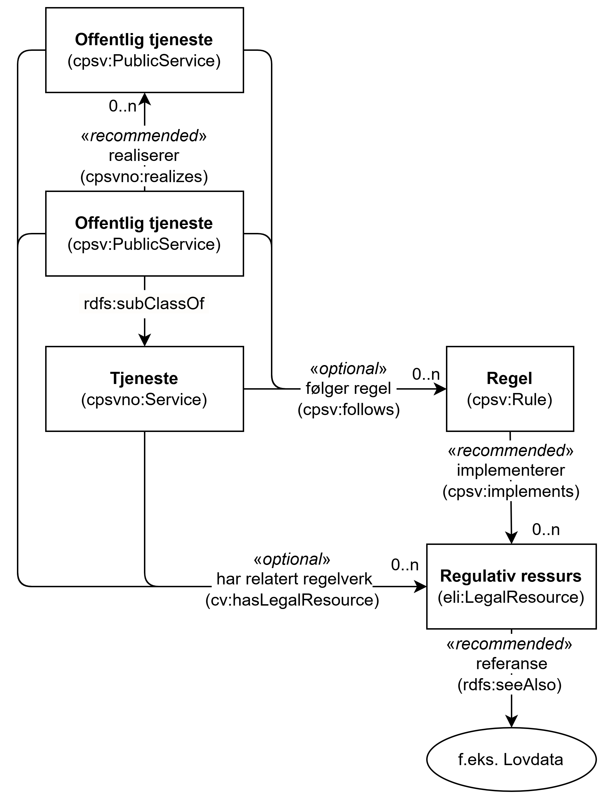

=== Å knytte en tjeneste til regelverk [[KnytteTilRegelverk]]

:xrefstyle: short

Som illustrert i <> kan regelverk knyttes til en Tjeneste, Offentlig tjeneste eller Lovpålagt tjeneste, ved å bruke egenskapene «følger regel (cpsv:follows)» og/eller «har relatert regelverk (cv:hasLegalResource)» i klassen <<Tjeneste, Tjeneste>>, <<OffentligTjeneste, Offentlig tjeneste>> eller <<LovpålagtTjeneste, Lovpålagt tjeneste>>. Egenskapene kan brukes hver for seg eller sammen, avhengig av hva som er mest hensiktsmessig i det enkelte tilfelle.

[[img-TjenesteOgRegelverk]]
.Tjeneste og regelverk.
[link=images/FigurTjenesteOgRegelverk.png]

Eksempel: Tjenesten «Skjenkebevilling» er hjemlet i «Lov om omsetning av alkoholholdig drikk m.v. (alkoholloven)».

Eksempel i RDF Turtle:
-----
<skjenkebevilling> a cpsvno:StatutoryService ; # lovpålagt tjeneste
   cv:hasLegalResource <alkoholloven> ; .

<alkoholloven> a eli:LegalResource ; # regulativ ressurs
   dct:type <https://data.norge.no/vocabulary/legal-resource-type#act> ; # type = lov
   dct:title "Lov om omsetning av alkoholholdig drikk m.v. (alkoholloven)"@nb ; # tittel
   dct:language <http://publications.europa.eu/resource/authority/language/NOB> ; # språk 
   rdfs:seeAlso <https://lovdata.no/eli/lov/1989/06/02/27/> ; # referanse
   .
-----

:xrefstyle: full