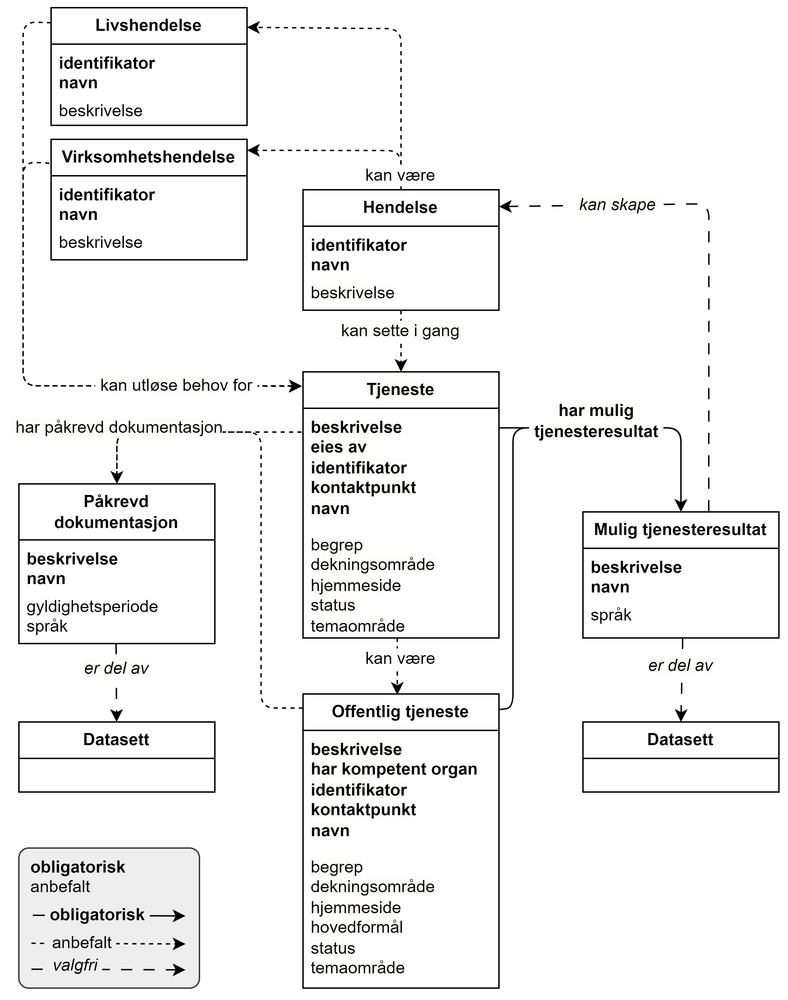

== Forenklet fremstilling av kravene i CPSV-AP-NO [[Forenklet-fremstilling]]

_Denne delen av spesifikasjonen er primært ment for den ikke-tekniske målgruppen._ 

=== Opplysninger som SKAL og BØR tas med om en tjeneste og hendelse [[Noen-krav]]

:xrefstyle: short

<> viser en forenklet fremstilling av noen av kravene i CPSV-AP-NO. Med unntak av noen få valgfrie opplysninger (som KAN tas med), viser figuren bare opplysninger som SKAL (obligatorisk) og BØR (anbefalt) tas med i beskrivelsen av en tjeneste eller hendelse. Krav til hvordan opplysningene skal  representeres teknisk i RDF (https://www.w3.org/RDF/[Resource Description Framework &#x29C9;, window="_blank", role="ext-link"]) er spesifisert i <<Spesifikasjon-per-klasse>>. 

[[img-ForenkletModell]]
.Forenklet fremstilling av noen av kravene i CPSV-AP-NO.
[link=images/CPSV-AP-NO-forenklet-fremstilling.png]

:xrefstyle: full

Helt overordnet illustrerer figuren bl.a. følgende:

* En *https://data.norge.no/concepts/db48fa77-3f47-4d58-b4a3-41569f149c1a[hendelse &#x29C9;, window="_blank", role="ext-link"]* KAN sette i gang en eller flere *https://data.norge.no/concepts/9d406b71-273f-4631-8f3d-52d61943612b[tjenester &#x29C9;, window="_blank", role="ext-link"]*. 
** En tjeneste KAN være en *https://data.norge.no/concepts/73f78f28-cab8-4dae-9029-6e5af9f98dc0[offentlig tjeneste &#x29C9;, window="_blank", role="ext-link"]*.
** En hendelse KAN være en *https://data.norge.no/concepts/9b19d5ce-87b3-4584-a875-e7cff3ad6740[livshendelse &#x29C9;, window="_blank", role="ext-link"]* eller en *https://data.norge.no/concepts/71fd9d69-ca64-3f9b-a1d3-7ade4d069f8a[virksomhetshendelse &#x29C9;, window="_blank", role="ext-link"]*, som KAN utløse behov for en eller flere tjenester / offentlige tjenester.

* En tjeneste / offentlig tjeneste SKAL alltid ha et eller flere *mulige resultat* som KAN skape en eller flere nye hendelser. 
** Et mulig resultat KAN være en del av et *datasett*.

* Det KAN være *påkrevd dokumentasjon* til en tjeneste / offentlig tjeneste.
** En påkrevd dokumentasjon KAN være en del av et datasett. 

=== Et illustrativt eksempel [[Illustrativt-eksempel]]

:xrefstyle: short

<> viser et illustrativt eksempel: 

* En av enkelthendelsene i livshendelsen https://alvorligsyktbarn.no/[Alvorlig sykt barn &#x29C9;, window="_blank", role="ext-link"] er at «barnet er blitt syk».
* Hendelsen «barnet er blitt syk» kan utløse behov for «legetjeneste». 
* Et mulig resultat fra «legetjeneste» er at det forskrives legemidler (datasett «e-resept») som skaper en ny hendelse «e-resept sendt». 
* Denne nye hendelse kan utløse behov for «apotektjeneste» som bruker datasettet «e-resept».

[[img-SyktBarn]]
.Eksempel på sammenheng mellom hendelse, tjeneste og data.
[link=images/FigurSyktBarn.png]
image::images/FigurSyktBarn.png[alt="Fremstilling av brukerreisen rundt eResept. Brukerreisen er beskrevet i teksten."]

:xrefstyle: full