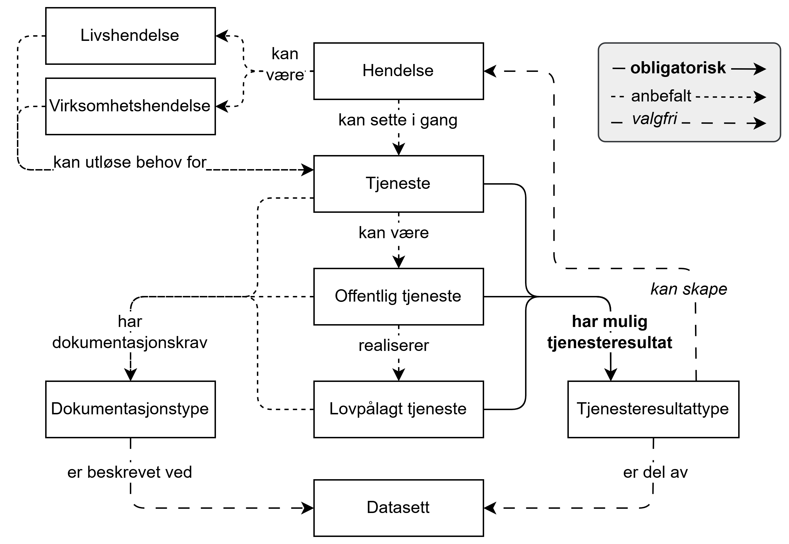

== Forenklet fremstilling av kravene i CPSV-AP-NO [[Forenklet-fremstilling]]

_Denne delen av spesifikasjonen er primært ment for den ikke-tekniske målgruppen._ 

:xrefstyle: short

Som illustrert i <> gir CPSV-AP-NO mulighet til å beskrive tjenester og hendelser. 

[[img-ForenkletModell]]
.Forenklet fremstilling av CPSV-AP-NO.
[link=images/CPSV-AP-NO-forenklet-fremstilling.png]

Helt overordnet illustrerer figuren bl.a. følgende:

* En *https://data.norge.no/concepts/db48fa77-3f47-4d58-b4a3-41569f149c1a[hendelse &#x29C9;, window="_blank", role="ext-link"]* KAN sette i gang en eller flere *https://data.norge.no/concepts/9d406b71-273f-4631-8f3d-52d61943612b[tjenester &#x29C9;, window="_blank", role="ext-link"]*. 
** En tjeneste KAN være en *https://data.norge.no/concepts/73f78f28-cab8-4dae-9029-6e5af9f98dc0[offentlig tjeneste &#x29C9;, window="_blank", role="ext-link"]*, og en offentlig tjeneste realiserer en *lovpålagt tjeneste*.
** En hendelse KAN være en *https://data.norge.no/concepts/9b19d5ce-87b3-4584-a875-e7cff3ad6740[livshendelse &#x29C9;, window="_blank", role="ext-link"]* eller en *https://data.norge.no/concepts/71fd9d69-ca64-3f9b-a1d3-7ade4d069f8a[virksomhetshendelse &#x29C9;, window="_blank", role="ext-link"]*, som KAN utløse behov for en eller flere tjenester / offentlige tjenester.

* En tjeneste / offentlig tjeneste / lovpålagt tjeneste SKAL alltid ha et eller flere *mulige tjenesteresultat* som KAN skape en eller flere nye hendelser. 
** Et mulig tjenesteresultat KAN være en del av et *datasett*.

* Det KAN være *dokumentasjonskrav* til en tjeneste / offentlig tjeneste / lovpålagt tjeneste.
** Dokumentasjonstype som kreves KAN være beskrevet ved et datasett. 

Hvilke typer opplysninger som SKAL (obligatoriske), BØR (anbefalte) og KAN (valgfrie) tas med i en beskrivelse av en hendelse / livshendlese / virksomhetshendelse og tjeneste / offentlig tjeneste / lovopålagt tjeneste er nærmere spesifisert i det følgende i dette kapittelet. Hvordan opplysningene skal representeres teknisk i RDF (https://www.w3.org/RDF/[Resource Description Framework &#x29C9;, window="_blank", role="ext-link"]) er spesifisert i kap. <<Spesifikasjon-per-klasse>>, som også innehlder flere klasser som kan brukes i tillegg til de som er vist i <> og beskrevet i dette kapittelet.

=== Opplysninger som SKAL, BØR og KAN tas med om en tjeneste, offentlig tjeneste og lovpålagt tjeneste [[Krav-til-tjeneste-offentlig-tjeneste-lovpålagt-tjeneste]]

__#@@@@@@ tekst kommer#__

=== Opplysninger som SKAL, BØR og KAN tas med om en hendelse, livshendelse og virksomhetshendelse [[Krav-til-hendelse-livshendelse-virksomhetshendelse]]

__#@@@@@@ tekst kommer#__

=== Et illustrativt eksempel [[Illustrativt-eksempel]]

<> viser et illustrativt eksempel: 

* En av enkelthendelsene i livshendelsen https://alvorligsyktbarn.no/[Alvorlig sykt barn &#x29C9;, window="_blank", role="ext-link"] er at «barnet er blitt syk».
* Hendelsen «barnet er blitt syk» kan utløse behov for «legetjeneste». 
* Et mulig tjenesteresultat fra «legetjeneste» er at det forskrives legemidler (datasett «e-resept») som kan skape en ny hendelse «e-resept sendt». 
* Denne nye hendelse kan sette i gang «apotektjeneste» som bruker datasettet «e-resept».

[[img-SyktBarn]]
.Eksempel på sammenheng mellom hendelse, tjeneste og data.
[link=images/FigurSyktBarn.png]
image::images/FigurSyktBarn.png[alt="Fremstilling av brukerreisen rundt eResept. Brukerreisen er beskrevet i teksten."]

:xrefstyle: full