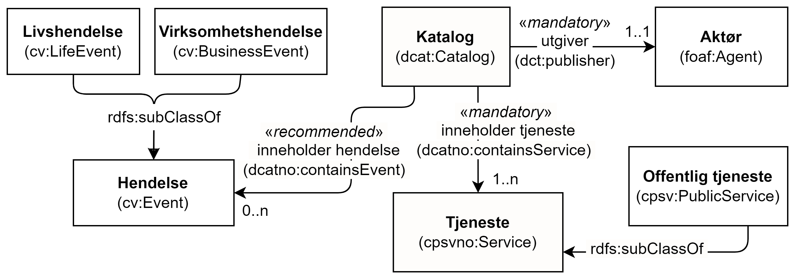
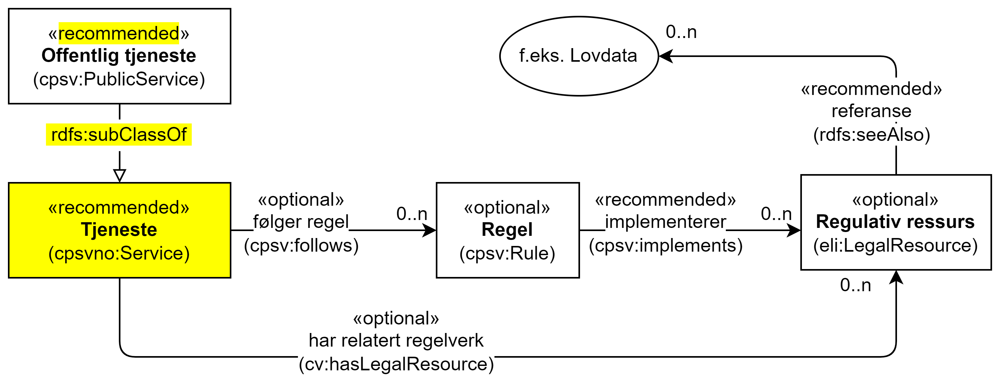

== Forenklet modell for CPSV-AP-NO [[Forenklet_modell]]

[[img-ForenkletModell]]
.Forenklet modell for tjeneste- og hendelsesbeskrivelser
[link=images/ForenkletModell-CPSV-AP-NO.png]
image::images/ForenkletModell-CPSV-AP-NO.png[]

Figur <> viser en forenklet modell av tjeneste- og hendelsesbeskrivelser. Forenklet fordi den ikke viser alle klasser, heller ikke alle relasjoner og egenskaper. Modellen er ikke ment som en formell representasjon av spesifikasjonen, men kun for å gi en visuell oversikt over klasser og relasjoner mellom dem. Før eventuell uoverensstemmelse mellom figuren og den tekstlige beskrivelsen blir rettet opp, har den tekstlige beskrivelsen forrang. Samme forrang gjelder også når det gjelder eventuelle overensstemmelser mellom tekstlige beskrivelser og diagrammer i resten av spesifikasjonen.

=== Å beskrive en tjeneste/hendelseskatalog [[BeskriveEnKatalog]]

[[img-Katalogbeskrivelse]]
.Katalogbeskrivelse
[link=images/FigurKatalog.png]

EUs CPSV-AP som spesifikasjonen baseres på, dekker bare behov for beskrivelse av hendelser og offentlige tjenester. For å beskrive en katalog over tjenester og hendelser, og som en norsk utvidelse til CPSV-AP, gjenbruker spesifikasjonen klassen Katalog (`dcat:Catalog`) fra https://data.norge.no/specification/dcat-ap-no/[DCAT-AP-NO]. Spesifikasjonen utvider også klassen Katalog med egendefinerte egenskapene «tjenestebeskrivelse» (`cpsvno:service`) og «hendelsesbeskrivelse» (`cpsvno:event`), som brukes til å inkludere tjenestebeskrivelser og hendelsesbeskrivelser i katalogen.

=== Å knytte til et datasett og derfra til API, begrep eller informasjonsmodell [[KnytteTilDatasett]]

[[img-TjenesteOgData]]
.Tjeneste med Datasett (dcat:Dataset) som dokumentasjonskrav og tjenesteresultat
[link=images/FigurTjenesteMedDataInnOgUt.png]
image::images/FigurTjenesteMedDataInnOgUt.png[]

Som illustrert i figur <>, kan et Tjenesteresultat (`cv:Output`) produsert av en Tjeneste (`cpsvno:Service` inkl. subklassen Offentlig tjeneste (`cv:PublicService`)) være et Datasett (`dcat:Dataset`), f.eks.  «Skjenkebevillingen» som et resultat fra tjenesten «Søknad om skjenkebevilling» kan deles som et datasett. Et dokumentasjonskrav (`cv:Evidence`) kan også bekreftes ved en dokumentreferanse (`cccev:DocumentReference`) som kan være et datasett (`dcat:Dataset`), f.eks. «Politiattest».

Se https://data.norge.no/guide/veileder-beskrivelse-av-datasett/#sammenheng[Sammenheng mellom datasett, distribusjon, datatjeneste, begrep og informasjonsmodell i _Veileder for beskrivelse av datasett osv._], for hvordan datasett (som f.eks. «Skjenkebevillingen» og «Politiattest») kan videre knyttes til distribusjon, datatjeneste (også kalt API), begrep og informasjonsmodell.

=== Å knytte begrep til en tjeneste eller en hendelse [[KnytteTilBegrep]]

Spesifikasjonen utvider CPSV-AP med egenskapen «begrep» (`dct:subject`) i Klassen Hendelse (`cv:Event`), Klassen Livshendelse (`cv:LifeEvent`), Klassen Virksomhetshendelse (`cv:BusinessEvent`), Klassen Tjeneste (`cpsvno:Service`) og Klassen Offentlig tjeneste (`cpsv:PublicService`). Egenskapen brukes til å referere til et eller flere begreper som er relatert til hendelsen/tjenesten og som er viktig for å forstå hendelsen/tjenesten. Det anbefales å referere til begreper som er publisert i f.eks. https://data.norge.no/concepts[begrepsdelen av Felles datakatalog]. Eksempel: begrepet ‘daglig leder’ er viktig for tjenesten «Søknad om skjenkebevilling».

Se ellers også https://data.norge.no/specification/forvaltningsstandard-begrepsbeskrivelser/[_Forvaltningsstandard for begrepsbeskrivelser_], samt https://data.norge.no/specification/skos-ap-no-begrep/[SKOS-AP-NO-begrep] for hvordan begrepsbeskrivelser utformet i henhold til _Forvaltningsstandard for begrepsbeskrivelser_ tilgjengeliggjøres i RDF.

=== Å knytte en datatjeneste (også kalt API) til en tjenestekanal [[KnytteTilDatatjeneste]]

Spesifikasjonen utvider CPSV-AP med en egendefinert egenskap «datatjeneste» (`cpsvno:dataService`), som kan brukes til å knytte en datatjeneste/API (`dcat:DataService`) til en tjenestekanal (`cv:Channel`). Det anbefales å referere til datatjenestebeskrivelser som er publisert i f.eks. https://data.norge.no/dataservices[API-delen av Felles datakatalog].

=== Å publisere hendelsesstrøm [[Hendelsesstrøm]]

[[img-HendelseOgDistribusjon]]
.Hendelse og Distribusjon
[link=images/FigurHendelseOgDistribusjon.png]
image::images/FigurHendelseOgDistribusjon.png[]

Som illustrert i figur <> har spesifikasjonen utvidet CPSV-AP med egenskapen «distribusjon» (`dcat:distribution`) i Klassen Hendelse (`cv:Event`), Klassen Livshendelse (`cv:LifeEvent`) og Klassen Virksomhetshendelse (`cv:BusinessEvent`), og dermed også implisitt sagt at (beskrivelse av) en Hendelse er et Datasett. Denne egenskapen brukes til å referere til konkrete distribusjoner av f.eks. en hendelsesstrøm som f.eks. kan abonneres på.

Se ellers https://data.norge.no/guide/veileder-beskrivelse-av-datasett/#sammenheng[Sammenheng mellom datasett, distribusjon, datatjeneste, begrep og informasjonsmodell i Veileder for beskrivelse av datasett osv.], for hvordan et datasett (som i dette tilfellet er en hendelsesbeskrivelse) kan knyttes til distribusjon og datatjeneste (også kalt API).

=== Å knytte til regelverk [[KnytteTilRegelverk]]

Se https://data.norge.no/guide/veileder-beskrivelse-av-datasett/#beskrivelse-av-juss[Beskrivelse av juridiske rammer i _Veileder for beskrivelse av datasett osv._], for hvordan regelverk knyttes til et datasett (som f.eks. dokumentasjonskrav til eller tjenesteresultat fra en (offentlig) tjeneste). På helt tilsvarende måte kan regelverk også knyttes til en (offentlig) tjeneste, ved å bruke egenskapen `cpsv:follows`, som illustrert i figur <>.

[[img-TjenesteOgRegelverk]]
.(Offentlig) Tjeneste og regelverk
[link=images/FigurTjenesteOgRegelverk.png]

Eksempel: Tjenesten «Søknad om skjenkebevilling» er hjemlet i «Lov om omsetning av alkoholholdig drikk m.v. (alkoholloven)».

Eksempel i RDF Turtle:
-----
<søknadOmSkjenkebevilling> a cv:PublicService ;
   cv:hasLegalResource [ a eli:LegalResource ;
      dct:type [ a eli:ResourceType ; skos:prefLabel "lov" ; ] ;
      rdfs:seeAlso <https://lovdata.no/eli/lov/1989/06/02/27/nor/html> ; ] ;
     ] ; .
-----

=== Å knytte deltagende aktører til en tjeneste [[KnytteDeltagendeAktørerTilEnTjeneste]]

[[img-FigurTjenesteOgDeltagelse]]
.Tjeneste og Deltagelse
[link=images/FigurTjenesteOgDeltagelse.png]
image::images/FigurTjenesteOgDeltagelse.png[]

Som illustrert i figur <> brukes egenskapen Tjeneste – eies av (`cv:ownedBy`) til å uttrykke relasjonen mellom en Tjeneste og dens eier (en Aktør, `foaf:Agent`), og egenskapen Offentlig tjeneste – har kompetent organ (`cv:hasCompetentAuthority`) til å uttrykke relasjonen mellom en Offentlig tjeneste og dens kompetente organ.

For å uttrykke involvering av andre aktører (inkl. andre offentlige organisasjoner) enn ovennevnte, brukes Klassen Deltagelse (`cv:Participation`). En Tjeneste kan ha en eller flere Deltagelser knyttet til seg, ved bruk av egenskapen <<Tjeneste-deltagende>> (eller egenskapen <<OffentligTjeneste-deltagende>>). En Aktør (inkl. Offentlig organisasjon) kan ha en eller flere roller i en eller flere Deltagelser, ved bruk av egenskapen <<Aktør-harRolle>> (eller <<OffentligOrganisasjon-harRolle>>).

Den obligatoriske egenskapen <<Deltagelse-rolle>> skal brukes til å beskrive en eller flere roller i en Deltagelse, f.eks. «dataleverandør» (leverandør av f.eks. datasett som bekreftelse på at et dokumentasjonsbevis er oppfylt), og «datakonsument» (konsument av datasett som produseres av tjenesten). Slik vi forstår CPSV-AP, ved å knytte en Aktør til en gitt Deltagelse, sier man implisitt at Aktøren har alle rollene i den aktuelle Deltagelse. Det bør derfor lages flere instanser av klassen Deltagelse, f.eks. en med bare rollen «dataleverandør» og en med bare rollen «datakonsument» når ikke alle deltagende aktører har begge roller.

Eksempel: Politidirektoratet (med datasett «Politiattest») deltar som dataleverandør til tjenesten «Søknad om skjenkebevilling».

Eksempel i RDF Turtle:
----
<søknadOmSkjenkebevilling> a cv:PublicService ;
   cv:hasParticipation <deltagendeDataleverandør> ; .
<deltagendeDataleverandør> a cv:Participation ;
   dct:description "deltagende dataleverandører til tjenesten Søknad om skjenkebevilling"@nb ; .
   cv:role <dataleverandør> ; .

<Politidirektoratet> a cv:PublicOrganisation ;
   cv:playsRole <deltagendeDataleverandør> ; .
----
