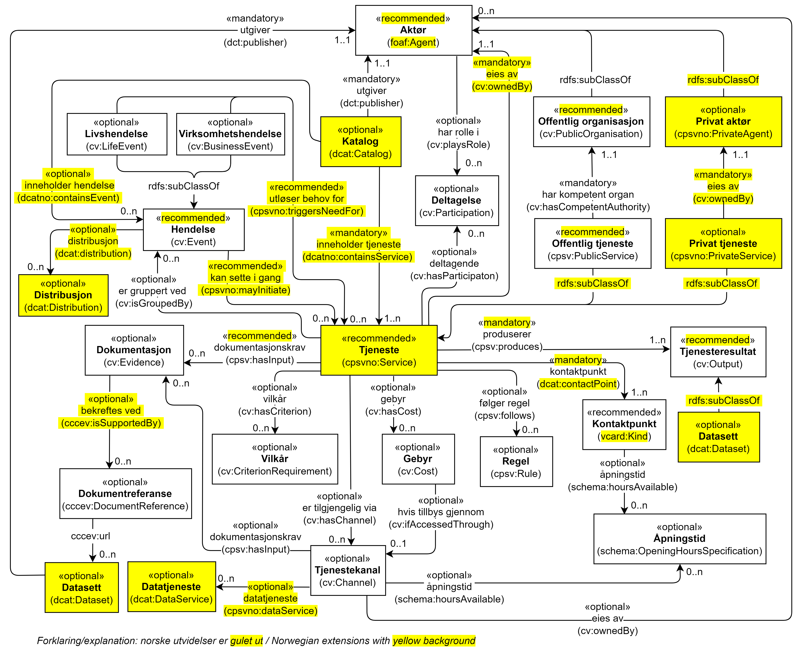

== Forenklet modell for CPSV-AP-NO [[Forenklet_modell]]

<> viser en forenklet modell av tjeneste- og hendelsesbeskrivelser. Forenklet fordi den ikke viser alle klasser, heller ikke alle relasjoner og egenskaper. Modellen er ikke ment som en formell representasjon av spesifikasjonen, men kun for å gi en visuell oversikt over klasser og relasjoner mellom dem. Før eventuell uoverensstemmelse mellom figuren og den tekstlige beskrivelsen blir rettet opp, har den tekstlige beskrivelsen forrang. Samme forrang gjelder også når det gjelder eventuelle uoverensstemmelser mellom tekstlige beskrivelser og diagrammer i resten av spesifikasjonen.

[[img-ForenkletModell]]
.Forenklet modell for tjeneste- og hendelsesbeskrivelser
[link=images/ForenkletModell-CPSV-AP-NO.png]

include::TemaDokumentasjonskrav.adoc[]

include::TemaTjenestekjede.adoc[]

include::TemaKnytteDeltagendeAktørerTilEnTjeneste.adoc[]

include::TemaKnytteTilDatasett.adoc[]

include::TemaKnytteTilBegrep.adoc[]

include::TemaKnytteTilRegelverk.adoc[]

include::TemaKnytteTilDatatjeneste.adoc[]

include::TemaHendelsesstrøm.adoc[]

include::TemaBeskriveEnKatalog.adoc[]
