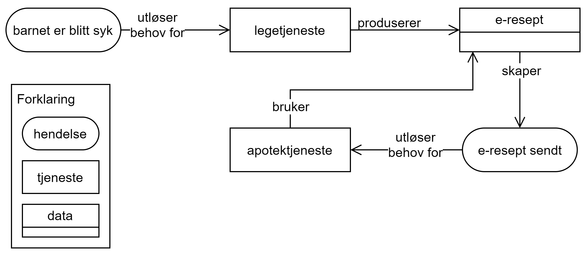

== Innledning – hendelser, tjenester og data [[Innledning]]

[[img-HendelseTjenesteData]]
.Sammenheng mellom hendelse, tjeneste og data
[link=images/FigurHendelseTjenesteData.png]
image::images/FigurHendelseTjenesteData.png[]

Sammenheng mellom hendelse, tjeneste og data illustrert i figur <> som er hentet fra  Digitaliseringsbloggen https://www.digdir.no/sammenhengende-tjenester/vi-ma-snakke-det-samme-spraket-i-sammenhengende-tjenester/2614[_Vi må snakke det samme språket i sammenhengende tjenester!_], kan forklares slik: En hendelse kan utløse behov for en eller flere tjenester. En tjeneste bruker data og kan også  resultere i endringer i data. Endring i data kan føre til en eller flere nye hendelser som igjen kan utløse behov for en eller flere tjenester.

[[img-SyktBarn]]
.Eksempel på sammenheng mellom hendelse, tjeneste og data
[link=images/FigurSyktBarn.png]

Eksempel, illustrert i figur <>: En av enkelthendelsene i livshendelsen https://alvorligsyktbarn.no/[Alvorlig sykt barn] er at "barnet er blitt syk" som utløser behov for "legetjeneste". Et resultat fra "legetjeneste" er at det forskrives legemidler (datasett "e-resept") som skaper en ny hendelse "e-resept sendt". Denne nye hendelse utløser behov for "apotektjeneste" som bruker datasettet "e-resept".
