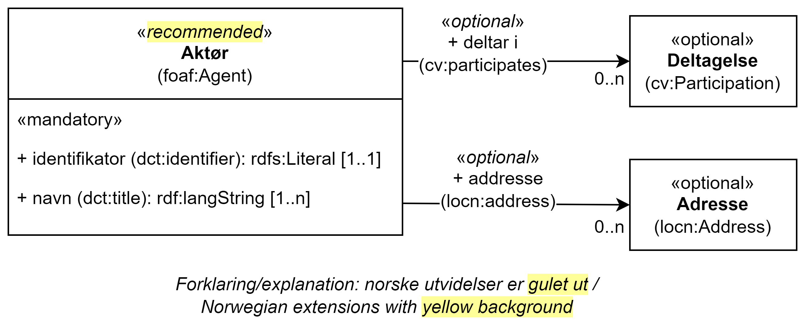

== Klassen Aktør (foaf:Agent) [[Aktør]]

[[img-KlassenAktør]]
.Klassen Aktør (foaf:Agent)
[link=images/KlassenAktør.png]

[cols="30s,70d"]
|===
|English name|Agent
|Beskrivelse|Brukes til å representere en aktør.
|Usage note|The Agent class is any resource that acts or has the power to act. This includes people, organisations and groups. The Public Organization class, defined in the Core Public Organisation Vocabulary, is a notable sub class of Agent.
|URI|foaf:Agent
|Kravsnivå|Anbefalt/Recommended
|Merknad 1|For aktør som er en offentlig organisasjon skal det brukes <<OffentligOrganisasjon>>.
|Merknad 2|Kravsnivå endret fra valgfri til anbefalt.
|Merknad 3|Norsk utvidelse: URI endret fra `dct:Agent` til `foaf:Agent` (EU har sagt at dette skal endres i neste release av CPSV-AP, så dette vil etter hvert ikke være en norsk utvidelse).
|Eksempel|Vi bruker en fiktiv exAktør (Den beste restauranten AS) som eksempel i dette kapittelet.
|===

Eksempel i RDF Turtle:
-----
<exAktør> a foaf:Agent ; .
-----

=== Obligatoriske egenskaper for klassen _Aktør_ [[Aktør-obligatoriske-egenskaper]]

==== Aktør – navn (foaf:name) [[Aktør-navn]]

[cols="30s,70d"]
|===
|English name|name
|URI|foaf:name
|Range|rdfs:Literal
|Beskrivelse|Navn på aktøren. Denne egenskapen kan gjentas for ulike versjoner av navnet (som navnet på forskjellige språk).
|Usage note|This property contains a name of the agent. This property can be repeated for different versions of the name (e.g. the name in different languages).
|Multiplisitet|1..n
|Kravsnivå|Obligatorisk/Mandatory
|Merknad|
|Eksempel|Det fulle navnet til vår exAktør er «Den beste restauranten AS»
|===

Eksempel i RDF Turtle:
----
<exAktør> a foaf:Agent ;
   foaf:name "Den beste restauranten AS"@nb ; .
----

=== Anbefalte egenskaper for klassen _Aktør_ [[Aktør-anbefalte-egenskaper]]

==== Aktør – identifikator (dct:identifier) [[Aktør-identifikator]]

[cols="30s,70d"]
|===
|English name|identifier
|URI|dct:identifier
|Range|rdfs:Literal
|Beskrivelse|Egenskap som angir aktørens identifikasjonsnummer, for eksempel i henhold til Enhetsregisterets organisasjonsnummer.
|Usage note|This property contains an identifier for the Agent.
|Multiplisitet|0..1
|Kravsnivå|Anbefalt/Recommended
|Merknad|Identifikator er som regel systemgenerert av verktøystøtte, slik at du som vanlig bruker ikke trenger å fylle ut verdien til denne egenskapen manuelt.

For deg som skal utvikle/tilpasse verktøystøtte: Når aktøren har et organisasjonsnummer bør identifikatoren oppgis som en URI med følgende mønster der "nnnnnnnnn" er organisasjonsnummeret: f.eks. `\https://organization-catalogue.fellesdatakatalog.digdir.no/organizations/nnnnnnnnn`
|Eksempel|exAktør har organisasjonsnummer nnnnnnnnn
|===

Eksempel I RDF Turtle:
-----
<exAktør> a foaf:Agent ;
   foaf:name "Den beste restauranten AS"@nb ;
   dct:identifier "https://organization-catalogue.fellesdatakatalog.digdir.no/organizations/nnnnnnnnn"^^xsd:anyURI ;  .
-----

==== Aktør – type (dct:type) [[Aktør-type]]

[cols="30s,70d"]
|===
|English name|type
|URI|dct:type
|Range|skos:Concept
|Beskrivelse|Refererer til type aktør.
|Usage note|This property refers to a type of the agent.
|Multiplisitet|0..1
|Kravsnivå|Anbefalt/Recommended
|Merknad|Verdien skal velges fra http://purl.org/adms/publishertype/[ADMS Publisher Type Vocabulary (i RDF)].
|Eksempel|Vår Eksempelaktør er av type _Company_.
|===

Eksempel i RDF Turtle:
-----
<exAktør> a foaf:Agent ;
   foaf:name "Den beste restauranten AS"@nb ;
   dct:type adms:Company ;  .
-----

=== Valgfrie egenskaper for klassen _Aktør_ [[Aktør-valgfrie-egenskaper]]

====  Aktør – adresse (locn:address) [[Aktør-adresse]]

[cols="30s,70d"]
|===
|English name|address
|URI|locn:address
|Range|locn:Address
|Beskrivelse|Brukes til å oppgi en adresse til aktøren.
|Usage note|This property represents an Address related to an Agent.
|Multiplisitet|0..n
|Kravsnivå|Valgfri/Optional
|Merknad|Norsk utvidelse: I CPSV-AP er URIen for denne egenskapen `cv:hasAddress` og range `locn:Address`. Vi har valgt å samkjøre med DCAT-AP-NO som bruker URI `locn:address` med range `locn:Address`. Core Public Organization Vocabulary (v.1.0.0) som CPSV-AP baseres på, bruker også URIen `locn:address`.
|Eksempel|Restaurantgata 1, Gourmetby, Matland
|===

Eksempel i RDF Turtle:
----
<exAktør> a foaf:Agent ;
   foaf:name "Den beste restauranten AS"@nb ;
     locn:address [ a locn:Address ;
         locn:fullAddress "Restaurantgata 1, Gourmetby, Matland"@nb ; ] ; .
----

==== Aktør – har rolle i (cv:playsRole) [[Aktør-harRolle]]

[cols="30s,70d"]
|===
|English name|plays role
|URI|cv:playsRole
|Range|cv:Participation
|Beskrivelse|Brukes til å knytte en deltagelse (`cv:Participation`) til en aktør.
|Usage note|This property links an Agent to the Participation class. The Participation class (`cv:Participation`) facilitates the detailed description of how an Agent participates in or interacts with a (Public) Service and may include temporal and spatial constraints on that participation.
|Multiplisitet|0..n
|Kravsnivå|Valgfri/Optional
|Merknad|
|Eksempel|Se under <<KnytteDeltagendeAktørerTilEnTjeneste>>.
|===

Eksempel i RDF Turtle: Se under <<KnytteDeltagendeAktørerTilEnTjeneste>>.
