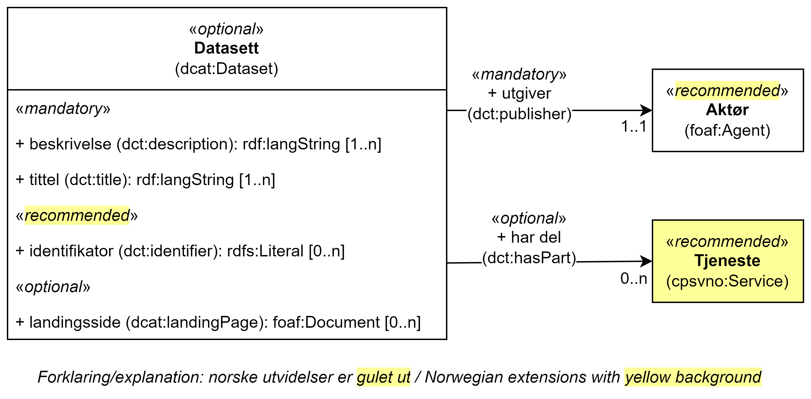

== Klassen Datasett (dcat:Dataset) [[Datasett]]

[[img-KlassenDatasett]]
.Klassen Datasett (dcat:Dataset)
[link=images/KlassenDatasett.png]

[cols="30s,70d"]
|===
|English name|Dataset
|Anvendelse| Klassen representerer en samling metadata om en tjeneste, dokumentasjonskrav til en tjeneste eller tjenesteresultat fra en tjeneste og hvor de kan finnes, for eksempel på en regional offentlig tjenesteportal og/eller en nasjonal eGovernment-portal.
|Usage note|This class represents a collection of metadata and where they can be found, for instance on a regional public service portal and/or a national eGovernment portal.
|URI|dcat:Dataset
|Kravnivå|Valgfri/Optional
|===

Se ellers https://data.norge.no/specification/dcat-ap-no/#Datasett[klassen Datasett i DCAT-AP-NO] for egenskapene som kan brukes til å beskrive et datasett, i tillegg til egenskapene spesifisert her.

=== Obligatoriske egenskaper for klassen _Datasett_ [[Datasett-obligatoriske-egenskaper]]

==== Datasett – beskrivelse (dct:description) [[Datasett-beskrivelse]]

[cols="30s,70d"]
|===
|English name|description
|URI|dct:description
|Range|rdf:langString
|Anvendelse|Egenskapen brukes til å angi fritekstbeskrivelse av datasettet. Egenskapen bør gjentas når beskrivelsen finnes på flere språk.
|Usage note|This property contains a free-text description of the Dataset. This property should be repeated for parallel language versions of the description.
|Multiplisitet|1..n
|Kravnivå|Obligatorisk/Mandatory
|===

Eksempel I RDF Turtle:
-----
<exDataset> a dcat:Dataset ;
   dct:description "teksten som beskriver datasettet"@nb ;  .
-----

==== Datasett – tittel (dct:title) [[Datasett-tittel]]

[cols="30s,70d"]
|===
|English name|title
|URI|dct:title
|Range|rdf:langString
|Anvendelse|Egenskapen brukes til å angi navnet på datasettet. Egenskapen bør gjentas når navnet finnes på flere språk.
|Usage note|This property contains the name of the Dataset. This property should be repeated for parallel language versions of the name.
|Multiplisitet|1..n
|Kravnivå|Obligatorisk/Mandatory
|===

Eksempel I RDF Turtle:
-----
<exDataset> a dcat:Dataset ;
   dct:title "navnet på datasettet"@nb ;  .
-----

==== Datasett – utgiver (dct:publisher) [[Datasett-utgiver]]

[cols="30s,70d"]
|===
|English name|publisher
|URI|dct:publisher
|Range|foaf:Agent
|Anvendelse|Egenskapen brukes til å referere til en aktør (organisasjon) som er ansvarlig for å gjøre datasettet tilgjengelig. Verdien bør være autoritativ URI for aktøren, f.eks. `dct:publisher <\https://organization-catalog.fellesdatakatalog.digdir.no/organizations/974760673>`.
|Usage note|This property refers to the publisher of the dataset, i.e. an entity (organisation) responsible for making the Dataset available.
|Multiplisitet|1..1
|Kravnivå|Obligatorisk/Mandatory
|===

Eksempel I RDF Turtle:
-----
<exDataset> a dcat:Dataset ;
   dct:publisher <https://organization-catalog.fellesdatakatalog.digdir.no/organizations/974760673> ;  .
-----

=== Anbefalte egenskaper for klassen _Datasett_ [[Datasett-anbefalte-egenskaper]]

==== Datasett – identifikator (dct:identifier) [[Datasett-identifikator]]

[cols="30s,70d"]
|===
|English name|identifier
|URI|dct:identifier
|Range|rdfs:Literal
|Anvendelse| Egenskapen brukes til å oppgi identifikatoren for datasettet, for eksempel en URI eller annen identifikator som er stabil og globalt unik.
|Usage note|This property contains the identifier for the Dataset, e.g. the URI or other unique identifier in the context of the Catalogue.
|Multiplisitet|0..n
|Kravnivå|Anbefalt/Recommended
|Merknad| Norsk utvidelse: Kravnivå endret fra valgfri til anbefalt.
|Remark | Norwegian extension: Requirement level changed from optional to recommended.
|===

Eksempel I RDF Turtle:
-----
<exDataset> a dcat:Dataset ;
   dct:identifier "https://example.org/exDataset"^^xsd:anyURI ;  .
-----

=== Valgfrie egenskaper for klassen _Datasett_ [[Datasett-valgfrie-egenskaper]]

==== Datasett – har del (dct:hasPart) [[Datasett-har-del]]

[cols="30s,70d"]
|===
|English name|has part
|URI|dct:hasPart
|Range|cpsvno:Service
|Anvendelse| Når datasettet brukes til å beskrive en tjeneste, brukes egenskapen til å referere til tjenester som inngår i tjenesten beskrevet av datasettet.
|Usage note| When the dataset is used to describe a service, this property refers to a service which is a part of the service described by the dataset.
|Multiplisitet|0..n
|Kravnivå|Valgfri/Optional
|Merknad| Norsk utvidelse: Range endret fra Offentlig tjeneste (`cpsv:PublicService`) til Tjeneste (`cpsvno:Service), for å åpne for ikke-offentlige tjenester.
|Remark | Norwegian extension: Range change from Public Service (`cpsv:PublicService`) to Service (`cpsvno:Service), in order to allow non-public services.
|===

Eksempel I RDF Turtle:
-----
<exDataset> a dcat:Dataset ;
   dct:hasPart <https://example.org/exService> ;  .
-----

==== Datasett – landingsside (dcat:landingPage) [[Datasett-landingsside]]

[cols="30s,70d"]
|===
|English name| landing page
|URI|dcat:landingPage
|Range|foaf:Document
|Anvendelse| Egenskapen brukes til å referere til nettside som gir tilgang til datasettet, dets distribusjoner og/eller tilleggsinformasjon. Intensjonen er å peke til en landingsside hos den opprinnelige datautgiveren.
|Usage note| This property refers to a web page that provides access to the Dataset, its Distributions and/or additional information. It is intended to point to a landing page at the original data provider, not to a page on a site of a third party, such as an aggregator.
|Multiplisitet|0..n
|Kravnivå|Valgfri/Optional
|===

Eksempel I RDF Turtle:
-----
<exDataset> a dcat:Dataset ;
   dcat:landingPage <https://example.org/exDataset> ;  .
-----
