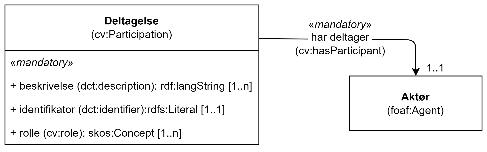

== Klassen Deltagelse (cv:Participation) [[Deltagelse]]

[[img-KlassenDeltagelse]]
.Klassen Deltagelse (cv:Participation)
[link=images/KlassenDeltagelse.png]

[cols="30s,70d"]
|===
|English name|Participation
|Anvendelse| Klassen brukes til å representere en deltagelse, som brukes til å inkludere andre aktører enn det kompetente organet (jf. <<OffentligTjeneste-harKompetentOrgan>>) eller tjenesteeieren (jf. <<Tjeneste-eiesAv>>), som er involvert i en tjeneste.
|Usage note|The CPSV-AP recognises a common role connected with public services, i.e. the Competent Authority. However, this simple structure does not allow statements to be made about those participants, such as the start and end date of a contract, nor does it support the inclusion of other roles. The Participation class supports this extra complexity if required, for instance, the description of a service user or a service provider.
|URI|cv:Participation
|Kravnivå|Valgfri/Optional
|Merknad|Se også <<KnytteDeltagendeAktørerTilEnTjeneste>>.
|Eksempel|Se under <<KnytteDeltagendeAktørerTilEnTjeneste>>.
|===

=== Obligatoriske egenskaper for klassen _Deltagelse_ [[Deltagelse-obligatoriske-egenskaper]]

==== Deltagelse – beskrivelse (dct:description) [[Deltagelse-beskrivelse]]

[cols="30s,70d"]
|===
|English name|description
|URI|dct:description
|Range|rdfs:Literal
|Anvendelse| Egenskapen brukes til å oppgi en tekstlig beskrivelse av deltagelsen. Gjentas når beskrivelsen finnes i flere ulike språk.
|Usage note| This property represents a free text description of the Participation.
|Multiplisitet|1..n
|Kravnivå|Obligatorisk/Mandatory
|Merknad|Norsk utvidelse: Multiplisitet endret fra 1..1 til 1..n for å støtte flerspråklighet.
|Eksempel|Se under <<KnytteDeltagendeAktørerTilEnTjeneste>>.
|===

==== Deltagelse – identifikator (dct:identifier) [[Deltagelse-identifikator]]

[cols="30s,70d"]
|===
|English name|identifier
|URI|dct:identifier
|Range|rdfs:Literal typed as URI
|Anvendelse| Egenskapen brukes til å oppgi identifikatoren til deltagelsen.
|Usage note|This property represents an Identifier for the Participation.
|Multiplisitet|1..1
|Kravnivå|Obligatorisk/Mandatory
|Merknad|Identifikator er som regel systemgenerert av verktøystøtte, slik at du som vanlig bruker ikke trenger å fylle ut verdien til denne egenskapen manuelt.

For deg som skal utvikle/tilpasse verktøystøtte, se https://data.norge.no/guide/veileder-beskrivelse-av-datasett/#om-identifikator[Om identifikator (dct:identifier) i Veileder for beskrivelse av datasett osv.]
|Eksempel|
|===

==== Deltagelse – rolle (cv:role) [[Deltagelse-rolle]]

[cols="30s,70d"]
|===
|English name|role
|URI|cv:role
|Range|skos:Concept
|Anvendelse| Egenskapen brukes til å referere til et begrep som beskriver en rolle i deltagelsen.
|Usage note| This property provides the role played.
|Multiplisitet|1..n
|Kravnivå|Obligatorisk/Mandatory
|Merknad|Verdien skal velges fra det felles kontrollerte vokabularet https://data.norge.no/vocabulary/role-type[Rolletype], når verdien finnes i vokabularet.
|Remarks|The value shall be chosen from the common controlled vocabulary https://data.norge.no/vocabulary/role-type[Role type], when the value is in the vocabulary.
|Eksempel|Se under <<KnytteDeltagendeAktørerTilEnTjeneste>>.
|===
