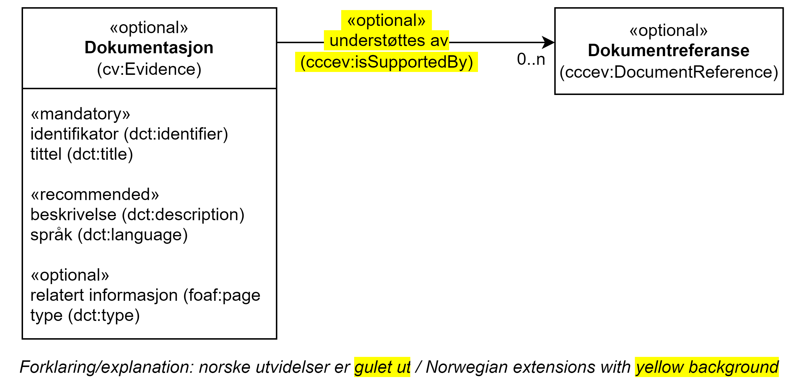

== Klassen Dokumentasjon (cv:Evidence) [[Dokumentasjon]]

[[img-KlassenDokumentasjon]]
.Klassen Dokumentasjon (cv:Evidence)
[link=images/KlassenDokumentasjon.png]

[cols="30s,70d"]
|===
|English name|Evidence
|Anvendelse| Egenskapen brukes til å representere dokumentasjon som trengs for å kunne utføre en tjeneste.
|Usage note| Evidence can be any resource - document, artefact – anything needed for executing the service. In the context of Public Services, Evidence is usually administrative documents or completed application forms. A specific Public Service may require the presence of certain Evidence or combinations of Evidence in order to be delivered. It contains information that proves that a criterion requirement exists or is true, in particular evidences are used to prove that a specific criterion is met.
|URI|cv:Evidence
|Subklasse av / Subclass of | dcat:Dataset
|Kravnivå|Valgfri/Optional
|Merknad|
|Eksempel|Krav om vandel
|===

Eksempel i RDF Turtle:
----
<kravOmVandel> a cv:Evidence ; .
----

=== Obligatoriske egenskaper for klassen _Dokumentasjon_ [[Dokumentasjon-obligatoriske-egenskaper]]

==== Dokumentasjon – identifikator (dct:identifier) [[Dokumentasjon-identifikator]]

[cols="30s,70d"]
|===
|English name|identifier
|URI|dct:identifier
|Range|rdfs:Literal
|Anvendelse| Egenskapen brukes til å oppgi identifikatoren til dokumentasjonen.
|Usage note| This property represents an Identifier for the piece of Evidence.
|Multiplisitet|1..1
|Kravnivå|Obligatorisk/Mandatory
|Merknad|Identifikator er som regel systemgenerert av verktøystøtte, slik at du som vanlig bruker ikke trenger å fylle ut verdien til denne egenskapen manuelt.

For deg som skal utvikle/tilpasse verktøystøtte, se https://data.norge.no/guide/veileder-beskrivelse-av-datasett/#om-identifikator[Om identifikator (dct:identifier) i Veileder for beskrivelse av datasett osv.]
|Eksempel|
|===

==== Dokumentasjon – tittel (dct:title) [[Dokumentasjon-tittel]]

[cols="30s,70d"]
|===
|English name|name
|URI|dct:title
|Range|rdf:langString
|Anvendelse| Egenskapen brukes til å oppgi tittel til dokumentasjonen. Egenskapen bør gjentas når tittelen finnes i flere ulike språk.
|Usage note| This property represents the official Name of the piece of Evidence, repeated when the name is in parallel languages.
|Multiplisitet|1..n
|Kravnivå|Obligatorisk/Mandatory
|Merknad|
|Eksempel|Krav om vandel
|===

Eksempel i RDF Turtle:
-----
<kravOmVandel> a cv:Evidence ;
   dct:title "Krav om vandel"@nb ; .
-----

=== Anbefalte egenskaper for klassen _Dokumentasjon_ [[Dokumentasjon-anbefalte-egenskaper]]

==== Dokumentasjon – beskrivelse (dct:description) [[Dokumentasjon-beskrivelse]]

[cols="30s,70d"]
|===
|English name|description
|URI|dct:description
|Range|rdf:langString
|Anvendelse| Egenskapen brukes til å oppgi en tekstlig beskrivelse av dokumentasjonen. Egenskapen bør gjentas når beskrivelsen finnes i flere ulike språk.
|Usage note| This property represents a free text Description of the piece of Evidence, repeated when the description is in parallel languages.
|Multiplisitet|0..n
|Kravnivå|Anbefalt/Recommended
|Merknad|
|Eksempel| Forklaringen til «Krav om vandel»: Bevillingshaver, daglig leder og personer som har vesentlig innflytelse på virksomheten, må ha utvist uklanderlig vandel i forhold til regnskapslovgivningen, skatte- og avgiftslovgivningen. Personer som nevnt i første punktum må heller ikke ha begått lovbrudd i forhold til annen lovgiving på en måte som vil være uforenlig med drift av skjenkestedet.
|===

Eksempel i RDF Turtle:
-----
<kravOmVandel> a cv:Evidence ;
   dct:title "Krav om vandel"@nb ;
   dct:description "Bevillingshaver, daglig leder og personer som har vesentlig innflytelse på virksomheten, må ha utvist uklanderlig vandel i forhold til regnskapslovgivningen, skatte- og avgiftslovgivningen. Personer som nevnt i første punktum må heller ikke ha begått lovbrudd i forhold til annen lovgiving på en måte som vil være uforenlig med drift av skjenkestedet."@nb ; .
-----

==== Dokumentasjon – språk (dct:language) [[Dokumentasjon-språk]]

[cols="30s,70d"]
|===
|English name|language
|URI|dct:language
|Range|dct:LinguisticSystem
|Anvendelse| Egenskapen brukes til å oppgi språk til dokumentasjonen.
|Usage note| This property indicates the language(s) in which the Evidence must be provided.
|Multiplisitet|0..n
|Kravnivå|Anbefalt/Recommended
|Merknad|Verdien skal velges fra EUs kontrollerte vokabular https://op.europa.eu/en/web/eu-vocabularies/concept-scheme/-/resource?uri=http://publications.europa.eu/resource/authority/language[Språk].
|Remark | The value shall be chosen from EU's controlled vocabulary https://op.europa.eu/en/web/eu-vocabularies/concept-scheme/-/resource?uri=http://publications.europa.eu/resource/authority/language[Language].
|Eksempel|Dokumentasjon på «Krav om vandel» kan være på bokmål, nynorsk eller engelsk.
|===

Eksempel i RDF Turtle:
-----
<kravOmVandel> a cv:Evidence ;
   dct:language
      <https://publications.europa.eu/resource/authority/language/NOB>, # bokmål  
      <https://publications.europa.eu/resource/authority/language/NNN>, # nynorsk
      <https://publications.europa.eu/resource/authority/language/ENG>; # engelsk 
   .
-----

=== Valgfrie egenskaper for klassen _Dokumentasjon_ [[Dokumentasjon-valgfrie-egenskaper]]

==== Dokumentasjon – relatert informasjon (foaf:page) [[Dokumentasjon-relatertInformasjon]]

[cols="30s,70d"]
|===
|English name|related documentation (about the evidence)
|URI|foaf:page
|Range|foaf:Document
|Anvendelse| Egenskapen brukes til å referere til mer informasjon om dokumentasjonen.
|Usage note| This property represents documentation that contains information related to the Evidence, for instance a particular template for an administrative document, an application or a guide on formatting the Input.
|Multiplisitet|0..n
|Kravnivå|Valgfri/Optional
|Merknad|
|Eksempel|Krav om vandel er forklart nærmere på https://kommune24-7.no/1813/702431[denne siden hos Brønnøy kommune].
|===

Eksempel i RDF Turtle:
-----
<kravOmVandel> a cv:Evidence ;
   dct:title "Krav om vandel"@nb ;
   foaf:page <https://kommune24-7.no/1813/702431> ; .
-----

==== Dokumentasjon – type (dct:type) [[Dokumentasjon-type]]

[cols="30s,70d"]
|===
|English name|type
|URI|dct:type
|Range|skos:Concept
|Anvendelse| Egenskapen brukes til å referere til begrepet som representerer typen dokumentasjonen tilhører.
|Usage note| This property represents the type of Evidence as described in a controlled vocabulary.
|Multiplisitet|0..1
|Kravnivå| Valgfri/Optional
|Merknad| Verdien skal velges fra det felles kontrollerte vokabularet https://data.norge.no/vocabulary/evidence-type[Dokumentasjonstype], når verdien finnes i vokabularet.
|Remark | The value shall be chosen from the common controlled vocabulary https://data.norge.no/vocabulary/evidence-type[Evidence type], when the value is in the vocabulary.
|Eksempel|Dokumentasjon til «Krav om vandel» er av type «attest»
|===

Eksempel i RDF Turtle:
-----
<kravOmVandel> a cv:Evidence ;
   dct:title "Krav om vandel"@nb ;
   dct:type <https://data.norge.no/vocabulary/evidence-type#attestation> ; # attest .
-----

==== Dokumentasjon – #understøtter vilkår# (cv:supportsRequirement) [[Dokumentasjon-understøtter-vilkår]]

[cols="30s,70d"]
|===
|English name| supports requirement
|URI| cv:supportsRequirement
|Range| cv:Requirement
|Anvendelse| Egenskapen brukes til å referere vilkår som dokumentasjonen #understøtter#.
|Usage note| This property is used to refer to the requirement that the evidence supports.
|Multiplisitet|0..n
|Kravnivå|Valgfri/Optional
|Merknad|
|Eksempel|
|===

Eksempel i RDF Turtle:
