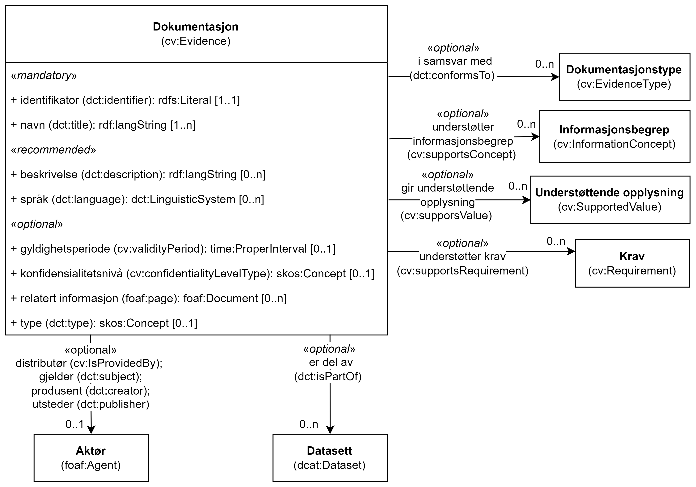

== Klassen Dokumentasjon (cv:Evidence) [[Dokumentasjon]]

[[img-KlassenDokumentasjon]]
.Klassen Dokumentasjon (cv:Evidence)
[link=images/KlassenDokumentasjon.png]

[cols="30s,70d"]
|===
|English name|Evidence
|Beskrivelse|Brukes til å representere dokumentasjon som trengs for å kunne utføre en tjeneste.
|Usage note|Evidence can be any resource - document, artefact – anything needed for executing the (Public) Service. In the context of Public Services, Evidence is usually administrative documents or completed application forms. A specific Public Service may require the presence of certain Evidence or combinations of Evidence in order to be delivered. It contains information that proves that a criterion requirement exists or is true, in particular evidences are used to prove that a specific criterion is met.
|URI|cv:Evidence
|Kravsnivå|Valgfri/Optional
|Merknad|
|Eksempel|Krav om vandel
|===

Eksempel i RDF Turtle:
----
<kravOmVandel> a cv:Evidence ; .
----

=== Obligatoriske egenskaper for klassen _Dokumentasjon_ [[Dokumentasjon-obligatoriske-egenskaper]]

==== Dokumentasjon – identifikator (dct:identifier) [[Dokumentasjon-identifikator]]

[cols="30s,70d"]
|===
|English name|identifier
|URI|dct:identifier
|Range|rdfs:Literal typed as URI
|Beskrivelse|Brukes til å oppgi identifikatoren til dokumentasjonen.
|Usage note|This property represents an Identifier for the piece of Evidence.
|Multiplisitet|1..1
|Kravsnivå|Obligatorisk/Mandatory
|Merknad|Identifikator er som regel systemgenerert av verktøystøtte, slik at du som vanlig bruker ikke trenger å fylle ut verdien til denne egenskapen manuelt.

For deg som skal utvikle/tilpasse verktøystøtte, se https://data.norge.no/guide/veileder-beskrivelse-av-datasett/#om-identifikator[Om identifikator (dct:identifier) i Veileder for beskrivelse av datasett osv.]
|Eksempel|
|===

==== Dokumentasjon – tittel (dct:title) [[Dokumentasjon-tittel]]

[cols="30s,70d"]
|===
|English name|name
|URI|dct:title
|Range|rdfs:Literal
|Beskrivelse|Brukes til å oppgi tittel til dokumentasjonen. Gjentas når tittelen finnes i flere ulike språk.
|Usage note|This property represents the official Name of the piece of Evidence.
|Multiplisitet|1..n
|Kravsnivå|Obligatorisk/Mandatory
|Merknad|Norsk utvidelse: Multiplisitet endret fra 1..1 til 1..n for å støtte flerspråklighet.
|Eksempel|Krav om vandel
|===

Eksempel i RDF Turtle:
-----
<kravOmVandel> a cv:Evidence ;
   dct:title "Krav om vandel"@nb ; .
-----

=== Anbefalte egenskaper for klassen _Dokumentasjon_ [[Dokumentasjon-anbefalte-egenskaper]]

==== Dokumentasjon – beskrivelse (dct:description) [[Dokumentasjon-beskrivelse]]

[cols="30s,70d"]
|===
|English name|description
|URI|dct:description
|Range|rdfs:Literal
|Beskrivelse|Brukes til å oppgi en tekstlig beskrivelse av dokumentasjonen. Gjentas når beskrivelsen finnes i flere ulike språk.
|Usage note|This property represents a free text Description of the piece of Evidence.
|Multiplisitet|0..n
|Kravsnivå|Anbefalt/Recommended
|Merknad|Norsk utvidelse: Multiplisitet endret fra 0..1 til 0..n for å støtte flerspråklighet.
|Eksempel|Forklaringen til «Krav om vandel»: Bevillingshaver, daglig leder og personer som har vesentlig innflytelse på virksomheten, må ha utvist uklanderlig vandel i forhold til regnskapslovgivningen, skatte- og avgiftslovgivningen. Personer som nevnt i første punktum må heller ikke ha begått lovbrudd i forhold til annen lovgiving på en måte som vil være uforenlig med drift av skjenkestedet.
|===

Eksempel i RDF Turtle:
-----
<kravOmVandel> a cv:Evidence ;
   dct:title "Krav om vandel"@nb ;
   dct:description "Bevillingshaver, daglig leder og personer som har vesentlig innflytelse på virksomheten, må ha utvist uklanderlig vandel i forhold til regnskapslovgivningen, skatte- og avgiftslovgivningen. Personer som nevnt i første punktum må heller ikke ha begått lovbrudd i forhold til annen lovgiving på en måte som vil være uforenlig med drift av skjenkestedet."@nb ; .
-----

==== Dokumentasjon – språk (dct:language) [[Dokumentasjon-språk]]

[cols="30s,70d"]
|===
|English name|language
|URI|dct:language
|Range|dct:LinguisticSystem
|Beskrivelse|Brukes til å oppgi språk til dokumentasjonen.
|Usage note|Indicates the language(s) in which the Evidence must be provided.
|Multiplisitet|0..n
|Kravsnivå|Anbefalt/Recommended
|Merknad|Verdien skal velges fra EU sin kontrollerte liste over https://op.europa.eu/en/web/eu-vocabularies/dataset/-/resource?uri=http://publications.europa.eu/resource/dataset/language[Language].
|Eksempel|Dokumentasjon på «Krav om vandel» kan være på bokmål, nynorsk eller engelsk.
|===

Eksempel i RDF Turtle:
-----
<kravOmVandel> a cv:Evidence ;
   dct:language
      <https://publications.europa.eu/resource/authority/language/NOB>, # bokmål  
      <https://publications.europa.eu/resource/authority/language/NNN>, # nynorsk
      <https://publications.europa.eu/resource/authority/language/ENG>; # engelsk 
   .
-----

=== Valgfrie egenskaper for klassen _Dokumentasjon_ [[Dokumentasjon-valgfrie-egenskaper]]

==== Dokumentasjon – bekreftes ved (cccev:isSupportedBy) [[Dokumentasjon-bekreftesVed]]

[cols="30s,70d"]
|===
|English name|is supported by
|URI|cccev:isSupportedBy
|Range|cccev:DocumentReference
|Beskrivelse|Brukes til å referere til en attest eller lignende som bekreftelse på dokumentasjonen. Kan også være URL til der bekreftelsen (ev. fra en tredjepart) kan finnes.
|Usage note|An Evidence may refer to the attestation, to the evidentiary document or to the URL where the proof from a third party can be found.
|Multiplisitet|0..n
|Kravsnivå|Valgfri/Optional
|Merknad|Norsk utvidelse: Denne er ikke eksplisitt med i CPSV-AP, men trengs for f.eks. å knytte et datasett (en eller annen «attest») til dokumentasjonen.
|Eksempel|«Krav om vandel» kan bekreftes ved «Vandelsattest».
|===

Eksempel i RDF Turtle:
-----
<kravOmVandel> a cv:Evidence ;
   dct:title "Krav om vandel"@nb ;
   cccev:isSupportedBy <vandelsattest> ; .

<vandelsattest> a cccev:DocumentReference ; .
-----

==== Dokumentasjon – relatert informasjon (foaf:page) [[Dokumentasjon-relatertInformasjon]]

[cols="30s,70d"]
|===
|English name|related documentation (about the evidence)
|URI|foaf:page
|Range|foaf:Document
|Beskrivelse|Brukes til å referere til mer informasjon om dokumentasjonen.
|Usage note|This property represents documentation that contains information related to the Evidence, for instance a particular template for an administrative document, an application or a guide on formatting the Input.
|Multiplisitet|0..n
|Kravsnivå|Valgfri/Optional
|Merknad|
|Eksempel|Krav om vandel er forklart nærmere på https://kommune24-7.no/1813/702431[denne siden hos Brønnøy kommune].
|===

Eksempel i RDF Turtle:
-----
<kravOmVandel> a cv:Evidence ;
   dct:title "Krav om vandel"@nb ;
   foaf:page <https://kommune24-7.no/1813/702431> ; .
-----

==== Dokumentasjon – type (dct:type) [[Dokumentasjon-type]]

[cols="30s,70d"]
|===
|English name|type
|URI|dct:type
|Range|skos:Concept
|Beskrivelse|Brukes til å referere til begrepet som representerer typen dokumentasjonen tilhører.
|Usage note|This property represents the type of Evidence as described in a controlled vocabulary.
|Multiplisitet|0..1
|Kravsnivå|Valgfri/Optional
|Merknad|Verdien skal velges fra en felles kontrollert liste over typer dokumentasjon (Evidence) når den finnes på listen. Se forslag under til et slikt kontrollert vokabular.
|Eksempel|Dokumentasjon til «Krav om vandel» er av type «attest»
|===

Eksempel i RDF Turtle:
-----
<kravOmVandel> a cv:Evidence ;
   dct:title "Krav om vandel"@nb ;
   dct:type <attest> ; .
-----

Forslag til et kontrollert vokabular for dokumentasjonstyper:

* Attest
* Erklæring
* Protokoll
* Sertifikat
* #<kom med innspill>#
