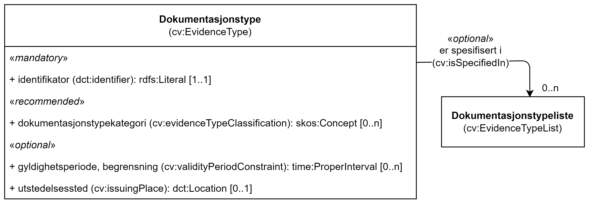

== Klassen Dokumentasjonstype (cv:EvidenceType) [[Dokumentasjonstype]]

[[img-KlassenDokumentasjonstype]]
.Klassen Dokumentasjonstype (cv:EvidenceType) og klassen den refererer til. 
[link=images/KlassenDokumentasjonstype.png]

[cols="30s,70d"]
|===
| _English name_ | _Evidence Type_
| Anvendelse / _Usage note_ | Klassen brukes til å representere informasjon om egenskapene til dokumentasjonen.

_This class represents information about the characteristics of an Evidence. The Evidence Type and the characteristics it describes are not concrete individual responses to a Requirement (i.e. Evidence), but descriptions about the desired form, content, source and/or other characteristics that an actual response should have and provide (e.g. membership of a class of Evidences)._
| URI | cv:EvidenceType
| Kravnivå / _Requirement level_ | Valgfri / _Optional_
| Eksempel | Se under <<Å-beskrive-dokumentasjonskrav>>.
|===

Eksempel i RDF Turtle: Se under <<Å-beskrive-dokumentasjonskrav>>.

=== Obligatoriske egenskaper for klassen _Dokumentasjonstype_ [[Dokumentasjonstype-obligatoriske-egenskaper]]

==== Dokumentasjonstype – identifikator (dct:identifier) [[Dokumentasjonstype-identifikator]]

[cols="30s,70d"]
|===
| _English name_ | _identifier_
| URI | dct:identifier
| Verdiområde / _Range_ | rdfs:Literal
| Anvendelse / _Usage note_ | Egenskapen brukes til å oppgi identifikatoren til dokumentasjonstypen.

_This property represents an unambiguous reference to the Evidence Type._
| Multiplisitet / _Multiplicity_ | 1..1
| Kravnivå / _Requirement level_ | Obligatorisk / _Mandatory_ 
| Merknad / _Note_ | Identifikator er som regel systemgenerert av verktøystøtte, slik at du som vanlig bruker ikke trenger å fylle ut verdien til egenskapen manuelt.

For deg som skal utvikle/tilpasse verktøystøtte, se https://data.norge.no/guide/veileder-beskrivelse-av-datasett/#om-identifikator[Om identifikator (dct:identifier) i Veileder for beskrivelse av datasett osv. &#x29C9;, window="_blank", role="ext-link"]

__Identifier is usually generated by the application, such that you as an end-user of the application usually do not need to manually fill out the value of this property.__ 

__If you are developing applications, see https://data.norge.no/guide/veileder-beskrivelse-av-datasett/#om-identifikator[Om identifikator (dct:identifier) i Veileder for beskrivelse av datasett osv. &#x29C9;, window="_blank", role="ext-link"] (in Norwegian only).__
|===

=== Anbefalte egenskaper for klassen _Dokumentasjonstype_ [[Dokumentasjonstype-anbefalte-egenskaper]]

==== Dokumentasjonstype – dokumentasjonstypekategori (cv:evidenceTypeClassification) [[Dokumentasjonstype-dokumentasjonstypekategori]]

[cols="30s,70d"]
|===
| _English name_ | _evidence type classification_
| URI | cv:evidenceTypeClassification
| Verdiområde / _Range_ | skos:Concept
| Anvendelse / _Usage note_ | Egenskapen brukes til å referere til kategorien som dokumentasjonstypen tilhører.

_This property represents the category to which the Evidence Type belongs._
| Multiplisitet / _Multiplicity_ | 0..n
| Kravnivå / _Requirement level_ | Anbefalt / _Recommended_
| Merknad / _Note_ | Norsk utvidelse: Kravnivå endret fra valgfri til anbefalt.

_Norwegian extension: Requirement level changed from optional to recommended._
|===

=== Valgfrie egenskaper for klassen _Dokumentasjonstype_ [[Dokumentasjonstype-valgfrie-egenskaper]]

==== Dokumentasjonstype – er spesifisert i (cv:isSpecifiedIn) [[Dokumentasjonstype-erSpesifisertI]]

[cols="30s,70d"]
|===
| _English name_ | _is spesified in_
| URI | cv:isSpecifiedIn
| Verdiområde / _Range_ | cv:EvidenceTypeList
| Anvendelse / _Usage note_ | Egenskapen brukes til å referere til en dokumentasjonstypeliste som inneholder dokumentasjonstypen.

_This property represents the Evidence Type List in which the Evidence Type is included._
| Multiplisitet / _Multiplicity_ | 0..n
| Kravnivå / _Requirement level_ | Valgfri / _Optional_
| Merknad / _Note_ | Norsk utvidelse: Ikke eksplisitt spesifisert i CPSV-AP, men i CCCEV som CPSV-AP også bruker.

_Norwegian extension: Not explicitly specified in CPSV-AP, but in CCCEV which CPSV-AP also uses._
|===

==== Dokumentasjonstype – gyldighetsperiode, begrensning (cv:validityPeriodConstraint) [[Dokumentasjonstype-gyldighetsperiodeBegrensning]]

[cols="30s,70d"]
|===
| _English name_ | _validity period constraint_
| URI |cv:validityPeriodConstraint
| Verdiområde / _Range_ |time:ProperInterval
| Anvendelse / _Usage note_ |Egenskapen brukes til å referere til tidsmessige betingelser for gyldighetsperioden til dokumentasjonstypen.

_This property represents temporal condition on the validity period of the Evidence Type. E.g. A Belgian birth evidence is valid for X months after emission. To express constraints on the validity period that must hold when assessing the evidence (e.g. the certificate of good conduct cannot be issued more than 3 months ago), we refer to the Constraint class._
| Multiplisitet / _Multiplicity_ | 0..n
| Kravnivå / _Requirement level_ | Valgfri / _Optional_
| Merknad / _Note_ | Norsk utvidelse: Ikke eksplisitt spesifisert i CPSV-AP, men i CCCEV som CPSV-AP også bruker.

_Norwegian extension: Not explicitly specified in CPSV-AP, but in CCCEV which CPSV-AP also uses._
|===

==== Dokumentasjonstype – utstedelsessted (cv:issuingPlace) [[Dokumentasjonstype-utstedelsessted]]

[cols="30s,70d"]
|===
| _English name_ | _issuing place_
| URI |cv:issuingPlace
| Verdiområde / _Range_ |dct:Location
| Anvendelse / _Usage note_ |Egenskapen brukes til å referer til stedet der dokumentasjonen er utstedt. F.eks. belgiske ID-kort utstedes i Belgia.

_This property represents the Location where an Evidence Type is issued. E.g. Belgian ID cards are issued in Belgium._
| Multiplisitet / _Multiplicity_ |0..1
| Kravnivå / _Requirement level_ |Valgfri / _Optional_
| Merknad / _Note_ | Norsk utvidelse: Ikke eksplisitt spesifisert i CPSV-AP, men i CCCEV som CPSV-AP også bruker.

_Norwegian extension: Not explicitly specified in CPSV-AP, but in CCCEV which CPSV-AP also uses._
|===
