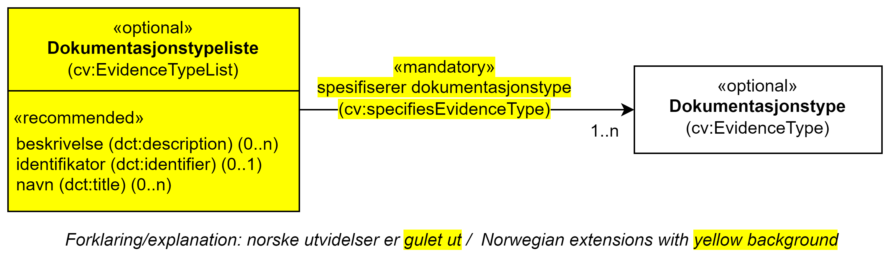

== Klassen Dokumentasjonstypeliste (cv:EvidenceTypeList) [[Dokumentasjonstypeliste]]

[[img-KlassenDokumentasjonstypeliste]]
.Klassen Dokumentasjonstypeliste (cv:EvidenceTypeList) og klassen den refererer til.
[link=images/KlassenDokumentasjonstypeliste.png]

[cols="30s,70d"]
|===
| _English name_ | _Evidence Type List_
| Anvendelse / _Usage note_ | Klassen brukes til å representere en gruppe av dokumentasjonstyper som kreves for å oppfylle et krav.

Kravet om å være i samsvar med en dokumentasjonstypeliste er oppfylt **hvis og bare hvis** den aktuelle dokumentasjonen samsvarer med **alle** typer som listen inneholder. Det er med andre ord en `AND` betingelse mellom typene på en gitt dokumentasjonsliste, og en `OR` betingelse mellom ulike dokumentasjonslister.

_This class represents a group of Evidence Types for conforming to a Requirement._

_An Evidence Type List is satisfied, if and only if, for all included Evidence Types in this List, corresponding conformant Evidence(s) are supporting the Requirement having this List. The Evidence Type List describes thus an AND condition on the different Evidence Types within the list and an OR condition between two or more Evidence Type Lists. Combinations of alternative Lists can be provided for a respondent of a Requirement to choose amongst them._
| URI | cv:EvidenceTypeList
| Kravnivå / _Requirement level_ | Valgfri / _Optional_
| Merknad / _Note_ | Norsk utvidelse: Ikke eksplisitt spesifisert i CPSV-AP, men i CCCEV som CPSV-AP også bruker.

_Norwegian extension: Not explicitly specified in CPSV-AP, but in CCCEV which CPSV-AP also uses._
| Eksempel | Se under <<Å-beskrive-dokumentasjonskrav>>.
|===

Eksempel i RDF Turtle: Se under <<Å-beskrive-dokumentasjonskrav>>.

=== Obligatoriske egenskaper for klassen _Dokumentasjonstypeliste_ [[Dokumentasjonstypeliste-obligatoriske-egenskaper]]

==== Dokumentasjonstypeliste – spesifiserer dokumentasjonstype (cv:specifiesEvidenceType) [[Dokumentasjonstypeliste-SpesifisererDokumentasjonstype]]

[cols="30s,70d"]
|===
| _English name_ |  _specifies evidence type_
| URI |cv:specifiesEvidenceType
| Verdiområde / _Range_ | cv:EvidenceType
| Anvendelse / _Usage note_ |Egenskapen brukes til å referere til dokumentasjonstypene som inngår i dokumentasjonstypelisten.

_This property represents Evidence Type included in this Evidence Type List._
| Multiplisitet / _Multiplicity_ | 1..n
| Kravnivå / _Requirement level_ |Obligatorisk/Mandatory
| Merknad / _Note_ | Norsk utvidelse: Ikke eksplisitt spesifisert i CPSV-AP, men i CCCEV som CPSV-AP også bruker.

_Norwegian extension: Not explicitly specified in CPSV-AP, but in CCCEV which CPSV-AP also uses._
|===

=== Anbefalte egenskaper for klassen _Dokumentasjonstypeliste_ [[Dokumentasjonstypeliste-anbefalte-egenskaper]]

==== Dokumentasjonstypeliste – beskrivelse (dct:description) [[Dokumentasjonstypeliste-beskrivelse]]

[cols="30s,70d"]
|===
| _English name_ | _description_
| URI |dct:description
| Verdiområde / _Range_ | rdf:langString
| Anvendelse / _Usage note_ |Egenskapen brukes til å oppgi en tekstlig beskrivelse av dokumentasjonstypelisten. F.eks. informasjon knyttet til bruk av listen eller annen tilleggsinformasjon. Egenskapen bør gjentas når beskrivelsen finnes på flere språk.

_This property represents a short explanation supporting the understanding of the Evidence Type List. The explanation can include information about the nature, attributes, uses or any other additional information about the Evidence Type List._
| Multiplisitet / _Multiplicity_ |  0..n
| Kravnivå / _Requirement level_ | Anbefalt / _Recommended_
| Merknad / _Note_ | Norsk utvidelse: Ikke eksplisitt spesifisert i CPSV-AP, men i CCCEV som CPSV-AP også bruker.

_Norwegian extension: Not explicitly specified in CPSV-AP, but in CCCEV which CPSV-AP also uses._
|===

==== Dokumentasjonstypeliste – identifikator (dct:identifier) [[Dokumentasjonstypeliste-identifikator]]

[cols="30s,70d"]
|===
| _English name_ | _identifier_
| URI |dct:identifier
| Verdiområde / _Range_ | rdfs:Literal
| Anvendelse / _Usage note_ |Egenskapen brukes til å oppgi identifikatoren til dokumentasjonstypelisten.

_This property represents an unambiguous reference to the Evidence Type List._
| Multiplisitet / _Multiplicity_ |  0..1
| Kravnivå / _Requirement level_ | Anbefalt / _Recommended_
| Merknad 1 / _Note 1_ | Identifikator er som regel systemgenerert av verktøystøtte, slik at du som vanlig bruker ikke trenger å fylle ut verdien til egenskapen manuelt.

For deg som skal utvikle/tilpasse verktøystøtte, se https://data.norge.no/guide/veileder-beskrivelse-av-datasett/#om-identifikator[Om identifikator (dct:identifier) i Veileder for beskrivelse av datasett osv.]

_Identifier is usually generated by the application, such that you as an end-user of the application usually do not need to manually fill out the value of this property._ 

_If you are developing applications, see https://data.norge.no/guide/veileder-beskrivelse-av-datasett/#om-identifikator[Om identifikator (dct:identifier) i Veileder for beskrivelse av datasett osv.] (in Norwegian only)._
| Merknad 2 / _Note 2_ | Norsk utvidelse: Ikke eksplisitt spesifisert i CPSV-AP, men i CCCEV som CPSV-AP også bruker.

_Norwegian extension: Not explicitly specified in CPSV-AP, but in CCCEV which CPSV-AP also uses._
|===

==== Dokumentasjonstypeliste – navn (skos:prefLabel) [[Dokumentasjonstypeliste-navn]]

[cols="30s,70d"]
|===
| _English name_ | _name_
| URI |skos:prefLabel
| Verdiområde / _Range_ | rdf:langString
| Anvendelse / _Usage note_ |Egenskapen brukes til å oppgi navnet til dokumentasjonstypelisten. Egenskapen bør gjentas når navnet finnes på flere språk.

_This property represents the Name of the Evidence Type List._
| Multiplisitet / _Multiplicity_ | 0..n
| Kravnivå / _Requirement level_ | Anbefalt / _Recommended_
| Merknad / _Note_ | Norsk utvidelse: Ikke eksplisitt spesifisert i CPSV-AP, men i CCCEV som CPSV-AP også bruker.

_Norwegian extension: Not explicitly specified in CPSV-AP, but in CCCEV which CPSV-AP also uses._
|===
