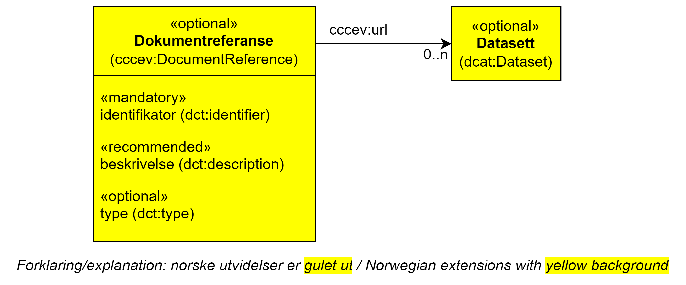

== Klassen Dokumentreferanse (cccev:DocumentReference) [[Dokumentreferanse]]

[[img-KlassenDokumentreferanse]]
.Klassen Dokumentreferanse (cccev:DocumentReference)
[link=images/KlassenDokumentreferanse.png]

[cols="30s,70d"]
|===
|English name|document reference
|Beskrivelse|Brukes til å representere en dokumentreferanse som bekreftelse/attest på at et dokumentasjonskrav er oppfylt, vanligvis fra en annen part enn den som oppgir at kravet er oppfylt.
|Usage note|To represent a reference to the document, attestation or data, usually provided by a party different from the one providing the response, that proves the response.
|URI|cccev:DocumentReference
|Kravsnivå|Valgfri/Optional
|Merknad|Norsk utvidelse: Ikke eksplisitt tatt med i CPSV-AP, men trengs for f.eks. å knytte et datasett (en «attest») som dokumentasjon.
|Eksempel|«Vandelsattest», som bekreftelse på at «Krav om vandel» er oppfylt.
|===

Eksempel i RDF Turtle:
-----
<vandelsattest> a cccev:DocumentReference ; .
-----

=== Obligatoriske egenskaper for klassen _Dokumentreferanse_ [[Dokumentreferanse-obligatoriske-egenskaper]]

==== Dokumentreferanse – identifikator (dct:identifier) [[Dokumentreferanse-identifikator]]

[cols="30s,70d"]
|===
|English name|identifier
|URI|dct:identifier
|Range|rdfs:Literal typed as URI
|Beskrivelse|Brukes til å oppgi en identifikator til dokumentreferansen.
|Usage note|A Document reference shall contain an identifier.
|Multiplisitet|1..1
|Kravsnivå|Obligatorisk/Mandatory
|Merknad 1 |Identifikator er som regel systemgenerert av verktøystøtte, slik at du som vanlig bruker ikke trenger å fylle ut verdien til denne egenskapen manuelt.

For deg som skal utvikle/tilpasse verktøystøtte, se https://data.norge.no/guide/veileder-beskrivelse-av-datasett/#om-identifikator[Om identifikator (dct:identifier) i Veileder for beskrivelse av datasett osv.]
|Merknad 2 | Norsk utvidelse: Ikke eksplisitt spesifisert i CPSV-AP.
|Remark | Norwegian extension: Not explicitly speficied in CPSP-AP.
|Eksempel|
|===

=== Anbefalte egenskaper for klassen _Dokumentreferanse_ [[Dokumentreferanse-anbefalte-egenskaper]]

==== Dokumentreferanse – beskrivelse (dct:description) [[Dokumentreferanse-beskrivelse]]

[cols="30s,70d"]
|===
|English name|description
|URI|dct:description
|Range|rdfs:Literal
|Beskrivelse|Brukes til å oppgi en tekstlig beskrivelse av dokumentreferansen. Gjentas når beskrivelsen finnes i flere ulike språk.
|Usage note|A Document reference may contain the description of the attestation or evidentiary document.
|Multiplisitet|0..n
|Kravsnivå|Anbefalt/Recommended
|Merknad | Norsk utvidelse: Ikke eksplisitt spesifisert i CPSV-AP.
|Remark | Norwegian extension: Not explicitly speficied in CPSP-AP.
|Eksempel|«En politiattest viser om du har brutt loven innenfor feltet du skal jobbe i eller studere. Arbeidsgiveren din, organisasjonen din eller studiestedet ditt kan kreve en slik attest for å sjekke om du egner deg for jobben eller studiet.»
|===

Eksempel i RDF Turtle:
-----
<politiattest> a cccev:DocumentReference ;
   dct:description "En politiattest viser om du har brutt loven innenfor feltet du skal jobbe i eller studere. Arbeidsgiveren din, organisasjonen din eller studiestedet ditt kan kreve en slik attest for å sjekke om du egner deg for jobben eller studiet."@nb ; .
-----

==== Dokumentreferanse – URL (cccev:url) [[Dokumentreferanse-URL]]

[cols="30s,70d"]
|===
|English name|url
|URI|cccev:url
|Range|rdfs:Literal typed as xsd:anyURI
|Beskrivelse|Brukes til å oppgi URLen hvor dokumentreferansen kan finnes.
|Usage note|The Uniform Resource Locator where the document or attestation can be found.
|Multiplisitet|0..1
|Kravsnivå|Anbefalt/Recommended
|Merknad | Norsk utvidelse: Ikke eksplisitt spesifisert i CPSV-AP.
|Remark | Norwegian extension: Not explicitly speficied in CPSP-AP.
|Eksempel|Referansen til datasettbeskrivelsen for Politiattest i Felles datakatalog.
|===

=== Valgfrie egenskaper for klassen _Dokumentreferanse_ [[Dokumentreferanse-valgfrie-egenskaper]]

==== Dokumentreferanse – type (dct:type) [[Dokumentreferanse-type]]

[cols="30s,70d"]
|===
|English name|type
|URI|dct:type
|Range|skos:Concept
|Beskrivelse|Brukes til å referere til et begrep som representerer type dokumentreferanse.
|Usage note|The Document reference may contain the type that categorizes the attestation or evidentiary document.
|Multiplisitet|0..1
|Kravsnivå|Anbefalt/Recommended
|Merknad 1 | Verdien skal velges fra en felles kontrollert liste over typer dokumentreferanse når den finnes på listen. Se forslag under til et slikt kontrollert vokabular.
|Merknad 2 | Norsk utvidelse: Ikke eksplisitt spesifisert i CPSV-AP.
|Remark | Norwegian extension: Not explicitly speficied in CPSP-AP.
|Eksempel|
|===

Forslag til et kontrollert vokabular for typer dokumentreferanse:

* Kjernegruppen har ikke klart å forstå hvordan man skal tolke det engelske «usage note». #Gi innspill# på hvordan man kan kategorisere attestasjoner, protokoller osv.
