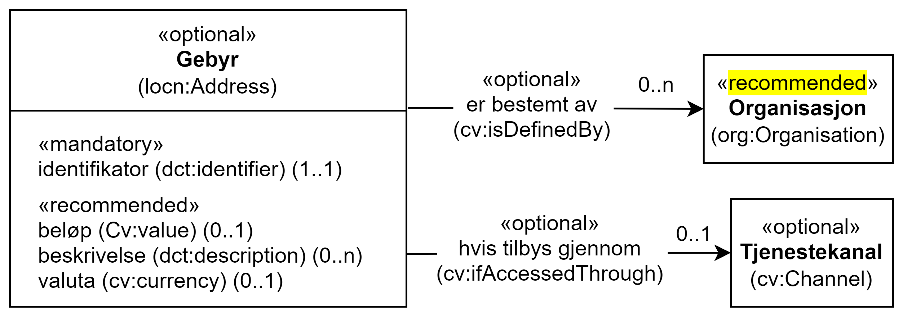

== Klassen Gebyr (cv:Cost) [[Gebyr]]

[[img-KlassenGebyr]]
.Klassen Gebyr (cv:Cost) og klassene den refererer til.
[link=images/KlassenGebyr.png]

[cols="30s,70d"]
|===
| _English name_ | _Cost_
| Anvendelse / _Usage note_ | Klassen brukes til å representere gebyr.

_The Cost class represents any costs related to the execution of a service that the Agent consuming it needs to pay._
| URI | cv:Cost
| Kravnivå / _Requirement level_ | Valgfri / _Optional_
| Eksempel | Se under <<OffentligTjeneste-har-gebyr>>.
|===

=== Obligatoriske egenskaper for klassen _Gebyr_ [[Gebyr-obligatoriske-egenskaper]]

==== Gebyr – identifikator (dct:identifier) [[Gebyr-identifikator]]

[cols="30s,70d"]
|===
| _English name_ | _identifier_
| URI | dct:identifier
| Verdiområde / _Range_ | rdfs:Literal
| Anvendelse / _Usage note_ | Egenskapen brukes til å oppgi en identifikator til gebyret.

_This property represents an Identifier for the Cost._
| Multiplisitet / _Multiplicity_ | 1..1
| Kravnivå / _Requirement level_ | Obligatorisk / _Mandatory_
| Merknad / _Note_ | Identifikator er som regel systemgenerert av verktøystøtte, slik at du som vanlig bruker ikke trenger å fylle ut verdien til egenskapen manuelt.

For deg som skal utvikle/tilpasse verktøystøtte, se https://data.norge.no/guide/veileder-beskrivelse-av-datasett/#om-identifikator[Om identifikator (dct:identifier) i Veileder for beskrivelse av datasett osv. &#x29C9;, window="_blank", role="ext-link"]

__Identifier is usually generated by the application, such that you as an end-user of the application usually do not need to manually fill out the value of this property.__ 

__If you are developing applications, see https://data.norge.no/guide/veileder-beskrivelse-av-datasett/#om-identifikator[Om identifikator (dct:identifier) i Veileder for beskrivelse av datasett osv. &#x29C9;, window="_blank", role="ext-link"] (in Norwegian only).__
|===

=== Anbefalte egenskaper for klassen _Gebyr_ [[Gebyr-anbefalte-egenskaper]]

==== Gebyr – beløp (cv:hasValue) [[Gebyr-beløp]]

[cols="30s,70d"]
|===
| _English name_ | _value_
| URI | cv:hasValue
| Verdiområde / _Range_ |  xsd:double
| Anvendelse / _Usage note_ | Egenskapen brukes til å oppgi gebyrbeløpet.

_This property represents a numeric value indicating the amount of the Cost._
| Multiplisitet / _Multiplicity_ | 0..1
| Kravnivå / _Requirement level_ | Anbefalt / _Recommended_
| Eksempel | Se under <<OffentligTjeneste-har-gebyr>>.
|===

Eksempel i RDF Turtle: Se under <<OffentligTjeneste-har-gebyr>>.

==== Gebyr – beskrivelse (dct:description) [[Gebyr-beskrivelse]]

[cols="30s,70d"]
|===
| _English name_ | _description_
| URI | dct:description
| Verdiområde / _Range_ | rdf:langString
| Anvendelse / _Usage note_ | Egenskapen brukes til å oppgi en tekstlig beskrivelse av gebyret. Egenskapen bør gjentas når beskrivelsen finnes på flere språk.

_This property represents a free text description of the Cost. This property should be repeated when the description is in parallel languages._
| Multiplisitet / _Multiplicity_ | 0..n
| Kravnivå / _Requirement level_ | Anbefalt / _Recommended_
| Eksempel | Se under <<OffentligTjeneste-har-gebyr>>.
|===

Eksempel i RDF Turtle: Se under <<OffentligTjeneste-har-gebyr>>.

==== Gebyr – valuta (cv:currency) [[Gebyr-valuta]]

[cols="30s,70d"]
|===
| _English name_ | _currency_
| URI | cv:currency
| Verdiområde / _Range_ |  skos:Concept
| Anvendelse / _Usage note_ | Egenskapen brukes til å oppgi valutatype av gebyret.

_This property represents the currency in which the Cost needs to be paid and the value of the Cost is expressed._
| Multiplisitet / _Multiplicity_ | 0..1
| Kravnivå / _Requirement level_ | Anbefalt / _Recommended_
| Merknad / _Note_ | Verdien skal velges fra EUs kontrollerte vokabular https://op.europa.eu/en/web/eu-vocabularies/concept-scheme/-/resource?uri=http://publications.europa.eu/resource/authority/currency[Valuta &#x29C9;, window="_blank", role="ext-link"].

__The value shall be chosen from EU's controlled vocabulary https://op.europa.eu/en/web/eu-vocabularies/concept-scheme/-/resource?uri=http://publications.europa.eu/resource/authority/currency[Currency &#x29C9;, window="_blank", role="ext-link"].__
| Eksempel | Se under <<OffentligTjeneste-har-gebyr>>.
|===

Eksempel i RDF Turtle: Se under <<OffentligTjeneste-har-gebyr>>.

=== Valgfrie egenskaper for klassen _Gebyr_ [[Gebyr-valgfrie-egenskaper]]

==== Gebyr – er bestemt av (cv:isDefinedBy) [[Gebyr-erBestemtAv]]

[cols="30s,70d"]
|===
| _English name_ | _is defined by_
| URI | cv:isDefinedBy
| Verdiområde / _Range_ |  org:Organization
| Anvendelse / _Usage note_ | Egenskapen brukes til å referere til en eller flere organisasjonen (inkl. offentlige organisasjoner) som bestemmer gebyr for en tjeneste.

_This property links the Cost class with one or more instances of the Agent class (foaf:Agent). This property refers to the organisation(s) defining the costs associated with the delivery of a particular Service._
| Multiplisitet / _Multiplicity_ | 0..n
| Kravnivå / _Requirement level_ | Valgfri / _Optional_
|===

==== Gebyr – hvis tilbys gjennom (cv:ifAccessedThrough) [[Gebyr-hvisTilbysGjennom]]

[cols="30s,70d"]
|===
| _English name_ | _if accessed through_
| URI | cv:ifAccessedThrough
| Verdiområde / _Range_ | cv:Channel
| Anvendelse / _Usage note_ | Egenskapen brukes til å referere til en tjenestekanal som det aktuelle gebyret er spesifikt for.

_Where the cost varies depending on the channel used, for example, if accessed through an online service cf. accessed at a physical location, the cost can be linked to the channel using the If Accessed Through property._
| Multiplisitet / _Multiplicity_ | 0..1
| Kravnivå / _Requirement level_ | Valgfri / _Optional_
|===
