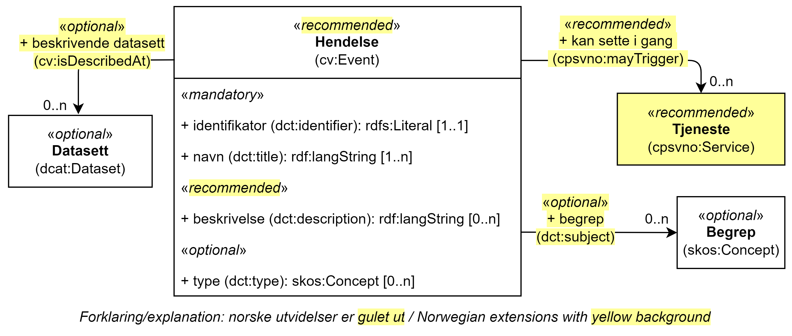

== Klassen Hendelse (cv:Event) [[Hendelse]]

[[img-KlassenHendelse]]
.Klassen Hendelse (cv:Event)
[link=images/KlassenHendelse.png]

[cols="30s,70d"]
|===
|English name|Event
|Anvendelse| Klassen brukes til å representere en https://data.norge.no/concepts/db48fa77-3f47-4d58-b4a3-41569f149c1a[hendelse].
|Usage note|This class represents an event that can be of any type that triggers, makes use of, or in some way is related to, a service. It is not expected to be used directly, rather, one or other of its subclasses should be used. The properties of the class are, of course, inherited by those subclasses.
|URI|cv:Event
|Subklasse av / Subclass of|dcat:Dataset
|Kravnivå|Anbefalt/Recommended
|Merknad 1|Bruk den semantisk sett mer presise <<Livshendelse>> eller <<Virksomhetshendelse>>, istedenfor denne generiske klassen.
|Remark 1 | Use the semantically more precise <<Livshendelse>> or <<Virksomhetshendelse>>, instead of this generic class.
|Merknad 2|Norsk utvidelse: I CPSV-AP er ikke Hendelse (`cv:Event`) en subklasse av Datasett (`dcat:Dataset`). For f.eks. å kunne publisere hendelsesstrøm som kan abonneres på, har vi valgt å betrakte beskrivelse av Hendelse som Datasett.
|Remark 2 | Norwegian extension: In CPSV-AP the class Event (`cv:Event`) is not a subclass of Dataset (`dcat:Dataset`).
|Merknad 3|Norsk utvidelse: Kravnivå endret fra valgfri til anbefalt.
|Remark 3 | Norwegian extension: Requirement level changed from optional to recommended.
|Eksempel|Se tilsvarende eksempler i <<Livshendelse>> eller <<Virksomhetshendelse>>.
|===

=== Obligatoriske egenskaper for klassen _Hendelse_ [[Hendelse-obligatoriske-egenskaper]]

==== Hendelse – identifikator (dct:identifier) [[Hendelse-identifikator]]

[cols="30s,70d"]
|===
|English name|identifier
|URI|dct:identifier
|Range|rdfs:Literal
|Anvendelse| Egenskapen brukes til å oppgi identifikatoren til en hendelse.
|Usage note|This property represents an Identifier for the Event.
|Multiplisitet|1..1
|Kravnivå|Obligatorisk/Mandatory
|Merknad|Identifikator er som regel systemgenerert av verktøystøtte, slik at du som vanlig bruker ikke trenger å fylle ut verdien til egenskapen manuelt.

For deg som skal utvikle/tilpasse verktøystøtte, se https://data.norge.no/guide/veileder-beskrivelse-av-datasett/#om-identifikator[Om identifikator (dct:identifier) i Veileder for beskrivelse av datasett osv.]
|Eksempel|
|===

==== Hendelse – navn (dct:title) [[Hendelse-navn]]

[cols="30s,70d"]
|===
|English name|name
|URI|dct:title
|Range| rdf:langString
|Anvendelse| Egenskapen brukes til å oppgi navn til en hendelse. Egenskapen bør gjentas når navnet finnes på flere språk.
|Usage note|This property represents the Name (or title) of the Event, repeated when the name is in parallel languages.
|Multiplisitet|1..n
|Kravnivå|Obligatorisk/Mandatory
|===

=== Anbefalte egenskaper for klassen _Hendelse_ [[Hendelse-anbefalte-egenskaper]]

==== Hendelse – beskrivelse (dct:description) [[Hendels-beskrivelse]]

[cols="30s,70d"]
|===
|English name|description
|URI|dct:description
|Range|rdf:langString
|Anvendelse| Egenskapen brukes til å oppgi en tekstlig beskrivelse av hendelsen. Gjentas når beskrivelsen finnes på flere språk.
|Usage note|This property represents a free text description of the Event. The description is likely to be the text that a business or citizen sees for that specific Event when looking for relevant services. Public administrations are therefore encouraged to include a reasonable level of detail in the description.
|Multiplisitet|0..n
|Kravnivå|Anbefalt/Recommended
|Merknad |Norsk utvidelse: Kravnivået endret fra valgfri  til anbefalt, fordi en hendelse bør beskrives med mindre den har et selvforklarende navn.
|Remark | Norwegian extension: Requirement level changed from optional to recommended.
|===

==== Hendelse – kan sette i gang (cpsvno:mayTrigger) [[Hendelse-kanSetteIGang]]

[cols="30s,70d"]
|===
|English name|may trigger
|URI|cpsvno:mayTrigger
|Subegenskap av / Subproperty of | dct:relation
|Range|cpsvno:Service
|Anvendelse| Egenskapen brukes til å referere til tjenester som kan settes i gang av den aktuelle hendelsen.
|Usage note|This property links an event directly to a service that the event may trigger.
|Multiplisitet|0..n
|Kravnivå|Anbefalt/Recommended
|Merknad| Norsk utvidelse: Ikke eksplisitt spesifisert i CPSV-AP. Begrunnelse: det er behov for en mer presis URI enn `dct:relation` som er i CPSV-AP.
|Remark | Norwegian extension: Not explicitly specified in CPSV-AP.
|===

=== Valgfrie egenskaper for klassen _Hendelse_ [[Hendelse-valgfrie-egenskaper]]

==== Hendelse – begrep (dct:subject) [[Hendelse-begrep]]

[cols="30s,70d"]
|===
|English name|subject
|URI|dct:subject
|Range|skos:Concept
|Anvendelse| Egenskapen brukes til å referere til begrep som er viktig for å forstå hendelsen.
|Usage note| This property refers to concept that is important for the understanding of the event.
|Multiplisitet|0..n
|Kravnivå|Valgfri/Optional
|Merknad| Norsk utvidelse: Ikke eksplisitt spesifisert i CPSV-AP. Begrunnelse: det er behov for å kunne referere til begreper som er viktig for å forstå hendelsen.
|Remark | Norwegian extension: Not explicitly specified in CPSV-AP.
|===

==== Hendelse – distribusjon (dcat:distribution) [[Hendelse-distribusjon]]

[cols="30s,70d"]
|===
|English name|distribution
|URI|dcat:distribution
|Range|dcat:Distribution
|Anvendelse| Egenskapen brukes til å referere til beskrivelsen av distribusjon av hendelsen.
|Usage note| This property refers to the description of Distribution of the Event.
|Multiplisitet|0..n
|Kravnivå|Valgfri/Optional
|Merknad|Norsk utvidelse: Ikke eksplisitt spesifisert i CPSV-AP. Begrunnelse: det er behov for å kunne publisere f.eks. hendelsesstrøm.
|Remark | Norwegian extension: Not explicitly specified in CPSV-AP.
|Eksempel| Se https://skatteetaten.github.io/folkeregisteret-api-dokumentasjon/hendelsesliste/[Skatteetatens Hendelsesliste].
|===

==== Hendelse – type (dct:type) [[Hendelse-type]]

[cols="30s,70d"]
|===
|English name|type
|URI|dct:type
|Range|skos:Concept
|Anvendelse| Egenskapen brukes til å oppgi type hendelse.
|Usage note|The type property links an Event to a controlled vocabulary of event types and it is the nature of those controlled vocabularies that is the major difference between a business event, such as creating the business in the first place and a life event, such as the birth of a child.
|Multiplisitet|0..n
|Kravnivå|Valgfri/Optional
|Merknad|Verdien skal velges fra det felles kontrollerte vokabularet https://data.norge.no/vocabulary/event-type[Hendelsestype], når verdien finnes i vokabularet.
|Remark | The value shall be chosen from the common controlled vocabulary https://data.norge.no/vocabulary/event-type[Event type], when the value is in the vocabulary.
|===
