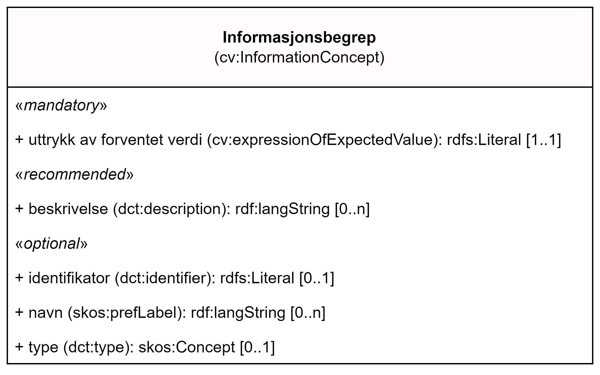

== Klassen Informasjonsbegrep (cv:InformationConcept) [[Informasjonsbegrep]]

[[img-KlassenInformasjonsbegrep]]
.Klassen Informasjonsbegrep (cv:InformationConcept).
[link=images/KlassenInformasjonsbegrep.png]

[cols="30s,70d"]
|===
| _English name_ |  _Information concept_
| Anvendelse / _Usage note_ |  Klassen brukes til å representere en del av informasjonen som dokumentasjonen gir eller som kravet trenger. Informasjonsbegrepklassen tilbyr muligheten til å beskrive kravene konseptuelt og oppgitte fakta i dokumentasjon. I kombinasjon med Understøttende opplysning-klassen er dette et (første) skritt mot å tilrettelegge for vurderingen av kravene på en automatisert måte basert på dokumentasjonen som er gitt.

_This class represents a piece of information that the Evidence provides or the Requirement needs. The Information Concept class offers the ability to describe conceptually the Requirements and provided facts in Evidences. In complementarity with the Supported Value class, this is a (first) step towards facilitating the assessment of the requirements in an automated way based on the Evidence provided._
| URI |  cv:InformationConcept
| Kravnivå / _Requirement level_ | Valgfri / _Optional_
|Merknad / _Note_ |   Norsk utvidelse: Ikke eksplisitt spesifisert i CPSV-AP, men i CCCEV som CPSV-AP også bruker.

_Norwegian extension: Not explicitly specified in CPSV-AP, but in CCCEV which CPSV-AP also uses._
|===

=== Obligatoriske egenskaper for klassen _Informasjonsbegrep_ [[Informasjonsbegrep-obligatoriske-egenskaper]]

==== Informasjonsbegrep – uttrykk av forventet verdi (cv:expressionOfExpectedValue) [[Informasjonsbegrep-uttrykkAvForventetVerdi]]

[cols="30s,70d"]
|===
| _English name_ | _expression of expected value_
| URI | cv:expressionOfExpectedValue
| Verdiområde / _Range_ | rdfs:Literal
| Anvendelse / _Usage note_ | Egenskapen brukes til å representere en formulering på et formelt språk av forventet verdi(er) for informasjonsbegrepet som samsvarer med begrepene fra kravene som er definert og må respekteres av de medfølgende understøttende opplysninger.

_This property represents a formulation in a formal language of the expected value(s) for the Information Concept which is aligned with the concepts from the Requirements defined and must be respected by the supplied Supported Values._
| Multiplisitet / _Multiplicity_ | 1..1
| Kravnivå / _Requirement level_ | Obligatorisk / _Mandatory_
|Merknad / _Note_ |   Norsk utvidelse: Ikke eksplisitt spesifisert i CPSV-AP, men i CCCEV som CPSV-AP også bruker.

_Norwegian extension: Not explicitly specified in CPSV-AP, but in CCCEV which CPSV-AP also uses._
|===

=== Anbefalte egenskaper for klassen _Informasjonsbegrep_ [[Informasjonsbegrep-anbefalte-egenskaper]]

==== Informasjonsbegrep – beskrivelse (dct:description) [[Informasjonsbegrep-beskrivelse]]

[cols="30s,70d"]
|===
| _English name_ | _description_
| URI | dct:description
| Verdiområde / _Range_ | rdf:langString
| Anvendelse / _Usage note_ | Egenskapen brukes til å oppgi en tekstlig beskrivelse av informasjonsbegrepet. F.eks. informasjon om begrepets art, egenskaper, bruk eller annen tilleggsinformasjon om begrepet. Egenskapen bør gjentas når beskrivelsen finnes på flere språk.

_This property represents a short explanation supporting the understanding of the Information Concept. The explanation can include information about the nature, attributes, uses or any other additional information about the Information Concept._
| Multiplisitet / _Multiplicity_ | 0..n
| Kravnivå / _Requirement level_ | Anbefalt / _Recommended_
|Merknad / _Note_ |   Norsk utvidelse: Ikke eksplisitt spesifisert i CPSV-AP, men i CCCEV som CPSV-AP også bruker.

_Norwegian extension: Not explicitly specified in CPSV-AP, but in CCCEV which CPSV-AP also uses._
|===

=== Valgfrie egenskaper for klassen _Informasjonsbegrep_ [[Informasjonsbegrep-valgfrie-egenskaper]]

==== Informasjonsbegrep – identifikator (dct:identifier) [[Informasjonsbegrep-identifikator]]

[cols="30s,70d"]
|===
| _English name_ | _identifier_
| URI | dct:identifier
| Verdiområde / _Range_ | rdfs:Literal
| Anvendelse / _Usage note_ | Egenskapen brukes til å oppgi identifikatoren til informasjonsbegrepet.

_This property represents an unambiguous reference to the Information Concept._
| Multiplisitet / _Multiplicity_ | 0..1
| Kravnivå / _Requirement level_ | Valgfri / _Optional_
|Merknad / _Note_ |   Norsk utvidelse: Ikke eksplisitt spesifisert i CPSV-AP, men i CCCEV som CPSV-AP også bruker.

_Norwegian extension: Not explicitly specified in CPSV-AP, but in CCCEV which CPSV-AP also uses._
|===

==== Informasjonsbegrep – navn (skos:prefLabel) [[Informasjonsbegrep-navn]]

[cols="30s,70d"]
|===
| _English name_ | _name_
| URI | skos:prefLabel
| Verdiområde / _Range_ | rdf:langString
| Anvendelse / _Usage note_ | Egenskapen brukes til å oppgi navnet til informasjonsbegrepet. Egenskapen bør gjentas når navnet finnes på flere språk.

_This property represents the Name of the Information Concept. The property should be repeated when the name is in several languages._
| Multiplisitet / _Multiplicity_ | 0..n
| Kravnivå / _Requirement level_ | Valgfri / _Optional_
|Merknad / _Note_ |   Norsk utvidelse: Ikke eksplisitt spesifisert i CPSV-AP, men i CCCEV som CPSV-AP også bruker.

_Norwegian extension: Not explicitly specified in CPSV-AP, but in CCCEV which CPSV-AP also uses._
|===

==== Informasjonsbegrep – type (dct:type) [[Informasjonsbegrep-type]]

[cols="30s,70d"]
|===
| _English name_ | _type_
| URI | dct:type
| Verdiområde / _Range_ | skos:Concept
| Anvendelse / _Usage note_ | Egenskapen brukes til å spesifisere hvilken kategori informasjonsbegrepet tilhører.

_This property represents the category to which the Information Concept belongs._
| Multiplisitet / _Multiplicity_ | 0..1
| Kravnivå / _Requirement level_ | Valgfri / _Optional_
|Merknad / _Note_ |   Norsk utvidelse: Ikke eksplisitt spesifisert i CPSV-AP, men i CCCEV som CPSV-AP også bruker.

_Norwegian extension: Not explicitly specified in CPSV-AP, but in CCCEV which CPSV-AP also uses._
|===
