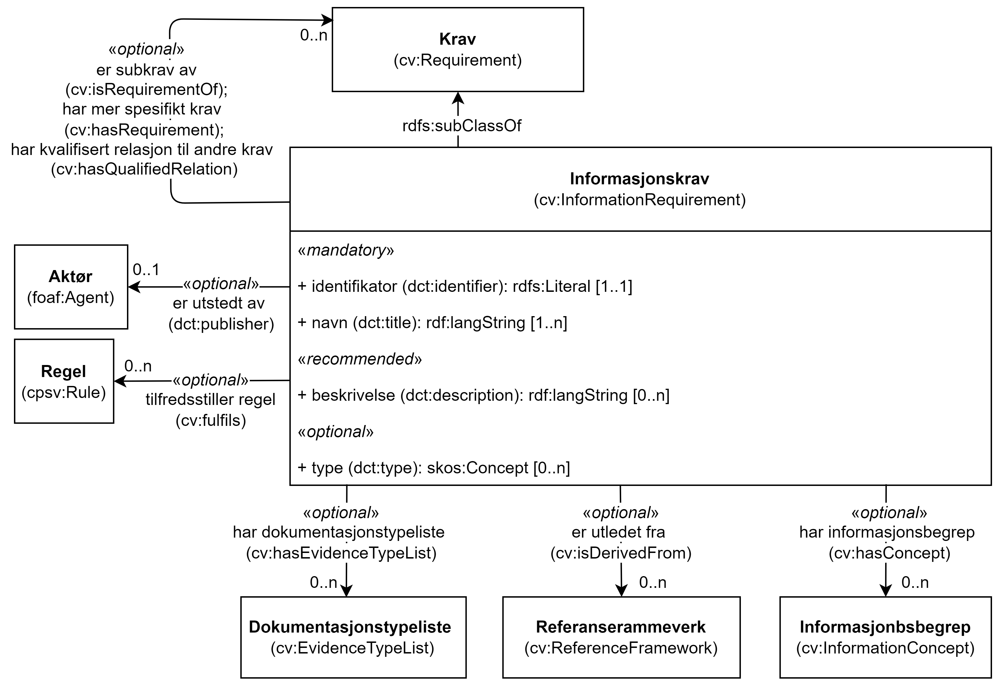

== Klassen Informasjonskrav (cv:InformationRequirement) [[Informasjonskrav]]

[[img-KlassenInformasjonskrav]]
.Klassen Informasjonskrav (cv:InformationRequirement)
[link=images/KlassenInformasjonskrav.png]

[cols="30s,70d"]
|===
|English name|  Information Requirement
|Anvendelse| Klassen brukes til å representere forespørsler om data som skal dokumentere en eller flere fakta (fra den virkelige verden) på en formell måte, eller som fører til kilden til slik dokumentasjon.
|Usage note|This class represents requested data that is to be proven by Evidence.

Information Requirements are the most neutral kind of Requirements. They aim to request information in any form, e.g. a person's date of birth or a company's turnover. They represent requests for data that prove one or more facts of the real world in a formal manner, or that leads to the source of such a proof. They can be understood as 'requests for Evidences'. The response to an Information Requirement is an Evidence when the issuer of the response is an authoritative source (e.g. a Civil Registry providing data about a natural person for the provision of public service through the Single Digital Gateway). In other cases, the responses might not be issued by an authoritative source, but the issuer supports the responses with Evidences (or commits to support them timely, e.g. a self-declaration or a declaration of oath). The Information Requirement can require structured data or documents of any form. For structured data, the Requirement can use 'Concepts' to specify the structure and type of the data expected in the response. For both structured and unstructured data, the Information Requirement can indicate the expected Type of Evidence, its format, source, and other properties related to the Evidence.
|URI| cv:InformationRequirement
|Subklasse av / Subclass of| cv:Requirement
|Kravnivå| Valgfri/Optional
|Merknad | Norsk utvidelse: Ikke eksplisitt spesifisert i CPSV-AP, men i CCCEV som CPSV-AP også bruker.
|Remark | Norwegian extension: Not explicitly specified in CPSV-AP, but in CCCEV which CPSV-AP also uses.
|===

=== Obligatoriske egenskaper for klassen _Informasjonskrav_ [[Informasjonskrav-obligatoriske-egenskaper]]

==== Informasjonskrav – identifikator (dct:identifier) [[Informasjonskrav-identifikator]]

[cols="30s,70d"]
|===
|English name|identifier
|URI|dct:identifier
|Range|rdfs:Literal
|Anvendelse| Egenskapen brukes til å oppgi identifikatoren til informasjonskravet.
|Usage note|This property represents an identifier for the Information Requirement.
|Multiplisitet|1..1
|Kravnivå|Obligatorisk/Mandatory
|Merknad|Identifikator er som regel systemgenerert av verktøystøtte, slik at du som vanlig bruker ikke trenger å fylle ut verdien til egenskapen manuelt.

For deg som skal utvikle/tilpasse verktøystøtte, se https://data.norge.no/guide/veileder-beskrivelse-av-datasett/#om-identifikator[Om identifikator (dct:identifier) i Veileder for beskrivelse av datasett osv.]
|===

==== Informasjonskrav – navn (dct:title) [[Informasjonskrav-navn]]

[cols="30s,70d"]
|===
|English name|name
|URI|dct:title
|Range|rdf:langString
|Anvendelse| Egenskapen brukes til å oppgi navn til informasjonskravet. Egenskapen bør gjentas når navnet er på flere språk.
|Usage note|This property represents the official Name of the Information Requirement, repeated when the name is in several languages.
|Multiplisitet|1..n
|Kravnivå|Obligatorisk/Mandatory
|===

=== Anbefalte egenskaper for klassen _Informasjonskrav_ [[Informasjonskrav-anbefalte-egenskaper]]

==== Informasjonskrav – beskrivelse (dct:description) [[Informasjonskrav-beskrivelse]]

[cols="30s,70d"]
|===
|English name| description
|URI|dct:description
|Range|rdf:langString
|Anvendelse| Egenskapen brukes til å oppgi beskrivelse av informasjonskravet. Egenskapen bør gjentas når beskrivelsen er på flere språk.
|Usage note|This property represents a description of the Information Requirement, repeated when the description is in several languages.
|Multiplisitet|0..n
|Kravnivå|Anbefalt/Recommended
|Merknad | Norsk utvidelse: Ikke eksplisitt spesifisert i CPSV-AP, men i CCCEV som CPSV-AP også bruker.
|Remark | Norwegian extension: Not explicitly specified in CPSV-AP, but in CCCEV which CPSV-AP also uses.
|===

=== Valgfrie egenskaper for klassen _Informasjonskrav_ [[Informasjonskrav-valgfrie-egenskaper]]

==== Informasjonskrav – er subkrav av (cv:isRequirementOf) [[Informasjonskrav-er-krav-til]]

[cols="30s,70d"]
|===
|English name|  is requirement of
|URI| cv:isRequirementOf
|Range| cv:Requirement
|Anvendelse| Egenskapen brukes til å representere en referanse mellom et subkrav og dets forelderkrav.

Et subkrav/forelderkrav er en instans av klassen Krav (`cv:Requirement`) eller en av dens subklasser.
|Usage note|This property represents a reference between a sub-Requirement and its parent Requirement.
|Multiplisitet|0..n
|Kravnivå| Valgfri/Optional
|Merknad | Norsk utvidelse: Ikke eksplisitt spesifisert i CPSV-AP, men i CCCEV som CPSV-AP også bruker.
|Remark | Norwegian extension: Not explicitly specified in CPSV-AP, but in CCCEV which CPSV-AP also uses.
|===

==== Informasjonskrav – er utledet fra (cv:isDerivedFrom) [[Informasjonskrav-er-utledet-fra]]

[cols="30s,70d"]
|===
|English name| is derived from
|URI| cv:isDerivedFrom
|Range| cv:ReferenceFramework
|Anvendelse| Egenskapen brukes til å referere til referanserammeverk som informasjonskravet er basert på, f.eks. lov, forskrift eller annen regulering.
|Usage note|This property refers to the Reference Framework on which the Information Requirement is based, such as a law or regulation.

Note that an Information Requirement can have several Reference Frameworks from which it is derived.
|Multiplisitet|0..n
|Kravnivå|Valgfri/Optional
|Merknad | Norsk utvidelse: Ikke eksplisitt spesifisert i CPSV-AP, men i CCCEV som CPSV-AP også bruker.
|Remark | Norwegian extension: Not explicitly specified in CPSV-AP, but in CCCEV which CPSV-AP also uses.
|===

==== Informasjonskrav – er utstedt av (dct:publisher) [[Informasjonskrav-er-utstedt-av]]

[cols="30s,70d"]
|===
|English name| is issued by
|URI| dct:publisher
|Range| foaf:Agent
|Anvendelse| Egenskapen brukes til å referere til aktøren som har utstedt informasjonskravet.
|Usage note|This property refers to the Agent that has published the Information Requirement.
|Multiplisitet|0..1
|Kravnivå|Valgfri/Optional
|Merknad | Norsk utvidelse: Ikke eksplisitt spesifisert i CPSV-AP, men i CCCEV som CPSV-AP også bruker.
|Remark | Norwegian extension: Not explicitly specified in CPSV-AP, but in CCCEV which CPSV-AP also uses.
|===

==== Informasjonskrav – har dokumentasjonstypeliste (cv:hasEvidenceTypeList) [[Informasjonskrav-har-dokumentasjonstypeliste]]

[cols="30s,70d"]
|===
|English name| has evidence type list
|URI| cv:hasEvidenceTypeList
|Range| cv:EvidenceTypeList
|Anvendelse| Egenskapen brukes til å referere til dokumentasjonstypeliste som spesifiserer dokumentasjonstypene som trengs for å tilfredsstille informasjonskravet.

Et informasjonskrav kan ha en eller flere dokumentasjonstypelister. For at informasjonskravet skal være oppfylt, skal dokumentasjonen være i samsvar med minst én av listene når det er flere lister.
|Usage note|This property refers to the Evidence Type List that specifies the Evidence Types that are needed to meet the Information Requirement.

One or several Lists of Evidence Types can support an Informatioin Requirement. At least one of them must be satisfied by the response to the Information Requirement.
|Multiplisitet|0..n
|Kravnivå|Valgfri/Optional
|Merknad | Norsk utvidelse: Ikke eksplisitt spesifisert i CPSV-AP, men i CCCEV som CPSV-AP også bruker.
|Remark | Norwegian extension: Not explicitly specified in CPSV-AP, but in CCCEV which CPSV-AP also uses.
|===

==== Informasjonskrav – har informasjonsbegrep (cv:hasConcept) [[Informasjonskrav-har-informasjonsbegrep]]

[cols="30s,70d"]
|===
|English name| has concept
|URI| cv:hasConcept
|Range| cv:InformationConcept
|Anvendelse| Egenskapen brukes til å referere til informasjonsbegrep som informasjonskravet forventer en verdi av.
|Usage note|This property refers to the Information Concept for which a value is expected by the Information Requirement.

Information Concepts defined for specific Information Requirements also represent the basis for specifying the Supported Value an Evidence should provide.
|Multiplisitet|0..n
|Kravnivå|Valgfri/Optional
|Merknad | Norsk utvidelse: Ikke eksplisitt spesifisert i CPSV-AP, men i CCCEV som CPSV-AP også bruker.
|Remark | Norwegian extension: Not explicitly specified in CPSV-AP, but in CCCEV which CPSV-AP also uses.
|===

==== Informasjonskrav – har kvalifisert relasjon til andre krav (cv:hasQualifiedRelation) [[Informasjonskrav-har-kvalifisert-relasjon-til-andre-krav]]

[cols="30s,70d"]
|===
|English name| has qualified relation
|URI| cv:hasQaulifiedRelation
|Range| cv:Requirement
|Anvendelse| Egenskapen brukes til å representere en beskrevet/kategorisert relasjon til instans av klassen Krav (`cv:Requirement`) eller en av dens subklasser.
|Usage note|This property represents a described and/or categorised relation to another Requirement.
|Multiplisitet|0..n
|Kravnivå|Valgfri/Optional
|Merknad | Norsk utvidelse: Ikke eksplisitt spesifisert i CPSV-AP, men i CCCEV som CPSV-AP også bruker.
|Remark | Norwegian extension: Not explicitly specified in CPSV-AP, but in CCCEV which CPSV-AP also uses.
|===

==== Informasjonskrav – har mer spesifikt krav (cv:hasRequirement) [[Informasjonskrav-har-mer-spesifikt-krav]]

[cols="30s,70d"]
|===
|English name| has requirement
|URI| cv:hasRequirement
|Range| cv:Requirement
|Anvendelse| Egenskapen brukes til å referere til instans av klassen Krav (`cv:Requirement`) eller en av dens subklasser, som er en del av informasjonskravet.
|Usage note|This property refers to a more specific Requirement that is part of the Information Requirement.
|Multiplisitet|0..n
|Kravnivå|Valgfri/Optional
|Merknad | Norsk utvidelse: Ikke eksplisitt spesifisert i CPSV-AP, men i CCCEV som CPSV-AP også bruker.
|Remark | Norwegian extension: Not explicitly specified in CPSV-AP, but in CCCEV which CPSV-AP also uses.
|===

==== Informasjonskrav – har understøttende dokumentasjon (cv:hasSupportingEvidence) [[Informasjonskrav-har-understøttende-dokumentasjon]]

[cols="30s,70d"]
|===
|English name| has supporting evidence
|URI| hasSupportingEvidence
|Range| cv:Evidence
|Anvendelse| Egenskapen brukes til å referere til dokumentasjon som gir informasjon, bevis eller støtte for informasjonskravet.
|Usage note|This property refers to the Evidence that supplies information, proof or support for the Information Requirement.
|Multiplisitet|0..n
|Kravnivå|Valgfri/Optional
|===

==== Informasjonskrav – tilfredsstiller regel (cv:fulfils) [[Informasjonskrav-tilfredsstiller]]

[cols="30s,70d"]
|===
|English name| fulfils
|URI| cv:fulfils
|Range| cpsv:Rule
|Anvendelse| Egenskapen brukes til å referere til regel som informasjonskravet tilfredsstiller.
|Usage note|This property refers to the rules that the Information Requirement fulfils.
|Multiplisitet|0..n
|Kravnivå|Valgfri/Optional
|===

==== Informasjonskrav – type (dct:type) [[Informasjonskrav-type]]

[cols="30s,70d"]
|===
|English name|type
|URI|dct:type
|Range|skos:Concept
|Anvendelse| Egenskapen brukes til å referere til kategorien informasjonskravet tilhører.
|Usage note|This property refers to the category to which the Information Requirement belongs.
|Multiplisitet|0..n
|Kravnivå|Valgfri/Optional
|Merknad |Verdien bør velges fra et kontrollert vokabular.
|Remark |The value should be chosen from a controlled vocabulary.
|===
