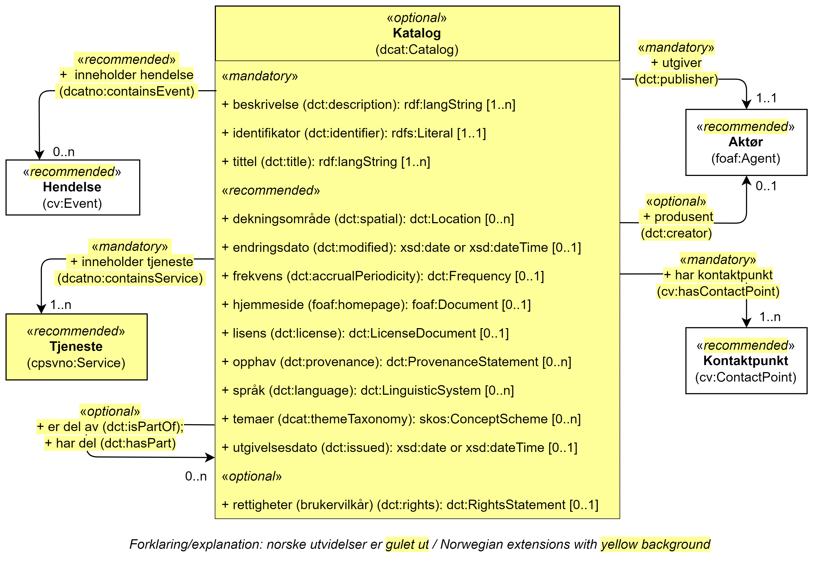

== Klassen Katalog (dcat:Catalog) [[Katalog]]

[[img-KlassenKatalog]]
.Klassen Katalog (dcat:Catalog)
[link=images/KlassenKatalog.png]

[cols="30s,70d"]
|===
|English name|Catalog
|Anvendelse| Klassen brukes til å representere en katalog, i konteksten av spesifikasjonen en katalog over tjenester og hendelser.
|Usage note|This class represents a catalog, in context of this specification a catalog of events and services.
|URI|dcat:Catalog
|Kravnivå|Valgfri/Optional
|Merknad|Norsk utvidelse: CPSV-AP dekker ikke katalogbeskrivelse. Klassen fra DCAT-AP-NO tas med her for å kunne dekke norsk behov for å beskrive «tjeneste-/hendelseskataloger».
|Remark | Norwegian extension: Not explicitly specified in CPSV-AP.
|Eksempel| https://data.norge.no/public-services-and-events[Tjeneste- og hendelsesdelen av Felles datakatalog] er en katalog over tjenester og hendelser.
|===

Eksempel i RDF Turtle:
----
<https://data.norge.no/public-services-and-events> a dcat:Catalog ; .
----

=== Obligatoriske egenskaper for klassen _Katalog_ [[Katalog-obligatoriske-egenskaper]]

==== Katalog – beskrivelse (dct:description) [[Katalog-beskrivelse]]

[cols="30s,70d"]
|===
|English name|description
|URI|dct:description
|Range|rdf:langString
|Anvendelse| Egenskapen brukes til å oppgi fritekst-beskrivelse av innholdet i katalogen. Gjentas når beskrivelsen finnes på flere språk.
|Usage note| This property represents a textual description of the content in the catalog.
|Multiplisitet|1..n
|Kravnivå|Obligatorisk/Mandatory
|Merknad| Norsk utvidelse: Ikke eksplisitt spesifisert i CPSV-AP.
|Remark | Norwegian extension: Not explicitly specified in CPSP-AP.
|Eksempel|«Den delen av Felles datakatalog (data.norge.no) som inneholder oversikt over tjenester og hendelser»
|===

Eksempel i RDF Turtle:
----
<https://data.norge.no/public-services-and-events> a dcat:Catalog ;
   dct:description "Den delen av Felles datakatalog (data.norge.no) som inneholder oversikt over tjenester og hendelser"@nb ; .
----

==== Katalog – identifikator (dct:identifier) [[Katalog-identifikator]]

[cols="30s,70d"]
|===
|English name|identifier
|URI|dct:identifier
|Range|rdfs:Literal
|Anvendelse| Egenskapen brukes til å oppgi identifikatoren til katalogen.
|Usage note| This property represents the identifier of the catalog.
|Multiplisitet|1..1
|Kravnivå|Obligatorisk/Mandatory
|Merknad 1|Identifikator er som regel systemgenerert av verktøystøtte, slik at du som vanlig bruker ikke trenger å fylle ut verdien til egenskapen manuelt.

For deg som skal utvikle/tilpasse verktøystøtte, se https://data.norge.no/guide/veileder-beskrivelse-av-datasett/#om-identifikator[Om identifikator (dct:identifier) i Veileder for beskrivelse av datasett osv.]
|Merknad 2| Norsk utvidelse: Ikke eksplisitt spesifisert i CPSV-AP.
|Remark | Norwegian extension: Not explicitly specified in CPSP-AP.
|===

==== Katalog – inneholder tjeneste (dcatno:containsService) [[Katalog-inneholderTjeneste]]

[cols="30s,70d"]
|===
|English name|service
|URI|dcatno:containsService
|Subegenskap av / Subproperty of |dct:hasPart
|Range|cpsvno:Service
|Anvendelse| Egenskapen brukes til å referere til en tjeneste som er i katalogen.
|Usage note| This property refers to a service that is in the catalog.
|Multiplisitet|1..n
|Kravnivå|Obligatorisk/Mandatory
|Merknad| Norsk utvidelse: Ikke eksplisitt spesifisert i CPSV-AP.
|Remark | Norwegian extension: Not explicitly specified in CPSP-AP.
|===

==== Katalog – tittel (dct:title) [[Katalog-tittel]]

[cols="30s,70d"]
|===
|English name|title
|URI|dct:title
|Range|rdf:langString
|Anvendelse| Egenskapen brukes til å oppgi navnet på katalogen. Egenskapen bør gjentas når navnet finnes på flere språk.
|Usage note| This property represents the title of the catalog.
|Multiplisitet|1..n
|Kravnivå|Obligatorisk/Mandatory
|Merknad| Norsk utvidelse: Ikke eksplisitt spesifisert i CPSV-AP.
|Remark | Norwegian extension: Not explicitly specified in CPSP-AP.
|Eksempel|Tjeneste- og hendelseskatalog
|===

Eksempel i RDF Turtle:
----
<https://data.norge.no/public-services-and-events> a dcat:Catalog ;
   dct:title "Tjeneste- og hendelseskatalog"@nb ; .
----

==== Katalog – utgiver (dct:publisher) [[Katalog-utgiver]]

[cols="30s,70d"]
|===
|English name|publisher
|URI|dct:publisher
|Range|foaf:Agent
|Anvendelse| Egenskapen brukes til å referere til en aktør (organisasjon) som er ansvarlig for å gjøre katalogen tilgjengelig. Bør være autoritativ URI for aktøren, sekundært organisasjonsnummer.
|Usage note| This property refers to the Agent responsible for making the catalog available.
|Multiplisitet|1..1
|Kravnivå|Obligatorisk/Mandatory
|Merknad| Norsk utvidelse: Ikke eksplisitt spesifisert i CPSV-AP.
|Remark | Norwegian extension: Not explicitly specified in CPSP-AP.
|Eksempel|Digdir er utgiver av «Tjeneste- og hendelseskatalog» i Felles datakatalog.
|===

Eksempel i RDF Turtle:
-----
<https://data.norge.no/public-services-and-events> a dcat:Catalog ;
   dct:publisher <https://organization-catalog.fellesdatakatalog.digdir.no/organizations/991825827> ; .
-----

=== Anbefalte egenskaper for klassen _Katalog_ [[Katalog-anbefalte-egenskaper]]

==== Katalog – dekningsområde (dct:spatial) [[Katalog-dekningsområde]]

[cols="30s,70d"]
|===
|English name|spatial coverage
|URI|dct:spatial
|Range|dct:Location
|Anvendelse| Egenskapen brukes til å oppgi geografisk område som er dekket av katalogen.
|Usage note| This property represents the spatial coverage of the catalog.
|Multiplisitet|0..n
|Kravnivå|Anbefalt/Recommended
|Merknad 1 a|Følgende krav til bruk av kontrollerte vokabularer gjelder:

* Minst en verdi skal velges fra en av følgende kontrollerte vokabularer: https://op.europa.eu/en/web/eu-vocabularies/concept-scheme/-/resource?uri=http://publications.europa.eu/resource/authority/continent[Kontinent]; https://op.europa.eu/en/web/eu-vocabularies/concept-scheme/-/resource?uri=http://publications.europa.eu/resource/authority/country[Land]; https://op.europa.eu/en/web/eu-vocabularies/concept-scheme/-/resource?uri=http://publications.europa.eu/resource/authority/place[Sted]; http://sws.geonames.org/[GeoNavn].

* For å angi dekningsområde i Norge, bør Kartverkets kontrollerte vokabular https://data.geonorge.no/administrativeEnheter/nasjon/doc/173163[Administrative enheter] brukes.
|Remark 1 a|Regarding usage of controlled vocabularies, the following requirements apply:

* At least one value shall be chosen from the following controlled vocabularies: https://op.europa.eu/en/web/eu-vocabularies/concept-scheme/-/resource?uri=http://publications.europa.eu/resource/authority/continent[Continent]; https://op.europa.eu/en/web/eu-vocabularies/concept-scheme/-/resource?uri=http://publications.europa.eu/resource/authority/country[Country]; https://op.europa.eu/en/web/eu-vocabularies/concept-scheme/-/resource?uri=http://publications.europa.eu/resource/authority/place[Place]; http://sws.geonames.org/[GeoNames].

* To specify spatial coverage in Norway, the Norwegian Mapping Authority's controlled vocabulary https://data.geonorge.no/administrativeEnheter/nasjon/doc/173163[Administrative units] should be used.
|Merknad 2| Norsk utvidelse: Ikke eksplisitt spesifisert i CPSV-AP.
|Remark 2 | Norwegian extension: Not explicitly specified in CPSP-AP.
|Eksempel| «Tjeneste- og hendelseskatalog» i Felles datakatalog har Norge som sitt dekningsområde.
|===

Eksempel i RDF Turtle:
-----
<https://data.norge.no/public-services-and-events> a dcat:Catalog ;
   dct:spatial <http://publications.europa.eu/resource/authority/country/NOR> ; .
-----

==== Katalog – endringsdato (dct:modified) [[Katalog-endringsdato]]

[cols="30s,70d"]
|===
|English name|modified (last update)
|URI|dct:modified
|Range| xsd:date or xsd:dateTime
|Anvendelse| Egenskapen brukes til å oppgi dato for siste oppdatering/endring av katalogen.
|Usage note| This property represents the date of the last update of the catalog.
|Multiplisitet|0..1
|Kravnivå|Anbefalt/Recommended
|Merknad| Norsk utvidelse: Ikke eksplisitt spesifisert i CPSV-AP.
|Remark | Norwegian extension: Not explicitly specified in CPSP-AP.
|===

==== Katalog – frekvens (dct:accrualPeriodicity) [[Katalog-frekvens]]

[cols="30s,70d"]
|===
|English name|accrual periodicity
|URI|dct:accrualPeriodicity
|Range|dct:Frequency
|Anvendelse| Egenskapen brukes til å oppgi oppdateringsfrekvensen for katalogen.
|Usage note| This property represents the accrual periodicity of the catalog.
|Multiplisitet|0..1
|Kravnivå|Anbefalt/Recommended
|Merknad 1 |Verdien skal velges fra EUs kontrollerte vokabular https://op.europa.eu/en/web/eu-vocabularies/concept-scheme/-/resource?uri=http://publications.europa.eu/resource/authority/frequency[Frekvens].
|Remark 1|The value shall be chosen from EU’s controlled vocabulary https://op.europa.eu/en/web/eu-vocabularies/concept-scheme/-/resource?uri=http://publications.europa.eu/resource/authority/frequency[Frequency].
|Merknad 2 | Norsk utvidelse: Ikke eksplisitt spesifisert i CPSV-AP.
|Remark 2 | Norwegian extension: Not explicitly specified in CPSP-AP.
|===

==== Katalog – hjemmeside (foaf:homepage) [[Katalog-hjemmeside]]

[cols="30s,70d"]
|===
|English name|homepage
|URI|foaf:homepage
|Range|foaf:Document
|Anvendelse| Egenskapen brukes til å referere til nettside som fungerer som hovedside for katalogen.
|Usage note| This property refers to the homepage of the catalog.
|Multiplisitet|0..1
|Kravnivå|Anbefalt/Recommended
|Merknad| Norsk utvidelse: Ikke eksplisitt spesifisert i CPSV-AP.
|Remark | Norwegian extension: Not explicitly specified in CPSP-AP.
|===

==== Katalog – inneholder hendelse (dcatno:containsEvent) [[Katalog-inneholderHendelse]]

[cols="30s,70d"]
|===
|English name|event
|URI|dcatno:containsEvent
|Subegenskap av / Subproperty of |dct:hasPart
|Range|cv:Event
|Anvendelse| Egenskapen brukes til å referere til en hendelse som er i katalogen.
|Usage note| This property refers to an event that is in the catalog.
|Multiplisitet|0..n
|Kravnivå|Anbefalt/Recommended
|Merknad | Norsk utvidelse: Ikke eksplisitt spesifisert i CPSV-AP.
|Remark | Norwegian extension: Not explicitly specified in CPSP-AP.
|===

==== Katalog – lisens (dct:license) [[Katalog-lisens]]

[cols="30s,70d"]
|===
|English name|licence
|URI|dct:license
|Range|dct:LicenseDocument
|Anvendelse| Egenskapen brukes til å vise til lisens for katalogen som beskriver hvordan den kan viderebrukes.
|Usage note| This property refers to the licence of the catalog.
|Multiplisitet|0..1
|Kravnivå|Anbefalt/Recommended
|Merknad 1 |Verdien skal velges fra EUs kontrollerte vokabular https://op.europa.eu/en/web/eu-vocabularies/concept-scheme/-/resource?uri=http://publications.europa.eu/resource/authority/licence[Lisens], når lisensen som brukes i vokabularet.
|Remkark 1| The value shall be chosen from EU's controlled vocabulary https://op.europa.eu/en/web/eu-vocabularies/concept-scheme/-/resource?uri=http://publications.europa.eu/resource/authority/licence[Licence], when the licence used is in the vocabulary.
|Merknad 2 | Norsk utvidelse: Ikke eksplisitt spesifisert i CPSV-AP.
|Remark 2 | Norwegian extension: Not explicitly specified in CPSP-AP.
|Eksempel| «Tjeneste- og hendelseskatalog» i Felles datakatalog er utgitt under lisens CC BY 4.0.
|===

Eksempel i RDF Turtle:
-----
<https://data.norge.no/public-services-and-events> a dcat:Catalog ;
   dct:license <http://publications.europa.eu/resource/authority/licence/CC_BY_4_0> ; .
-----

==== Katalog – opphav (dct:provenance) [[Katalog-opphav]]

[cols="30s,70d"]
|===
|English name|provenance (authenticity)
|URI|dct:provenance
|Range|dct:ProvenanceStatement
|Anvendelse| Egenskapen brukes til å referere til beskrivelse av autentisitet og integritet til innholdet i katalogen.
|Usage note| This property indicates a statement of the authenticity and the integrity of the the content in a catalog.
|Multiplisitet|0..n
|Kravnivå|Anbefalt/Recommended
|Merknad | Norsk utvidelse: Ikke eksplisitt spesifisert i CPSV-AP.
|Remark | Norwegian extension: Not explicitly specified in CPSP-AP.
|===

==== Katalog – språk (dct:language) [[Katalog-språk]]

[cols="30s,70d"]
|===
|English name|language
|URI|dct:language
|Range|dct:LinguisticSystem
|Anvendelse| Egenskapen brukes til å oppgi språk som brukes i tekstlige metadata som beskriver innholdet i katalogen. Gjentas hvis metadata er gitt på flere språk.
|Usage note|This property represents the languages used in a catalog.
|Multiplisitet|0..n
|Kravnivå|Anbefalt/Recommended
|Merknad 1 |Verdien skal velges fra EUs kontrollerte vokabular https://op.europa.eu/en/web/eu-vocabularies/concept-scheme/-/resource?uri=http://publications.europa.eu/resource/authority/language[Språk].
|Remark 1 | The value shall be chosen from EU's controlled vocabulary https://op.europa.eu/en/web/eu-vocabularies/concept-scheme/-/resource?uri=http://publications.europa.eu/resource/authority/language[Language].
|Merknad 2 | Norsk utvidelse: Ikke eksplisitt spesifisert i CPSV-AP.
|Remark 2 | Norwegian extension: Not explicitly specified in CPSP-AP.
|Eksempel| «Tjeneste- og hendelseskatalog» i Felles datakatalog er i bokmål, nynorsk og engelsk.
|===

Eksempel i RDF Turtle:
-----
<https://data.norge.no/public-services-and-events> a dcat:Catalog ;
   dct:language 
      <https://publications.europa.eu/resource/authority/language/NOB>, # bokmål  
      <https://publications.europa.eu/resource/authority/language/NNN>, # nynorsk
      <https://publications.europa.eu/resource/authority/language/ENG>; # engelsk 
  .
-----

==== Katalog – temaer (dcat:themeTaxonomy) [[Katalog-temaer]]

[cols="30s,70d"]
|===
|English name|theme taxonomy
|URI|dcat:themeTaxonomy
|Range|skos:ConceptScheme
|Anvendelse| Egenskapen brukes til å referere til et kunnskapsorganiseringssystem (KOS) som er brukt for å klassifisere de katalogiserte ressursene i katalogen.
|Usage note|This property refers to a knowledge organisation system (i.e., thesaurus, taxonomy) used to classify the resources in a catalog.
|Multiplisitet|0..n
|Kravnivå|Anbefalt/Recommended
|Merknad 1 |Minst en verdi skal velges fra EUs kontrollerte vokabular https://op.europa.eu/en/web/eu-vocabularies/concept-scheme/-/resource?uri=http://eurovoc.europa.eu/100141[EuroVoc]. https://psi.norge.no/los/[Los – felles vokabular for å kategorisere og beskrive offentlige tjenester og ressurser] kan brukes i tillegg.
|Remark 1 | At least one value shall be chosen from EU's controlled vocabulary https://op.europa.eu/en/web/eu-vocabularies/concept-scheme/-/resource?uri=http://eurovoc.europa.eu/100141[EuroVoc]. https://psi.norge.no/los/[Los] may be used in addition.
|Merknad 2 | Norsk utvidelse: Ikke eksplisitt spesifisert i CPSV-AP.
|Remark 2 | Norwegian extension: Not explicitly specified in CPSP-AP.
|===

==== Katalog – utgivelsesdato (dct:issued) [[Katalog-utgivelsesdato]]

[cols="30s,70d"]
|===
|English name|issued (release date)
|URI|dct:issued
|Range|xsd:date or xsd:dateTime
|Anvendelse| Egenskapen brukes til å oppgi dato for formell utgivelse (publisering) av katalogen.
|Usage note|This property represents the date of first publication of a Catalogue.
|Multiplisitet|0..1
|Kravnivå|Anbefalt/Recommended
|Merknad | Norsk utvidelse: Ikke eksplisitt spesifisert i CPSV-AP.
|Remark | Norwegian extension: Not explicitly specified in CPSP-AP.
|===

=== Valgfrie egenskaper for klassen _Katalog_ [[Katalog-valgfrie-egenskaper]]

==== Katalog – er del av (dct:isPartOf) [[Katalog-erDelAv]]

[cols="30s,70d"]
|===
|English name|is part of
|URI|dct:isPartOf
|Range|dcat:Catalog
|Anvendelse| Egenskapen brukes til å referere til en beslektet katalog som katalogen fysisk eller logisk er inkludert i.
|Usage note|This property refers to a related Catalogue in which the described Catalogue is physically or logically included.
|Multiplisitet|0..1
|Kravnivå|Valgfri/Optional
|Merknad | Norsk utvidelse: Ikke eksplisitt spesifisert i CPSV-AP.
|Remark | Norwegian extension: Not explicitly specified in CPSP-AP.
|===

==== Katalog – har del (dct:hasPart) [[Katalog-harDel]]

[cols="30s,70d"]
|===
|English name|has part
|URI|dct:hasPart
|Range|dcat:Catalog
|Anvendelse| Egenskapen brukes til å referere til en beslektet katalog som er en del av den beskrevne katalogen.
|Usage note|This property refers to a related Catalogue that is part of the described Catalogue.
|Multiplisitet|0..n
|Kravnivå|Valgfri/Optional
|Merknad | Norsk utvidelse: Ikke eksplisitt spesifisert i CPSV-AP.
|Remark | Norwegian extension: Not explicitly specified in CPSP-AP.
|===

==== Katalog – produsent (dct:creator) [[Katalog-produsent]]

[cols="30s,70d"]
|===
|English name|creator
|URI|dct:creator
|Range|foaf:Agent
|Anvendelse| Egenskapen brukes til å referere til aktøren som er hovedansvarlig for å produsere katalogen.
|Usage note| This property represents the entity responsible for producing the catalogue.
|Multiplisitet|0..1
|Kravnivå|Valgfri/Optional
|Merknad | Norsk utvidelse: Ikke eksplisitt spesifisert i CPSV-AP.
|Remark | Norwegian extension: Not explicitly specified in CPSP-AP.
|===

==== Katalog – rettigheter (brukervilkår) (dct:rights) [[Katalog-rettigheter]]

[cols="30s,70d"]
|===
|English name|rights (use terms)
|URI|dct:rights
|Range|dct:RightsStatement
|Anvendelse| Egenskapen brukes til å referere til uttalelse som spesifiserer brukervilkår knyttet til katalogen.
|Usage note| This property includes a statement that specifies usage rights of the Catalogue.
|Multiplisitet|0..1
|Kravnivå|Valgfri/Optional
|Merknad | Norsk utvidelse: Ikke eksplisitt spesifisert i CPSV-AP.
|Remark | Norwegian extension: Not explicitly specified in CPSP-AP.
|===
