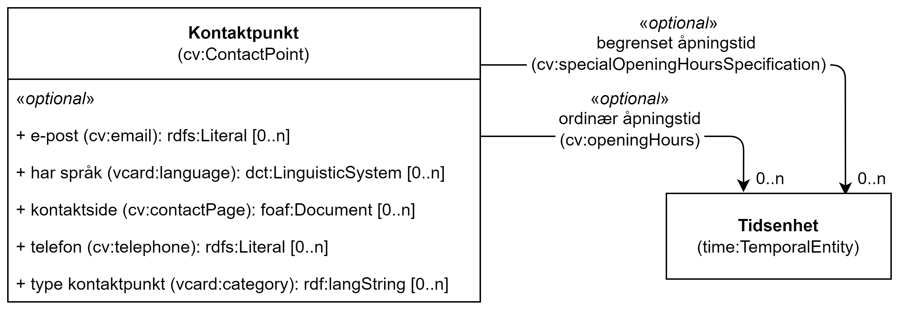

== Klassen Kontaktpunkt (cv:ContactPoint) [[Kontaktpunkt]]

[[img-KlassenKontaktpunkt]]
.Klassen Kontaktpunkt (cv:ContactPoint)
[link=images/KlassenKontaktpunkt.png]

[cols="30s,70d"]
|===
|English name|contact point
|Anvendelse| Klassen brukes til å representere kontakt informasjon for en tjeneste, en tjenestekanal, en offentlig organisasjon osv.
|Usage note|This class represents the contact information for a Service, Channel, Public Organization, etc.
|URI|cv:ContactPoint
|Kravnivå|Anbefalt/Recommended
|Merknad|Norsk utvidelse: URI endret fra `schema:ContactPoint` til `vcard:Kind`, for å samkjøre med DCAT-AP-NO.
|Eksempel|
|===

=== Valgfrie egenskaper for klassen _Kontaktpunkt_ [[Kontaktpunkt-valgfrie-egenskaper]]

==== Kontaktpunkt – begrenset åpningstid strukturert (cv:specialOpeningHoursSpecification) [[Kontaktpunkt-begrenset-åpningstid-strukturert]]

[cols="30s,70d"]
|===
|English name| availability rescrition
|URI| cv:specialOpeningHoursSpecification
|Range| cv:OpeningHoursSpecification
|Anvendelse| Egenskapen brukes til å oppgi begrenset åpningstid til kontaktpunktet, som strukturert data.
|Usage note| This property is used to specify the time interval during which the Contact Point is not available, as structured data.
|Multiplisitet|0..n
|Kravnivå|Valgfri/Optional
|Merknad|
|Eksempel|
|===

==== Kontaktpunkt – e-post (cv:email) [[Kontaktpunkt-e-post]]

[cols="30s,70d"]
|===
|English name| email
|URI| cv:email
|Range| rdfs:Literal
|Anvendelse| Egenskapen brukes til å oppgi e-postadresse til kontaktpunktet.
|Usage note| This property represents an electronic address through which the Contact Point can be contacted.
|Multiplisitet|0..n
|Kravnivå|Valgfri/Optional
|Merknad|
|Eksempel|
|===

==== Kontaktpunkt – har språk (vcard:hasLanguage) [[Kontaktpunkt-har-språk]]

[cols="30s,70d"]
|===
|English name| has language
|URI| vcard:hasLanguage
|Range| dct:LinguisticSystem
|Anvendelse| Egenskapen brukes til å oppgi språk som kontaktpunktet bruker.
|Usage note| This property specifies which language(s) the contact point uses.
|Multiplisitet|0..n
|Kravnivå|Valgfri/Optional
|Merknad| Norsk utvidelse: Ikke eksplisitt spesifisert i CPSV-AP.
|Eksempel|
|===

==== Kontaktpunkt – kontaktside (cv:contactPage) [[Kontaktpunkt-kontaktside]]

[cols="30s,70d"]
|===
|English name| contact page
|URI| cv:contactPage
|Range| foaf:Document
|Anvendelse| Egenskapen brukes til å oppgi kontaktside til kontaktpunktet.
|Usage note| This property refers to a contact page that could be used to reach out the contact point.
|Multiplisitet|0..n
|Kravnivå|Valgfri/Optional
|Merknad|
|Eksempel|
|===

==== Kontaktpunkt – ordinær åpningstid fritekst (cv:openingHours) [[Kontaktpunkt-ordinær-åpningstid-fritekst]]

[cols="30s,70d"]
|===
|English name| opening hours (text)
|URI| cv:openingHours
|Range| rdf:langString
|Anvendelse| Egenskapen brukes til å oppgi ordinær åpningstid for kontaktpunktet, i fritekst.
|Usage note| This property specifies the opening hours for the contact point, in text.
|Multiplisitet|0..n
|Kravnivå|Valgfri/Optional
|Merknad|
|Eksempel|
|===

==== Kontaktpunkt – ordinær åpningstid strukturert (schema:hoursAvailable) [[Kontaktpunkt-ordinær-åpningstid-strukturert]]

[cols="30s,70d"]
|===
|English name| hours available (structured)
|URI|schema:hoursAvailable
|Range|schema:OpeningHoursSpecification
|Anvendelse| Egenskapen brukes til å referere til en strukturert beskrivelse av åpningstid.
|Usage note| This property links a contact point to information about when the contact point is available, as structured data.
|Multiplisitet|0..n
|Kravnivå|Valgfri/Optional
|Merknad|Norsk utvidelse: Ikke eksplisitt spesifisert i CPSV-AP.
|Eksempel|Se eksempler under <<Åpningstid>>.
|===

Eksempel i RDF Turtle: Se under <<Åpningstid>>.

==== Kontaktpunkt – telefon (cv:telephone) [[Kontaktpunkt-telefon]]

[cols="30s,70d"]
|===
|English name| telehpone
|URI| cv:telephone
|Range| rdfs:Literal
|Anvendelse| Egenskapen brukes til å oppgi telefonnummer til kontaktpunktet.
|Usage note| This property represents a telephone number through which the Contact Point can be contacted.
|Multiplisitet|0..n
|Kravnivå|Valgfri/Optional
|Merknad|
|Eksempel|
|===
