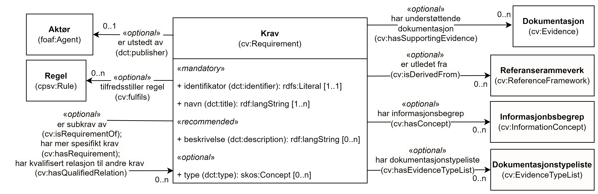

== Klassen Krav (cv:Requirement) [[Krav]]

[[img-KlassenKrav]]
.Klassen Krav (cv:Requirement) og klassene den refererer til.
[link=images/KlassenKrav.png]

[cols="30s,70d"]
|===
| _English name_ | _Requirement_
| Anvendelse / _Usage note_ | Klassen brukes til å representere nødvendige betingelser eller forutsetninger for bruk av en tjeneste.

_The class represents condition or prerequisite._

_Not all public services are needed or are used by everyone. For example, the visa service operated by European countries is not needed by European citizens but is needed by some citizens from elsewhere, or public services offering unemployment benefits and grants are targeting specific societal groups._
| URI | cv:Requirement
| Merknad / _Note_ | Denne klassen er en generisk klasse som frarådes å brukes direkte. Dens subklasse <<Begrensning>>, <<Kriterium>> eller <<Informasjonskrav>> BØR brukes istedenfor. 

__Requirement is a generic class representing any type of prerequisite that may be desired, needed or imposed as an obligation. CCCEV recommends to not use the Requirement class directly, but rather a more semantically-enriched subclass such as <<Kriterium, Criterion>>, <<Informasjonskrav, Information Requirement>> or <<Begrensning,Constraint>>. Also note that the Requirement class is specified at a more abstract level and is not to be used as the instantiation of a Requirement for a specific Agent. To illustrate the notion: the European Directive on services in the internal market defines requirement as any obligation, prohibition, condition or limit provided for in the laws, regulations or administrative provisions of the Member States or in consequence of case-law, administrative practice, the rules of professional bodies, or the collective rules of professional associations or other professional organisations, adopted in the exercise of their legal autonomy.__
|===

=== Obligatoriske egenskaper for klassen _Krav_ [[Krav-obligatoriske-egenskaper]]

==== Krav – identifikator (dct:identifier) [[Krav-identifikator]]

[cols="30s,70d"]
|===
| _English name_ | _identifier_
| URI | dct:identifier
| Verdiområde / _Range_ | rdfs:Literal
| Anvendelse / _Usage note_ | Egenskapen brukes til å oppgi identifikatoren til kravet.

_This property represents an identifier for the Requirement._
| Multiplisitet / _Multiplicity_ | 1..1
| Kravnivå / _Requirement level_ | Obligatorisk / _Mandatory_
|===

==== Krav – navn (dct:title) [[Krav-navn]]

[cols="30s,70d"]
|===
| _English name_ | _name_
| URI | dct:title
| Verdiområde / _Range_ | rdf:langString
| Anvendelse / _Usage note_ | Egenskapen brukes til å oppgi navn til kravet. Egenskapen BØR gjentas når navnet er på flere språk.

_This property represents the official Name of the Requirement. This property SHOULD be repeated when the name is in several languages._
| Multiplisitet / _Multiplicity_ | 1..n
| Kravnivå / _Requirement level_ | Obligatorisk / _Mandatory_
|===

=== Anbefalte egenskaper for klassen _Krav_ [[Krav-anbefalte-egenskaper]]

==== Krav – beskrivelse (dct:description) [[Krav-beskrivelse]]

[cols="30s,70d"]
|===
| _English name_ | _description_
| URI | dct:description
| Verdiområde / _Range_ | rdf:langString
| Anvendelse / _Usage note_ | Egenskapen brukes til å oppgi beskrivelse av kravet. Egenskapen BØR gjentas når beskrivelsen er på flere språk.

_This property represents a description of the Requirement. This property SHOULD be repeated when the description is in several languages._
| Multiplisitet / _Multiplicity_ | 0..n
| Kravnivå / _Requirement level_ | Anbefalt / _Recommended_
| Merknad / _Note_ |  Norsk utvidelse: Ikke eksplisitt spesifisert i CPSV-AP.

_Norwegian extension: Not explicitly specified in CPSV-AP._
|===

=== Valgfrie egenskaper for klassen _Krav_ [[Krav-valgfrie-egenskaper]]

==== Krav – er subkrav av (cv:isRequirementOf) [[Krav-er-krav-til]]

[cols="30s,70d"]
|===
| _English name_ |  _is requirement of_
| URI |  cv:isRequirementOf
| Verdiområde / _Range_ |  cv:Requirement
| Anvendelse / _Usage note_ | Egenskapen brukes til å representere en referanse mellom et subkrav og dets forelderkrav.

_This property represents a reference between a sub-Requirement and its parent Requirement._

_The relation between a parent Requirement and a sub-Requirement can be complex. Therefore, qualified relations (see hasQualifiedRelation) can be used to represent this relationship on its own and qualify it with additional information such as a date, a place. This is left to implementers. In the case where the purpose is to link the two Requirements without additional information, the simple relationship as proposed here can be directly used._
| Multiplisitet / _Multiplicity_ | 0..n
| Kravnivå / _Requirement level_ |  Valgfri / _Optional_
| Merknad / _Note_ |  Norsk utvidelse: Ikke eksplisitt spesifisert i CPSV-AP.

_Norwegian extension: Not explicitly specified in CPSV-AP._
|===

==== Krav – er utledet fra (cv:isDerivedFrom) [[Krav-er-utledet-fra]]

[cols="30s,70d"]
|===
| _English name_ | _is derived from_
| URI |  cv:isDerivedFrom
| Verdiområde / _Range_ |  cv:ReferenceFramework
| Anvendelse / _Usage note_ | Egenskapen brukes til å referere til referanserammeverk som kravet er basert på, f.eks. lov, forskrift eller annen regulering.

_This property refers to the Reference Framework on which the Requirement is based, such as a law or regulation._

_Note that a Requirement can have several Reference Frameworks from which it is derived._
| Multiplisitet / _Multiplicity_ | 0..n
| Kravnivå / _Requirement level_ | Valgfri / _Optional_
| Merknad / _Note_ |  Norsk utvidelse: Ikke eksplisitt spesifisert i CPSV-AP.

_Norwegian extension: Not explicitly specified in CPSV-AP._
|===

==== Krav – er utstedt av (dct:publisher) [[Krav-er-utstedt-av]]

[cols="30s,70d"]
|===
| _English name_ | _is issued by_
| URI |  dct:publisher
| Verdiområde / _Range_ |  foaf:Agent
| Anvendelse / _Usage note_ | Egenskapen brukes til å referere til aktøren som har utstedt kravet.

_This property refers to the Agent that has published the Requirement._
| Multiplisitet / _Multiplicity_ | 0..1
| Kravnivå / _Requirement level_ | Valgfri / _Optional_
| Merknad / _Note_ |  Norsk utvidelse: Ikke eksplisitt spesifisert i CPSV-AP.

_Norwegian extension: Not explicitly specified in CPSV-AP._
|===

==== Krav – har dokumentasjonstypeliste (cv:hasEvidenceTypeList) [[Krav-har-dokumentasjonstypeliste]]

[cols="30s,70d"]
|===
| _English name_ | _has evidence type list_
| URI |  cv:hasEvidenceTypeList
| Verdiområde / _Range_ |  cv:EvidenceTypeList
| Anvendelse / _Usage note_ | Egenskapen brukes til å referere til dokumentasjonstypeliste som spesifiserer dokumentasjonstypene som trengs for å tilfredsstille kravet.

Et krav KAN ha en eller flere dokumentasjonstypelister. For at kravet skal være oppfylt, SKAL dokumentasjonen være i samsvar med minst én av listene når det er flere lister.

_This property refers to the Evidence Type List that specifies the Evidence Types that are needed to meet the Requirement._

_One or several Lists of Evidence Types MAY support a Requirement. At least one of them MUST be satisfied by the response to the Requirement._
| Multiplisitet / _Multiplicity_ | 0..n
| Kravnivå / _Requirement level_ | Valgfri / _Optional_
| Merknad / _Note_ |  Norsk utvidelse: Ikke eksplisitt spesifisert i CPSV-AP.

_Norwegian extension: Not explicitly specified in CPSV-AP._
|===

==== Krav – har informasjonsbegrep (cv:hasConcept) [[Krav-har-informasjonsbegrep]]

[cols="30s,70d"]
|===
| _English name_ | _has concept_
| URI |  cv:hasConcept
| Verdiområde / _Range_ |  cv:InformationConcept
| Anvendelse / _Usage note_ | Egenskapen brukes til å referere til informasjonsbegrep som kravet forventer en verdi av.

_This property refers to the Information Concept for which a value is expected by the Requirement._

_Information Concepts defined for specific Requirements also represent the basis for specifying the Supported Value an Evidence should provide._
| Multiplisitet / _Multiplicity_ | 0..n
| Kravnivå / _Requirement level_ | Valgfri / _Optional_
| Merknad / _Note_ |  Norsk utvidelse: Ikke eksplisitt spesifisert i CPSV-AP.

_Norwegian extension: Not explicitly specified in CPSV-AP._
|===

==== Krav – har kvalifisert relasjon til andre krav (cv:hasQualifiedRelation) [[Krav-har-kvalifisert-relasjon-til-andre-krav]]

[cols="30s,70d"]
|===
| _English name_ | _has qualified relation_
| URI |  cv:hasQualifiedRelation
| Verdiområde / _Range_ |  cv:Requirement
| Anvendelse / _Usage note_ | Egenskapen brukes til å representere en beskrevet/kategorisert relasjon til instans av klassen Krav eller en av dens subklasser.

_This property represents a described and/or categorised relation to another Requirement._

_This property leaves the possibility to define a qualified relation from Requirement to Information Requirement or Constraint as well as a qualified relation from Requirement to Requirement. A use case would be to specialize an EU requirement in Member States' specific requirements._
| Multiplisitet / _Multiplicity_ | 0..n
| Kravnivå / _Requirement level_ | Valgfri / _Optional_
| Merknad / _Note_ |  Norsk utvidelse: Ikke eksplisitt spesifisert i CPSV-AP.

_Norwegian extension: Not explicitly specified in CPSV-AP._
|===

==== Krav – har mer spesifikt krav (cv:hasRequirement) [[Krav-har-mer-spesifikt-krav]]

[cols="30s,70d"]
|===
| _English name_ | _has requirement_
| URI |  cv:hasRequirement
| Verdiområde / _Range_ |  cv:Requirement
| Anvendelse / _Usage note_ | Egenskapen brukes til å referere til et mer spesifikt krav som er en del av kravet.

_This property refers to a more specific Requirement that is part of the Requirement._
| Multiplisitet / _Multiplicity_ | 0..n
| Kravnivå / _Requirement level_ | Valgfri / _Optional_
| Merknad / _Note_ |  Norsk utvidelse: Ikke eksplisitt spesifisert i CPSV-AP.

_Norwegian extension: Not explicitly specified in CPSV-AP._
|===

==== Krav – tilfredsstiller regel (cv:fulfils) [[Krav-tilfredsstiller]]

[cols="30s,70d"]
|===
| _English name_ | _fulfils_
| URI |  cv:fulfils
| Verdiområde / _Range_ |  cpsv:Rule
| Anvendelse / _Usage note_ | Egenskapen brukes til å referere til regel som kravet tilfredsstiller.

_This property refers to the rules that the requirement fulfils._
| Multiplisitet / _Multiplicity_ | 0..n
| Kravnivå / _Requirement level_ | Valgfri / _Optional_
|===

==== Krav – type (dct:type) [[Krav-type]]

[cols="30s,70d"]
|===
| _English name_ | _type_
| URI | dct:type
| Verdiområde / _Range_ | skos:Concept
| Anvendelse / _Usage note_ | Egenskapen brukes til å referere til kategorien kravet tilhører.

_This property refers to the category to which the Requirement belongs._
| Multiplisitet / _Multiplicity_ | 0..n
| Kravnivå / _Requirement level_ | Valgfri / _Optional_
| Merknad / _Note_ | Verdien BØR velges fra det kontrollerte vokabularet https://data.norge.no/vocabulary/requirement-type[Kravtype &#x29C9;, window="_blank", role="ext-link"] når verdien finnes i det vokabularet.

__The value SHOULD be chosen from the controlled vocabulary https://data.norge.no/vocabulary/requirement-type[Requirement type &#x29C9;, window="_blank", role="ext-link"] when the value is in that vocabulary.__
|===
