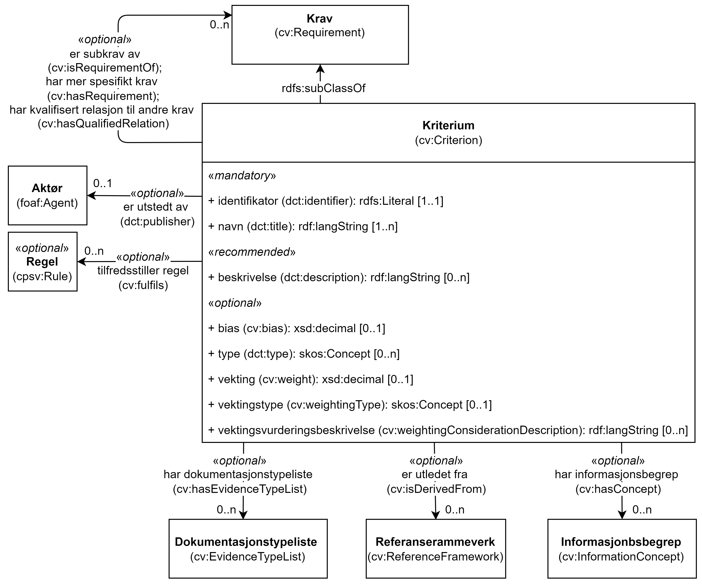

== Klassen Kriterium (cv:Criterion) [[Kriterium]]

[[img-KlassenKriterium]]
.Klassen Kriterium (cv:Criterion) og klassene den refererer til.
[link=images/KlassenKriterium.png]

[cols="30s,70d"]
|===
| _English name_ | _Criterion_
| Anvendelse / _Usage note_ |  Klassen brukes til å representere en betingelse for evaluering eller vurdering.

_This class represents a Condition for evaluation or assessment._

_In general, Criteria are used for comparison, filtering or selection purposes. Criteria usually set minimum conditions (e.g. limits, intervals, thresholds, etc.) that need to be met in order to pass the requirements or to fulfil them to a certain degree or quality. The concept of Criteria is broader than the concept of Constraint since it covers more usages. The evaluation of the fulfilment is usually supported by the provision of Evidence. For example in the eProcurement domain, the eProcurement Ontology defines different subclasses of Criterion such as exclusion grounds, selection criteria or award criteria. A concrete example of a Criterion is 'participation in a criminal organisation' which could also be considered as an exclusion ground criterion in the procurement domain or for requiring a public service._
| URI |  cv:Criterion
| Subklasse av / _Subclass of_ | cv:Requirement
| Kravnivå / _Requirement level_ | Valgfri / _Optional_ 
| Merknad / _Note_ |  Norsk utvidelse: Ikke eksplisitt spesifisert i CPSV-AP, men i CCCEV som CPSV-AP også bruker.

_Norwegian extension: Not explicitly specified in CPSV-AP, but in CCCEV which CPSV-AP also uses._
|===

=== Obligatoriske egenskaper for klassen _Kriterium_ [[Kriterium-obligatoriske-egenskaper]]

==== Kriterium – identifikator (dct:identifier) [[Kriterium-identifikator]]

[cols="30s,70d"]
|===
| _English name_ | _identifier_
| URI | dct:identifier
| Verdiområde / _Range_ | rdfs:Literal
| Anvendelse / _Usage note_ |  Egenskapen brukes til å oppgi identifikatoren til kriteriet.

_This property represents an identifier for the Criterion._
| Multiplisitet / _Multiplicity_ | 1..1
| Kravnivå / _Requirement level_ | Obligatorisk / _Mandatory_
| Merknad 1 / _Note 1_ | Identifikator er som regel systemgenerert av verktøystøtte, slik at du som vanlig bruker ikke trenger å fylle ut verdien til egenskapen manuelt.

For deg som skal utvikle/tilpasse verktøystøtte, se https://data.norge.no/guide/veileder-beskrivelse-av-datasett/#om-identifikator[Om identifikator (dct:identifier) i Veileder for beskrivelse av datasett osv. &#x29C9;, window="_blank", role="ext-link"]

__Identifier is usually generated by the application, such that you as an end-user of the application usually do not need to manually fill out the value of this property.__ 

__If you are developing applications, see https://data.norge.no/guide/veileder-beskrivelse-av-datasett/#om-identifikator[Om identifikator (dct:identifier) i Veileder for beskrivelse av datasett osv. &#x29C9;, window="_blank", role="ext-link"] (in Norwegian only).__
| Merknad 2 / _Note 2_ |  Norsk utvidelse: Ikke eksplisitt spesifisert i CPSV-AP, men i CCCEV som CPSV-AP også bruker.

_Norwegian extension: Not explicitly specified in CPSV-AP, but in CCCEV which CPSV-AP also uses._
|===

==== Kriterium – navn (dct:title) [[Kriterium-navn]]

[cols="30s,70d"]
|===
| _English name_ | _name_
| URI | dct:title
| Verdiområde / _Range_ | rdf:langString
| Anvendelse / _Usage note_ |  Egenskapen brukes til å oppgi navn til kriteriet. Egenskapen bør gjentas når navnet er på flere språk.

_This property represents the official Name of the Criterion. This property should be repeated when the name is in several languages._
| Multiplisitet / _Multiplicity_ | 1..n
| Kravnivå / _Requirement level_ | Obligatorisk / _Mandatory_
| Merknad / _Note_ |  Norsk utvidelse: Ikke eksplisitt spesifisert i CPSV-AP, men i CCCEV som CPSV-AP også bruker.

_Norwegian extension: Not explicitly specified in CPSV-AP, but in CCCEV which CPSV-AP also uses._
|===

=== Anbefalte egenskaper for klassen _Kriterium_ [[Kriterium-anbefalte-egenskaper]]

==== Kriterium – beskrivelse (dct:description) [[Kriterium-beskrivelse]]

[cols="30s,70d"]
|===
| _English name_ |  _description_
| URI | dct:description
| Verdiområde / _Range_ | rdf:langString
| Anvendelse / _Usage note_ |  Egenskapen brukes til å oppgi beskrivelse av kriteriet. Egenskapen bør gjentas når beskrivelsen er på flere språk.

_This property represents a description of the Criterion. This property should be repeated when the description is in several languages._
| Multiplisitet / _Multiplicity_ | 0..n
| Kravnivå / _Requirement level_ | Anbefalt / _Recommended_
| Merknad / _Note_ |  Norsk utvidelse: Ikke eksplisitt spesifisert i CPSV-AP, men i CCCEV som CPSV-AP også bruker.

_Norwegian extension: Not explicitly specified in CPSV-AP, but in CCCEV which CPSV-AP also uses._
|===

=== Valgfrie egenskaper for klassen _Kriterium_ [[Kriterium-valgfrie-egenskaper]]

==== Kriterium – bias (cv:bias) [[Kriterium-bias]]

[cols="30s,70d"]
|===
| _English name_ | _bias_
| URI |  cv:bias
| Verdiområde / _Range_ |  xsd:decimal
| Anvendelse / _Usage note_ | Brukes til å oppgi parameteren som brukes til å justere evalueringen av kriteriet.

_This property represents the parameter used to adjust the evaluation of the Criterion._

_The bias parameter tries to correct a systematic error. For example in procurement, a home bias corresponds to the "presence of local preferences distorting international specialisation and resource allocation". When quantified, this systematic error can be removed._
| Multiplisitet / _Multiplicity_ |  0..1
| Kravnivå / _Requirement level_ | Valgfri / _Optional_ 
| Merknad / _Note_ |  Norsk utvidelse: Ikke eksplisitt spesifisert i CPSV-AP, men i CCCEV som CPSV-AP også bruker.

_Norwegian extension: Not explicitly specified in CPSV-AP, but in CCCEV which CPSV-AP also uses._
|===

==== Kriterium – er subkrav av (cv:isRequirementOf) [[Kriterium-er-krav-til]]

[cols="30s,70d"]
|===
| _English name_ | _is requirement of_
| URI |  cv:isRequirementOf
| Verdiområde / _Range_ |  cv:Requirement
| Anvendelse / _Usage note_ |  Egenskapen brukes til å representere en referanse mellom et subkrav og dets forelderkrav.

Et subkrav/forelderkrav er en instans av klassen Krav (`cv:Requirement`) eller en av dens subklasser.

_This property represents a reference between a Requirement and its parent Requirement._
| Multiplisitet / _Multiplicity_ | 0..n
| Kravnivå / _Requirement level_ | Valgfri / _Optional_ 
| Merknad / _Note_ |  Norsk utvidelse: Ikke eksplisitt spesifisert i CPSV-AP, men i CCCEV som CPSV-AP også bruker.

_Norwegian extension: Not explicitly specified in CPSV-AP, but in CCCEV which CPSV-AP also uses._
|===

==== Kriterium – er utledet fra (cv:isDerivedFrom) [[Kriterium-er-utledet-fra]]

[cols="30s,70d"]
|===
| _English name_ | _is derived from_
| URI |  cv:isDerivedFrom
| Verdiområde / _Range_ |  cv:ReferenceFramework
| Anvendelse / _Usage note_ |  Egenskapen brukes til å referere til referanserammeverk som kriteriet er basert på, f.eks. lov, forskrift eller annen regulering.

_This property refers to the Reference Framework on which the Criterion is based, such as a law or regulation._

_Note that a Criterion can have several Reference Frameworks from which it is derived._
| Multiplisitet / _Multiplicity_ | 0..n
| Kravnivå / _Requirement level_ | Valgfri / _Optional_
| Merknad / _Note_ |  Norsk utvidelse: Ikke eksplisitt spesifisert i CPSV-AP, men i CCCEV som CPSV-AP også bruker.

_Norwegian extension: Not explicitly specified in CPSV-AP, but in CCCEV which CPSV-AP also uses._
|===

==== Kriterium – er utstedt av (dct:publisher) [[Kriterium-er-utstedt-av]]

[cols="30s,70d"]
|===
| _English name_ | _is issued by_
| URI |  dct:publisher
| Verdiområde / _Range_ |  foaf:Agent
| Anvendelse / _Usage note_ |  Egenskapen brukes til å referere til aktøren som har utstedt kriteriet.

_This property refers to the Agent that has published the Criterion._
| Multiplisitet / _Multiplicity_ | 0..1
| Kravnivå / _Requirement level_ | Valgfri / _Optional_
| Merknad / _Note_ |  Norsk utvidelse: Ikke eksplisitt spesifisert i CPSV-AP, men i CCCEV som CPSV-AP også bruker.

_Norwegian extension: Not explicitly specified in CPSV-AP, but in CCCEV which CPSV-AP also uses._
|===

==== Kriterium – har dokumentasjonstypeliste (cv:hasEvidenceTypeList) [[Kriterium-har-dokumentasjonstypeliste]]

[cols="30s,70d"]
|===
| _English name_ | _has evidence type list_
| URI |  cv:hasEvidenceTypeList
| Verdiområde / _Range_ |  cv:EvidenceTypeList
| Anvendelse / _Usage note_ |  Egenskapen brukes til å referere til dokumentasjonstypeliste som spesifiserer dokumentasjonstypene som trengs for å tilfredsstille kriteriet.

Et kriterium kan ha en eller flere dokumentasjonstypelister. For at et kriterium skal være oppfylt, skal dokumentasjonen være i samsvar med minst én av listene når det er flere lister.

_This property refers to the Evidence Type List that specifies the Evidence Types that are needed to meet the Criterion._

_One or several Lists of Evidence Types can support a Criterion. At least one of them must be satisfied by the response to the Criterion._
| Multiplisitet / _Multiplicity_ | 0..n
| Kravnivå / _Requirement level_ | Valgfri / _Optional_
| Merknad / _Note_ |  Norsk utvidelse: Ikke eksplisitt spesifisert i CPSV-AP, men i CCCEV som CPSV-AP også bruker.

_Norwegian extension: Not explicitly specified in CPSV-AP, but in CCCEV which CPSV-AP also uses._
|===

==== Kriterium – har informasjonsbegrep (cv:hasConcept) [[Kriterium-har-informasjonsbegrep]]

[cols="30s,70d"]
|===
| _English name_ | _has concept_
| URI |  cv:hasConcept
| Verdiområde / _Range_ |  cv:InformationConcept
| Anvendelse / _Usage note_ |  Egenskapen brukes til å referere til informasjonsbegrep som kriteriet forventer en verdi av.

_This property refers to the Information Concept for which a value is expected by the Criterion._

_Information Concepts defined for specific Criterions also represent the basis for specifying the Supported Value an Evidence should provide._
| Multiplisitet / _Multiplicity_ | 0..n
| Kravnivå / _Requirement level_ | Valgfri / _Optional_
| Merknad / _Note_ |  Norsk utvidelse: Ikke eksplisitt spesifisert i CPSV-AP, men i CCCEV som CPSV-AP også bruker.

_Norwegian extension: Not explicitly specified in CPSV-AP, but in CCCEV which CPSV-AP also uses._
|===

==== Kriterium – har kvalifisert relasjon til andre krav (cv:hasQualifiedRelation) [[Kriterium-har-kvalifisert-relasjon-til-andre-krav]]

[cols="30s,70d"]
|===
| _English name_ | _has qualified relation_
| URI |  cv:hasQualifiedRelation
| Verdiområde / _Range_ |  cv:Requirement
| Anvendelse / _Usage note_ |  Egenskapen brukes til å representere en beskrevet/kategorisert relasjon til instans av klassen Krav (`cv:Requirement`) eller en av dens subklasser.

_This property represents a described and/or categorised relation to another Requirement._
| Multiplisitet / _Multiplicity_ | 0..n
| Kravnivå / _Requirement level_ | Valgfri / _Optional_
| Merknad / _Note_ |  Norsk utvidelse: Ikke eksplisitt spesifisert i CPSV-AP, men i CCCEV som CPSV-AP også bruker.

_Norwegian extension: Not explicitly specified in CPSV-AP, but in CCCEV which CPSV-AP also uses._
|===

==== Kriterium – har mer spesifikt krav (cv:hasRequirement) [[Kriterium-har-mer-spesifikt-krav]]

[cols="30s,70d"]
|===
| _English name_ | _has requirement_
| URI |  cv:hasRequirement
| Verdiområde / _Range_ |  cv:Requirement
| Anvendelse / _Usage note_ |  Egenskapen brukes til å referere til instans av klassen Krav (`cv:Requirement`) eller en av dens subklasser, som er en del av kriteriet.

_This property refers to a more specific Requirement that is part of the Criterion._
| Multiplisitet / _Multiplicity_ | 0..n
| Kravnivå / _Requirement level_ | Valgfri / _Optional_
| Merknad / _Note_ |  Norsk utvidelse: Ikke eksplisitt spesifisert i CPSV-AP, men i CCCEV som CPSV-AP også bruker.

_Norwegian extension: Not explicitly specified in CPSV-AP, but in CCCEV which CPSV-AP also uses._
|===

==== Kriterium – har understøttende dokumentasjon (cv:hasSupportingEvidence) [[Kriterium-har-understøttende-dokumentasjon]]

[cols="30s,70d"]
|===
| _English name_ | _has supporting evidence_
| URI |  cv:hasSupportingEvidence
| Verdiområde / _Range_ |  cv:Evidence
| Anvendelse / _Usage note_ |  Egenskapen brukes til å referere til dokumentasjon som gir informasjon, bevis eller støtte for kriteriet.

_This property refers to the Evidence that supplies information, proof or support for the Criterion._
| Multiplisitet / _Multiplicity_ | 0..n
| Kravnivå / _Requirement level_ | Valgfri / _Optional_
| Merknad / _Note_ |  Norsk utvidelse: Ikke eksplisitt spesifisert i CPSV-AP, men i CCCEV som CPSV-AP også bruker.

_Norwegian extension: Not explicitly specified in CPSV-AP, but in CCCEV which CPSV-AP also uses._
|===

==== Kriterium – tilfredsstiller regel (cv:fulfils) [[Kriterium-tilfredsstiller]]

[cols="30s,70d"]
|===
| _English name_ | _fulfils_
| URI |  cv:fulfils
| Verdiområde / _Range_ |  cpsv:Rule
| Anvendelse / _Usage note_ |  Egenskapen brukes til å referere til regel som kriteriet tilfredsstiller.

_This property refers to the rules that the Criterion fulfils._
| Multiplisitet / _Multiplicity_ | 0..n
| Kravnivå / _Requirement level_ | Valgfri / _Optional_
| Merknad / _Note_ |  Norsk utvidelse: Ikke eksplisitt spesifisert i CPSV-AP, men i CCCEV som CPSV-AP også bruker.

_Norwegian extension: Not explicitly specified in CPSV-AP, but in CCCEV which CPSV-AP also uses._
|===

==== Kriterium – type (dct:type) [[Kriterium-type]]

[cols="30s,70d"]
|===
| _English name_ | _type_
| URI | dct:type
| Verdiområde / _Range_ | skos:Concept
| Anvendelse / _Usage note_ |  Egenskapen brukes til å referere til kategorien kriteriet tilhører.

_This property refers to the category to which the Criterion belongs._
| Multiplisitet / _Multiplicity_ | 0..n
| Kravnivå / _Requirement level_ | Valgfri / _Optional_
| Merknad 1 / _Note 1_ | Verdien bør velges fra et kontrollert vokabular.

_The value should be chosen from a controlled vocabulary._
| Merknad 2 / _Note 2_ |  Norsk utvidelse: Ikke eksplisitt spesifisert i CPSV-AP, men i CCCEV som CPSV-AP også bruker.

_Norwegian extension: Not explicitly specified in CPSV-AP, but in CCCEV which CPSV-AP also uses._
|===

==== Kriterium – vekting (cv:weight) [[Kriterium-vekting]]

[cols="30s,70d"]
|===
| _English name_ | _weight_
| URI |  cv:weight
| Verdiområde / _Range_ |  xsd:decimal
| Anvendelse / _Usage note_ | Brukes til å oppgi relativ viktighet (vekting) av kriteriet.

_This property represents the relative importance of the Criterion._

_The weight must be between 0 and 1. Usually, all Criteria can be integrated within a weighted sum equal to 1._
| Multiplisitet / _Multiplicity_ |  0..1
| Kravnivå / _Requirement level_ | Valgfri / _Optional_ 
| Merknad / _Note_ |  Norsk utvidelse: Ikke eksplisitt spesifisert i CPSV-AP, men i CCCEV som CPSV-AP også bruker.

_Norwegian extension: Not explicitly specified in CPSV-AP, but in CCCEV which CPSV-AP also uses._
|===

==== Kriterium – vektingstype (cv:weightingType) [[Kriterium-vektingstype]]

[cols="30s,70d"]
|===
| _English name_ | _weighting type_
| URI |  cv:weightingType
| Verdiområde / _Range_ |  skos:Concept
| Anvendelse / _Usage note_ | Brukes til å oppgi hvordan vektingen bør tolkes i et komplekst evalueringsuttrykk, f.eks. som en prosent i et evalueringsuttrykk.

_This property represents an indication of how the weight should be interpreted in a complex evaluation expression, e.g. as a percentage in an evaluation expression._
| Multiplisitet / _Multiplicity_ |  0..1
| Kravnivå / _Requirement level_ | Valgfri / _Optional_ 
| Merknad 1 / _Note 1_ | EUs kontrollerte vokabular https://op.europa.eu/en/web/eu-vocabularies/concept-scheme/-/resource?uri=http://publications.europa.eu/resource/authority/number-weight[Number weight &#x29C9;, window="_blank", role="ext-link"] kan brukes som mulige verdier for denne egenskapen.

__EU's controlled vocabulary https://op.europa.eu/en/web/eu-vocabularies/concept-scheme/-/resource?uri=http://publications.europa.eu/resource/authority/number-weight[Number weight &#x29C9;, window="_blank", role="ext-link"] may be used as possible values for this property.__
| Merknad 2 / _Note 2_ |  Norsk utvidelse: Ikke eksplisitt spesifisert i CPSV-AP, men i CCCEV som CPSV-AP også bruker.

_Norwegian extension: Not explicitly specified in CPSV-AP, but in CCCEV which CPSV-AP also uses._
|===

==== Kriterium – vektingsvurderingsbeskrivelse (cv:weightingConsiderationDescription) [[Kriterium-vektingsvurderingsbeskrivelse]]

[cols="30s,70d"]
|===
| _English name_ | _weighting consideration description_
| URI |  cv:weightingConsiderationDescription
| Verdiområde / _Range_ |  rdf:langString
| Anvendelse / _Usage note_ |  Brukes til å oppgi en tekstlig forklaring på hvordan vektingen av et kriterium brukes. Egenskapen bør gjentas når forklaringen finnes på flere språk.

_This property contains the explanation of how the weighting of a Criterion is to be used. This property should be repeated when the explanation is in parallel languages._
| Multiplisitet / _Multiplicity_ |  0..n
| Kravnivå / _Requirement level_ | Valgfri / _Optional_ 
| Merknad / _Note_ |  Norsk utvidelse: Ikke eksplisitt spesifisert i CPSV-AP, men i CCCEV som CPSV-AP også bruker.

_Norwegian extension: Not explicitly specified in CPSV-AP, but in CCCEV which CPSV-AP also uses._
|===
