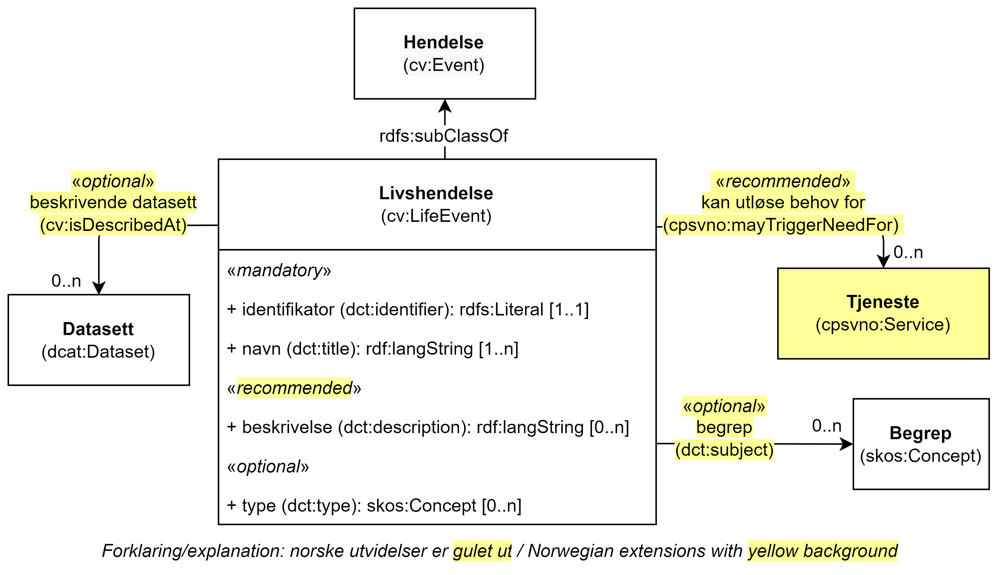

== Klassen Livshendelse (cv:LifeEvent) [[Livshendelse]]

[[img-KlassenLivshendelse]]
.Klassen Livshendelse (cv:LifeEvent) og klassene den refererer til.
[link=images/KlassenLivshendelse.png]

[cols="30s,70d"]
|===
| _English name_ | _Life Event_
| Anvendelse / _Usage note_ | Klassen brukes til å representere en https://data.norge.no/concepts/9b19d5ce-87b3-4584-a875-e7cff3ad6740[livshendelse &#x29C9;, window="_blank", role="ext-link"].

__The Life Event class represents an important event or situations in a citizen's life where services may be required.__
| URI | cv:LifeEvent
| Subklasse av / _Subclass of_ | <<Hendelse, cv:Event>>
| Merknad / _Note_ | I kontekst av denne spesifikasjonen, representerer klassen Livshendelse en hendelse/situasjon for hvilken en tjeneste kan være relevant. F.eks. en forlovelse er utenfor omfanget av denne spesifikasjonen, mens et giftemål er innenfor. 

_An individual will encounter any number of 'events' in the general sense of the word. In the context of the CPSV-AP, the Life Event class only represents an event for which a Service is related. For example, a couple becoming engaged is not a CPSV-AP Life Event, getting married is, since only the latter has any relevance to services._
| Eksempel | «Å få barn» er en livshendelse hos en innbygger.
|===

Eksempel i RDF Turtle:
-----
<åFåBarn> a cv:LifeEvent ; .
-----

=== Obligatoriske egenskaper for klassen _Livshendelse_ [[Livshendelse-obligatoriske-egenskaper]]

==== Livshendelse – identifikator (dct:identifier) [[Livshendelse-identifikator]]

[cols="30s,70d"]
|===
| _English name_ | _identifier_
| URI | dct:identifier
| Verdiområde / _Range_ | rdfs:Literal
| Anvendelse / _Usage note_ | Egenskapen brukes til å oppgi identifikatoren til en hendelse.

_This property represents an Identifier for the Event._
| Multiplisitet / _Multiplicity_ | 1..1
| Kravnivå / _Requirement level_ | Obligatorisk / _Mandatory_
|===

==== Livshendelse – navn (dct:title) [[Livshendelse-navn]]

[cols="30s,70d"]
|===
| _English name_ | _name_
| URI | dct:title
| Verdiområde / _Range_ | rdf:langString
| Anvendelse / _Usage note_ | Egenskapen brukes til å oppgi navn til en hendelse. Egenskapen BØR gjentas når navnet finnes på flere språk.

_This property represents the Name (or title) of the Event. This property SHOULD be repeated when the name is in parallel languages._
| Multiplisitet / _Multiplicity_ | 1..n
| Kravnivå / _Requirement level_ | Obligatorisk / _Mandatory_
| Eksempel | «Å få barn»
|===

Eksempel i RDF Turtle:
-----
<åFåBarn> a cv:LifeEvent ;
   dct:title "Å få barn"@nb .
-----

=== Anbefalte egenskaper for klassen _Livshendelse_ [[Livshendelse-anbefalte-egenskaper]]

==== Livshendelse – beskrivelse (dct:description) [[Livshendelse-beskrivelse]]

[cols="30s,70d"]
|===
| _English name_ | _description_
| URI | dct:description
| Verdiområde / _Range_ | rdf:langString
| Anvendelse / _Usage note_ | Egenskapen brukes til å oppgi en tekstlig beskrivelse av hendelsen. Egenskapen BØR gjentas når beskrivelsen finnes på flere språk.

_This property represents a free text description of the Event. This property SHOULD be repeated when the description is in parallel languages._

_The description is likely to be the text that a business or citizen sees for that specific Event when looking for relevant Services. Public administrations are therefore encouraged to include a reasonable level of detail in the description._
| Multiplisitet / _Multiplicity_ | 0..n
| Kravnivå / _Requirement level_ | Anbefalt / _Recommended_
| Merknad / _Note_ | Norsk utvidelse: Kravnivå endret fra valgfri til anbefalt.

_Norwegian extension: Requirement level changed from optional to recommended._ 
| Eksempel | «Å få barn omfatter både en rekke generelle behov som treffer de fleste som skal ha barn, og spesielle behov som kan oppstå i valgt periode. Mange deler av offentlig sektor er involvert.»
|===

Eksempel i RDF Turtle:
-----
<åFåBarn> a cv:LifeEvent ;
   dct:title "Å få barn"@nb ;
   dct:description "Å få barn omfatter både en rekke generelle behov som treffer de fleste som skal ha barn, og spesielle behov som kan oppstå i valgt periode. Mange deler av offentlig sektor er involvert."@nb ; .
-----

==== Livshendelse – kan utløse behov for (cpsvno:mayTriggerNeedFor) [[Livshendelse-kanUtløseBehovFor]]

[cols="30s,70d"]
|===
| _English name_ |  _may trigger need for_
| URI | cpsvno:mayTriggerNeedFor
|Subegenskap av / _Subproperty of_ | cpsvno:mayTrigger
| Verdiområde / _Range_ | <<Tjeneste, cpsvno:Service>>
| Anvendelse / _Usage note_ | Egenskapen brukes til å referere til tjenester som den aktuelle hendelsen kan utløse behov for.

_This property links an event directly to a service that the event may trigger need for._
| Multiplisitet / _Multiplicity_ | 0..n
| Kravnivå / _Requirement level_ | Anbefalt / _Recommended_
| Merknad / _Note_ | Norsk utvidelse: Ikke eksplisitt spesifisert i CPSV-AP. Begrunnelse: det er behov for en mer presis URI enn `cv:hasRelatedService` som er i CPSV-AP.

_Norwegian extension: Not explicitly specified in CPSV-AP._
| Eksempel | «Familieytelser» (NAV), «Hjelpemidler for barn og familier» (NAV), «Bekymringsmelding» (Barnevern)
|===

Eksempel i RDF Turtle:
----
<åFåBarn> a cv:LifeEvent ;
   dct:title "Å få barn"@nb ;
   cpsvno:mayTriggerNeedFor <familieytelse> , <hjelpemidlerBarnOgFamilier>, <bekymringsmelding> ; .

<familieytelse> a cpsv:PublicService ; .

<hjelpemidlerBarnOgFamilier> a cpsv:PublicService ; .

<bekymringsmelding> a cpsv:PublicService ; .
----

=== Valgfrie egenskaper for klassen _Livshendelse_ [[Livshendelse-valgfrie-egenskaper]]

==== Livshendelse – begrep (dct:subject) [[Livshendelse-begrep]]

[cols="30s,70d"]
|===
| _English name_ | _subject_
| URI | dct:subject
| Verdiområde / _Range_ | skos:Concept
| Anvendelse / _Usage note_ | Egenskapen brukes til å referere til begrep som er viktig for å forstå hendelsen.

_This property refers to concept that is important for the understanding of the event._
| Multiplisitet / _Multiplicity_ | 0..n
| Kravnivå / _Requirement level_ | Valgfri / _Optional_
| Merknad / _Note_ | Norsk utvidelse: Ikke eksplisitt spesifisert i CPSV-AP. Begrunnelse: det er behov for å kunne referere til begreper som er viktig for å forstå hendelsen.

_Norwegian extension: Not explicitly specified in CPSV-AP._
|===

==== Livshendelse – beskrivende datasett (cv:isDescribedAt) [[Livshendelse-beskrivendeDatasett]]

[cols="30s,70d"]
|===
| _English name_ | _is described at_
| URI | cv:isDescribedAt
| Verdiområde / _Range_ | https://informasjonsforvaltning.github.io/dcat-ap-no/#Datasett[dcat:Dataset &#x29C9;, window="_blank", role="ext-link"]
| Anvendelse / _Usage note_ |  Egenskapen brukes til å referere til datasett som beskriver livshendelsen.

_This property links a life event to the dataset(s) in which it is being described._
| Multiplisitet / _Multiplicity_ | 0..n
| Kravnivå / _Requirement level_ | Valgfri / _Optional_
| Merknad / _Note_ | Norsk utvidelse: Ikke eksplisitt spesifisert i CPSV-AP. Begrunnelse: det er behov for å kunne publisere f.eks. hendelsesstrøm (som et datasett) som kan abonneres på.

 _Norwegian extension: Not explicitly specified in CPSV-AP._
|===

==== Livshendelse – type (dct:type) [[Livshendelse-type]]

[cols="30s,70d"]
|===
| _English name_ | _type_
| URI | dct:type
| Verdiområde / _Range_ | skos:Concept
| Anvendelse / _Usage note_ | Egenskapen brukes til å oppgi type hendelse.

_The type property links an Event to a controlled vocabulary of event types._
| Multiplisitet / _Multiplicity_ | 0..n
| Kravnivå / _Requirement level_ | Valgfri / _Optional_
| Merknad / _Note_ | Verdien SKAL velges fra det felles kontrollerte vokabularet https://data.norge.no/vocabulary/life-event-type[Livshendelsestype &#x29C9;, window="_blank", role="ext-link"], når verdien finnes i vokabularet.

__The value MUST be chosen from the common controlled vocabulary https://data.norge.no/vocabulary/life-event-type[Life event type &#x29C9;, window="_blank", role="ext-link"], when the value is in the vocabulary.__
| Eksempel | Å få barn
|===

Eksempel i RDF Turtle:
-----
<åFåBarn> a cv:LifeEvent ;
   dct:type <https://data.norge.no/vocabulary/life-event-type#having-a-child> ; .
-----
