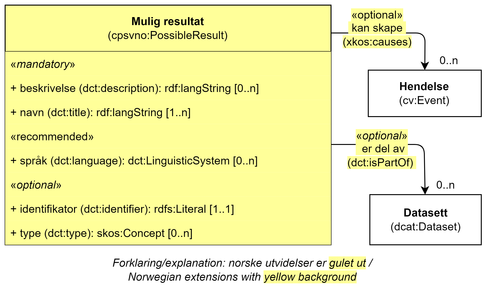

== Klassen Mulig resultat (cpsvno:PossibleOutput) [[MuligResultat]]

[[img-KlassenMuligResultat]]
.Klassen Mulig resultat (cpsvno:PossibleOutput) og klassene den refererer til. 
[link=images/KlassenMuligResultat.png]

[cols="30s,70d"]
|===
| _English name_ | _Possible output_
| Anvendelse / _Usage note_ |  Klassen brukes til å representere et mulig resultat fra en tjeneste.

_The class is used to represent a possible output of a service._
| URI | cpsvno:PossibleOutput
| Merknad / _Note_ | Norsk utvidelse: Ikke eksplisitt spesifisert i CPSV-AP.

_Norwegian extension: Not explicitly specified in CPSV-AP._
| Eksempel | Et mulig resultat fra tjenesten «Skjenkebevilling (i Brønnøy kommune)» er «bevilling» (når søknaden godkjennes). Et annet mulig resultat er «avslag» (når søknaden ikke blir godkjent).
|===

Eksempel i RDF Turtle:
-----
<bevilling> a cpsvno:PossibleOutput .

<avslag> a cpsvno:PossibleOutput .
-----

=== Obligatoriske egenskaper for klassen _Mulig resultat_ [[MuligResultat-obligatoriske-egenskaper]]

==== Mulig resultat – beskrivelse (dct:description) [[MuligResultat-beskrivelse]]

[cols="30s,70d"]
|===
| _English name_ | _description_
| URI | dct:description
| Verdiområde / _Range_ |  rdf:langString
| Anvendelse / _Usage note_ |  Egenskapen brukes til å oppgi en tekstlig beskrivelse av et mulig resultat fra en tjeneste. Egenskapen BØR gjentas når beskrivelsen finnes på flere språk.

_This property represents a free text Description of a possible output from a service. This property SHOULD be repeated when the description is in several parallel languages._
| Multiplisitet / _Multiplicity_ | 1..n
| Kravnivå / _Requirement level_ | Obligatorisk / _Mandatory_
| Merknad / _Note_ | Norsk utvidelse: Ikke eksplisitt spesifisert i CPSV-AP.

_Norwegian extension: Not explicitly specified in CPSV-AP._
|===

Eksempel i RDF Turtle:
-----
<bevilling> a cpsvno:PossibleOutput ;
   dct:description "Vedtak om bevilling, når en skjenketillatelse bevilges."@nb ; .

<avslag> a cpsvno:PossibleOutput ;
   dct:description "Vedtak om avslag, når en skjenketillatelse ikke bevilges."@nb ; .
-----

==== Mulig resultat – navn (dct:title) [[MuligResultat-navn]]

[cols="30s,70d"]
|===
| _English name_ | _name_
| URI | dct:title
| Verdiområde / _Range_ |  rdf:langString
| Anvendelse / _Usage note_ |  Egenskapen brukes til å oppgi  navn til tjenesteresultatet. Egenskapen BØR gjentas når navnet finnes på flere språk.

_This property represents the official Name of the Output. This property SHOULD be repeated when the name is in several parallel languages._
| Multiplisitet / _Multiplicity_ | 1..n
| Kravnivå / _Requirement level_ | Obligatorisk / _Mandatory_
| Eksempel | «Skjenkebevilling»
|===

Eksempel i RDF Turtle:
-----
<bevilling> a cpsvno:PossibleOutput ;
   dct:title "Skjenkebevilling"@nb ; .
-----

=== Anbefalte egenskaper for klassen _Mulig resultat_ [[MuligResultat-anbefalte-egenskaper]]

==== Mulig resultat – språk (dct:language) [[MuligResultat-språk]]

[cols="30s,70d"]
|===
| _English name_ | _possible language_
| URI | dct:language
| Verdiområde / _Range_ | dct:LinguisticSystem
| Anvendelse / _Usage note_ |  Egenskapen brukes til å oppgi hvilke språk et mulig resultat kan være tilgjengelig på. Egenskapen BØR gjentas når flere språk er mulige.

_This property represents the language in which a possible output may be written. This property SHOULD be repeated when several languages are available._
| Multiplisitet / _Multiplicity_ | 0..n
| Kravnivå / _Requirement level_ | Anbefalt / _Recommended_
| Merknad 1 / _Note 1_ | Verdien SKAL velges fra EUs kontrollerte vokabular https://op.europa.eu/en/web/eu-vocabularies/concept-scheme/-/resource?uri=http://publications.europa.eu/resource/authority/language[Språk &#x29C9;, window="_blank", role="ext-link"].

__The value MUST be chosen from Eu's controlled vocabulary https://op.europa.eu/en/web/eu-vocabularies/concept-scheme/-/resource?uri=http://publications.europa.eu/resource/authority/language[Language &#x29C9;, window="_blank", role="ext-link"].__
| Merknad 2 / _Note 2_ | Norsk utvidelse: Ikke eksplisitt spesifisert i CPSV-AP.

_Norwegian extension: Not explicitly specified in CPSV-AP._
| Eksempel | Bokmål, nynorsk eller engelsk
|===

Eksempel i RDF Turtle:
-----
<bevilling> a cpsvno:PossibleOutput ;
   dct:language
      <https://publications.europa.eu/resource/authority/language/NOB>, # bokmål
      <https://publications.europa.eu/resource/authority/language/NNO>, # nynorsk
      <https://publications.europa.eu/resource/authority/language/ENG>; # engelsk  
   .
-----

=== Valgfrie egenskaper for klassen _Mulig resultat_ [[MuligResultat-valgfrie-egenskaper]]

==== Mulig resultat – er del av (dct:isPartOf) [[MuligResultat-erDelAvv]]

[cols="30s,70d"]
|===
| _English name_ |  _is part of_
| URI | dct:isPartOf
|Verdiområde / _Range_ | https://informasjonsforvaltning.github.io/dcat-ap-no/#Datasett[dcat:Dataset &#x29C9;, window="_blank", role="ext-link"]
| Anvendelse / _Usage note_ | Egenskapen brukes til å referere til et datasett som et mulig resultat fysisk eller logisk kan være inkludert i.

_This property is used to refer to a dataset in which a possible output may physically or logically be included._
| Multiplisitet / _Multiplicity_ | 0..n
| Kravnivå / _Requirement level_ | Valgfri / _Optional_
| Merknad / _Note_ | Norsk utvidelse: Ikke eksplisitt spesifisert i CPSV-AP.

_Norwegian extension: Not explicitly specified in CPSV-AP._
|===

==== Mulig resultat – identifikator (dct:identifier) [[MuligResultat-identifikator]]

[cols="30s,70d"]
|===
| _English name_ | _identifier_
| URI | dct:identifier
| Verdiområde / _Range_ | rdfs:Literal
| Anvendelse / _Usage note_ |  Egenskapen brukes til å oppgi identifikatoren til et mulig resultat.

_This property represents an identifier for a possible output._
| Multiplisitet / _Multiplicity_ | 0..1
| Kravnivå / _Requirement level_ | Valgfri / _Optional_
| Merknad / _Note_ | Norsk utvidelse: Ikke eksplisitt spesifisert i CPSV-AP.

_Norwegian extension: Not explicitly specified in CPSV-AP._
|===

==== Mulig resultat – kan skape (xkos:causes) [[MuligResultat-kanSkape]]

[cols="30s,70d"]
|===
| _English name_ | _may cause_
| URI |xkos:causes
| Verdiområde / _Range_ | cv:Event
| Anvendelse / _Usage note_ | Egenskapen brukes til å uttrykke relasjon mellom et mulig resultat og en eller flere hendelser, f.eks. endring av data (som et mulig resultat) skaper en eller flere hendelser.

_This property expresses the relation between a possible output and one or more events, for instance the cases where change of data (as a possible output) may cause one of more events._
| Multiplisitet / _Multiplicity_ | 0..n 
| Kravnivå / _Requirement level_ | Valgfri / _Optional_ 
| Merknad / _Note_ | Norsk utvidelse: Ikke eksplisitt spesifisert i CPSV-AP.

_Norwegian extension: Not explicitly specified in CPSV-AP._
|===

==== Mulig resultat – type (dct:type) [[MuligResultat-type]]

[cols="30s,70d"]
|===
| _English name_ | _type_
| URI | dct:type
| Verdiområde / _Range_ | skos:Concept
| Anvendelse / _Usage note_ |  Egenskapen brukes til å referere til begrep som representerer type(r) et mulig resultat tilhører.

_This property represents the type of a possible output as defined in a controlled vocabulary._
| Multiplisitet / _Multiplicity_ | 0..n
| Kravnivå / _Requirement level_ | Valgfri / _Optional_
| Merknad / _Note_ | Verdien SKAL velges fra det felles kontrollerte vokabularet https://data.norge.no/vocabulary/service-output-type[Tjenesteresultattype &#x29C9;, window="_blank", role="ext-link"], når verdien finnes i vokabularet.

__The value MUST be chosen from the common controlled vocabulary https://data.norge.no/vocabulary/service-output-type[Service output type &#x29C9;, window="_blank", role="ext-link"], when the value is in the vocabulary.__
| Merknad 2 / _Note 2_ | Norsk utvidelse: Ikke eksplisitt spesifisert i CPSV-AP.

_Norwegian extension: Not explicitly specified in CPSV-AP._
| Eksempel | tillatelse
|===

Eksempel i RDF Turtle:
-----
<bevilling> a cpsvno:PossibleOutput ;
   dct:type <https://data.norge.no/vocabulary/service-output-type#permit> ; # tillatelse
   .
-----
