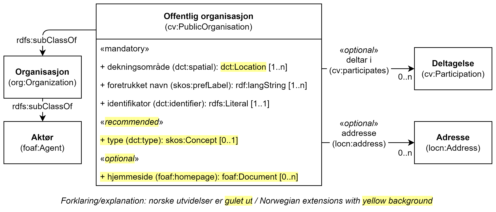

== Klassen Offentlig organisasjon (cv:PublicOrganisation) [[OffentligOrganisasjon]]

[[img-KlassenOffentligOrganisasjon]]
.Klassen Offentlig organisasjon (cv:PublicOrganisation)
[link=images/KlassenOffentligOrganisasjon.png]

[cols="30s,70d"]
|===
|English name|Public Organisation
|Anvendelse| Klassen brukes til å representere en offentlig organisasjon.
|Usage note| This class is used to represent a Public Organisation.
|URI|cv:PublicOrganisation
|Subklasse av / Subclass of| org:Organization
|Kravnivå | Anbefalt/Recommended
|Merknad|Norsk utvidelse: Kravnivå er endret fra obligatorisk til anbefalt, for at spesifikasjonen også skal kunne brukes til beskrivelse av f.eks. tjenester levert av aktører som ikke er offentlige organisasjoner.
|Eksempel|Brønnøy kommune er en offentlig organisasjon.
|===

Eksempel i RDF Turtle:
-----
<BrønnøyKommune> a cv:PublicOrganisation ; .
-----

=== Obligatoriske egenskaper for klassen _Offentlig organisasjon_ [[OffentligOrganisasjon-obligatoriske-egenskaper]]

==== Offentlig organisasjon – dekningsområde (dct:spatial) [[OffentligOrganisasjon-dekningsområde]]

[cols="30s,70d"]
|===
|English name|spatial coverage
|URI|dct:spatial
|Range|dct:Location
|Anvendelse| Egenskapen brukes til å referere til et geografisk område dekket av organisasjonen.
|Usage note| This property contains the geographic or administrative region covered by a Public Organisation.
|Multiplisitet|1..n
|Kravnivå | Obligatorisk/Mandatory
|Merknad 1 a|Følgende krav til bruk av kontrollerte vokabularer gjelder:

* Minst en verdi skal være fra en av følgende kontrollerte vokabularer: https://op.europa.eu/en/web/eu-vocabularies/concept-scheme/-/resource?uri=http://publications.europa.eu/resource/authority/continent[Kontinent]; https://op.europa.eu/en/web/eu-vocabularies/concept-scheme/-/resource?uri=http://publications.europa.eu/resource/authority/country[Land]; https://op.europa.eu/en/web/eu-vocabularies/concept-scheme/-/resource?uri=http://publications.europa.eu/resource/authority/place[Sted]; http://sws.geonames.org/[GeoNavn].

* For å angi dekningsområde i Norge, bør Kartverkets kontrollerte vokabular https://data.geonorge.no/administrativeEnheter/nasjon/doc/173163[Administrative enheter] brukes.
|Remark 1 a|Regarding usage of controlled vocabularies, the following requirements apply:

* At least one value shall be chosen from the following controlled vocabularies: https://op.europa.eu/en/web/eu-vocabularies/concept-scheme/-/resource?uri=http://publications.europa.eu/resource/authority/continent[Continent]; https://op.europa.eu/en/web/eu-vocabularies/concept-scheme/-/resource?uri=http://publications.europa.eu/resource/authority/country[Country]; https://op.europa.eu/en/web/eu-vocabularies/concept-scheme/-/resource?uri=http://publications.europa.eu/resource/authority/place[Place]; http://sws.geonames.org/[GeoNames].

* To specify spatial coverage in Norway, the Norwegian Mapping Authority's controlled vocabulary https://data.geonorge.no/administrativeEnheter/nasjon/doc/173163[Administrative units] should be used.
|Merknad 2 | Norsk utvidelse: CPSP-AP v.3.00 refererer til et kontrollert vokabular som range, noe vi mener ikke er korrekt. Vi har valgt å bruke `dct:Location` som range. Inntil EU oppdaterer sin versjon blir dette en norsk utvidelse.
|Remark 2 | Norwegian extension: CPSV-AP refers to a controlled vocabulary as the range, instead of a class.
|Eksempel|Offentlig organisasjon «Brønnøy kommune» har Brønnøy kommune i Norge som sitt dekningsområde.
|===

Eksempel i RDF Turtle:
----
<BrønnøyKommune> a cv:PublicOrganisation ;
   dct:spatial <http://publications.europa.eu/resource/authority/country/NOR> , # Norge
      <https://data.geonorge.no/administrativeEnheter/kommune/id/172833> ; # Brønnøy kommune
   .
----

==== Offentlig organisasjon – foretrukket navn (skos:prefLabel) [[OffentligOrganisasjon-foretrukketNavn]]

[cols="30s,70d"]
|===
|English name|preferred name
|URI|skos:prefLabel
|Range|rdf:langString
|Anvendelse| Egenskapen brukes til å oppgi det foretrukne navnet til organisasjonen.
|Usage note| This property represents a preferred label is used to provide the primary, legally recognised name of the Public Organization, as defined in the ORG Ontology.
|Multiplisitet| 1..n
|Kravnivå | Obligatorisk/Mandatory
|Merknad| Norsk utvidelse: multiplisitet endret fra 1..1 til 1..n.
|Remark | Norwegian extension: the multiplicity changed from 1..1 to 1..n.
|Eksempel|Brønnøy kommune
|===

Eksempel i RDF Turtle:
-----
<BrønnøyKommune> a cv:PublicOrganisation ;
   skos:prefLabel "Brønnøy kommune"@nb ; .
-----

==== Offentlig organisasjon – identifikator (dct:identifier) [[OffentligOrganisasjon-identifikator]]

[cols="30s,70d"]
|===
|English name|identifier
|URI|dct:identifier
|Range|rdfs:Literal
|Anvendelse| Egenskapen brukes til å oppgi organisasjonens identifikator, f.eks. i henhold til Enhetsregisterets organisasjonsnummer.
|Usage note|This property represents an Identifier for an Agent.
|Multiplisitet|1..1
|Kravnivå | Obligatorisk/Mandatory
|Merknad|Identifikator er som regel systemgenerert av verktøystøtte, slik at du som vanlig bruker ikke trenger å fylle ut verdien til egenskapen manuelt.

For deg som skal utvikle/tilpasse verktøystøtte: Når aktøren har et organisasjonsnummer bør identifikatoren oppgis som en URI med følgende mønster der "nnnnnnnnn" er organisasjonsnummeret: f.eks. `\https://organization-catalog.fellesdatakatalog.digdir.no/organizations/nnnnnnnnn`
|===

Eksempel i RDF Turtle:
-----
<BrønnøyKommune> a cv:PublicOrganisation ;
   dct:identifier "https://organization-catalogue.fellesdatakatalog.digdir.no/organizations/991825827" ; .
-----

==== Offentlig organisasjon – navn (dct:title) [[OffentligOrganisasjon-navn]]

[cols="30s,70d"]
|===
|English name|name
|URI|dct:title
|Range|rdf:langString
|Anvendelse| Egenskapen brukes til å oppgi navn på organisasjonen. Egenskapen bør gjentas når navnet finnes på flere språk.
|Usage note|This property represents the name of the public organisation, repeated when the name is in parallel languages.
|Multiplisitet|1..n
|Kravnivå | Obligatorisk/Mandatory
|Merknad |Både navn (denne egenskapen) og <<OffentligOrganisasjon-foretrukketNavn>> er obligatorisk (dette for å ha samsvar mellom våre nasjonale spesifikasjoner og EU-standarder på området). Egenskapen <<OffentligOrganisasjon-foretrukketNavn>> anbefalt brukes primært. Når det ikke finnes flere navn enn det foretrukne navnet, har disse to egenskapene samme verdi.
|Remark | Both name (this property) and the property <<OffentligOrganisasjon-foretrukketNavn>> are mandatory. The property <<OffentligOrganisasjon-foretrukketNavn>> should be used primarily. When there are no more names than the preferred name, these two properties should have the same value. 
|Eksempel|Brønnøy kommune
|===

Eksempel i RDF Turtle:
-----
<BrønnøyKommune> a cv:PublicOrganisation ;
   skos:prefLabel "Brønnøy kommune"@nb ; # foretrukket navn
   dct:title "Brønnøy kommune"@nb . # navn
-----

=== Anbefalte egenskaper for klassen _Offentlig organisasjon_ [[OffentligOrganisasjon-anbefalte-egenskaper]]

==== Offentlig organisasjon – type (dct:type) [[OffentligOrganisasjon-type]]

[cols="30s,70d"]
|===
|English name|type
|URI|dct:type
|Range|skos:Concept
|Anvendelse| Egenskapen brukes til å oppgi type offentlig organisasjon.
|Usage note|This property refers to a type of the public organization.
|Multiplisitet|0..1
|Kravnivå|Anbefalt/Recommended
|Merknad 1 |Verdien skal velges fra http://purl.org/adms/publishertype/[ADMS Publisher Type Vocabulary (lenket ressurs i RDF)].
|Remark 1 | The value shall be chosen from http://purl.org/adms/publishertype/[ADMS Publisher Type Vocabulary (linked resource in RDF)].
|Merknad 2 | Norsk utvidelse: Ikke eksplisitt spesifisert i CPSV-AP.
|Remark 2 | Norwegian extension: Not explicitly specified in CPSV-AP.
|Eksempel| Brønnøy kommune er av type _Local Authority_.
|===

Eksempel i RDF Turtle:
-----
<BrønnøyKommune> a cv:PublicOrganisation ;
   skos:prefLabel "Brønnøy kommune"@nb ;
   dct:type adms:LocalAuthority ;  .
-----

=== Valgfrie egenskaper for klassen _Offentlig organisasjon_ [[OffentligOrganisasjon-valgfrie-egenskaper]]

==== Offentlig organisasjon – adresse (locn:address) [[OffentligOrganisasjon-adresse]]

[cols="30s,70d"]
|===
|English name|address
|URI|locn:address
|Range|locn:Address
|Anvendelse| Egenskapen brukes til å oppgi adresse til en offentlig organisasjon.
|Usage note|This property represents the address.
|Multiplisitet|0..n
|Kravnivå | Anbefalt/Recommended
|Merknad| Norsk utvidelse: Multiplisitet endret fra 0..1 til 0..n.
|Remark | Norwegian extension: Multiplicity changed from 0..1 to 0..n.
|===

Eksempel i RDF Turtle:
-----
<BrønnøyKommune> a cv:PublicOrganisation ;
   skos:prefLabel "Brønnøy kommune"@nb ;
   locn:address [ a locn:Address ;
       locn:fullAddress "Sivert Nielsens gt. 24, 8905 Brønnøysund"@nb ; ] ; .
-----

==== Offentlig organisasjon – har rolle i (cv:playsRole) [[OffentligOrganisasjon-harRolle]]

[cols="30s,70d"]
|===
|English name|plays role
|URI|cv:playsRole
|Range|cv:Participation
|Anvendelse| Egenskapen brukes til å knytte en aktør/organisasjon til en instans av deltagelse (cv:Participation) i en tjeneste der organisasjonen har en eller flere roller.
|Usage note|This property links an Agent / Public Organisation to the Participation class.

The Participation class (`cv:Participation`) facilitates the detailed description of how an Agent / Public Organisation participates in or interacts with a Service and may include temporal and spatial constraints on that participation.
|Multiplisitet|0..n
|Kravnivå | Valgfri/Optional
|Eksempel|Se tilsvarende eksempel under <<KnytteDeltagendeAktørerTilEnTjeneste>>.
|===

Eksempel i RDF Turtle: Se tilsvarende eksempel under <<KnytteDeltagendeAktørerTilEnTjeneste>>.

==== Offentlig organisasjon – hjemmeside (foaf:homepage) [[OffentligOrganisasjon-hjemmeside]]

[cols="30s,70d"]
|===
|English name|homepage
|URI|foaf:homepage
|Range|foaf:Document
|Anvendelse| Egenskapen brukes til å referere til hjemmesiden til organisasjonen. Bør gjentas når hjemmesiden finnes på flere språk.
|Usage note|This property refers to the homepage of a Public Organisation.
|Multiplisitet|0..n
|Kravnivå | Anbefalt/Recommended
|Merknad|Norsk utvidelse: Ikke eksplisitt spesifisert i CPSV-AP.
|Remark | Norwegian extension: Not explicitly specified in CPSV-AP.
|Eksempel|https://www.bronnoy.kommune.no/[https://www.bronnoy.kommune.no/]
|===

Eksempel i RDF Turtle:
-----
<BrønnøyKommune> a cv:PublicOrganisation ;
   skos:prefLabel "Brønnøy kommune"@nb ;
   foaf:homepage <https://www.bronnoy.kommune.no/> ;  .
-----
