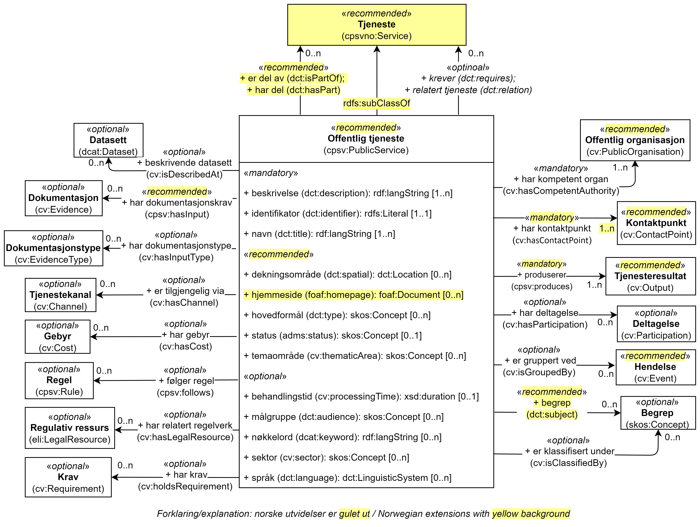

== Klassen Offentlig tjeneste (cpsv:PublicService) [[OffentligTjeneste]]

[[img-KlassenOffentligTjeneste]]
.Klassen Offentlig tjeneste (cpsv:PublicService) og klassene den refererer til.
[link=images/KlassenOffentligTjeneste.png]

[cols="30s,70d"]
|===
| _English name_ | _Public Service_
| Anvendelse / _Usage note_ |  Klassen brukes til å representere en https://data.norge.no/concepts/73f78f28-cab8-4dae-9029-6e5af9f98dc0[offentlig tjeneste &#x29C9;, window="_blank", role="ext-link"].

__This class represents a Public Service.__
| URI | cpsv:PublicService
| Subklasse av / _Subclass of_ | cpsvno:Service
| Merknad / _Note_ | Norsk utvidelse: Klassen Offentlig tjeneste (`cpsv:PublicService`) er i CPSV-AP ikke en subklasse av Tjeneste (`cpsvno:Service`). Denne spesifikasjonen har utvidet CPSV-AP med å tilføye klassen Tjeneste (`cpsvno:Service`) slik at det også er mulig å beskrive tjenester som ikke er offentlige. 

_Norwegian extension: The class Public Service (`cpsv:PublicService`) in CPSV-AP is not a subclass of the class Service (`cpsvno:Service`)._
|===

Eksempel i RDF Turtle:
-----
<skjenkebevilling> a cpsv:PublicService ; .
-----

=== Obligatoriske egenskaper for klassen _Offentlig tjeneste_ [[OffentligTjeneste-onligatoriske-egenskaper]]

==== Offentlig tjeneste – beskrivelse (dct:description) [[OffentligTjenest-beskrivelse]]

[cols="30s,70d"]
|===
| _English name_ | _description_
| URI | dct:description
| Verdiområde / _Range_ | rdf:langString
| Anvendelse / _Usage note_ |  Egenskapen brukes til å oppgi en tekstlig beskrivelse av tjenesten. Egenskapen BØR gjentas når beskrivelsen finnes på flere språk.

_This property represents a free text Description of the Public Service. This property SHOULD be repeated when the text is in parallel languages._
| Multiplisitet / _Multiplicity_ | 1..n
| Kravnivå / _Requirement level_ | Obligatorisk / _Mandatory_
| Eksempel | Bevilling for skjenking av alkoholholdig drikke, enten som alminnelig bevilling eller som bevilling for lukket selskap.
|===

Eksempel i RDF Turtle:
-----
<skjenkebevillingBrønnøy> a cpsv:PublicService ;
   dct:description "Bevilling for skjenking av alkoholholdig drikk, enten som alminnelig bevilling eller som bevilling for lukket selskap."@nb ; .
-----

==== Offentlig tjeneste – har kompetent organ (cv:hasCompetentAuthority) [[OffentligTjeneste-harKompetentOrgan]]

[cols="30s,70d"]
|===
| _English name_ | _has competent authority_
| URI | cv:hasCompetentAuthority
| Verdiområde / _Range_ | cv:PublicOrganisation
| Anvendelse / _Usage note_ |  Egenskapen brukes til å referere til den offentlige organisasjonen som har ansvaret for tjenesten, uansett om tjenesten tilbys direkte av den aktuelle offentlige organisasjonen eller er satt bort til andre.

_This property links a Public Service to a Public Organization, which is the responsible Agent for the delivery of the Public Service. Whether the particular Public Organization provides the public service directly or outsources it is not relevant. The Public Organization that is the Competent Authority of the service is the one that is ultimately responsible for managing and providing the public service._
| Multiplisitet / _Multiplicity_ | 1..n
| Kravnivå / _Requirement level_ | Obligatorisk / _Mandatory_
| Merknad / _Note_ | Begrepet ‘competent authority’ er definert i Services Directive (2006/123/EC) som: “any body or authority which has a supervisory or regulatory role in a Member State in relation to service activities, including, in particular, administrative authorities, including courts acting as such, professional bodies, and those professional associations or other professional organisations which, in the exercise of their legal autonomy, regulate in a collective manner access to service activities or the exercise thereof”.

_The term ‘Competent Authority’ is defined in the Services Directive (2006/123/EC) in the following way: "Any body or authority which has a supervisory or regulatory role in a Member State in relation to service activities, including, in particular, administrative authorities, including courts acting as such, professional bodies, and those professional associations or other professional organisations which, in the exercise of their legal autonomy, regulate in a collective manner access to service activities or the exercise thereof"._
| Eksempel | Brønnøy kommune er det kompetente organet for tjenesten «Skjenkebevilling i Brønnøy kommune»
|===

Eksempel i RDF Turtle:
-----
<skjenkebevillingBrønnøy> a cpsv:PublicService ;
   cv:hasCompetentAuthority <https://organization-catalog.fellesdatakatalog.digdir.no/organizations/964983291> ; . # Brønnøy kommune
-----

==== Offentlig tjeneste – har mulig tjenesteresultat (cpsvno:hasPossibleOutput) [[OffentligTjeneste-harMuligTjenesteresultat]]

[cols="30s,70d"]
|===
| _English name_ | _has possible output_
| URI | cpsvno:hasPossibleOutput
| Verdiområde / _Range_ | cpsvno:PossibleOutput
| Anvendelse / _Usage note_ |  Egenskapen brukes til å spesifisere mulig resultat fra tjenesten.

_This property is used to specify possible result of the service._
| Multiplisitet / _Multiplicity_ | 1..n
| Kravnivå / _Requirement level_ | Obligatorisk / _Mandatory_
| Merknad / _Note_ |  Norsk utvidelse: Ikke eksplisitt spesifisert i CPSV-AP.

_Norwegian extension: Not explicitly specified in CPSV-AP._
| Eksempel | Et mulig resultat fra tjenesten «Skjenkebevilling (i Brønnøy kommune)» er bevillingen som utstedes når søknaden godkjennes. Et annet mulig resultat er avslag når søknaden ikke godkjennes.
|===

Eksempel i RDF Turtle:
-----
<skjenkebevillingBrønnøy> a cpsv:PublicService ;
   cpsvno:hasPossibleOutput <bevilling> , <avslag> .
-----

==== Offentlig tjeneste – identifikator (dct:identifier) [[OffentligTjeneste-identifikator]]

[cols="30s,70d"]
|===
| _English name_ | _identifier_
| URI | dct:identifier
| Verdiområde / _Range_ | rdfs:Literal
| Anvendelse / _Usage note_ |  Egenskapen brukes til å oppgi en formell identifikasjon til tjenesten.

_This property represents a formally-issued Identifier for the Public Service._
| Multiplisitet / _Multiplicity_ | 1..1
| Kravnivå / _Requirement level_ | Obligatorisk / _Mandatory_
|===

==== Offentlig tjeneste – kontaktpunkt (cv:contactPoint) [[OffentligTjeneste-kontaktpunkt]]

[cols="30s,70d"]
|===
| _English name_ | _contact point_
| URI |  cv:contactPoint
| Verdiområde / _Range_ | cv:ContactPoint
| Anvendelse / _Usage note_ |  Egenskapen brukes til å oppgi kontaktpunkt(er) for tjenesten.

_This property represents contact points for the service._
| Multiplisitet / _Multiplicity_ | 1..n
| Kravnivå / _Requirement level_ |  Obligatorisk / _Mandatory_
|Merknad / _Note_ a| Norsk utvidelse:

* Kravnivå et endret fra valgfri til obligatorisk – enhver offentlig tjeneste skal ha minst ett kontaktpunkt oppgitt.
* Multiplisitet endret fra 0..n til 1..n

_Norwegian extension:_

* _Requirement level changed from optional to mandatory._
* _Multiplicity changed from 0..1 to 1..n_
| Eksempel | Brønnøy kommune med telefonnr. 75 01 20 00 er et kontaktpunkt for «Skjenkebevilling (i Brønnøy kommune)»
|===

Eksempel i RDF Turtle:
-----
<skjenkebevillingBrønnøy> a cpsv:PublicService ;
   cv:contactPoint [ a  cv:ContactPoint ; # kontaktpunkt
     cv:telephone "tel:+4775012000" ;
    ] ; .
-----

==== Offentlig tjeneste – navn (dct:title) [[OffentligTjeneste-navn]]

[cols="30s,70d"]
|===
| _English name_ | _name_
| URI | dct:title
| Verdiområde / _Range_ | rdf:langString
| Anvendelse / _Usage note_ |  Egenskapen brukes til å oppgi det offisielle navnet på tjenesten. Egenskapen BØR gjentas når navnet finnes på flere språk.

_This property represents the official Name of the Public Service. This property SHOULD be repeated when the name is in parallel languages._
| Multiplisitet / _Multiplicity_ | 1..n
| Kravnivå / _Requirement level_ |  Obligatorisk / _Mandatory_
| Eksempel | «Skjenkebevilling»
|===

Eksempel i RDF Turtle:
-----
<skjenkebevilling> a cpsv:PublicService ;
   dct:title "Skjenkebevilling"@nb ; .
-----

=== Anbefalte egenskaper for klassen _Offentlig tjeneste_ [[OffentligTjeneste-anbefalte-egenskaper]]

==== Offentlig tjeneste – begrep (dct:subject) [[OffentligTjeneste-begrep]]

[cols="30s,70d"]
|===
| _English name_ | _subject_
| URI | dct:subject
| Verdiområde / _Range_ | skos:Concept
| Anvendelse / _Usage note_ |  Egenskapen brukes til å referere til begrep som er viktig for å forstå tjenesten.

_This property refers to concept that is important for the understanding of the service._
| Multiplisitet / _Multiplicity_ | 0..n
| Kravnivå / _Requirement level_ |  Anbefalt / _Recommended_
| Merknad / _Note_ | Norsk utvidelse: Ikke eksplisitt spesifisert i CPSV-AP. Begrunnelse: det er behov for å kunne referere til begreper som er viktig for å forstå tjenesten.

_Norwegian extension: Not explicitly specified in CPSV-AP._
|===

==== Offentlig tjeneste – dekningsområde (dct:spatial) [[OffentligTjeneste-dekningsområde]]

[cols="30s,70d"]
|===
| _English name_ | _spatial coverage_
| URI | dct:spatial
| Verdiområde / _Range_ | dct:Location
| Anvendelse / _Usage note_ |  Egenskapen brukes til å referere til et geografisk område som dekkes av tjenesten.

_This property represents that area(s) a Public Service is likely to be available only within, typically the area(s) covered by a particular public authority._
| Multiplisitet / _Multiplicity_ | 0..n
| Kravnivå / _Requirement level_ | Anbefalt / _Recommended_
|Merknad 1 / _Note 1_ a|Følgende krav til bruk av kontrollerte vokabularer gjelder:

* Minst én verdi SKAL være fra en av følgende kontrollerte vokabularer: https://op.europa.eu/en/web/eu-vocabularies/concept-scheme/-/resource?uri=http://publications.europa.eu/resource/authority/continent[Kontinent &#x29C9;, window="_blank", role="ext-link"]; https://op.europa.eu/en/web/eu-vocabularies/concept-scheme/-/resource?uri=http://publications.europa.eu/resource/authority/country[Land &#x29C9;, window="_blank", role="ext-link"]; https://op.europa.eu/en/web/eu-vocabularies/concept-scheme/-/resource?uri=http://publications.europa.eu/resource/authority/place[Sted &#x29C9;, window="_blank", role="ext-link"].

* For å angi dekningsområde i Norge, BØR Kartverkets kontrollerte vokabular https://data.geonorge.no/administrativeEnheter/nasjon/doc/173163[Administrative enheter &#x29C9;, window="_blank", role="ext-link"] brukes.

_Regarding usage of controlled vocabularies, the following requirements apply:_

* __At least one value MUST be chosen from the following controlled vocabularies: https://op.europa.eu/en/web/eu-vocabularies/concept-scheme/-/resource?uri=http://publications.europa.eu/resource/authority/continent[Continent &#x29C9;, window="_blank", role="ext-link"]; https://op.europa.eu/en/web/eu-vocabularies/concept-scheme/-/resource?uri=http://publications.europa.eu/resource/authority/country[Country &#x29C9;, window="_blank", role="ext-link"]; https://op.europa.eu/en/web/eu-vocabularies/concept-scheme/-/resource?uri=http://publications.europa.eu/resource/authority/place[Place &#x29C9;, window="_blank", role="ext-link"].__

* __To specify spatial coverage in Norway, the Norwegian Mapping Authority's controlled vocabulary https://data.geonorge.no/administrativeEnheter/nasjon/doc/173163[Administrative units &#x29C9;, window="_blank", role="ext-link"] SHOULD be used.__
| Merknad 2 / _Note 2_ |  Norsk utvidelse: Kravnivå  endret fra valgfri til anbefalt.

_Norwegian extension: Requirement level changed from optional to recommended._
| Eksempel | «Skjenkebevilling (i Brønnøy kommune)» har Brønnøy kommune i Norge som dekningsområde.
|===

Eksempel i RDF Turtle:
----
<skjenkebevillingBrønnøy> a cpsv:PublicService ;
   dct:spatial <http://publications.europa.eu/resource/authority/country/NOR> , # Norge
      <https://data.geonorge.no/administrativeEnheter/kommune/id/172833> ; # Brønnøy kommune
   .
----

==== Offentlig tjeneste – har påkrevd dokumentasjon (cpsvno:hasRequiredEvidence) [[OffentligTjeneste-harPåkrevdDokumentasjon]]

[cols="30s,70d"]
|===
| _English name_ | _has required evidence_
| URI | cpsvno:hasRequiredEvidence
| Verdiområde / _Range_ | cpsvno:RequiredEvidence
| Anvendelse / _Usage note_ |  Egenskapen brukes til å spesifisere dokumentasjon som er påkrevd av tjenesten.

_This property is used to specify evidence that is required by the service._
| Multiplisitet / _Multiplicity_ | 0..n
| Kravnivå / _Requirement level_ |  Anbefalt / _Recommended_
| Merknad 1 / _Note 1_ | For å kunne levere en tjeneste kan det kreves  dokumentasjon. Hvis dokumentasjon som kreves varierer avhengig av kanal tjenesten tilbys gjennom, BØR tilsvarende egenskap i klassen Tjenestekanal benyttes. 

_A service may require certain evidence in order to be delivered. If the evidence required varies according to the channel through which it is accessed, then the corresponding property in the class Channel SHOULD be used._
| Merknad 2 / _Note 2_ |  Norsk utvidelse: Ikke eksplisitt spesifisert i CPSV-AP.

_Norwegian extension: Not explicitly specified in CPSV-AP._
| Eksempel | En påkrevd dokumentasjon til å søke om skjenkebevilling er firmaattest.
|===

Eksempel i RDF Turtle:
----
<skjenkebevillingBrønnøy> a cpsv:PublicService ;
   cpsvno:hasRequiredEvidence <firmaattest> ; .
----

==== Offentlig tjeneste – hjemmeside (foaf:homepage) [[OffentligTjeneste-hjemmeside]]

[cols="30s,70d"]
|===
| _English name_ | _homepage_
| URI | foaf:homepage
| Verdiområde / _Range_ | foaf:Document
| Anvendelse / _Usage note_ |  Egenskapen brukes til å referere til en hjemmeside til tjenesten.

_This property refers to a homepage of the Service._
| Multiplisitet / _Multiplicity_ | 0..n
| Kravnivå / _Requirement level_ | Anbefalt / _Recommended_
| Merknad / _Note_ |  Norsk utvidelse: Ikke eksplisitt spesifisert i CPSV-AP.

_Norwegian extension: Not explicitly specified in CPSV-AP._
| Eksempel | https://kommune24-7.no/1813[https://kommune24-7.no/1813 &#x29C9;, window="_blank", role="ext-link"]
|===

Eksempel i RDF Turtle:
-----
<skjenkebevillingBrønnøy> a cpsv:PublicService ;
   foaf:homepage <https://kommune24-7.no/1813> ; .
-----

==== Offentlig tjeneste – hovedformål (dct:type) [[OffentligTjeneste-hovedformål]]

[cols="30s,70d"]
|===
| _English name_ | _functions of government_
| URI | dct:type
| Verdiområde / _Range_ | skos:Concept
| Anvendelse / _Usage note_ |  Egenskapen brukes til å indikere type tjeneste i henhold til et kontrollert vokabular.

_This property represents the Type of a Public Service as described in a controlled vocabulary._
| Multiplisitet / _Multiplicity_ | 0..n
| Kravnivå / _Requirement level_ | Anbefalt / _Recommended_
| Merknad 1 / _Note 1_ | Verdien SKAL velges fra EUs kontrollerte vokabular https://op.europa.eu/en/web/eu-vocabularies/concept-scheme/-/resource?uri=http://publications.europa.eu/resource/authority/main-activity[Main activity &#x29C9;, window="_blank", role="ext-link"], når verdien finnes i vokabularet.

__The value MUST be chosen from EU's controlled vocabulary https://op.europa.eu/en/web/eu-vocabularies/concept-scheme/-/resource?uri=http://publications.europa.eu/resource/authority/main-activity[Main activity &#x29C9;, window="_blank", role="ext-link"].__
| Merknad 2 / _Note 2_ |  Norsk utvidelse: Kravnivå er endret fra valgfri til anbefalt.

_Norwegian extension: Requirement level changed from optional to recommended._
|===

==== Offentlig tjeneste – status (adms:status) [[OffentligTjeneste-status]]

[cols="30s,70d"]
|===
| _English name_ | _status_
| URI | adms:status
| Verdiområde / _Range_ | skos:Concept
| Anvendelse / _Usage note_ |  Egenskapen brukes til å referere til status til tjenesten (f.eks. aktiv, inaktiv, under utvikling osv.) i henhold til et predefinert kontrollert vokabular.

_This property indicates whether a Public Service is active, inactive, under development etc. according to a controlled vocabulary._
| Multiplisitet / _Multiplicity_ | 0..1
| Kravnivå / _Requirement level_ | Anbefalt / _Recommended_
| Merknad 1 / _Note 1_ | Norsk utvidelse: Verdien SKAL velges fra EU's kontrollerte vokabular https://op.europa.eu/en/web/eu-vocabularies/concept-scheme/-/resource?uri=http://publications.europa.eu/resource/authority/distribution-status[__Distribution status__ &#x29C9;, window="_blank", role="ext-link"].

__Norwegian extension: The value MUST be chosen from EU's controlled vocabulary https://op.europa.eu/en/web/eu-vocabularies/concept-scheme/-/resource?uri=http://publications.europa.eu/resource/authority/distribution-status[Distribution status &#x29C9;, window="_blank", role="ext-link"].__
| Merknad 2 / _Note 2_ |  Norsk utvidelse: Kravnivå endret fra valgfri til anbefalt.

_Norwegian extension: Requirement level changed from optional to recommended._
| Eksempel | Ferdig utviklet
|===

Eksempel i RDF Turtle:
-----
<skjenkebevillingBrønnøy> a cpsv:PublicService ;
  adms:status <http://purl.org/adms/status/Completed> ; # tjenesten er ferdig utviklet
     .
-----

==== Offentlig tjeneste – temaområde (cv:thematicArea) [[OffentligTjeneste-temaområde]]

[cols="30s,70d"]
|===
| _English name_ | _thematic area_
| URI | cv:thematicArea
| Verdiområde / _Range_ | skos:Concept
| Anvendelse / _Usage note_ |  Egenskapen brukes til å referere til primært temaområde som dekkes av tjenesten.

_This property represents the Thematic Area of a Public Service as described in a controlled vocabulary._
| Multiplisitet / _Multiplicity_ | 0..n
| Kravnivå / _Requirement level_ | Anbefalt / _Recommended_
| Merknad 1 / _Note 1_ | Verdien BØR velges fra EUs kontrollerte vokabular https://op.europa.eu/en/web/eu-vocabularies/concept-scheme/-/resource?uri=http://eurovoc.europa.eu/100141[EuroVoc &#x29C9;, window="_blank", role="ext-link"] eller https://psi.norge.no/los/[Los – felles vokabular for å kategorisere og beskrive offentlige tjenester og ressurser &#x29C9;, window="_blank", role="ext-link"].

__The value SHOULD  be chosen from EU's controlled vocabulary https://op.europa.eu/en/web/eu-vocabularies/concept-scheme/-/resource?uri=http://eurovoc.europa.eu/100141[EuroVoc &#x29C9;, window="_blank", role="ext-link"] or https://psi.norge.no/los/[Los &#x29C9;, window="_blank", role="ext-link"].__
| Merknad 2 / _Note 2_ |  Norsk utvidelse: Kravnivå  endret fra valgfri til anbefalt.

_Norwegian extension: Requirement level changed from optional to recommended._
|===

=== Valgfrie egenskaper for klassen _Offentlig tjeneste_ [[OffentligTjeneste-valgfrie-egenskaper]]

==== Offentlig tjeneste – behandlingstid (cv:processingTime) [[OffentligTjeneste-behandlingstid]]

[cols="30s,70d"]
|===
| _English name_ | _processing time_
| URI | cv:processingTime
| Verdiområde / _Range_ | xsd:duration
| Anvendelse / _Usage note_ |  Egenskapen brukes til å oppgi den estimerte behandlingstiden.

_The value of this property is the (estimated) time needed for executing a Public Service._
| Multiplisitet / _Multiplicity_ | 0..1
| Kravnivå / _Requirement level_ | Valgfri / _Optional_
| Merknad / _Note_ |  Opplysningen SKAL oppgis ved hjelp av ISO 8601-syntaksen for varighet. Forklaring er gitt på https://en.wikipedia.org/wiki/ISO_8601#Durations[Wikipedia-siden &#x29C9;, window="_blank", role="ext-link"] som refererer til den offisielle ISO-standarden.

__The actual information MUST be provided using the ISO 8601 syntax for durations. Explanation is provided in the https://en.wikipedia.org/wiki/ISO_8601#Durations[Wikipedia page &#x29C9;, window="_blank", role="ext-link"] that references the official ISO standard.__
| Eksempel | Det tar 1 dag for å behandle en søknad om skjenkebevilling (i Brønnøy kommune).
|===

Eksempel i RDF Turtle:
-----
<skjenkebevillingBrønnøy> a cpsv:PublicService ;
   cv:processingTime "P1D"^^xsd:duration ; .
-----

==== Offentlig tjeneste – beskrivende datasett (cv:isDescribedAt) [[OffentligTjeneste-beskrivendeDatasett]]

[cols="30s,70d"]
|===
| _English name_ | _is described at_
| URI | cv:isDescribedAt
| Verdiområde / _Range_ | https://informasjonsforvaltning.github.io/dcat-ap-no/#Datasett[dcat:Dataset &#x29C9;, window="_blank", role="ext-link"]
| Anvendelse / _Usage note_ |  Egenskapen brukes til å referere til datasett som beskriver tjenesten.

_This property links a Public Service to the Dataset(s) in which it is being described._
| Multiplisitet / _Multiplicity_ | 0..n
| Kravnivå / _Requirement level_ | Valgfri / _Optional_
|===

==== Offentlig tjeneste – er del av (dct:isPartOf) [[OffentligTjeneste-erDelAv]]

[cols="30s,70d"]
|===
| _English name_ | _is part of_
| URI | dct:isPartOf
| Verdiområde / _Range_ | cpsvno:Service
| Anvendelse / _Usage note_ |  Egenskapen brukes til å referere til en annen tjeneste som tjenesten er en del av.

_This property indicates a related service in which the described resource is included. This property is the inverse of `dct:hasPart`._
| Multiplisitet / _Multiplicity_ | 0..n
| Kravnivå / _Requirement level_ | Valgfri / _Optional_
| Merknad 1 / _Note 1_ | Denne er den inverse av egenskapen <<OffentligTjeneste-harDel>>.

_This is the inverse of the property <<OffentligTjeneste-harDel>>._
| Merknad 2 / _Note 2_ | Norsk utvidelse: Ikke eksplisitt tatt med i CPSV-AP.

_Norwegian extension: Not explicitly specified in CPSV-AP._
|===

==== Offentlig tjeneste – er gruppert ved (cv:isGroupedBy) [[OffentligTjeneste-erGruppertVed]]

[cols="30s,70d"]
|===
| _English name_ | _is grouped by_
| URI | cv:isGroupedBy
| Verdiområde / _Range_ | cv:Event
| Anvendelse / _Usage note_ |  Egenskapen brukes til å referere til en eller flere hendelser som utløser behov for tjenesten.
|Usage note| This property links the Public Service to the triggering Event class.
| Multiplisitet / _Multiplicity_ | 0..n
| Kravnivå / _Requirement level_ | Valgfri / _Optional_
| Merknad / _Note_ | Flere offentlige tjenester KAN være knyttet til en bestemt hendelse, og likedan KAN den samme offentlige tjenesten være knyttet til flere forskjellige hendelser.

_Several Public Services MAY be associated with a particular Event and, likewise, the same Public Service MAY be associated with several different Events._
| Eksempel | Tjenesten «Skjenkebevilling» grupperes under hendelsen «Starte og drive en restaurant»
|===

Eksempel i RDF Turtle:
-----
<skjenkebevillingBrønnøy> a cpsv:PublicService ;
   cv:isGroupedBy <starteOgDriveRestaurant> .

<starteOgDriveRestaurant> a cv:Event .
-----

==== Offentlig tjeneste – er klassifisert under (cv:isClassifiedBy) [[OffentligTjeneste-erKlassifisertUnder]]

[cols="30s,70d"]
|===
| _English name_ | _is classified by_
| URI | cv:isClassifiedBy
| Verdiområde / _Range_ | skos:Concept
| Anvendelse / _Usage note_ |  Egenskapen brukes til å referere til et eller flere begreper som er brukt til å klassifisere tjenesten, begreper som _ikke_ er eller _ikke_ kan være inkludert i andre egenskaper som <<OffentligTjeneste-temaområde>>, <<OffentligTjeneste-sektor>> osv.

_This property allows to classify the Public Service with any Concept, other than those already foreseen and defined explicitly in CPSV-AP (<<OffentligTjeneste-temaområde>>, <<OffentligTjeneste-sektor>> etc.)_
| Multiplisitet / _Multiplicity_ | 0..n
| Kravnivå / _Requirement level_ | Valgfri / _Optional_
| Merknad / _Note_ |  Dette er en generisk egenskap som kan spesialiseres til å lage spesifikke klassifiseringer, f.eks. å klassifisere offentlige tjenester etter digitaliseringsnivå osv.

_It is a generic property which can be further specialised to make the classification explicit, for instance for classifying public services according to level of digitisation etc._
|===

==== Offentlig tjeneste – er tilgjengelig via (cv:hasChannel) [[OffentligTeneste-erTilgjengeligVia]]

[cols="30s,70d"]
|===
| _English name_ | _has channel_
| URI | cv:hasChannel
| Verdiområde / _Range_ | cv:Channel
| Anvendelse / _Usage note_ |  Egenskapen brukes til å referere til en eller flere kanaler som tjenesten er tilgjengelig gjennom, f.eks. gjennom online, telefonisk eller fysisk oppmøte.

_This property links the Public Service to any Channel through which an Agent provides, uses or otherwise interacts with the Public Service, such as an online service, phone number or office._
| Multiplisitet / _Multiplicity_ | 0..n
| Kravnivå / _Requirement level_ | Valgfri / _Optional_
| Eksempel | Tjenesten «Skjenkebevilling (i Brønnøy kommune)» tilbys online på kommunens https://kommune24-7.no/1813/[skjemaportal &#x29C9;, window="_blank", role="ext-link"]
|===

Eksempel i RDF Turtle:
----
<skjenkebevillingBrønnøy> a cpsv:PublicService ;
   cv:hasChannel <https://kommune24-7.no/1813/> ; .
----

==== Offentlig tjeneste – følger regel (cpsv:follows) [[OffentligTjeneste-følgerRegel]]

[cols="30s,70d"]
|===
| _English name_ | _follows_
| URI | cpsv:follows
| Verdiområde / _Range_ | cpsv:Rule
| Anvendelse / _Usage note_ |  Egenskapen brukes til å referere til regelen som gjelder for tjenesten.

_This property links a Service to the Rule(s) under which it operates._
| Multiplisitet / _Multiplicity_ | 0..n
| Kravnivå / _Requirement level_ | Valgfri / _Optional_
| Eksempel | Se også <<KnytteTilRegelverk>>.
|===

==== Offentlig tjeneste – har del (dct:hasPart) [[OffentligTjeneste-harDel]]

[cols="30s,70d"]
|===
| _English name_ | _has part_
| URI | dct:hasPart
| Verdiområde / _Range_ | cpsvno:Service
| Anvendelse / _Usage note_ |  Egenskapen brukes til å referere til en tjeneste som er inkludert enten fysisk eller logisk i tjenesten som beskrives.

_This property indicates a related service that is included either physically or logically in the described resource._
| Multiplisitet / _Multiplicity_ | 0..n
| Kravnivå / _Requirement level_ | Valgfri / _Optional_
| Merknad 1 / _Note 1_ | Dette er den inverse av egenskapen <<OffentligTjeneste-erDelAv>>.

_This is the inverse of the property <<OffentligTjeneste-erDelAv>>._
| Merknad 2 / _Note 2_ | Norsk utvidelse: Ikke eksplisitt tatt med i CPSV-AP.

_Norwegian extension: Not explicitly specified in CPSV-AP._
|===

==== Offentlig tjeneste – har deltagelse (cv:hasParticipation) [[OffentligTjeneste-har-deltagelse]]

[cols="30s,70d"]
|===
| _English name_ | _has participation_
| URI | cv:hasParticipation
| Verdiområde / _Range_ | cv:Participation
| Anvendelse / _Usage note_ |  Egenskapen brukes til å knytte til andre aktører som deltar i eller samhandler med tjenesten.

_It links a Public Service to the Participation class._

_The Participation class facilitates the detailed description of how an Agent participates in or interacts with a Public Service and may include temporal and spatial information._
| Multiplisitet / _Multiplicity_ | 0..n
| Kravnivå / _Requirement level_ | Valgfri / _Optional_
| Merknad / _Note_ | Andre aktører vil si andre enn det kompetente organ (`cv:hasCompetentAuthority`) og tjenesteeieren (`cv:ownedBy`).
| Eksempel | Se tilsvarende eksempel under <<KnytteDeltagendeAktørerTilEnTjeneste>>.
|===

Eksempel i RDF Turtle: Se tilsvarende eksempel under <<KnytteDeltagendeAktørerTilEnTjeneste>>.

==== Offentlig tjeneste – har dokumentasjonstype (cv:hasInputType) [[OffentligTjeneste-har-dokumentasjonstype]]

[cols="30s,70d"]
|===
| _English name_ | _has input type_
| URI | cv:hasInputType
| Verdiområde / _Range_ | cv:EvidenceType
| Anvendelse / _Usage note_ |  Egenskapen brukes til å knytte til tjenesten en eller flere dokumentasjonstyper.

_It links a Public Service to one or more instances of the EvidenceType class._
| Multiplisitet / _Multiplicity_ | 0..n
| Kravnivå / _Requirement level_ | Valgfri / _Optional_
|===

==== Offentlig tjeneste – har gebyr (cv:hasCost) [[OffentligTjeneste-har-gebyr]]

[cols="30s,70d"]
|===
| _English name_ | _has cost_
| URI | cv:hasCost
| Verdiområde / _Range_ | cv:Cost
| Anvendelse / _Usage note_ |  Egenskapen brukes til å referere til en eller flere instanser av klassen Gebyr (`cv:Cost`), for å oppgi ev. gebyr for tjenesten.

_This property links a Public Service to one or more instances of the Cost class. It indicates the costs related to the execution of a Public Service for the citizen or business related to the execution of the particular Public Service._
| Multiplisitet / _Multiplicity_ | 0..n
| Kravnivå / _Requirement level_ | Valgfri / _Optional_
| Merknad / _Note_ | Der gebyret varierer avhengig av kanalen tjenesten tilbys gjennom, SKAL egenskapen <<Gebyr-hvisTilbysGjennom>> brukes.

_Where the cost varies depending on the channel through which the service is accessed, it MUST be linked to the channel using the <<Gebyr-hvisTilbysGjennom>> relationship._
| Eksempel | Ifm. «Skjenkebevilling (i Brønnøy kommune)» er gebyret «Pr. vareliter for alkoholdhold drikke i gruppe 1: 0.49 NOK».
|===

Eksempel i RDF Turtle:
-----
<skjenkebevillingBrønnøy> a cpsv:PublicService ;
   cv:hasCost [ a cv:Cost ;
      cv:hasValue "0.49"^^xsd:decimal ; # beløp
      cv:currency <http://publications.europa.eu/resource/authority/currency/NOK> ; # valuta
      dct:description "Pr. vareliter for alkoholdhold drikke i gruppe 1"@nb ;
   ] ; .
-----

==== Offentlig tjeneste – har krav (cv:holdsRequirement) [[OffentligTjeneste-har-krav]]

[cols="30s,70d"]
|===
| _English name_ |  _holds requirement_
| URI |  cv:holdsRequirement
| Verdiområde / _Range_ | cv:Requirement
| Anvendelse / _Usage note_ |  Egenskapen brukes til å referere til krav knyttet til behov for eller bruk av tjenesten.

_This property links a Public Service to a class that describes the criteria for needing or using the service, such as residency in a given location, being over a certain age etc._
| Multiplisitet / _Multiplicity_ | 0..n
| Kravnivå / _Requirement level_ | Valgfri / _Optional_
| Eksempel | Et av kravene for å søke om skjenkebevilling er at søkeren skal være over 20 år.
|===

Eksempel i RDF Turtle:
-----
<skjenkebevillingBrønnøy> a cpsv:PublicService ;
   cv:holdsRequirement [ a cv:Requirement ;
   dct:title "Over 20 år"@nb ;
   dct:description "Søkeren må være over 20 år"@nb ; ] ; .
-----

==== Offentlig tjeneste – har relatert regelverk (cv:hasLegalResource) [[OffentligTjeneste-har-relatert-regelverk]]

[cols="30s,70d"]
|===
| _English name_ | _has legal resource_
| URI | cv:hasLegalResource
| Verdiområde / _Range_ | eli:LegalResource
| Anvendelse / _Usage note_ |  Egenskapen brukes til å referere til regelverk (instans av "regulativ ressurs") som tjenesten opereres under eller har som sin juridiske ramme, eller på andre måter er relatert til.

_This property links a Public Service to a Legal Resource. It indicates the Legal Resource (e.g. legislation) to which the Public Service relates, operates or has its legal basis._
| Multiplisitet / _Multiplicity_ | 0..n
| Kravnivå / _Requirement level_ | Valgfri / _Optional_
|===

==== Offentlig tjeneste – krever (dct:requires) [[OffentligTjeneste-krever]]

[cols="30s,70d"]
|===
| _English name_ | _requires_
| URI | dct:requires
| Verdiområde / _Range_ | cpsvno:Service
| Anvendelse / _Usage note_ |  Egenskapen brukes til å referere til en eller flere andre tjenester som tjenesten krever utført først, eller som tjenesten på en eller annen måte bruker resultatet fra.

_One Public Service may require, or in some way make use of, the output of one or several other Services. In this case, for a Public Service to be executed, another Service must be executed beforehand. The nature of the requirement will be described in the associated Rule or Input._
| Multiplisitet / _Multiplicity_ | 0..n
| Kravnivå / _Requirement level_ | Valgfri / _Optional_
| Merknad / _Note_ | Norsk utvidelse: Range endret fra `cpsv:PublicService` til `cpsvno:Service`, som en følge av den norsk utvidelse av å tilføye <<Tjeneste>>.

_Norwegian extension: Range changed from `cpsv:PublicService` to `cpsvno:Service`, as a consequence of the Norwegian extension of adding <<Tjeneste, the class Service (cpsvno:Service)>>._
| Eksempel | For å kunne søke om skjenkebevilling kreves det at «Kunnskapsprøve» er tatt.
|===

Eksempel i RDF Turtle:
-----
<skjenkebevillingBrønnøy> a cpsv:PublicService ;
   dct:requires <kunnskapsprøve> .

<kunnskapsprøve> a cpsv:PublicService ;
   dct:title "Kunnskapsprøve for styrere og stedfortredere – Alkoholloven og serveringsloven"@nb .
-----

==== Offentlig tjeneste – målgruppe (dct:audience) [[OffentligTjeneste-målgruppe]]

[cols="30s,70d"]
|===
| _English name_ | _addressee_ 
| URI | dct:audience 
| Verdiområde / _Range_ | skos:Concept
| Anvendelse / _Usage note_ | Egenskapen brukes til å spesifisere målgruppe av tjenesten.   

_This property is used to specify the target recipient of the service._ 
| Multiplisitet / _Multiplicity_ | 0..n 
| Kravnivå / _Requirement level_ | Valgfri / _Optional_ 
|===

==== Offentlig tjeneste – nøkkelord (dcat:keyword) [[OffentligTjeneste-nøkkelord]]

[cols="30s,70d"]
|===
| _English name_ | _keyword_
| URI | dcat:keyword
| Verdiområde / _Range_ | rdf:langString
| Anvendelse / _Usage note_ |  Egenskapen brukes til å oppgi nøkkelord som beskriver den aktuelle offentlige tjenesten.

_This property represents a keyword, term or phrase to describe the Public Service._
| Multiplisitet / _Multiplicity_ | 0..n
| Kravnivå / _Requirement level_ | Valgfri / _Optional_
| Eksempel / _Example_ | Eksempler i forbindelse med tjenesten «Skjenkebevilling»: alkoholservering, skjenkebevilling, bar, nattklubb.

_Examples in connection with the service «Liquor license»: Alcohol serving, Liquor license, Bar, Nightclub._
|===

Eksempel i RDF Turtle:
-----
<søkjenkebevillingBrønnøy> a cpsv:PublicService ;
   dcat:keyword "alkoholservering"@nb , "skjenkebevilling"@nb , "bar"@nb , "nattklubb"@nb ; .
-----

==== Offentlig tjeneste – relatert tjeneste (cv:relatedService) [[OffentligTjeneste-relatertTjeneste]]

[cols="30s,70d"]
|===
| _English name_ | _related service_
| URI | cv:relatedService
| Subegenskap av / _Subproperty of_ | dct:relation
| Verdiområde / _Range_ | cpsvno:Service
| Anvendelse / _Usage note_ |  Egenskapen brukes til å referere til en eller flere andre relaterte tjenester.

_This property represents a Service related to the particular instance of the Public Service class._
| Multiplisitet / _Multiplicity_ | 0..n
| Kravnivå / _Requirement level_ | Valgfri / _Optional_
| Merknad 1 / _Note 1_ |  Vurder å bruke egenskapen <<OffentligTjeneste-krever>> der det er avhengighet mellom tjenestene.

_Consider using the property <<OffentligTjeneste-krever>> where there are dependencies between the services._
| Merknad 2 / _Note 2_ |  Norsk utvidelse: Range endret fra `cpsv:PublicService` til `cpsvno:Service`, som en følge av den norsk utvidelse av å tilføye <<Tjeneste>>.

_Norwegian extension: Range changed from `cpsv:PublicService` to `cpsvno:Service`, as a consequence of the Norwegian extension of adding <<Tjeneste, the class Service (cpsvno:Service)>>._
|===

==== Offentlig tjeneste – sektor (cv:sector) [[OffentligTjeneste-sektor]]

[cols="30s,70d"]
|===
| _English name_ | _sector_
| URI | cv:sector
| Verdiområde / _Range_ | skos:Concept
| Anvendelse / _Usage note_ |  Egenskapen brukes til å referere til industri/sektor som den aktuelle offentlige tjenesten er relatert til, eller er ment for. En tjeneste KAN relateres til flere industrier/sektorer.

_This property represents the industry or sector a Public Service relates to, or is intended for. Note that a single Public Service MAY relate to multiple sectors._
| Multiplisitet / _Multiplicity_ | 0..n
| Kravnivå / _Requirement level_ | Valgfri / _Optional_
| Merknad / _Note_ | Verdien SKAL velges fra EUs kontrollerte vokabular https://op.europa.eu/en/web/eu-vocabularies/concept-scheme/-/resource?uri=http://publications.europa.eu/resource/authority/data-theme[Data theme &#x29C9;, window="_blank", role="ext-link"].

__The value MUST be chosen from the controlled vocabulary https://op.europa.eu/en/web/eu-vocabularies/concept-scheme/-/resource?uri=http://publications.europa.eu/resource/authority/data-theme[Data theme &#x29C9;, window="_blank", role="ext-link"] of the Publications Office.__
|===

==== Offentlig tjeneste – språk (dct:language) [[OffentligTjeneste-språk]]

[cols="30s,70d"]
|===
| _English name_ | _language_
| URI | dct:language
| Verdiområde / _Range_ | dct:LinguisticSystem
| Anvendelse / _Usage note_ |  Egenskapen brukes til å oppgi hvilke språk tjenesten er tilgjengelig på. Dette kan være ett språk eller flere språk, for eksempel i land med mer enn ett offisielt språk.

_This property represents the language(s) in which the Public Service is available. This could be one language or multiple languages, for instance in countries with more than one official language._
| Multiplisitet / _Multiplicity_ | 0..n
| Kravnivå / _Requirement level_ | Valgfri / _Optional_
| Merknad / _Note_ | Verdien SKAL velges fra EUs kontrollerte vokabular https://op.europa.eu/en/web/eu-vocabularies/concept-scheme/-/resource?uri=http://publications.europa.eu/resource/authority/language[Språk &#x29C9;, window="_blank", role="ext-link"].

__The value MUST be chosen from EU's controlled vocabulary https://op.europa.eu/en/web/eu-vocabularies/concept-scheme/-/resource?uri=http://publications.europa.eu/resource/authority/language[Language &#x29C9;, window="_blank", role="ext-link"].__
| Eksempel / _Example_ | For eksempel: Norsk, Norsk Bokmål, Norsk Nynorsk, Nordsamisk, Engelsk.

_For example: Norwegian, Norwegian Bokmål, Norwegian Nynorsk, Northern Sami, English._
|===

Eksempel i RDF Turtle:
-----
<skjenkebevillingBrønnøy> a cpsv:PublicService ;
   dct:language <https://publications.europa.eu/resource/authority/language/NOB> . # norsk bokmål
-----
