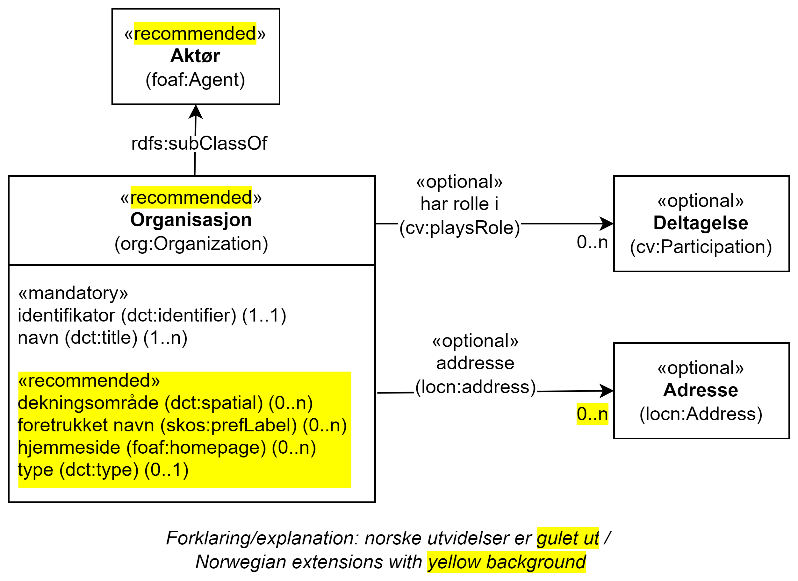

== Klassen Organisasjon (org:Organization) [[Organisasjon]]

[[img-KlassenOrganisasjon]]
.Klassen Organisasjon (org:Organization) og klassene den refererer til.
[link=images/KlassenOrganisasjon.png]

[cols="30s,70d"]
|===
| _English name_ | _Organization_
| Anvendelse / _Usage note_ | Klassen brukes til å representere en organisasjon.

_This class represents an organization. An organization is a group of people that get together in a community or other social, commercial or political structure. The group has some common purpose or reason for existence which goes beyond the set of people belonging to it and can act as an Agent._
| URI | org:Organization
| Subklasse av / _Subclass of_ | foaf:Agent
| Eksempel | Som eksempel på bruk av klassen, bruker vi en fiktiv exOrg ("Den beste restauranten AS") som ikke er en offentlig organisasjon.
|===

Eksempel i RDF Turtle:
-----
<exOrg> a org:Organization ; .
-----

=== Obligatoriske egenskaper for klassen _Organisasjon_ [[Organisasjon-obligatoriske-egenskaper]]

==== Organisasjon – foretrukket navn (skos:prefLabel) [[Organisasjon-foretrukketNavn]]

[cols="30s,70d"]
|===
| _English name_ | _preferred name_
| URI | skos:prefLabel
| Verdiområdet / _Range_ | rdf:langString
| Anvendelse / _Usage note_ |  Egenskapen brukes til å oppgi det foretrukne navnet til organisasjonen. Egenskapen BØR gjentas når navnet finnes på flere språk.

_This property represents a preferred label is used to provide the primary, legally recognised name of the Organization, as defined in the ORG Ontology. This property SHOULD be repeated when the name is in several languages._
| Multiplisitet / _Multiplicity_ |  0..n
| Kravnivå / _Requirement level_ |  Obligatorisk / _Mandatory_
| Merknad / _Note_ |  Norsk utvidelse: ikke eksplisitt spesifisert i CPSV-AP.

_Norwegian extension: not explicitly specified in CPSV-AP._
| Eksempel | Det foretrukne navnet til vår exOrg er «Den beste restauranten AS» (bokmål)
|===

Eksempel i RDF Turtle:
-----
<exOrg> a org:Organization ;
   skos:prefLabel "Den beste restauranten AS"@nb ; .
-----

==== Organisasjon – identifikator (dct:identifier) [[Organisasjon-identifikator]]

[cols="30s,70d"]
|===
| _English name_ | _identifier_
| URI | dct:identifier
| Verdiområdet / _Range_ | rdfs:Literal
| Anvendelse / _Usage note_ | Egenskapen brukes til å angi organisasjonens identifikasjonsnummer, for eksempel i henhold til Enhetsregisterets organisasjonsnummer.

_This property contains the identifier for the Organization._
| Multiplisitet / _Multiplicity_ | 1..1
| Kravnivå / _Requirement level_ | Obligatorisk / _Mandatory_
| Merknad / _Note_ | Når organisasjonen har et organisasjonsnummer registrert i Enhetsregisteret, BØR identifikatoren oppgis som en URI med f.eks. følgende mønster der "nnnnnnnnn" er organisasjonsnummeret: `\https://organization-catalog.fellesdatakatalog.digdir.no/organizations/nnnnnnnnn`.

_When the organization has an organization number registered in the Central Coordinating Register for Legal Entities (CCR), the identifier SHOULD be given as a URI with e.g. the following pattern where "nnnnnnnnn" is the organization number: `\https://organization-catalog.fellesdatakatalog.digdir.no/organizations/nnnnnnnnn`._
| Eksempel | Vår exOrg har organisasjonsnummer 1656923949276 (NB! ugyldig org.nr.)
|===

Eksempel I RDF Turtle:
-----
<exOrg> a org:Organization ;
   dct:identifier "https://organization-catalog.fellesdatakatalog.digdir.no/organizations/1656923949276"^^xsd:anyURI ;  .
-----

=== Anbefalte egenskaper for klassen _Organisasjon_ [[Organisasjon-anbefalte-egenskaper]]

==== Organisasjon – dekningsområde (dct:spatial) [[Organisasjon-dekningsområde]]

[cols="30s,70d"]
|===
| _English name_ | _spatial coverage_
| URI | dct:spatial
| Verdiområdet / _Range_ | dct:Location
| Anvendelse / _Usage note_ |  Egenskapen brukes til å referere til et geografisk område dekket av organisasjonen.

_This property contains the geographic or administrative region covered by an Organisation._
| Multiplisitet / _Multiplicity_ |  0..n
| Kravnivå / _Requirement level_ |  Anbefalt / _Recommended_
| Merknad 1 / _Note 1_ a|Følgende krav til bruk av kontrollerte vokabularer gjelder:

* Minst én verdi SKAL være fra en av følgende kontrollerte vokabularer: https://op.europa.eu/en/web/eu-vocabularies/concept-scheme/-/resource?uri=http://publications.europa.eu/resource/authority/continent[Kontinent &#x29C9;, window="_blank", role="ext-link"]; https://op.europa.eu/en/web/eu-vocabularies/concept-scheme/-/resource?uri=http://publications.europa.eu/resource/authority/country[Land &#x29C9;, window="_blank", role="ext-link"]; https://op.europa.eu/en/web/eu-vocabularies/concept-scheme/-/resource?uri=http://publications.europa.eu/resource/authority/place[Sted &#x29C9;, window="_blank", role="ext-link"].

* For å angi dekningsområde i Norge, BØR Kartverkets kontrollerte vokabular https://data.geonorge.no/administrativeEnheter/nasjon/doc/173163[Administrative enheter &#x29C9;, window="_blank", role="ext-link"] brukes.

__Regarding usage of controlled vocabularies, the following requirements apply:__

* __At least one value MUST be chosen from the following controlled vocabularies: https://op.europa.eu/en/web/eu-vocabularies/concept-scheme/-/resource?uri=http://publications.europa.eu/resource/authority/continent[Continent &#x29C9;, window="_blank", role="ext-link"]; https://op.europa.eu/en/web/eu-vocabularies/concept-scheme/-/resource?uri=http://publications.europa.eu/resource/authority/country[Country &#x29C9;, window="_blank", role="ext-link"]; https://op.europa.eu/en/web/eu-vocabularies/concept-scheme/-/resource?uri=http://publications.europa.eu/resource/authority/place[Place &#x29C9;, window="_blank", role="ext-link"].__

* __To specify spatial coverage in Norway, the Norwegian Mapping Authority's controlled vocabulary https://data.geonorge.no/administrativeEnheter/nasjon/doc/173163[Administrative units &#x29C9;, window="_blank", role="ext-link"] SHOULD be used.__
| Merknad 2 / _Note 2_  | Norsk utvidelse: Ikke eksplisitt spesifisert i CPSV-AP.

_Norwegian extension: Not explicitly specified in CPSV-AP._
| Eksempel | Se under <<OffentligOrganisasjon-dekningsområde>>.
|===

Eksempel i RDF Turtle: se under <<OffentligOrganisasjon-dekningsområde>>.

==== Organisasjon – type (dct:type) [[Organisasjon-type]]

[cols="30s,70d"]
|===
| _English name_ | _type_
| URI | dct:type
| Verdiområdet / _Range_ | skos:Concept
| Anvendelse / _Usage note_ | Egenskapen brukes til å oppgi type organisasjon.

_This property refers to a type of the organization._
| Multiplisitet / _Multiplicity_ | 0..1
| Kravnivå / _Requirement level_ | Anbefalt / _Recommended_
| Merknad 1 / _Note 1_| Verdien SKAL velges fra http://purl.org/adms/publishertype/[ADMS Publisher Type Vocabulary (lenket ressurs i RDF) &#x29C9;, window="_blank", role="ext-link"].

__The value MUST be chosen from http://purl.org/adms/publishertype/[ADMS Publisher Type Vocabulary (linked resource in RDF) &#x29C9;, window="_blank", role="ext-link"].__
| Merknad 2 / _Note 2_ |Norsk utvidelse: Ikke eksplisitt spesifisert i CPSV-AP.

_Norwegian extension: Not explicitly specified in CPSV-AP._
| Eksempel | Vår exOrg er av type _Company_.
|===

Eksempel i RDF Turtle:
-----
<exOrg> a org:Organization ;
   dct:type <http://purl.org/adms/publishertype/Company> ;  .
-----

=== Valgfrie egenskaper for klassen _Organisasjon_ [[Organisasjon-valgfrie-egenskaper]]

==== Organisasjon – adresse (locn:address) [[Organisasjon-adresse]]

[cols="30s,70d"]
|===
| _English name_ | _address_
| URI | locn:address
| Verdiområdet / _Range_ | locn:Address
| Anvendelse / _Usage note_ | Egenskapen brukes til å oppgi en adresse til organisasjonen.

_This property represents an Address related to an Organization._
| Multiplisitet / _Multiplicity_ | 0..n
| Kravnivå / _Requirement level_ | Valgfri / _Optional_
| Eksempel | Se under <<Adresse>>
|===

Eksempel i RDF Turtle: Se under <<Adresse>>

==== Organisasjon – deltar i (cv:participates) [[Organisasjon-deltar-i]]

[cols="30s,70d"]
|===
| _English name_ | _participates_
| URI | cv:participates
| Verdiområdet / _Range_ | cv:Participation
| Anvendelse / _Usage note_ | Egenskapen brukes til å knytte en deltagelse (cv:Participation) til en organisasjon.

_This property links an Organization to the Participation class (cv:Participation). The Participation class facilitates the detailed description of how an Organization participates in or interacts with a Public Service and may include temporal and spatial information._
| Multiplisitet / _Multiplicity_ | 0..n
| Kravnivå / _Requirement level_ | Valgfri / _Optional_
| Eksempel | Se under <<KnytteDeltagendeAktørerTilEnTjeneste>>.
|===

Eksempel i RDF Turtle: Se under <<KnytteDeltagendeAktørerTilEnTjeneste>>.

==== Organisasjon – hjemmeside (foaf:homepage) [[Organisasjon-hjemmeside]]

[cols="30s,70d"]
|===
| _English name_ | _homepage_
| URI | foaf:homepage
| Verdiområdet / _Range_ | foaf:Document
| Anvendelse / _Usage note_ |  Egenskapen brukes til å referere til hjemmesiden til organisasjonen.

_This property refers to the homepage of an Organisation._
| Multiplisitet / _Multiplicity_ | 0..n
| Kravnivå / _Requirement level_ |  Valgfri / _Optional_
| Merknad / _Note_ | Norsk utvidelse: Ikke eksplisitt spesifisert i CPSV-AP.

_Norwegian extension: Not explicitly specified in CPSV-AP._
| Eksempel | \https://example.org/home
|===

Eksempel i RDF Turtle:
-----
<exOrg> a org:Organization ;
   foaf:homepage <https://example.org/home> ;  .
-----
