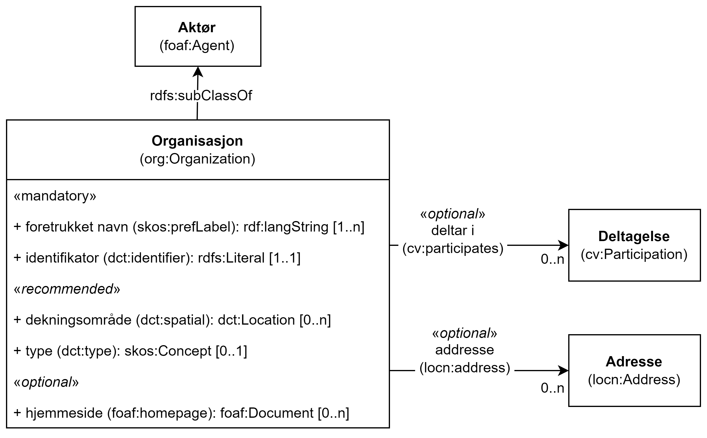

== Klassen Organisasjon (org:Organization) [[Organisasjon]]

[[img-KlassenOrganisasjon]]
.Klassen Organisasjon (org:Organization)
[link=images/KlassenOrganisasjon.png]

[cols="30s,70d"]
|===
|English name| Organization
|Anvendelse|Klassen brukes til å representere en organisasjon.
|Usage note|This class represents an organization. An organization is a group of people that get together in a community or other social, commercial or political structure. The group has some common purpose or reason for existence which goes beyond the set of people belonging to it and can act as an Agent.
|URI|org:Organization
|Subklasse av / Subclass of|foaf:Agent
|Kravnivå|Anbefalt/Recommended
|Eksempel| Som eksempel på bruk av klassen, bruker vi en fiktiv exOrg ("Den beste restauranten AS") som ikke er en offentlig organisasjon.
|===

Eksempel i RDF Turtle:
-----
<exOrg> a org:Organization ; .
-----

=== Obligatoriske egenskaper for klassen _Organisasjon_ [[Organisasjon-obligatoriske-egenskaper]]

==== Organisasjon – identifikator (dct:identifier) [[Organisasjon-identifikator]]

[cols="30s,70d"]
|===
|English name|identifier
|URI|dct:identifier
|Range|rdfs:Literal
|Anvendelse|Egenskapen brukes til å angi organisasjonens identifikasjonsnummer, for eksempel i henhold til Enhetsregisterets organisasjonsnummer.
|Usage note|This property contains the identifier for the Organization.
|Multiplisitet|1..1
|Kravnivå|Obligatorisk/Mandatory
|Merknad|Identifikator er som regel systemgenerert av verktøystøtte, slik at du som vanlig bruker ikke trenger å fylle ut verdien til egenskapen manuelt.

For deg som skal utvikle/tilpasse verktøystøtte: Når aktøren har et organisasjonsnummer bør identifikatoren oppgis som en URI med følgende mønster der "nnnnnnnnn" er organisasjonsnummeret: f.eks. `\https://organization-catalog.fellesdatakatalog.digdir.no/organizations/nnnnnnnnn`
|Eksempel| Vår exOrg har organisasjonsnummer 1656923949276 (NB! ugyldig org.nr.)
|===

Eksempel I RDF Turtle:
-----
<exOrg> a org:Organization ;
   dct:identifier "https://organization-catalog.fellesdatakatalog.digdir.no/organizations/1656923949276"^^xsd:anyURI ;  .
-----

==== Organisasjon – navn (dct:title) [[Organisasjon-navn]]

[cols="30s,70d"]
|===
|English name|name
|URI|dct:title
|Range|rdf:langString
|Anvendelse|Egenskapen brukes til å oppgi navnet på organisasjonen. Egenskapen bør gjentas når navnet finnes på flere språk.
|Usage note|This property contains the name of the organization. This property should be repeated for different versions of the name (e.g. the name in different languages).
|Multiplisitet|1..n
|Kravnivå|Obligatorisk/Mandatory
|Eksempel| Navnet til vår exOrg er «Den beste restauranten AS» (bokmål)
|===

Eksempel i RDF Turtle:
----
<exOrg> a org:Organization ;
   dct:title "Den beste restauranten AS"@nb ; .
----

=== Anbefalte egenskaper for klassen _Organisasjon_ [[Organisasjon-anbefalte-egenskaper]]

==== Organisasjon – dekningsområde (dct:spatial) [[Organisasjon-dekningsområde]]

[cols="30s,70d"]
|===
|English name|spatial coverage
|URI|dct:spatial
|Range|dct:Location
|Anvendelse| Egenskapen brukes til å referere til et geografisk område dekket av organisasjonen.
|Usage note| This property contains the geographic or administrative region covered by an Organisation.
|Multiplisitet| 0..n
|Kravnivå | Anbefalt/Recommended
|Merknad 1 a|Følgende krav til bruk av kontrollerte vokabularer gjelder:

* Minst en verdi skal være fra en av følgende kontrollerte vokabularer: https://op.europa.eu/en/web/eu-vocabularies/concept-scheme/-/resource?uri=http://publications.europa.eu/resource/authority/continent[Kontinent]; https://op.europa.eu/en/web/eu-vocabularies/concept-scheme/-/resource?uri=http://publications.europa.eu/resource/authority/country[Land]; https://op.europa.eu/en/web/eu-vocabularies/concept-scheme/-/resource?uri=http://publications.europa.eu/resource/authority/place[Sted]; http://sws.geonames.org/[GeoNavn].

* For å angi dekningsområde i Norge, bør Kartverkets kontrollerte vokabular https://data.geonorge.no/administrativeEnheter/nasjon/doc/173163[Administrative enheter] brukes.
|Remark 1 a|Regarding usage of controlled vocabularies, the following requirements apply:

* At least one value shall be chosen from the following controlled vocabularies: https://op.europa.eu/en/web/eu-vocabularies/concept-scheme/-/resource?uri=http://publications.europa.eu/resource/authority/continent[Continent]; https://op.europa.eu/en/web/eu-vocabularies/concept-scheme/-/resource?uri=http://publications.europa.eu/resource/authority/country[Country]; https://op.europa.eu/en/web/eu-vocabularies/concept-scheme/-/resource?uri=http://publications.europa.eu/resource/authority/place[Place]; http://sws.geonames.org/[GeoNames].

* To specify spatial coverage in Norway, the Norwegian Mapping Authority's controlled vocabulary https://data.geonorge.no/administrativeEnheter/nasjon/doc/173163[Administrative units] should be used.
|Merknad 2 | Norsk utvidelse: Ikke eksplisitt spesifisert i CPSV-AP.
|Remark 2 | Norwegian extension: Not explicitly specified in CPSV-AP.
|Eksempel| Se under <<OffentligOrganisasjon-dekningsområde>>.
|===

Eksempel i RDF Turtle: se under <<OffentligOrganisasjon-dekningsområde>>.

==== Organisasjon – foretrukket navn (skos:prefLabel) [[Organisasjon-foretrukketNavn]]

[cols="30s,70d"]
|===
|English name|preferred name
|URI|skos:prefLabel
|Range|rdf:langString
|Anvendelse| Egenskapen brukes til å oppgi det foretrukne navnet til organisasjonen. Egenskapen bør gjentas når navnet finnes på flere språk.
|Usage note| This property represents a preferred label is used to provide the primary, legally recognised name of the Organization, as defined in the ORG Ontology. The property should be repeated when the name is in several languages.
|Multiplisitet| 0..n
|Kravnivå | Anbefalt/Recommended
|Merknad| Norsk utvidelse: ikke eksplisitt spesifisert i CPSV-AP.
|Remark | Norwegian extension: not explicitly specified in CPSV-AP.
|Eksempel| Navnet til vår exOrg er «Den beste restauranten AS» (bokmål)
|===

Eksempel i RDF Turtle:
-----
<exOrg> a org:Organization ;
   skos:prefLabel "Den beste restauranten AS"@nb ; .
-----

==== Organisasjon – type (dct:type) [[Organisasjon-type]]

[cols="30s,70d"]
|===
|English name|type
|URI|dct:type
|Range|skos:Concept
|Anvendelse|Egenskapen brukes til å oppgi type organisasjon.
|Usage note|This property refers to a type of the organization.
|Multiplisitet|0..1
|Kravnivå|Anbefalt/Recommended
|Merknad 1|Verdien skal velges fra http://purl.org/adms/publishertype/[ADMS Publisher Type Vocabulary (lenket ressurs i RDF)].
|Remark 1|The value shall be chosen from http://purl.org/adms/publishertype/[ADMS Publisher Type Vocabulary (linked resource in RDF)].
|Merknad 2|Norsk utvidelse: Ikke eksplisitt spesifisert i CPSV-AP.
|Remark 2|Norwegian extension: Not explicitly specified in CPSV-AP.
|Eksempel| Vår exOrg er av type _Company_.
|===

Eksempel i RDF Turtle:
-----
<exOrg> a org:Organization ;
   dct:type <http://purl.org/adms/publishertype/Company> ;  .
-----

=== Valgfrie egenskaper for klassen _Organisasjon_ [[Organisasjon-valgfrige-egenskaper]]

==== Organisasjon – adresse (locn:address) [[Organisasjon-adresse]]

[cols="30s,70d"]
|===
|English name|address
|URI|locn:address
|Range|locn:Address
|Anvendelse|Egenskapen brukes til å oppgi en adresse til organisasjonen.
|Usage note|This property represents an Address related to an Organization.
|Multiplisitet|0..n
|Kravnivå|Valgfri/Optional
|Eksempel| Se under <<Adresse>>
|===

Eksempel i RDF Turtle: Se under <<Adresse>>

==== Organisasjon – deltar i (cv:participates) [[Organisasjon-deltar-i]]

[cols="30s,70d"]
|===
|English name|plays role
|URI|cv:participates
|Range|cv:Participation
|Anvendelse|Egenskapen brukes til å knytte en deltagelse (cv:Participation) til en organisasjon.
|Usage note|This property links an Oranization to the Participation class (cv:Participation). The Participation class facilitates the detailed description of how an Organization participates in or interacts with a Public Service and may include temporal and spatial information.
|Multiplisitet|0..n
|Kravnivå|Valgfri/Optional
|Eksempel|Se under <<KnytteDeltagendeAktørerTilEnTjeneste>>.
|===

Eksempel i RDF Turtle: Se under <<KnytteDeltagendeAktørerTilEnTjeneste>>.

==== Organisasjon – hjemmeside (foaf:homepage) [[Organisasjon-hjemmeside]]

[cols="30s,70d"]
|===
|English name|homepage
|URI|foaf:homepage
|Range|foaf:Document
|Anvendelse| Egenskapen brukes til å referere til hjemmesiden til organisasjonen.
|Usage note|This property refers to the homepage of an Organisation.
|Multiplisitet|0..n
|Kravnivå | Valgfri/Optional
|Merknad|Norsk utvidelse: Ikke eksplisitt spesifisert i CPSV-AP.
|Remark | Norwegian extension: Not explicitly specified in CPSV-AP.
|Eksempel| https://example.org/home
|===

Eksempel i RDF Turtle:
-----
<exOrg> a org:Organization ;
   foaf:homepage <https://example.org/home> ;  .
-----
