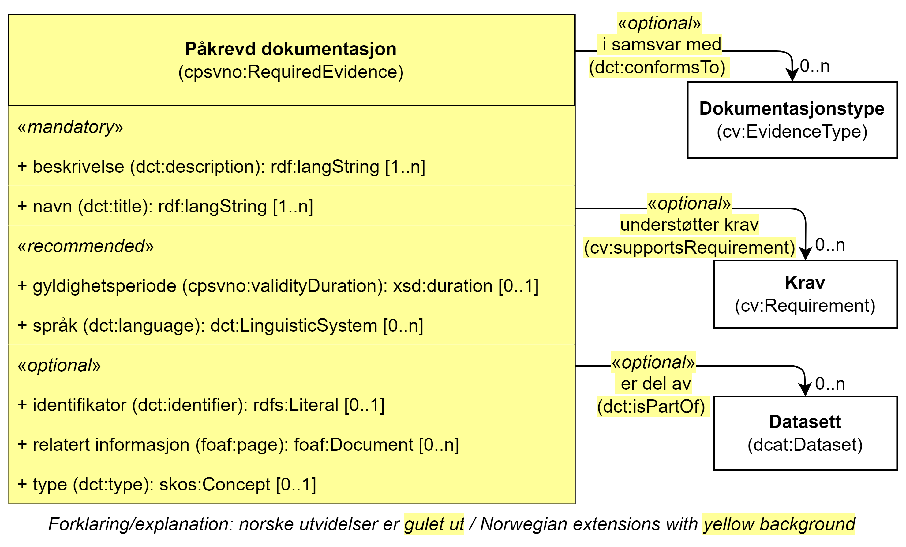

== Klassen Påkrevd dokumentasjon (cpsvno:RequiredEvidence) [[PåkrevdDokumentasjon]]

[[img-KlassenPåkrevdDokumentasjon]]
.Klassen Påkrevd dokumentasjon (cpsvno:RequiredEvidence) og klassene den refererer til.
[link=images/KlassenPåkrevdDokumentasjon.png]

[cols="30s,70d"]
|===
| _English name_ | _Required evidence_
| Anvendelse / _Usage note_ | Klassen brukes til å representere dokumentasjon som er påkrevd for å kunne utføre en tjeneste. 

_This class is used to represent an evidence that is required in order to execute a service._
| URI | cpsvno:RequiredInput
| Merknad / _Note_ | Norsk utvidelse: Ikke eksplisitt spesifisert i CPSV-AP.

_Norwegian extension: Not explicitly specified in CPSV-AP._
| Eksempel | Firmaattest fra Brønnøysundregistrene (som er påkrevd for tjenesten «Skjenkebevilling (i Brønnøy kommune)»).
|===

Eksempel i RDF Turtle:
----
<påkrevdFirmaattest> a cpsvno:RequiredEvidence ; .
----

=== Obligatoriske egenskaper for klassen _Påkrevd dokumentasjon_ [[PåkrevdDokumentasjon-obligatoriske-egenskaper]]

==== Påkrevd dokumentasjon – beskrivelse (dct:description) [[PåkrevdDokumentasjon-beskrivelse]]

[cols="30s,70d"]
|===
| _English name_ | _description_
| URI | dct:description
|Verdiområde / _Range_ | rdf:langString
| Anvendelse / _Usage note_ | Egenskapen brukes til å oppgi en tekstlig beskrivelse av den påkrevde dokumentasjonen. Egenskapen BØR gjentas når beskrivelsen finnes på flere språk.

_This property represents a free text Description of the required evidence. This property SHOULD be when the description is in parallel languages._
| Multiplisitet / _Multiplicity_ | 1..n
| Kravnivå / _Requirement level_ | Obligatorisk / _Mandatory_
| Merknad / _Note_ | Norsk utvidelse: Ikke eksplisitt spesifisert i CPSV-AP.

_Norwegian extension: Not explicitly specified in CPSV-AP._
| Eksempel |  «Firmaattest utstedt av Brønnøysundregistrene»
|===

Eksempel i RDF Turtle:
-----
<påkrevdFirmaattest> a cpsvno:RequiredEvidence ; 
   dct:description "Firmaattest utstedt av Brønnøysundregistrene"@nb ; .
-----

==== Påkrevd dokumentasjon – navn (dct:title) [[PåkrevdDokumentasjon-navn]]

[cols="30s,70d"]
|===
| _English name_ | _name_
| URI | dct:title
|Verdiområde / _Range_ | rdf:langString
| Anvendelse / _Usage note_ | Egenskapen brukes til å oppgi navnet til den påkrevde dokumentasjonen. Egenskapen BØR gjentas når navnet finnes på flere språk.

_This property represents the name of the required evidence. This property SHOULD be repeated when the name is in parallel languages._ 
| Multiplisitet / _Multiplicity_ | 1..n
| Kravnivå / _Requirement level_ | Obligatorisk / _Mandatory_
| Merknad / _Note_ | Norsk utvidelse: Ikke eksplisitt spesifisert i CPSV-AP.

_Norwegian extension: Not explicitly specified in CPSV-AP._
| Eksempel | «Firmaattest»
|===

Eksempel i RDF Turtle:
-----
<påkrevdFirmaattest> a cpsvno:RequiredEvidence ; 
   dct:title "Firmaattest"@nb ; .
-----

=== Anbefalte egenskaper for klassen _Påkrevd dokumentasjon_ [[PåkrevdDokumentasjon-anbefalte-egenskaper]]

==== Påkrevd dokumentasjon – gyldighetsperiode (cpsvno:validityDuration) [[PåkrevdDokumentasjon-gyldighetsperiode]]

[cols="30s,70d"]
|===
| _English name_ |  _validity duration_
| URI | cpsvno:validityDuration
|Verdiområde / _Range_ | xsd:duration
| Anvendelse / _Usage note_ | Egenskapen brukes til å angi en tidsperiode som den påkrevd dokumentasjonen skal være gyldig innenfor.

_This property represents time duration within which the required evidence must be valid._
| Multiplisitet / _Multiplicity_ | 0..1
| Kravnivå / _Requirement level_ | Anbefalt / _Recommended_
| Merknad / _Note_ | Norsk utvidelse: Ikke eksplisitt spesifisert i CPSV-AP.

_Norwegian extension: Not explicitly specified in CPSV-AP._
| Eksempel | Ikke eldre enn 6 måneder.
|===

Eksempel i RDF Turtle:
-----
<påkrevdFirmaattest> a cpsvno:RequiredEvidence ; 
   cpsvno:validityDuration "P6M"^^xsd:duration ; . # 6 måneder
-----

==== Påkrevd dokumentasjon – språk (dct:language) [[PåkrevdDokumentasjon-språk]]

[cols="30s,70d"]
|===
| _English name_ | _language_
| URI | dct:language
|Verdiområde / _Range_ | dct:LinguisticSystem
| Anvendelse / _Usage note_ | Egenskapen brukes til å oppgi språk som den påkrevde dokumentasjonen skal være på.

_This property is used to specify the language(s) that the required evidence must be written in._
| Multiplisitet / _Multiplicity_ | 0..n
| Kravnivå / _Requirement level_ | Anbefalt / _Recommended_
|Merknad 1 / _Note 1_ | Verdien SKAL velges fra EUs kontrollerte vokabular https://op.europa.eu/en/web/eu-vocabularies/concept-scheme/-/resource?uri=http://publications.europa.eu/resource/authority/language[Språk &#x29C9;, window="_blank", role="ext-link"].

__The value MUST be chosen from EU's controlled vocabulary https://op.europa.eu/en/web/eu-vocabularies/concept-scheme/-/resource?uri=http://publications.europa.eu/resource/authority/language[Language &#x29C9;, window="_blank", role="ext-link"].__
| Merknad 2 / _Note 2_ | Norsk utvidelse: Ikke eksplisitt spesifisert i CPSV-AP.

_Norwegian extension: Not explicitly specified in CPSV-AP._
| Eksempel | Den påkrevd dokumentasjonen må være på norsk eller engelsk.
|===

Eksempel i RDF Turtle:
-----
<påkrevdFirmaattest> a cpsvno:RequiredEvidence ; 
   dct:language
      <https://publications.europa.eu/resource/authority/language/NOR>, # norsk 
      <https://publications.europa.eu/resource/authority/language/ENG>; # engelsk  
   .
-----

=== Valgfrie egenskaper for klassen _Påkrevd dokumentasjon_ [[PåkrevdDokumentasjon-valgfrie-egenskaper]]

==== Påkrevd dokumentasjon – er del av (dct:isPartOf) [[PåkrevdDokumentasjon-erDelAv]]

[cols="30s,70d"]
|===
| _English name_ |  _is part of_
| URI | dct:isPartOf
|Verdiområde / _Range_ | https://informasjonsforvaltning.github.io/dcat-ap-no/#Datasett[dcat:Dataset &#x29C9;, window="_blank", role="ext-link"]
| Anvendelse / _Usage note_ | Egenskapen brukes til å referere til et datasett som den påkrevde dokumentasjonen fysisk eller logisk kan være inkludert i.

_This property is used to refer to a dataset in which the required evidence may  physically or logically be included._
| Multiplisitet / _Multiplicity_ | 0..n
| Kravnivå / _Requirement level_ | Valgfri / _Optional_
| Merknad / _Note_ | Norsk utvidelse: Ikke eksplisitt spesifisert i CPSV-AP.

_Norwegian extension: Not explicitly specified in CPSV-AP._
| Eksempel | Firmaattest kan hentes fra (dermed er en del av) Foretaksregisteret.
|===

Eksempel i RDF Turtle:
-----
<påkrevdFirmaattest> a cpsvno:RequiredEvidence ; 
   dct:isPartOf <foretaksregisteret> . 
-----

==== Påkrevd dokumentasjon – identifikator (dct:identifier) [[PåkrevdDokumentasjon-identifikator]]

[cols="30s,70d"]
|===
| _English name_ | _identifier_
| URI | dct:identifier
|Verdiområde / _Range_ | rdfs:Literal
| Anvendelse / _Usage note_ | Egenskapen brukes til å oppgi identifikatoren til den påkrevde dokumentasjonen som beskrives.

_This property represents an identifier for the required evidence that is descibed._
| Multiplisitet / _Multiplicity_ | 0..1
| Kravnivå / _Requirement level_ | Valgfri / _Optional_
| Merknad / _Note_ | Norsk utvidelse: Ikke eksplisitt spesifisert i CPSV-AP.

_Norwegian extension: Not explicitly specified in CPSV-AP._
|===

==== Påkrevd dokumentasjon – i samsvar med (dct:conformsTo) [[PåkrevdDokumentasjon-iSamsvarMed]]

[cols="30s,70d"]
|===
| _English name_ |  _is conformant to_
| URI |  dct:conformsTo
|Verdiområde / _Range_ |  cv:EvidenceType
| Anvendelse / _Usage note_ | Egenskapen brukes til å oppgi dokumentasjonstypen som den påkrevde dokumentasjonen skal være i samsvar med.

_This property represents the evidence type that the required evidence must conform to._
| Multiplisitet / _Multiplicity_ | 0..n
| Kravnivå / _Requirement level_ | Valgfri / _Optional_
| Merknad / _Note_ | Norsk utvidelse: Ikke eksplisitt spesifisert i CPSV-AP.

_Norwegian extension: Not explicitly specified in CPSV-AP._
|===

==== Påkrevd dokumentasjon – relatert informasjon (foaf:page) [[PåkrevdDokumentasjon-relatertInformasjon]]

[cols="30s,70d"]
|===
| _English name_ | _related documentation_
| URI | foaf:page
|Verdiområde / _Range_ | foaf:Document
| Anvendelse / _Usage note_ | Egenskapen brukes til å referere til mer informasjon om den påkrevde dokumentasjonen, f.eks. en bestemt mal til dokumentasjonen eller en veiledning for hvordan man skal formatere dokumentasjonen.

_This property represents documentation that contains information related to the required evidence, for instance a particular template for the require evidence or a guide on formatting the evidence._
| Multiplisitet / _Multiplicity_ | 0..n
| Kravnivå / _Requirement level_ | Valgfri / _Optional_
| Merknad / _Note_ | Norsk utvidelse: Ikke eksplisitt spesifisert i CPSV-AP.

_Norwegian extension: Not explicitly specified in CPSV-AP._
|===

==== Påkrevd dokumentasjon – type (dct:type) [[PåkrevdDokumentasjon-type]]

[cols="30s,70d"]
|===
| _English name_ | _type_
| URI | dct:type
|Verdiområde / _Range_ | skos:Concept
| Anvendelse / _Usage note_ | Egenskapen brukes til å referere til begrepet som representerer typen dokumentasjonen tilhører.

_This property represents the type of Evidence as described in a controlled vocabulary._
| Multiplisitet / _Multiplicity_ | 0..1
| Kravnivå / _Requirement level_ |  Valgfri / _Optional_
| Merknad 1 / _Note 1_ | Verdien SKAL velges fra kontrollerte vokabular https://data.norge.no/vocabulary/evidence-type[Dokumentasjonstype &#x29C9;, window="_blank", role="ext-link"], når verdien finnes på listen.

__The value MUST be chosen from the controlled vocabulary https://data.norge.no/vocabulary/evidence-type[Evidence type &#x29C9;, window="_blank", role="ext-link"], when the value is in the vocabulary.__
| Merknad 2 / _Note 2_ | Norsk utvidelse: Ikke eksplisitt spesifisert i CPSV-AP.

_Norwegian extension: Not explicitly specified in CPSV-AP._
| Eksempel | Den påkrevde «Firmaattest» er av type «attest»
|===

Eksempel i RDF Turtle:
-----
<påkrevdFirmaattest> a cpsvno:RequiredEvidence ; 
   dct:type <https://data.norge.no/vocabulary/evidence-type#attestation> ; # attest
   .
-----

==== Påkrevd dokumentasjon – understøtter krav (cv:supportsRequirement) [[PåkrevdDokumentasjon-understøtterKrav]]

[cols="30s,70d"]
|===
| _English name_ |  _supports requirement_
| URI |  cv:supportsRequirement
|Verdiområde / _Range_ |  cv:Requirement
| Anvendelse / _Usage note_ | Egenskapen brukes til å referere til krav som dokumentasjonen understøtter.

_This property is used to refer to the requirement that the evidence supports._
| Multiplisitet / _Multiplicity_ | 0..n
| Kravnivå / _Requirement level_ | Valgfri / _Optional_
| Merknad / _Note_ | Norsk utvidelse: Ikke eksplisitt spesifisert i CPSV-AP.

_Norwegian extension: Not explicitly specified in CPSV-AP._
|===

