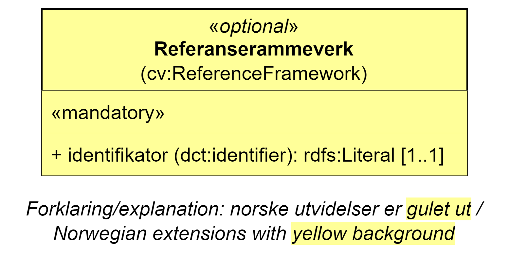

== Klassen Referanserammeverk (cv:ReferenceFramework) [[Referanserammeverk]]

[[img-KlassenReferanserammeverk]]
.Klassen Referanserammeverk (cv:ReferenceFramework).
[link=images/KlassenReferanserammeverk.png]

[cols="30s,70d"]
|===
| _English name_ | _Reference Framework_
| Anvendelse / _Usage note_ |  Klassen brukes til å representere lovgivning eller offisiell politikk som krav er utledet fra. Eksempler kan være prosedyrer, anskaffelsesreglement osv.

_This class represents legislation or official policy from which Requirements are derived. Examples include procedures, tendering legislation etc._
| URI |  cv:ReferenceFramework
| Kravnivå / _Requirement level_ |  Valgfri / _Optional_
| Merknad / _Note_ |  Norsk utvidelse: Ikke eksplisitt spesifisert i CPSV-AP, men i CCCEV som CPSV-AP også bruker.

_Norwegian extension: Not explicitly specified in CPSV-AP, but in CCCEV which CPSV-AP also uses._
| Eksempel |  Se under <<Å-beskrive-dokumentasjonskrav>>.
|===

Eksempel i RDF Turtle: Se under <<Å-beskrive-dokumentasjonskrav>>.

=== Obligatoriske egenskaper for klassen _Referanserammeverk_ [[Referanserammeverk-obligatoriske-egenskaper]]

==== Referanserammeverk – identifikator (dct:identifier) [[Referanserammeverk-identifikator]]

[cols="30s,70d"]
|===
| _English name_ | _identifier_
| URI |  dct:identifier
| Verdiområde / _Range_ | rdfs:Literal
| Anvendelse / _Usage note_ |  Egenskapen brukes til å oppgi en unik referanse til referanserammeverket.

_This property represents an unambiguous reference to a reference framework._
| Multiplisitet / _Multiplicity_ | 1..1
| Kravnivå / _Requirement level_ |  Obligatorisk / _Mandatory_
| Merknad / _Note_ |  Norsk utvidelse: Ikke eksplisitt spesifisert i CPSV-AP, men i CCCEV som CPSV-AP også bruker.

_Norwegian extension: Not explicitly specified in CPSV-AP, but in CCCEV which CPSV-AP also uses._
|===
