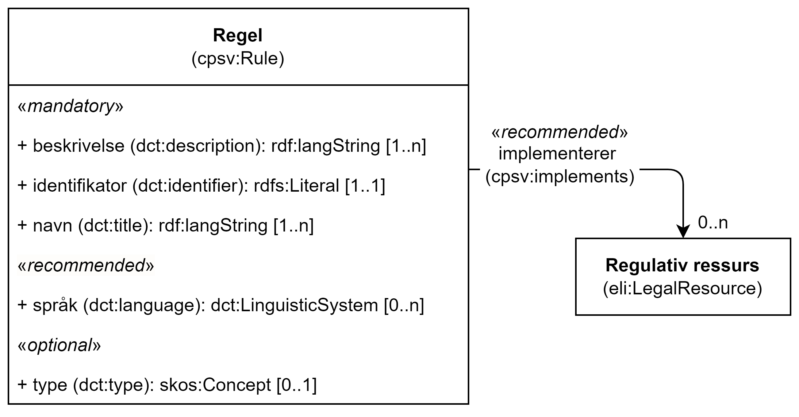

== Klassen Regel (cpsv:Rule) [[Regel]]

[[img-KlassenRegel]]
.Klassen Regel (cv:Rule)
[link=images/KlassenRegel.png]

[cols="30s,70d"]
|===
|English name|Rule
|Anvendelse| Klassen brukes til å representere regler/dokumenter som setter spesifikke regler, retningslinjer eller prosedyrer som skal følges av en tjeneste.
|Usage note| The Rule class represents a document that sets out the specific rules, guidelines or procedures that a Service follows. It includes the terms of service, licence, and authentication requirements of the Service.
|URI|cpsv:Rule
|Kravnivå |Valgfri/Optional
|Eksempel|Se under <<KnytteTilRegelverk>> for eksempler på bruk av klassen.
|===

=== Obligatoriske egenskaper for klassen _Regel_ [[Regel-obligatoriske-egenskaper]]

==== Regel – beskrivelse (dct:description) [[Regel-beskrivelse]]

[cols="30s,70d"]
|===
|English name|description
|URI|dct:description
|Range| rdf:langString
|Anvendelse| Egenskapen brukes til å oppgi en tekstlig beskrivelse av regelen. Egenskapen bør gjentas når beskrivelsen finnes på flere språk.
|Usage note| This property contains descriptive textual information about the Rule. This property should be repeated in case there are various versions of the text in different languages.
|Multiplisitet|1..n
|Kravnivå |Obligatorisk/Mandatory
|===

==== Regel – identifikator (dct:identifier) [[Regel-identifikator]]

[cols="30s,70d"]
|===
|English name|identifier
|URI|dct:identifier
|Range|rdfs:Literal
|Anvendelse| Egenskapen brukes til å oppgi identifikatoren til regelen.
|Usage note| This property contains an identifier for the rule.
|Multiplisitet|1..1
|Kravnivå |Obligatorisk/Mandatory
|Merknad|Identifikator er som regel systemgenerert av verktøystøtte, slik at du som vanlig bruker ikke trenger å fylle ut verdien til egenskapen manuelt.

For deg som skal utvikle/tilpasse verktøystøtte, se https://data.norge.no/guide/veileder-beskrivelse-av-datasett/#om-identifikator[Om identifikator (dct:identifier) i Veileder for beskrivelse av datasett osv.]
|===

==== Regel – navn (dct:title) [[Regel-navn]]

[cols="30s,70d"]
|===
|English name|name
|URI|dct:title
|Range| rdf:langString
|Anvendelse| Egenskapen brukes til å oppgi en beskrivende navn eller navn for regelen. Gjentas når navnet finnes på flere språk.
|Usage note| This property refers to the descriptive title or name of a Resource. This property should be repeated in case there are various versions of the text in different languages.
|Multiplisitet|1..n
|Kravnivå |Obligatorisk/Mandatory
|===

=== Anbefalte egenskaper for klassen _Regel_ [[Regel-anbefalte-egenskaper]]

==== Regel – implementerer (cpsv:implements) [[Regel-implementerer]]

[cols="30s,70d"]
|===
|English name|implements
|URI|cpsv:implements
|Range|eli:LegalResource
|Anvendelse| Egenskapen brukes til å referere til en regulativ ressurs som regelen er definert inn under.
|Usage note| This property links a Rule to relevant legislation or policy documents, such as the Legal Resource under which the Rules are defined.
|Multiplisitet|0..n
|Kravnivå |Anbefalt/Recommended
|Merknad| Norsk utvidelse: Kravnivå endret fra valgfri til anbefalt.
|Remark | Norwegian extension: Requirement level changed from optional to recommended.
|Eksempel|Se under <<KnytteTilRegelverk>>.
|===

Eksempel i RDF Turtle: Se under <<KnytteTilRegelverk>>.

==== Regel – språk (dct:language) [[Regel-språk]]

[cols="30s,70d"]
|===
|English name|language
|URI|dct:language
|Range|dct:LinguisticSystem
|Anvendelse| Egenskapen brukes til å referere til språk som regelen er tilgjengelig i.
|Usage note|This property represents the language(s) in which the Rule is available. This could be one or multiple languages, for instance in countries with more than one official language.
|Multiplisitet|0..n
|Kravnivå |Anbefalt/Recommended
|Merknad 1 |Verdien skal velges fra EUs kontrollerte vokabular https://op.europa.eu/en/web/eu-vocabularies/concept-scheme/-/resource?uri=http://publications.europa.eu/resource/authority/language[Språk].
|Remark 1 |The value shall be chosen from EU's controlled vocabulary https://op.europa.eu/en/web/eu-vocabularies/concept-scheme/-/resource?uri=http://publications.europa.eu/resource/authority/language[Language].
|Merknad 2 | Norsk utvidelse: Kravnivå endret fra valgfri til anbefalt.
|Remark 2 | Norwegian extension: Requirement level changed from optional to recommended.
|===

=== Valgfrie egenskaper for klassen _Regel_ [[Regel-valgfrie-egenskaper]]

==== Regel – type (dct:type) [[Regel-type]]

[cols="30s,70d"]
|===
|English name|type
|URI|dct:type
|Range|skos:Concept
|Anvendelse| Egenskapen brukes til å spesifisere type regel. Egenskapen skal bruke et kontrollert vokabular.
|Usage note|This property refers to the type of a Rule. It must use a controlled vocabulary.
|Multiplisitet|0..n
|Kravnivå |Valgfri/Optional
|Merknad|Verdien skal velges fra det felles kontrollerte vokabularet https://data.norge.no/vocabulary/rule-type[Regeltype], når verdien finnes i vokabularet.
|Remark | The value shall be chosen from the common controlled vocabulary https://data.norge.no/vocabulary/rule-type[Rule type], when the value is in the vocabulary.
|===
