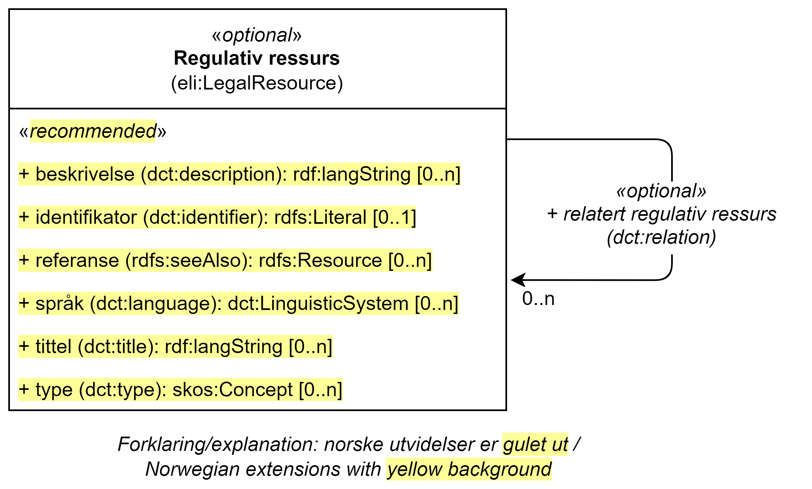

ravnivå == Klassen Regulativ ressurs (eli:LegalResource) [[RegulativRessurs]]

[[img-KlassenRegulativRessurs]]
.Klassen Regulativ ressurs (eli:LegealResource)
[link=images/KlassenRegulativRessurs.png]

[cols="30s,70d"]
|===
|English name|Legal Resource
|Anvendelse| Klassen brukes til å representere en regulativ ressurs, f.eks. regelverk eller politikk som regulerer utførelsen av en tjeneste.
|Usage note| This class represents the legislation, policy or policies that lie behind the Rules that govern the service.
|URI|eli:LegalResource
|Kravnivå |Valgfri/Optional
|Merknad|
|Eksempel|Se under <<KnytteTilRegelverk>> for eksempel på bruk av denne klassen.
|===

Eksempel i RDF Turtle: Se under <<KnytteTilRegelverk>>.

=== Anbefalte egenskaper for klassen _Regulativ ressurs_ [[RegulativRessurs-anbefalte-egenskaper]]

==== Regulativ ressurs – beskrivelse (dct:description) [[RegulativRessurs-beskrivelse]]

[cols="30s,70d"]
|===
|English name|description
|URI|dct:description
|Range| rdf:langString
|Anvendelse| Egenskapen brukes til å referere til en tekstlig beskrivelse av ressursen. Gjentas når den finnes i flere ulike språk.
|Usage note|This property contains descriptive textual information about the Legal Resource. This property should be repeated in case there are various versions of the text in different languages.
|Multiplisitet|0..n
|Kravnivå |Anbefalt/Recommended
|Merknad|Norsk utvidelse: Ikke eksplisitt tatt med i CPSV-AP, men i DCAT-AP-NO.
|Remark | Norwegian extension: Not explicitly specified in CPSV-AP.
|Eksempel|
|===

==== Regulativ ressurs – identifikator (dct:identifier) [[RegulativRessurs-identifikator]]

[cols="30s,70d"]
|===
|English name|identifier
|URI|dct:identifier
|Range|rdfs:Literal
|Anvendelse| Egenskapen brukes til å oppgi en identifikator til ressursen.
|Usage note|This property contains an identifier for the rule.
|Multiplisitet|0..1
|Kravnivå |Anbefalt/Recommended
|Merknad 1|Identifikator er som regel systemgenerert av verktøystøtte, slik at du som vanlig bruker ikke trenger å fylle ut verdien til denne egenskapen manuelt.

For deg som skal utvikle/tilpasse verktøystøtte, se https://data.norge.no/guide/veileder-beskrivelse-av-datasett/#om-identifikator[Om identifikator (dct:identifier) i Veileder for beskrivelse av datasett osv.]
|Merknad 2|Norsk utvidelse: Ikke eksplisitt tatt med i CPSV-AP, men i DCAT-AP-NO.
|Remark 2| Norwegian extension: Not explicitly specified in CPSV-AP.
|Eksempel|
|===

==== Regulativ ressurs – referanse (rdfs:seeAlso) [[RegulativRessurs-referanse]]

[cols="30s,70d"]
|===
|English name|reference
|URI|rdfs:seeAlso
|Range|rdfs:Resource
|Anvendelse| Egenskapen brukes til å oppgi referanse til den regulative ressursen.
|Usage note|To specify the reference(s) to the legal resource.
|Multiplisitet|0..n
|Kravnivå |Anbefalt/Recommended
|Merknad|Norsk utvidelse: Ikke eksplisitt tatt med i CPSV-AP, men i DCAT-AP-NO.
|Remark | Norwegian extension: Not explicitly specified in CPSV-AP.
|Eksempel|Se under <<KnytteTilRegelverk>>.
|===

Eksempel i RDF: Se under <<KnytteTilRegelverk>>.

==== Regulativ ressurs – språk (dct:language) [[RegulativRessurs-språk]]

[cols="30s,70d"]
|===
|English name| language
|URI|dct:language
|Range|dct:LinguisticSystem
|Anvendelse| Egenskapen brukes til å oppgi språk som den regulative ressursen er i.
|Usage note|To specify the language the legal resource is in.
|Multiplisitet|0..n
|Kravnivå |Anbefalt/Recommended
|Merknad 1 |Verdien skal velges fra EUs kontrollerte vokabular https://op.europa.eu/en/web/eu-vocabularies/concept-scheme/-/resource?uri=http://publications.europa.eu/resource/authority/language[Språk].
|Remark 1 | The value shall be chosen from Eu's controlled vocabulary https://op.europa.eu/en/web/eu-vocabularies/concept-scheme/-/resource?uri=http://publications.europa.eu/resource/authority/language[Language].
|Merknad 2|Norsk utvidelse: Ikke eksplisitt tatt med i CPSV-AP.
|Remark 2| Norwegian extension: Not explicitly specified in CPSV-AP.
|Eksempel|Se under <<KnytteTilRegelverk>>.
|===

Eksempel i RDF: Se under <<KnytteTilRegelverk>>.

==== Regulativ ressurs – tittel (dct:title) [[RegulativRessurs-tittel]]

[cols="30s,70d"]
|===
|English name| title
|URI|dct:title
|Range| rdf:langString
|Anvendelse| Egenskapen brukes til å oppgi tittel til den regulative ressursen.
|Usage note|To specify the title of the legal resource.
|Multiplisitet|0..n
|Kravnivå |Anbefalt/Recommended
|Merknad|Norsk utvidelse: Ikke eksplisitt tatt med i CPSV-AP.
|Remark| Norwegian extension: Not explicitly specified in CPSV-AP.
|Eksempel|Se under <<KnytteTilRegelverk>>.
|===

Eksempel i RDF: Se under <<KnytteTilRegelverk>>.

==== Regulativ ressurs – type (dct:type) [[RegulativRessurs-type]]

[cols="30s,70d"]
|===
|English name|type
|URI|dct:type
|Range|eli:ResourceType
|Anvendelse| Egenskapen brukes til å referere til typen av en regulativ ressurs (f.eks. direktiv, forordning).
|Usage note|This property refers to the type of a legal resource (e.g. "Directive", "Règlement grand ducal", "law", "Règlement ministériel", "draft proposition", "Parliamentary act", etc.). Member states are encouraged to make their own list of values in the corresponding concept scheme.
|Multiplisitet|1..n
|Kravnivå |Obligatorisk/Mandatory
|Merknad 1 | Verdien skal velges fra det felles kontrollerte vokabularet https://data.norge.no/vocabulary/legal-resource-type[Regulativ ressurs type], når verdien finnes i vokabularet.
|Remark 1 | The value shall be chosen from the common controlled vocabulary https://data.norge.no/vocabulary/legal-resource-type[Legal resource type], when the value is in the vocabulary.
|Merknad 2|Norsk utvidelse: Ikke eksplisitt tatt med i CPSV-AP, men i DCAT-AP-NO.
|Remark 2 |Norwegian extension: Not explicitly specified in CPSV-AP.
|Eksempel|
|===

=== Valgfrie egenskaper for klassen _Regulativ ressurs_ [[RegulativRessurs-valgfrie-egenskaper]]

==== Regulativ ressurs – relatert regulativ ressurs (dct:relation) [[RegulativRessurs-relatertRegulativRessurs]]

[cols="30s,70d"]
|===
|English name|related legal resource
|URI|dct:relation
|Range|eli:LegalResource
|Anvendelse| Egenskapen brukes til å referere til en annen relatert regulativ ressurs.
|Usage note|This property represents another instance of the Legal Resource class that is related to a particular Legal Resource being described.
|Multiplisitet|0..n
|Kravnivå |Valgfri/Optional
|Merknad|
|Eksempel|
|===
