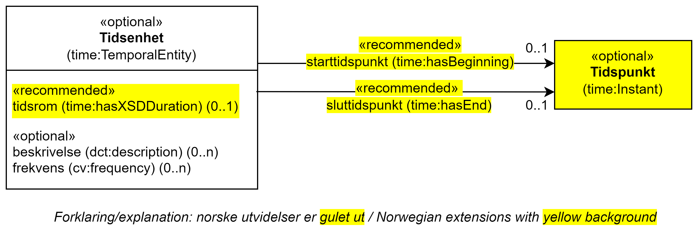

== Klassen Tidsenhet (time:TemporalEntity) [[Tidsenhet]]

[[img-KlassenTidsenhet]]
.Klassen Tidsenhet (time:TemporalEntity) og klassen den refererer til.
[link=images/KlassenTidsenhet.png]

[cols="30s,70d"]
|===
| _English name_ | _Temporal Entity_
| Anvendelse / _Usage note_ |  Klassen brukes til å representere et tidsintervall eller tidspunkt.

_This class represents a temporal interval or instant._
| URI |  time:TemporalEntity
| Kravnivå / _Requirement level_ |  Valgfri / _Optional_
|===

=== Anbefalte egenskaper for klassen _Tidsenhet_ [[Tidsenhet-anbefalte-egenskaper]]

==== Tidsenhet – sluttidspunkt (time:hasEnd) [[Tidsenhet-sluttidspunkt]]
[cols="30s,70d"]
|===
| _English name_ | _end time_
| URI |  time:hasEnd
| Verdiområde / _Range_ |  time:Instant
| Anvendelse / _Usage noe_ |  Egenskapen brukes til å oppgi slutten på en tidsenhet.

_This property represents the end of a temporal entity._
| Multiplisitet / _Multiplicity_ |  0..1
| Kravnivå / _Requirement level_ |  Anbefalt / _Recommended_
| Merknad / _Note_ |  Norsk utvidelse: Ikke eksplisitt spesifisert i CPSV-AP.

_Norwegian extension: Not explicitly specified in CPSV-AP._
| Eksempel | Normal åpningstid: kl. 08.00-16.00 alle ukedager. 
|===

Eksempel i RDF Turtle, åpningstider på vanlige ukedager/virkedager:
-----
<exServiceChannelPhone> a cv:Channel;
   dct:type <http://data.europa.eu/snb/com-channel/c05134f579>; # type = Phone
   cv:openingHours <exNormalMondayOpeningHours>, # normal Monday opening hours
      <exNormalTuesdayOpeningHours>, # normal Tuesday opening hours
      <exNormalWednesdayOpeningHours>, # normal Wednesday opening hours
      <exNormalThursdayOpeningHours>, # normal Thursday opening hours
      <exNormalFridayOpeningHours>; # normal Friday opening hours
   . 

<exNormalMondayOpeningHours> a time:TemporalEntity;
   time:hasBeginning [ a time:Instant;
      time:inDateTime [ a time:DateTimeDescription;
         time:unitType time:unitMinute;
         time:hour 8;
         time:minute 0;
         time:dayOfWeek time:Monday;
         ];
      ];
   time:hasEnd [ a time:Instant;
      time:inDateTime [ a time:DateTimeDescription;
         time:unitType time:unitMinute;
         time:hour 16;
         time:minute 0;
         time:dayOfWeek time:Monday;
         ];
      ];
   cv:frequency <http://publications.europa.eu/resource/authority/frequency/WEEKLY>;
   dct:description "normal Monday opening hours"@en, "normal åpningstid på mandager"@nb;
   .

<exNormalTuesdayOpeningHours> a time:TemporalEntity;
   time:hasBeginning [ a time:Instant;
      time:inDateTime [ a time:DateTimeDescription;
         time:unitType time:unitMinute;
         time:hour 8;
         time:minute 0;
         time:dayOfWeek time:Tuesday;
         ];
      ];
   time:hasEnd [ a time:Instant;
      time:inDateTime [ a time:DateTimeDescription;
         time:unitType time:unitMinute;
         time:hour 16;
         time:minute 0;
         time:dayOfWeek time:Tuesday;
         ];
      ];
   cv:frequency <http://publications.europa.eu/resource/authority/frequency/WEEKLY>;
   dct:description "normal Tuesday opening hours"@en, "normal åpningstid på tirsdager"@nb;
   .

<exNormalWednesdayOpeningHours> a time:TemporalEntity;
   time:hasBeginning [ a time:Instant;
      time:inDateTime [ a time:DateTimeDescription;
         time:unitType time:unitMinute;
         time:hour 8;
         time:minute 0;
         time:dayOfWeek time:Wednesday;
         ];
      ];
   time:hasEnd [ a time:Instant;
      time:inDateTime [ a time:DateTimeDescription;
         time:unitType time:unitMinute;
         time:hour 16;
         time:minute 0;
         time:dayOfWeek time:Wednesday;
         ];
      ];
   cv:frequency <http://publications.europa.eu/resource/authority/frequency/WEEKLY>;
   dct:description "normal Wednesday opening hours"@en, "normal åpningstid på onsdager"@nb;
   .

<exNormalThursdayOpeningHours> a time:TemporalEntity;
   time:hasBeginning [ a time:Instant;
      time:inDateTime [ a time:DateTimeDescription;
         time:unitType time:unitMinute;
         time:hour 8;
         time:minute 0;
         time:dayOfWeek time:Thursday;
         ];
      ];
   time:hasEnd [ a time:Instant;
      time:inDateTime [ a time:DateTimeDescription;
         time:unitType time:unitMinute;
         time:hour 16;
         time:minute 0;
         time:dayOfWeek time:Thursday;
         ];
      ];
   cv:frequency <http://publications.europa.eu/resource/authority/frequency/WEEKLY>;
   dct:description "normal Thursday opening hours"@en, "normal åpningstid på torsdager"@nb;
   .

<exNormalFridayOpeningHours> a time:TemporalEntity;
   time:hasBeginning [ a time:Instant;
      time:inDateTime [ a time:DateTimeDescription;
         time:unitType time:unitMinute;
         time:hour 8;
         time:minute 0;
         time:dayOfWeek time:Friday;
         ];
      ];
   time:hasEnd [ a time:Instant;
      time:inDateTime [ a time:DateTimeDescription;
         time:unitType time:unitMinute;
         time:hour 16;
         time:minute 0;
         time:dayOfWeek time:Friday;
         ];
      ];
   cv:frequency <http://publications.europa.eu/resource/authority/frequency/WEEKLY>;
   dct:description "normal Friday opening hours"@en, "normal åpningstid på fredager"@nb;
   .
-----

Eksempel i RDF Turtle, døgnkontinuerlig åpning: 
-----
<exServiceChannelWeb> a cv:Channel;
   dct:type <http://data.europa.eu/snb/com-channel/b37115f83e>; # type = Web
   cv:openingHours <exTwentyfourSevenOpeningHours>;
   . 

<exTwentyfourSevenOpeningHours> a time:TemporalEntity;
   time:hasBeginning [ a time:Instant;
      time:inDateTime [ a time:DateTimeDescription;
         time:unitType time:unitMinute;
         time:hour 0;
         time:minute 0;
         ];
      ];
   time:hasEnd [ a time:Instant;
      time:inDateTime [ a time:DateTimeDescription;
         time:unitType time:unitMinute;
         time:hour 24;
         time:minute 0;
          ];
      ];
   cv:frequency <http://publications.europa.eu/resource/authority/frequency/DAILY>;
   dct:description "24/7 opening hours"@en, "døgnkontinuerlig åpning"@nb;
   .
-----

==== Tidsenhet – starttidspunkt (time:hasBeginning) [[Tidsenhet-starttidspunkt]]
[cols="30s,70d"]
|===
| _English name_ | _start time_
| URI |  time:hasBeginning
| Verdiområde / _Range_ |  time:Instant
| Anvendelse / _Usage noe_ |  Egenskapen brukes til å oppgi begynnelsen på en tidsenhet.

_This property represents the beginning of a temporal entity._
| Multiplisitet / _Multiplicity_ |  0..1
| Kravnivå / _Requirement level_ |  Anbefalt / _Recommended_
| Merknad / _Note_ |  Norsk utvidelse: Ikke eksplisitt spesifisert i CPSV-AP.

_Norwegian extension: Not explicitly specified in CPSV-AP._
|Eksempel | Se under <<Tidsenhet-sluttidspunkt>>.
|===

Eksempel i RDF Turtle: Se under <<Tidsenhet-sluttidspunkt>>.

==== Tidsenhet – tidsrom (time:hasXSDDuration) [[Tidsenhet-tidsrom]]
[cols="30s,70d"]
|===
| _English name_ | _duration_
| URI |  time:hasXSDDuration
| Verdiområde / _Range_ |  xsd:duration
| Anvendelse / _Usage noe_ |  Egenskapen brukes til å oppgi et tidsrom eller intervall.

_This property represents a period or interval._
| Multiplisitet / _Multiplicity_ |  0..1
| Kravnivå / _Requirement level_ |  Anbefalt / _Recommended_
| Merknad / _Note_ |  Norsk utvidelse: Ikke eksplisitt spesifisert i CPSV-AP, men i CCCEV som vi bruker.

_Norwegian extension: Not explicitly specified in CPSV-AP, but in CCCEV that we use._
|===

=== Valgfri egenskaper for klassen _Tidsenhet_ [[Tidsenhet-valgfri-egenskaper]]

==== Tidsenhet – beskrivelse (dct:description) [[Tidsenhet-beskrivelse]]
[cols="30s,70d"]
|===
| _English name_ | _description_
| URI |  dct:description
| Verdiområde / _Range_ |  rdf:langString
| Anvendelse / _Usage noe_ |  Egenskapen brukes til å oppgi en tekstlig beskrivelse av tidsenheten. Egenskapen bør gjentas når beskrivelsen er på flere språk.  

_This property is used to specify a textual description of the temporal entity, repeated when the description is in several languages._
| Multiplisitet / _Multiplicity_ |  0..n
| Kravnivå / _Requirement level_ |  Anbefalt / _Recommended_
|Eksempel | Se under <<Tidsenhet-sluttidspunkt>>.
|===

Eksempel i RDF Turtle: Se under <<Tidsenhet-sluttidspunkt>>.

==== Tidsenhet – frekvens (cv:frequency) [[Tidsenhet-frekverns]]
[cols="30s,70d"]
|===
| _English name_ | _frequency_
| URI |  cv:frequency
| Verdiområde / _Range_ |  skos:Concept
| Anvendelse / _Usage noe_ |  Egenskapen brukes til å oppgi frekvens av tidsenheten.

_This property is used to specify the recurrence of an instant or period._
| Multiplisitet / _Multiplicity_ |  0..n
| Kravnivå / _Requirement level_ |  Valgfri / _Optional_
| Merknad / _Note_ |  Verdien bør velges fra EUs kontrollerte vokabular for https://op.europa.eu/en/web/eu-vocabularies/concept-scheme/-/resource?uri=http://publications.europa.eu/resource/authority/frequency[frekvens].

_The value should be chosen from EUs controlled vocabulary for https://op.europa.eu/en/web/eu-vocabularies/concept-scheme/-/resource?uri=http://publications.europa.eu/resource/authority/frequency[frequency]._
|Eksempel | Se under <<Tidsenhet-sluttidspunkt>>.
|===

Eksempel i RDF Turtle: Se under <<Tidsenhet-sluttidspunkt>>.
