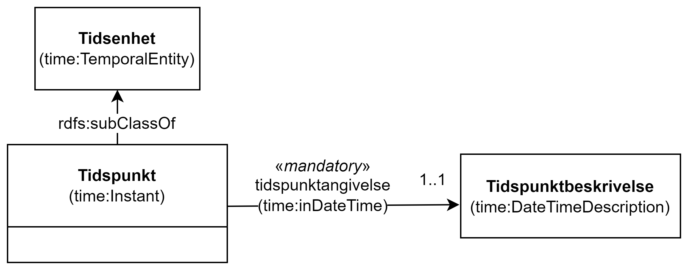

== Klassen Tidspunkt (time:Instant) [[Tidspunkt]]

[[img-KlassenTidspunkt]]
.Klassen Tidspunkt (time:Instant) og klassene den refererer til.
[link=images/KlassenTidspunkt.png]

[cols="30s,70d"]
|===
| _English name_ | _Time Instant_
| Anvendelse / _Usage note_ | Klassen brukes til å representere et tidspunkt.

_This class represents a time instant._
| URI | time:Instant
| Subklasse av / _Subclass of_ | time:TemporalEntity
|Merknad / _Note_ | Norsk utvidelse: Ikke eksplisitt spesifisert i CPSV-AP.

_Norwegian extension: Not explicitly specified in CPSV-AP._
| Eksempel | Se under <<Tidsenhet-sluttidspunkt>>.
|===

Eksempel i RDF Turtle: Se under <<Tidsenhet-sluttidspunkt>>.

=== Obligatoriske egenskaper for klassen _Tidspunkt_ [[Tidspunkt-obligatoriske-egenskaper]]

==== Tidspunkt – tidspunktangivelse (time:inDateTime) [[Tidspunkt-tidspunktangivelse]]
[cols="30s,70d"]
|===
| _English name_ | _in date-time description_
| URI | time:inDateTime
| Verdiområde / _Range_ | time:DateTimeDescription
| Anvendelse / _Usage note_ | Egenskapen brukes til å oppgi et tidspunkt, som en strukturert beskrivelse.

_This property is used to specify the position of an instant, expressed using a structured description._
| Multiplisitet / _Multiplicity_ | 1..1
|Kravnivå / _Requirement level_ | Obligatorisk / _Mandatory_
|Merknad / _Note_ | Norsk utvidelse: Ikke eksplisitt spesifisert i CPSV-AP.

_Norwegian extension: Not explicitly specified in CPSV-AP._
| Eksempel | Se under <<Tidsenhet-sluttidspunkt>>.
|===

Eksempel i RDF Turtle: Se under <<Tidsenhet-sluttidspunkt>>.

