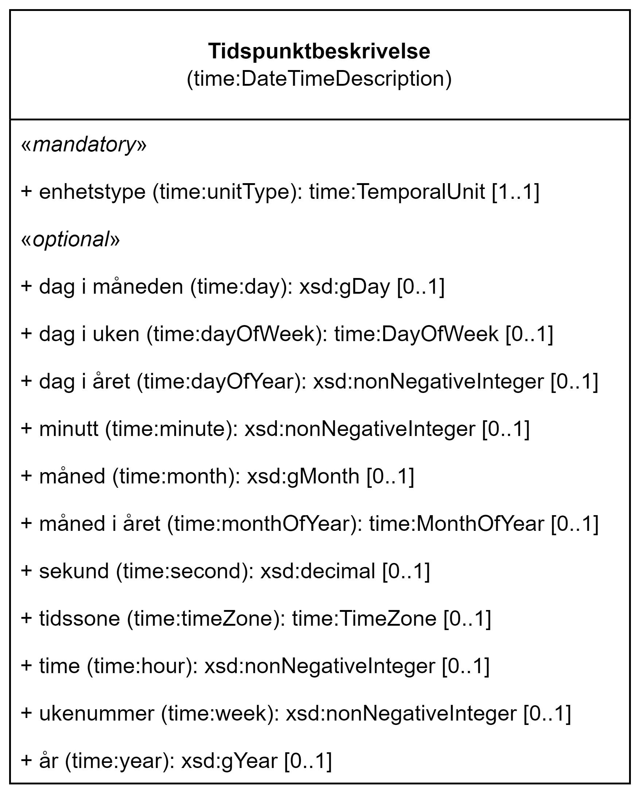

== Klassen Tidspunktbeskrivelse (time:DateTimeDescription) [[Tidspunktbeskrivelse]]

[[img-Tidspunktbeskrivelse]]
.Klassen Tidspunktbeskrivelse (time:DateTimeDescription).
[link=images/KlassenTidspunktbeskrivelse.png]

[cols="30s,70d"]
|===
| _English name_ | _Date Time Description_
| Anvendelse / _Usage note_ | Klassen brukes til å spesifisere et tidspunkt ved bruk av det gregorianske kalendersystemet.

_This class represents a description of date and time structured with separate values for the various elements of a calendar-clock system. The temporal reference system is fixed to Gregorian Calendar, and the range of year, month, day properties restricted to corresponding XML Schema types xsd:gYear, xsd:gMonth and xsd:gDay, respectively._
| URI | time:DateTimeDescription
| Merknad / _Note_ | Norsk utvidelse: Ikke eksplisitt spesifisert i CPSV-AP.

_Norwegian extension: Not explicitly specified in CPSV-AP._
|===

=== Obligatoriske egenskaper for klassen _Tidspunktbeskrivelse_ [[Tidspunktbeskrivelse-obligatoriske-egenskaper]]

==== Tidspunktbeskrivelse – enhetstype (time:unitType) [[Tidspunktbeskrivelse-enhetstype]]

[cols="30s,70d"]
|===
| _English name_ | _unit type_
| URI | time:unitType
| Verdiområde / _Range_ | time:TemporalUnit
| Anvendelse / _Usage note_ | Egenskapen brukes til å oppgi enhetstypen (presisjonen) for tidspunktet.

_This property is used to specify the temporal unit which provides the precision of a date-time value or scale of a temporal extent._
| Multiplisitet / _Multiplicity_ | 1..1
| Kravnivå / _Requirement level_ | Obligatorisk / _Mandatory_
| Merknad 1 / _Note 1_ | Verdien SKAL være en av følgende: `time:unitCentury`, `time:unitDay`, `time:unitDecade`, `time:unitHour`, `time:unitMillenium`, `time:unitMinute`, `time:unitMonth`, `time:unitSecond`, `time:unitWeek`, `time:unitYear`.

_The value MUST be one of the following: `time:unitCentury`, `time:unitDay`, `time:unitDecade`, `time:unitHour`, `time:unitMillenium`, `time:unitMinute`, `time:unitMonth`, `time:unitSecond`, `time:unitWeek`, `time:unitYear`._
| Merknad 2 / _Note 2_ | Norsk utvidelse: Ikke eksplisitt spesifisert i CPSV-AP.

_Norwegian extension: Not explicitly specified in CPSV-AP._
| Eksempel | minutt 
|===

Eksempel i RDF Turtle, minutt:
-----
<exDateTimeDesc> a time:DateTimeDescription; 
   time:unitType time:unitMinute; # enhetstype minutt
   . 
-----

=== Valgfrie egenskaper for klassen _Tidspunktbeskrivelse_ [[Tidspunktbeskrivelse-valgfrie-egenskaper]]

==== Tidspunktbeskrivelse – dag i måneden (time:day) [[Tidspunktbeskrivelse-dag-i-måneden]]

[cols="30s,70d"]
|===
| _English name_ | _day (of month)_
| URI | time:day
| Verdiområde / _Range_ | xsd:gDay
| Anvendelse / _Usage note_ | Egenskapen brukes til å oppgi dag, oppgitt som dagens nummer i en måned i det gregorianske kalendersystemet.

_This property is used to specify the day position in a month in the Gregorian calender-clock system._ 
| Multiplisitet / _Multiplicity_ | 0..1
| Kravnivå / _Requirement level_ | Valgfri / _Optional_
| Merknad / _Note_ | Norsk utvidelse: Ikke eksplisitt spesifisert i CPSV-AP.

_Norwegian extension: Not explicitly specified in CPSV-AP._
| Eksempel | den femtende i en måned
|===

Eksempel i RDF Turtle, den femtende i en måned:
-----
<exDateTimeDesc> a time:DateTimeDescription; 
   time:day 15; # den 15. i en måned
   . 
-----

==== Tidspunktbeskrivelse – dag i uken (time:dayOfWeek) [[Tidspunktbeskrivelse-dag-i-uken]]

[cols="30s,70d"]
|===
| _English name_ | _day of week_
| URI | time:dayOfWeek
| Verdiområde / _Range_ | time:DayOfWeek
| Anvendelse / _Usage note_ | Egenskapen brukes til å oppgi dag i uken, ved å referere til en predefinert ukedag i det gregorianske kalendersystemet. 

_This property is used to specify day of week in the Gregorian calender-clock system, whose value is a member of the class time:DayOfWeek._
| Multiplisitet / _Multiplicity_ | 0..1
| Kravnivå / _Requirement level_ | Valgfri / _Optional_
| Merknad 1 / _Note 1_ | Verdien SKAL være en av følgende: `time:Monday`, `time:Tuesday`, `time:Wednesday`, `time:Thursday`, `time:Friday`, `time:Saturday`, `time:Sunday`, `schema:PublicHolidays`.

_The value MUST be one of the following: `time:Monday`, `time:Tuesday`, `time:Wednesday`, `time:Thursday`, `time:Friday`, `time:Saturday`, `time:Sunday`, `schema:PublicHolidays`._
| Merknad 2 / _Note 2_ | Norsk utvidelse: Ikke eksplisitt spesifisert i CPSV-AP.

_Norwegian extension: Not explicitly specified in CPSV-AP._
| Merknad 3 / _Note 3_ | Norsk utvidelse: Klassen time:DayOfWeek er utvidet med schema:PublicHolidays, for å gjøre det lettere å spesifisere (begrenset) åpningstid for offentlige helligdager. 

_Norwegian extension: The class time:DayOfWeek is extended with schema:PublicHolidays, in order to make it easier to specify availability (restrictions) for public holidays._
| Eksempel | mandag
|===

Eksempel i RDF Turtle, mandag:
-----
<exDateTimeDesc> a time:DateTimeDescription; 
   time:dayOfWeek time:Monday; # mandag
   . 
-----

==== Tidspunktbeskrivelse – dag i året (time:dayOfYear) [[Tidspunktbeskrivelse-dag-i-året]]

[cols="30s,70d"]
|===
| _English name_ | _day of year_
| URI | time:dayOfYear
| Verdiområde / _Range_ | xsd:nonNegativeInteger
| Anvendelse / _Usage note_ | Egenskapen brukes til å oppgi dag i året, oppgitt som nummeret av dagen i året i det gregorianske kalendersystemet.

_This property is used to specify the number of the day within the year in the Gregorian calender-clock system._
| Multiplisitet / _Multiplicity_ | 0..1
| Kravnivå / _Requirement level_ | Valgfri / _Optional_
| Merknad / _Note_ | Norsk utvidelse: Ikke eksplisitt spesifisert i CPSV-AP.

_Norwegian extension: Not explicitly specified in CPSV-AP._
| Eksempel |  den 40. dag i et år
|===

Eksempel i RDF Turtle, den 40. dag i et år:
-----
<exDateTimeDesc> a time:DateTimeDescription; 
   time:dayOfYear 40; # den 40. dag i et år
   . 
-----

==== Tidspunktbeskrivelse – minutt (time:minute) [[Tidspunktbeskrivelse-minutt]]

[cols="30s,70d"]
|===
| _English name_ | _minute_
| URI | time:minute
| Verdiområde / _Range_ | xsd:nonNegativeInteger
| Anvendelse / _Usage note_ | Egenskapen brukes til å oppgi minutt i det gregorianske kalendersystem. 

_This property is used to specify the minute position in the Gregorian calendar-clock system._
| Multiplisitet / _Multiplicity_ | 0..1
| Kravnivå / _Requirement level_ | Valgfri / _Optional_
| Merknad / _Note_ | Norsk utvidelse: Ikke eksplisitt spesifisert i CPSV-AP.

_Norwegian extension: Not explicitly specified in CPSV-AP._
| Eksempel | Se under <<Tidsenhet-sluttidspunkt>>.
|===

Eksempel i RDF Turtle: Se under <<Tidsenhet-sluttidspunkt>>.

==== Tidspunktbeskrivelse – måned (time:month) [[Tidspunktbeskrivelse-måned]]

[cols="30s,70d"]
|===
| _English name_ | _month_
| URI | time:month
| Verdiområde / _Range_ | xsd:gMonth
| Anvendelse / _Usage note_ | Egenskapen brukes til å oppgi måned, oppgitt som månedens nummer i det gregorianske kalendersystemet. 

_This property is used to specify the month position in the Gregorian calendar-clock system._
| Multiplisitet / _Multiplicity_ | 0..1
| Kravnivå / _Requirement level_ | Valgfri / _Optional_
| Merknad / _Note_ | Norsk utvidelse: Ikke eksplisitt spesifisert i CPSV-AP.

_Norwegian extension: Not explicitly specified in CPSV-AP._
| Eksempel | 11 (= november)
|===

Eksempel i RDF Turtle, 11 (= november):
-----
<exDateTimeDesc> a time:DateTimeDescription; 
   xsd:gMonth 11; # måned nr. 11 = november
   . 
-----

==== Tidspunktbeskrivelse – måned i året (time:monthOfYear) [[Tidspunktbeskrivelse-måned-i-året]]

[cols="30s,70d"]
|===
| _English name_ | _month of year_
| URI | time:monthOfYear
| Verdiområde / _Range_ | time:MonthOfYear
| Anvendelse / _Usage note_ | Egenskapen brukes til å oppgi måned i året, ved å referere til en predefinert måned i det gregorianske kalendersystem.

_This property is used to specify the month of the year in the Gregorian calender-clock system, whose value is a member of the class time:MonthOfYear._
| Multiplisitet / _Multiplicity_ | 0..1
| Kravnivå / _Requirement level_ | Valgfri / _Optional_
| Merknad 1 / _Note 1_ | Verdien SKAL være en av følgende: `greg:January`, `greg:February`, `greg:March`, `greg:April`, `greg:May`, `greg:June`, `greg:July`, `greg:August`, `greg:September`, `greg:October`, `greg:November`, `greg:December`.

_TRe value MUST be one of the following: `greg:January`, `greg:February`, `greg:March`, `greg:April`, `greg:May`, `greg:June`, `greg:July`, `greg:August`, `greg:September`, `greg:October`, `greg:November`, `greg:December`._
| Merknad 2 / _Note 2_ | Norsk utvidelse: Ikke eksplisitt spesifisert i CPSV-AP.

_Norwegian extension: Not explicitly specified in CPSV-AP._
| Eksempel | november
|===

Eksempel i RDF Turtle, november: 
-----
<exDateTimeDesc> a time:DateTimeDescription; 
   time:MonthOfYear greg:November; # november
   . 
-----

==== Tidspunktbeskrivelse – sekund (time:second) [[Tidspunktbeskrivelse-sekund]]

[cols="30s,70d"]
|===
| _English name_ | _second_
| URI | time:second
| Verdiområde / _Range_ | xsd:decimal
| Anvendelse / _Usage note_ | Egenskapen brukes til å oppgi sekund i det gregorianske kalendersystem. 

_This property is used to specify the second position in the Gregorian calendar-clock system._
| Multiplisitet / _Multiplicity_ | 0..1
| Kravnivå / _Requirement level_ | Valgfri / _Optional_
| Merknad / _Note_ | Norsk utvidelse: Ikke eksplisitt spesifisert i CPSV-AP.

_Norwegian extension: Not explicitly specified in CPSV-AP._
| Eksempel | 60
|===

Eksempel i RDF Turtle, 60:
-----
<exDateTimeDesc> a time:DateTimeDescription; 
   time:second 60; 
   . 
-----

==== Tidspunktbeskrivelse – tidssone (time:timeZone) [[Tidspunktbeskrivelse-tidssone]]

[cols="30s,70d"]
|===
| _English name_ | _time zone_
| URI | time:timeZone
| Verdiområde / _Range_ | time:TimeZone
| Anvendelse / _Usage note_ | Egenskapen brukes til å oppgi tidssonen til tidspunktet. 

_This property is used to specify the time zone for clock elements in the temporal position._
| Multiplisitet / _Multiplicity_ | 0..1
| Kravnivå / _Requirement level_ | Valgfri / _Optional_
|Merknad / _Note_ | Norsk utvidelse: Ikke eksplisitt spesifisert i CPSV-AP.

_Norwegian extension: Not explicitly specified in CPSV-AP._
|===

==== Tidspunktbeskrivelse – time (time:hour) [[Tidspunktbeskrivelse-time]]

[cols="30s,70d"]
|===
| _English name_ | _hour_
| URI | time:hour
| Verdiområde / _Range_ | xsd:nonNegativeInteger
| Anvendelse / _Usage note_ | Egenskapen brukes til å oppgi time i det gregorianske kalendersystem. 

_This property is used to specify the hour position in the Gregorian calendar-clock system._
| Multiplisitet / _Multiplicity_ | 0..1
| Kravnivå / _Requirement level_ | Valgfri / _Optional_
| Merknad / _Note_ | Norsk utvidelse: Ikke eksplisitt spesifisert i CPSV-AP.

_Norwegian extension: Not explicitly specified in CPSV-AP._
| Eksempel | Se under <<Tidsenhet-sluttidspunkt>>.
|===

Eksempel i RDF Turtle: Se under <<Tidsenhet-sluttidspunkt>>.

==== Tidspunktbeskrivelse – ukenummer (time:week) [[Tidspunktbeskrivelse-uke]]

[cols="30s,70d"]
|===
| _English name_ | _week_
| URI | time:week
| Verdiområde / _Range_ | xsd:nonNegativeInteger
| Anvendelse / _Usage note_ | Egenskapen brukes til å oppgi ukenummer i det gregorianske kalendersystemet.

_This property is used to specify the week number within the year, in the Gregorian calender-clock system._
| Multiplisitet / _Multiplicity_ | 0..1
| Kravnivå / _Requirement level_ | Valgfri / _Optional_
| Merknad / _Note_ | Norsk utvidelse: Ikke eksplisitt spesifisert i CPSV-AP.

_Norwegian extension: Not explicitly specified in CPSV-AP._
| Eksempel | uke 42
|===

Eksempel i RDF Turtle, uke 42: 
-----
<exDateTimeDesc> a time:DateTimeDescription; 
   time:week 42; # uke nr. 42
   . 
-----

==== Tidspunktbeskrivelse – år (time:year) [[Tidspunktbeskrivelse-år]]

[cols="30s,70d"]
|===
| _English name_ | _year_
| URI | time:year
| Verdiområde / _Range_ | xsd:gYear
| Anvendelse / _Usage note_ | Egenskapen brukes til å oppgi år, i det gregorianske kalendersystemet. 

_This property is used to specify the year position in the Gregorian calendar-clock system._ 
| Multiplisitet / _Multiplicity_ | 0..1
| Kravnivå / _Requirement level_ | Valgfri / _Optional_
| Merknad / _Note_ | Norsk utvidelse: Ikke eksplisitt spesifisert i CPSV-AP.

_Norwegian extension: Not explicitly specified in CPSV-AP._
| Eksempel | 2023
|===

Eksempel i RDF Turtle, år 2023: 
-----
<exDateTimeDesc> a time:DateTimeDescription; 
   time:year 2023; # år 2023
   . 
-----

