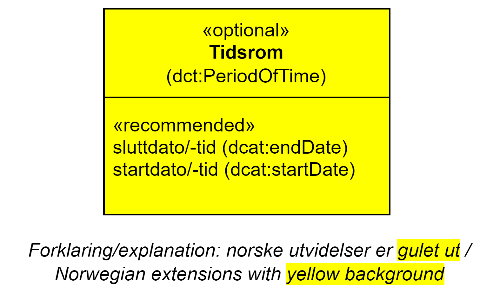

== Klassen Tidsrom (time:ProperInterval) [[Tidsrom]]

[[img-KlassenTidsrom]]
.Klassen Tidsrom (time:ProperInterval) og klassene den refererer til.
[link=images/KlassenTidsrom.png]

[cols="30s,70d"]
|===
| _English name_ | _Period of Time_
| Anvendelse / _Usage note_ | Klassen brukes til å beskrive et tidsrom eller intervall, der verdien til <<Tidsrom-sluttidspunkt>> er forskjellig fra verdien til <<Tidsrom-starttidspunkt>>, og/eller der <<Tidsrom-tidsrom>> har fått verdi. 

_This class  represents a period or time of interval, where the value of the start time and end time properties should be different, and/or a duration should be given._
| URI | time:ProperInterval
| Subklasse av / _Subclass of_ | time:TemporalEntity
| Merknad / _Note_ | Norsk utvidelse: Ikke eksplisitt spesifisert i CPSV-AP, men i CCCEV som vi bruker.

_Norwegian extension: Not explicitly specified in CPSV-AP, but in CCCEV that we use._
|===

=== Anbefalte egenskaper for klassen _Tidsrom_ [[Tidsrom-anbefalte-egenskaper]]

==== Tidsrom – sluttidspunkt (time:hasEnd) [[Tidsrom-sluttidspunkt]]
[cols="30s,70d"]
|===
| _English name_ | _end time_
| URI | time:hasEnd
| Verdiområde / _Range_ | time:Instant
|Anvendelse | Egenskapen brukes til å oppgi slutten på et tidsrom eller intervall.

_This property represents the end of a period or interval._
| Multiplisitet / _Multiplicity_ | 0..1
|Kravnivå / _Requirement level_ | Anbefalt / _Recommended_
| Merknad 1 / _Note 1_ | Norsk utvidelse: Ikke eksplisitt spesifisert i CPSV-AP, men i CCCEV som vi bruker.

_Norwegian extension: Not explicitly specified in CPSV-AP, but in CCCEV that we use._
| Merknad 2 / _Note 2_ | Norsk utvidelse: Range er endret fra xsd:dateTime til time:Instant som er i samsvar med spesifikasjonen i Time Ontology in OWL. 

_Norwegian extension: Range is changed from xsd:dateTime to time:Instant which is in accordance with the specification in Time Ontology in OWL._ 
|===

==== Tidsrom – starttidspunkt (time:hasBeginning) [[Tidsrom-starttidspunkt]]
[cols="30s,70d"]
|===
| _English name_ | _start time_
| URI | time:hasBeginning
| Verdiområde / _Range_ | time:Instant
|Anvendelse | Egenskapen brukes til å oppgi begynnelsen på et tidsrom eller intervall.

_This property represents the beginning of a period or interval._
| Multiplisitet / _Multiplicity_ | 0..1
|Kravnivå / _Requirement level_ | Anbefalt / _Recommended_
| Merknad 1 / _Note 1_ | Norsk utvidelse: Ikke eksplisitt spesifisert i CPSV-AP, men i CCCEV som vi bruker.

_Norwegian extension: Not explicitly specified in CPSV-AP, but in CCCEV that we use._
| Merknad 2 / _Note 2_ | Norsk utvidelse: Range er endret fra xsd:dateTime til time:Instant som er i samsvar med spesifikasjonen i Time Ontology in OWL. 

_Norwegian extension: Range is changed from xsd:dateTime to time:Instant which is in accordance with the specification in Time Ontology in OWL._ 
|===

==== Tidsrom – tidsrom (time:hasXSDDuration) [[Tidsrom-tidsrom]]
[cols="30s,70d"]
|===
| _English name_ | _duration_
| URI | time:hasXSDDuration
| Verdiområde / _Range_ | xsd:duration
|Anvendelse | Egenskapen brukes til å oppgi et tidsrom eller intervall.

_This property represents a period or interval._
| Multiplisitet / _Multiplicity_ | 0..1
|Kravnivå / _Requirement level_ | Anbefalt / _Recommended_
| Merknad / _Note_ | Norsk utvidelse: Ikke eksplisitt spesifisert i CPSV-AP, men i CCCEV som vi bruker.

_Norwegian extension: Not explicitly specified in CPSV-AP, but in CCCEV that we use._
|===
