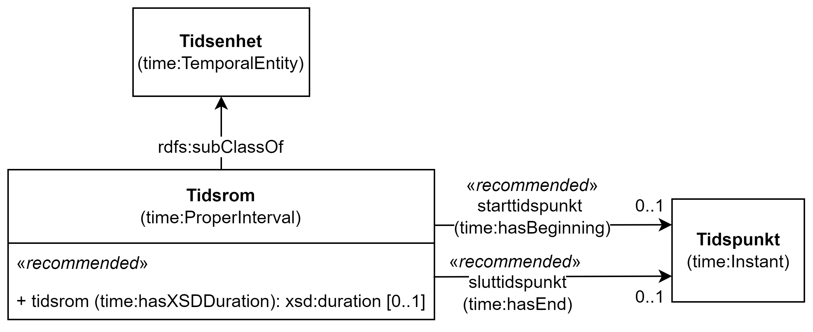

== Klassen Tidsrom (time:ProperInterval) [[Tidsrom]]

[[img-KlassenTidsrom]]
.Klassen Tidsrom (time:ProperInterval)
[link=images/KlassenTidsrom.png]

[cols="30s,70d"]
|===
|English name| Proper interval
|Anvendelse| Klassen brukes til å beskrive et tidsrom eller intervall, der verdien til <<Tidsrom-sluttidspunkt>> er forskjellig fra verdien til <<Tidsrom-starttidspunkt>>, og/eller der <<Tidsrom-tidsrom>> har fått verdi. 
|Usage note| This class  represents a period or time of interval, where the value of the start time and end time properties should be different, and/or a duration should be given.
|URI| time:ProperInterval
|Subklasse av / Subclass of | time:TemporalEntity
|Kravnivå | Valgfri/Optional
|Merknad | Norsk utvidelse: Ikke eksplisitt spesifisert i CPSV-AP, men i CCCEV som vi bruker.
|Remark | Norwegian extension: Not explicitly specified in CPSV-AP, but in CCCEV that we use.
|===

=== Anbefalte egenskaper for klassen _Tidsrom_ [[Tidsrom-anbefalte-egenskaper]]

==== Tidsrom – sluttidspunkt (time:hasEnd) [[Tidsrom-sluttidspunkt]]
[cols="30s,70d"]
|===
|English name | end time
|URI| time:hasEnd
|Range| time:Instant
|Anvendelse | Egenskapen brukes til å oppgi slutten på et tidsrom eller intervall.
|Usage note | This property represents the end of a period or interval.
|Multiplisitet| 0..1
|Kravnivå | Anbefalt/Recommended
|Merknad 1 | Norsk utvidelse: Ikke eksplisitt spesifisert i CPSV-AP, men i CCCEV som vi bruker.
|Remark 1 | Norwegian extension: Not explicitly specified in CPSV-AP, but in CCCEV that we use.
|Merknad 2 | Norsk utvidelse: Range er endret fra xsd:dateTime til time:Instant som er i samsvar med spesifikasjonen i Time Ontology in OWL. 
|Remark 2 | Norwegian extension: Range is changed from xsd:dateTime to time:Instant which is in accordance with the specification in Time Ontology in OWL. 
|===

==== Tidsrom – starttidspunkt (time:hasBeginning) [[Tidsrom-starttidspunkt]]
[cols="30s,70d"]
|===
|English name | start time
|URI| time:hasBeginning
|Range| time:Instant
|Anvendelse | Egenskapen brukes til å oppgi begynnelsen på et tidsrom eller intervall.
|Usage note | This property represents the beginning of a period or interval.
|Multiplisitet| 0..1
|Kravnivå | Anbefalt/Recommended
|Remark 1 | Norwegian extension: Not explicitly specified in CPSV-AP, but in CCCEV that we use.
|Merknad 2 | Norsk utvidelse: Range er endret fra xsd:dateTime til time:Instant som er i samsvar med spesifikasjonen i Time Ontology in OWL. 
|Remark 2 | Norwegian extension: Range is changed from xsd:dateTime to time:Instant which is in accordance with the specification in Time Ontology in OWL. 
|===

==== Tidsrom – tidsrom (time:hasXSDDuration) [[Tidsrom-tidsrom]]
[cols="30s,70d"]
|===
|English name | duration
|URI| time:hasXSDDuration
|Range| xsd:duration
|Anvendelse | Egenskapen brukes til å oppgi et tidsrom eller intervall.
|Usage note | This property represents a period or interval.
|Multiplisitet| 0..1
|Kravnivå | Anbefalt/Recommended
|Merknad | Norsk utvidelse: Ikke eksplisitt spesifisert i CPSV-AP, men i CCCEV som vi bruker.
|Remark | Norwegian extension: Not explicitly specified in CPSV-AP, but in CCCEV that we use.
|===
